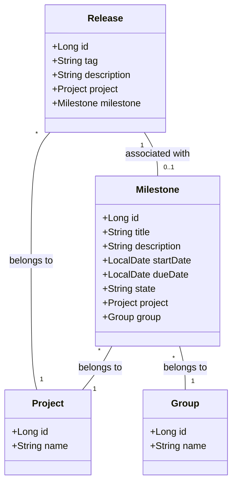
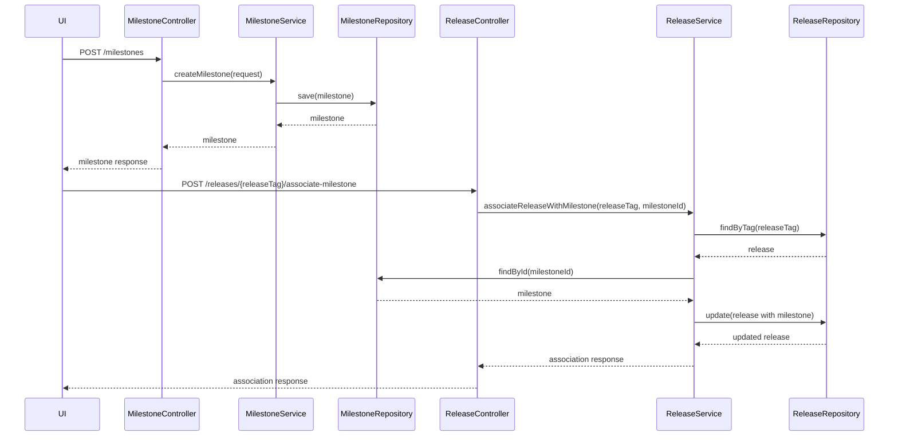
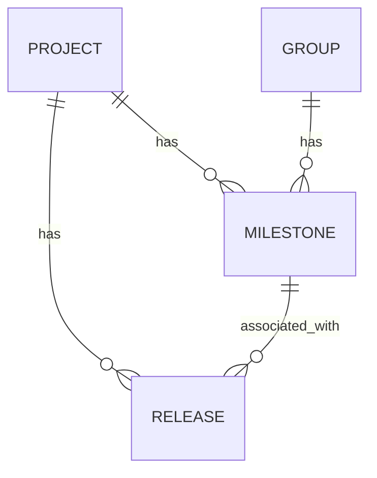

# Low-Level Design (LLD) Document: Milestone and Release Association

## 1. Objective
This document details the low-level design for implementing the ability to create milestones and associate releases with milestones in the GitLab application server. The goal is to enable project managers to track progress via milestones and allow developers to link releases to these milestones for better traceability of features and fixes. The design ensures data integrity, high concurrency handling, and production-readiness using Spring Boot best practices.

## 2. API Model

### 2.1 Common Components/Services
- **MilestoneService**: Handles all business logic for milestone creation and management.
- **ReleaseService**: Manages release creation and association with milestones.
- **MilestoneRepository**: Data access for milestones.
- **ReleaseRepository**: Data access for releases.
- **MilestoneReleaseAssociationService**: Manages linking releases to milestones.
- **ValidationUtils**: Centralized validation logic for input data.

### 2.2 API Details
| Operation                        | REST Method | Type     | URL                                         | Request JSON                                                                                          | Response JSON                                                                                       |
|----------------------------------|-------------|----------|----------------------------------------------|------------------------------------------------------------------------------------------------------|-----------------------------------------------------------------------------------------------------|
| Create Milestone                 | POST        | Success  | /api/v1/projects/{projectId}/milestones      | { "title": "string", "description": "string", "startDate": "yyyy-MM-dd", "dueDate": "yyyy-MM-dd" } | { "id": 1, "title": "string", "description": "string", "startDate": "yyyy-MM-dd", "dueDate": "yyyy-MM-dd", "state": "active" } |
| Create Milestone (Group)         | POST        | Success  | /api/v1/groups/{groupId}/milestones          | { "title": "string", "description": "string", "startDate": "yyyy-MM-dd", "dueDate": "yyyy-MM-dd" } | { "id": 1, "title": "string", "description": "string", "startDate": "yyyy-MM-dd", "dueDate": "yyyy-MM-dd", "state": "active" } |
| Associate Release with Milestone | POST        | Success  | /api/v1/projects/{projectId}/releases/{releaseTag}/associate-milestone | { "milestoneId": 1 } | { "releaseTag": "string", "milestoneId": 1, "status": "associated" } |
| Create Release                   | POST        | Success  | /api/v1/projects/{projectId}/releases        | { "tag": "string", "description": "string" } | { "id": 1, "tag": "string", "description": "string" } |
| Create Milestone                 | POST        | Failure  | /api/v1/projects/{projectId}/milestones      | { "title": "duplicate", ... } | { "error": "Milestone title must be unique within project or group." } |
| Associate Release with Milestone | POST        | Failure  | /api/v1/projects/{projectId}/releases/{releaseTag}/associate-milestone | { "milestoneId": 999 } | { "error": "Milestone not found." } |

### 2.3 Exceptions
- **DuplicateMilestoneTitleException**: Raised when a milestone title is not unique within a project or group.
- **InvalidDateRangeException**: Raised when the start date is after the due date.
- **MilestoneNotFoundException**: Raised when attempting to associate a release with a non-existent milestone.
- **ReleaseTagNotUniqueException**: Raised when a release tag is not unique within a project.
- **ReleaseAlreadyAssociatedException**: Raised when a release is already associated with a milestone.
- **DatabaseConcurrencyException**: Raised when concurrent updates cause conflicts.

## 3. Functional Design

### 3.1 Class Diagram

### 3.2 UML Sequence Diagram

### 3.3 Components
| Component Name                    | Purpose                                     | New/Existing |
|-----------------------------------|---------------------------------------------|--------------|
| MilestoneService                  | Business logic for milestones               | New          |
| MilestoneRepository               | Data access for milestones                  | New          |
| ReleaseService                    | Business logic for releases                 | New          |
| ReleaseRepository                 | Data access for releases                    | New          |
| MilestoneReleaseAssociationService| Handles linking releases to milestones      | New          |
| ValidationUtils                   | Centralized validation logic                | New          |
| Project, Group Models             | Represent project/group entities            | Existing     |

### 3.4 Service Layer Logic and Validations
| FieldName         | Validation                                         | ErrorMessage                                         | ClassUsed                  |
|-------------------|----------------------------------------------------|------------------------------------------------------|----------------------------|
| title             | Unique within project/group                        | Milestone title must be unique within project/group.  | MilestoneService           |
| startDate, dueDate| startDate <= dueDate                               | Start date must be before or equal to due date.      | MilestoneService           |
| tag               | Unique within project                              | Release tag must be unique within project.           | ReleaseService             |
| milestoneId       | Exists in DB                                       | Milestone not found.                                 | ReleaseService             |
| release-milestone | Release not already associated with another milestone | Release already associated with a milestone.         | ReleaseService             |

## 4. Integrations
| SystemToBeIntegrated | IntegratedFor                | IntegrationType |
|----------------------|------------------------------|-----------------|
| PostgreSQL           | Milestone/Release persistence| DB              |
| GitLab UI            | Milestone/Release management | REST API        |
| GitLab API           | Milestone/Release management | REST/GraphQL    |

## 5. DB Details

### 5.1 ER Model

### 5.2 DB Validations
- **Milestone.title**: Unique constraint within (project_id, group_id)
- **Milestone.start_date <= Milestone.due_date**: Check constraint
- **Release.tag**: Unique constraint within project_id
- **Release.milestone_id**: Foreign key to Milestone (nullable, one-to-one per release)
- **Release-Milestone Association**: Enforced via unique index on release_id in association table (if separate)

## 6. Dependencies
- Spring Boot 2.x/3.x
- PostgreSQL 12+
- JPA/Hibernate
- GitLab Application Server
- REST/GraphQL API frameworks

## 7. Assumptions
- A milestone can belong to either a project or a group, not both simultaneously.
- Release tags are unique within a project.
- A release can only be associated with one milestone at a time.
- All date fields use ISO 8601 format (yyyy-MM-dd).
- The system handles concurrent requests via DB-level constraints and optimistic locking.
- All APIs are secured and authenticated as per GitLab standards.
