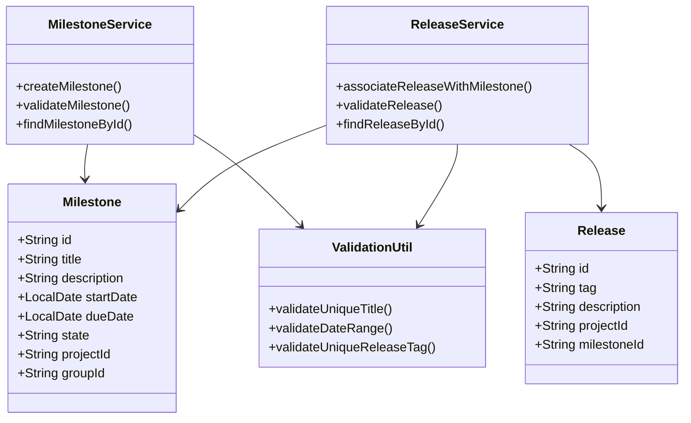
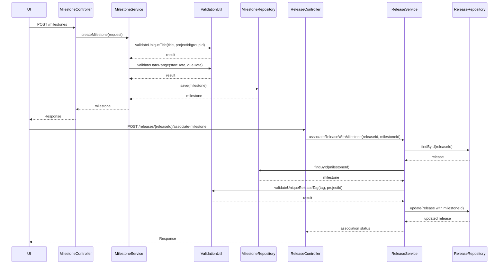
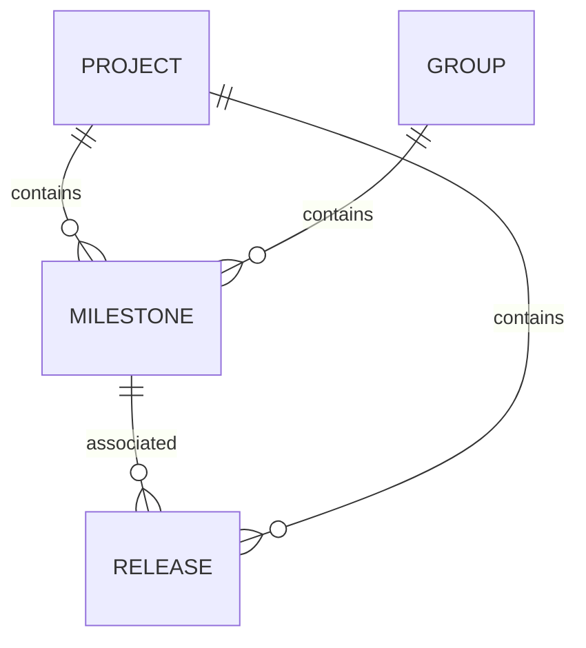

# Low-Level Design (LLD) Document: Milestone Creation & Release Association

## 1. Objective
This document details the low-level design for two core functionalities in the GitLab application server: (1) enabling project managers to create milestones within projects or groups, and (2) allowing developers to associate releases with milestones for better feature tracking. The design ensures robust validation, atomicity, and concurrency handling, leveraging PostgreSQL as the persistent store. All APIs and service logic are consolidated for a unified, production-ready implementation.

## 2. API Model
### 2.1 Common Components/Services
- **MilestoneService**: Handles creation, validation, and state management of milestones.
- **ReleaseService**: Manages releases and their associations with milestones.
- **ValidationUtil**: Provides reusable validation logic for fields and business rules.
- **ConcurrencyHandler**: Ensures atomic operations and handles concurrent requests.

### 2.2 API Details
| Operation                         | REST Method | Type          | URL                                      | Request JSON                                                                 | Response JSON                                                               |
|-----------------------------------|-------------|---------------|------------------------------------------|------------------------------------------------------------------------------|-----------------------------------------------------------------------------|
| Create Milestone                  | POST        | Success/Fail  | /api/v1/projects/{projectId}/milestones  | {"title": "string", "description": "string", "startDate": "yyyy-MM-dd", "dueDate": "yyyy-MM-dd", "groupId": "string (optional)"} | {"id": "string", "title": "string", "description": "string", "startDate": "yyyy-MM-dd", "dueDate": "yyyy-MM-dd", "state": "active", "projectId": "string", "groupId": "string (optional)"} |
| Associate Release with Milestone  | POST        | Success/Fail  | /api/v1/projects/{projectId}/releases/{releaseId}/associate-milestone | {"milestoneId": "string"}                                                 | {"releaseId": "string", "milestoneId": "string", "status": "associated"} |

### 2.3 Exceptions
- **MilestoneTitleNotUniqueException**: Raised when a milestone title is not unique within a project/group.
- **InvalidDateRangeException**: Raised when the start date is after the due date.
- **ReleaseTagNotUniqueException**: Raised when a release tag is not unique within a project.
- **MilestoneNotFoundException**: Raised when the specified milestone does not exist.
- **ReleaseNotFoundException**: Raised when the specified release does not exist.
- **ReleaseAlreadyAssociatedException**: Raised when a release is already associated with a milestone.
- **ConcurrentModificationException**: Raised when concurrent operations cause data conflicts.

## 3. Functional Design
### 3.1 Class Diagram

### 3.2 UML Sequence Diagram

### 3.3 Components
| Component Name      | Purpose                                            | New/Existing |
|---------------------|----------------------------------------------------|--------------|
| MilestoneService    | Business logic for milestone management            | New          |
| ReleaseService      | Business logic for release management              | New          |
| ValidationUtil      | Centralized validation logic                       | New          |
| MilestoneRepository | Data access for milestones                         | Existing     |
| ReleaseRepository   | Data access for releases                           | Existing     |
| ConcurrencyHandler  | Handles concurrent operations                      | New          |

### 3.4 Service Layer Logic and Validations
| FieldName         | Validation                                      | ErrorMessage                                 | ClassUsed         |
|-------------------|-------------------------------------------------|----------------------------------------------|-------------------|
| title             | Unique within project/group                      | Milestone title must be unique               | ValidationUtil    |
| startDate, dueDate| startDate <= dueDate                             | Start date must be before or equal to due date| ValidationUtil    |
| tag               | Unique within project                            | Release tag must be unique                   | ValidationUtil    |
| milestoneId       | Exists in DB                                     | Milestone not found                          | MilestoneService  |
| releaseId         | Exists in DB                                     | Release not found                            | ReleaseService    |
| releaseId         | Not already associated with another milestone     | Release already associated with milestone    | ReleaseService    |

## 4. Integrations
| SystemToBeIntegrated | IntegratedFor                  | IntegrationType |
|----------------------|-------------------------------|-----------------|
| PostgreSQL           | Milestone & Release persistence| DB              |
| GitLab UI            | Milestone & Release operations | REST API        |
| GitLab UI            | Milestone & Release operations | GraphQL API     |

## 5. DB Details
### 5.1 ER Model

### 5.2 DB Validations
- **Milestone.title**: Unique constraint on (title, project_id) and (title, group_id)
- **Milestone.start_date, Milestone.due_date**: Check constraint to ensure start_date <= due_date
- **Release.tag**: Unique constraint on (tag, project_id)
- **Release.milestone_id**: Foreign key constraint referencing Milestone(id), nullable (only one milestone per release)

## 6. Dependencies
- Spring Boot Framework
- PostgreSQL Database
- GitLab Application Server
- Spring Data JPA

## 7. Assumptions
- Milestone titles are unique within their respective project or group, but not globally.
- A release can only be associated with one milestone at a time.
- All date fields are in ISO 8601 format (yyyy-MM-dd).
- The system is responsible for handling concurrency and atomicity at both the application and DB levels.
- All APIs are secured and authenticated (not detailed here).
- Non-functional requirements (performance, concurrency) are handled via Spring Boot best practices and DB transaction isolation.
