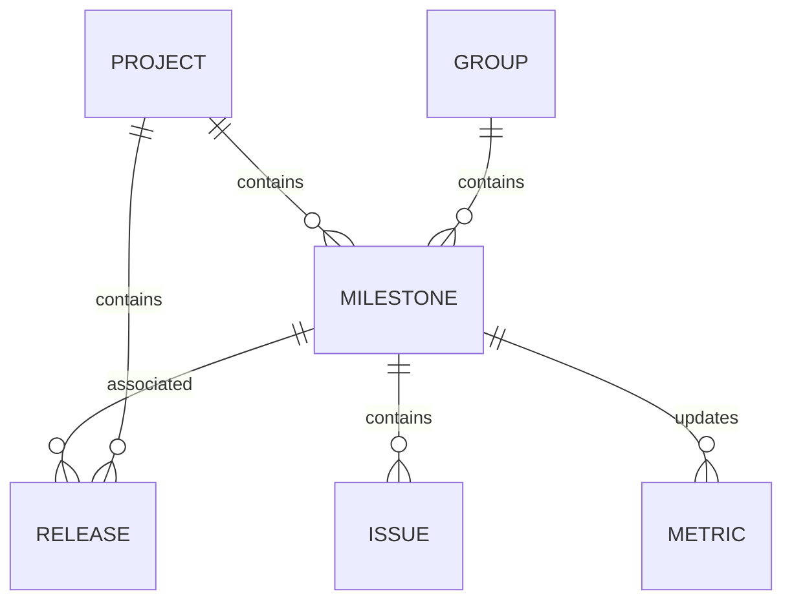

# Low-Level Design (LLD) Document: Milestone Management & Progress Tracking

## 1. Objective
This document provides a consolidated low-level design for milestone management in the GitLab application server. It covers the creation, closure, and progress tracking of milestones, as well as the association of releases with milestones. The design ensures robust validation, atomicity, and concurrency handling, leveraging PostgreSQL as the persistent store and Redis for caching. All APIs and service logic are unified for a production-ready implementation, supporting both project managers and team members in tracking project goals and progress.

## 2. API Model
### 2.1 Common Components/Services
- **MilestoneService**: Handles creation, closure, validation, and state management of milestones.
- **ReleaseService**: Manages releases and their associations with milestones.
- **MilestoneProgressService**: Calculates and provides milestone progress metrics.
- **ValidationUtil**: Provides reusable validation logic for fields and business rules.
- **ConcurrencyHandler**: Ensures atomic operations and handles concurrent requests.
- **NotificationService**: Triggers webhooks or notifications on milestone state changes.
- **PermissionService**: Validates user permissions for milestone actions.
- **CacheService**: Manages milestone progress caching in Redis.

### 2.2 API Details
| Operation                              | REST Method | Type          | URL                                                        | Request JSON                                                                 | Response JSON                                                               |
|----------------------------------------|-------------|---------------|------------------------------------------------------------|------------------------------------------------------------------------------|-----------------------------------------------------------------------------|
| Create Milestone                       | POST        | Success/Fail  | /api/v1/projects/{projectId}/milestones                    | {"title": "string", "description": "string", "startDate": "yyyy-MM-dd", "dueDate": "yyyy-MM-dd", "groupId": "string (optional)"} | {"id": "string", "title": "string", "description": "string", "startDate": "yyyy-MM-dd", "dueDate": "yyyy-MM-dd", "state": "active", "projectId": "string", "groupId": "string (optional)"} |
| Associate Release with Milestone        | POST        | Success/Fail  | /api/v1/projects/{projectId}/releases/{releaseId}/associate-milestone | {"milestoneId": "string"}                                                 | {"releaseId": "string", "milestoneId": "string", "status": "associated"} |
| Close Milestone                        | POST        | Success/Fail  | /api/v1/projects/{projectId}/milestones/{milestoneId}/close | {}                                                                           | {"id": "string", "state": "closed", "closedAt": "yyyy-MM-dd'T'HH:mm:ssZ"} |
| View Milestone Progress                | GET         | Success/Fail  | /api/v1/projects/{projectId}/milestones/{milestoneId}/progress | -                                                                            | {"milestoneId": "string", "progress": {"completedIssues": int, "totalIssues": int, "progressPercent": float, "weightedProgress": float (optional), "daysElapsed": int, "totalDays": int, "releases": [{"id": "string", "status": "string"}]}} |

### 2.3 Exceptions
- **MilestoneTitleNotUniqueException**: Raised when a milestone title is not unique within a project/group.
- **InvalidDateRangeException**: Raised when the start date is after the due date.
- **ReleaseTagNotUniqueException**: Raised when a release tag is not unique within a project.
- **MilestoneNotFoundException**: Raised when the specified milestone does not exist.
- **ReleaseNotFoundException**: Raised when the specified release does not exist.
- **ReleaseAlreadyAssociatedException**: Raised when a release is already associated with a milestone.
- **ConcurrentModificationException**: Raised when concurrent operations cause data conflicts.
- **MilestoneAlreadyClosedException**: Raised when attempting to close a milestone that is already closed.
- **PermissionDeniedException**: Raised when the user lacks permission to perform an action.
- **InvalidMilestoneStateException**: Raised when the milestone state does not allow the requested operation.
- **CacheConsistencyException**: Raised when there is a mismatch between cache and DB values.

## 3. Functional Design
### 3.1 Class Diagram
```mermaid
classDiagram
    class Milestone {
        +String id
        +String title
        +String description
        +LocalDate startDate
        +LocalDate dueDate
        +String state
        +String projectId
        +String groupId
        +LocalDateTime closedAt
    }
    class Release {
        +String id
        +String tag
        +String description
        +String projectId
        +String milestoneId
        +String status
    }
    class MilestoneService {
        +createMilestone()
        +closeMilestone()
        +validateMilestone()
        +findMilestoneById()
    }
    class ReleaseService {
        +associateReleaseWithMilestone()
        +validateRelease()
        +findReleaseById()
    }
    class MilestoneProgressService {
        +getProgress()
        +calculateWeightedProgress()
    }
    class ValidationUtil {
        +validateUniqueTitle()
        +validateDateRange()
        +validateUniqueReleaseTag()
    }
    class NotificationService {
        +triggerWebhook()
        +sendNotification()
    }
    class PermissionService {
        +checkPermission()
    }
    class CacheService {
        +getProgressFromCache()
        +updateProgressCache()
    }
    MilestoneService --&gt; Milestone
    ReleaseService --&gt; Release
    ReleaseService --&gt; Milestone
    MilestoneService --&gt; ValidationUtil
    ReleaseService --&gt; ValidationUtil
    MilestoneService --&gt; NotificationService
    MilestoneService --&gt; PermissionService
    MilestoneService --&gt; CacheService
    MilestoneProgressService --&gt; Milestone
    MilestoneProgressService --&gt; CacheService
    MilestoneProgressService --&gt; Release
```

### 3.2 UML Sequence Diagram
```mermaid
sequenceDiagram
    participant UI
    participant MilestoneController
    participant MilestoneService
    participant ValidationUtil
    participant PermissionService
    participant NotificationService
    participant MilestoneRepository
    participant ReleaseController
    participant ReleaseService
    participant ReleaseRepository
    participant MilestoneProgressController
    participant MilestoneProgressService
    participant CacheService

    UI-&gt;&gt;MilestoneController: POST /milestones
    MilestoneController-&gt;&gt;MilestoneService: createMilestone(request)
    MilestoneService-&gt;&gt;ValidationUtil: validateUniqueTitle(title, projectId/groupId)
    ValidationUtil--&gt;&gt;MilestoneService: result
    MilestoneService-&gt;&gt;ValidationUtil: validateDateRange(startDate, dueDate)
    ValidationUtil--&gt;&gt;MilestoneService: result
    MilestoneService-&gt;&gt;PermissionService: checkPermission(user, CREATE)
    PermissionService--&gt;&gt;MilestoneService: result
    MilestoneService-&gt;&gt;MilestoneRepository: save(milestone)
    MilestoneRepository--&gt;&gt;MilestoneService: milestone
    MilestoneService--&gt;&gt;MilestoneController: milestone
    MilestoneController--&gt;&gt;UI: Response

    UI-&gt;&gt;ReleaseController: POST /releases/{releaseId}/associate-milestone
    ReleaseController-&gt;&gt;ReleaseService: associateReleaseWithMilestone(releaseId, milestoneId)
    ReleaseService-&gt;&gt;ReleaseRepository: findById(releaseId)
    ReleaseRepository--&gt;&gt;ReleaseService: release
    ReleaseService-&gt;&gt;MilestoneRepository: findById(milestoneId)
    MilestoneRepository--&gt;&gt;ReleaseService: milestone
    ReleaseService-&gt;&gt;ValidationUtil: validateUniqueReleaseTag(tag, projectId)
    ValidationUtil--&gt;&gt;ReleaseService: result
    ReleaseService-&gt;&gt;ReleaseRepository: update(release with milestoneId)
    ReleaseRepository--&gt;&gt;ReleaseService: updated release
    ReleaseService--&gt;&gt;ReleaseController: association status
    ReleaseController--&gt;&gt;UI: Response

    UI-&gt;&gt;MilestoneController: POST /milestones/{milestoneId}/close
    MilestoneController-&gt;&gt;MilestoneService: closeMilestone(milestoneId, user)
    MilestoneService-&gt;&gt;MilestoneRepository: findById(milestoneId)
    MilestoneRepository--&gt;&gt;MilestoneService: milestone
    MilestoneService-&gt;&gt;PermissionService: checkPermission(user, CLOSE)
    PermissionService--&gt;&gt;MilestoneService: result
    MilestoneService-&gt;&gt;ValidationUtil: validateMilestoneState(milestone)
    ValidationUtil--&gt;&gt;MilestoneService: result
    MilestoneService-&gt;&gt;MilestoneRepository: updateState(milestone, closed)
    MilestoneRepository--&gt;&gt;MilestoneService: updated milestone
    MilestoneService-&gt;&gt;NotificationService: triggerWebhook(milestone closed)
    NotificationService--&gt;&gt;MilestoneService: webhook status
    MilestoneService-&gt;&gt;CacheService: updateProgressCache(milestoneId)
    CacheService--&gt;&gt;MilestoneService: cache status
    MilestoneService--&gt;&gt;MilestoneController: closed milestone
    MilestoneController--&gt;&gt;UI: Response

    UI-&gt;&gt;MilestoneProgressController: GET /milestones/{milestoneId}/progress
    MilestoneProgressController-&gt;&gt;MilestoneProgressService: getProgress(milestoneId)
    MilestoneProgressService-&gt;&gt;CacheService: getProgressFromCache(milestoneId)
    CacheService--&gt;&gt;MilestoneProgressService: cached progress or miss
    MilestoneProgressService-&gt;&gt;MilestoneRepository: findById(milestoneId)
    MilestoneRepository--&gt;&gt;MilestoneProgressService: milestone
    MilestoneProgressService-&gt;&gt;ReleaseRepository: findByMilestoneId(milestoneId)
    ReleaseRepository--&gt;&gt;MilestoneProgressService: releases
    MilestoneProgressService-&gt;&gt;MilestoneProgressService: calculateProgress()
    MilestoneProgressService--&gt;&gt;MilestoneProgressController: progress
    MilestoneProgressController--&gt;&gt;UI: Response
```

### 3.3 Components
| Component Name           | Purpose                                             | New/Existing |
|-------------------------|-----------------------------------------------------|--------------|
| MilestoneService        | Business logic for milestone management              | Existing     |
| ReleaseService          | Business logic for release management                | Existing     |
| MilestoneProgressService| Calculates and provides milestone progress           | New          |
| ValidationUtil          | Centralized validation logic                        | Existing     |
| MilestoneRepository     | Data access for milestones                          | Existing     |
| ReleaseRepository       | Data access for releases                            | Existing     |
| ConcurrencyHandler      | Handles concurrent operations                       | Existing     |
| NotificationService     | Triggers webhooks/notifications on state changes    | New          |
| PermissionService       | Validates user permissions for milestone actions     | New          |
| CacheService            | Handles milestone progress caching in Redis          | New          |

### 3.4 Service Layer Logic and Validations
| FieldName         | Validation                                      | ErrorMessage                                 | ClassUsed              |
|-------------------|-------------------------------------------------|----------------------------------------------|------------------------|
| title             | Unique within project/group                      | Milestone title must be unique               | ValidationUtil         |
| startDate, dueDate| startDate <= dueDate                             | Start date must be before or equal to due date| ValidationUtil         |
| tag               | Unique within project                            | Release tag must be unique                   | ValidationUtil         |
| milestoneId       | Exists in DB                                     | Milestone not found                          | MilestoneService       |
| releaseId         | Exists in DB                                     | Release not found                            | ReleaseService         |
| releaseId         | Not already associated with another milestone     | Release already associated with milestone    | ReleaseService         |
| milestone.state   | Only active milestones can be closed              | Only active milestones can be closed         | MilestoneService       |
| user              | Must have permission for action                   | Permission denied                            | PermissionService      |
| cache             | Consistency between cache and DB                  | Cache consistency error                      | CacheService           |

## 4. Integrations
| SystemToBeIntegrated | IntegratedFor                  | IntegrationType |
|----------------------|-------------------------------|-----------------|
| PostgreSQL           | Milestone & Release persistence| DB              |
| Redis                | Milestone progress caching     | Cache           |
| GitLab UI            | Milestone & Release operations | REST API        |
| GitLab UI            | Milestone & Release operations | GraphQL API     |
| Sidekiq              | Background jobs for milestone closure | Job Queue |

## 5. DB Details
### 5.1 ER Model


### 5.2 DB Validations
- **Milestone.title**: Unique constraint on (title, project_id) and (title, group_id)
- **Milestone.start_date, Milestone.due_date**: Check constraint to ensure start_date <= due_date
- **Milestone.state**: Enum constraint ('active', 'closed')
- **Milestone.closed_at**: Nullable timestamp, set when state = 'closed'
- **Release.tag**: Unique constraint on (tag, project_id)
- **Release.milestone_id**: Foreign key constraint referencing Milestone(id), nullable (only one milestone per release)
- **Issue.milestone_id**: Foreign key constraint referencing Milestone(id), nullable
- **Metric.milestone_id**: Foreign key constraint referencing Milestone(id)

## 6. Dependencies
- Spring Boot Framework
- PostgreSQL Database
- Redis Cache
- GitLab Application Server
- Spring Data JPA
- Sidekiq (for background jobs)

## 7. Assumptions
- Milestone titles are unique within their respective project or group, but not globally.
- A release can only be associated with one milestone at a time.
- All date fields are in ISO 8601 format (yyyy-MM-dd).
- The system is responsible for handling concurrency and atomicity at both the application and DB levels.
- All APIs are secured and authenticated (not detailed here).
- Non-functional requirements (performance, concurrency) are handled via Spring Boot best practices and DB transaction isolation.
- Progress bar and metrics are updated in real-time or with minimal delay using Redis cache.
- Background jobs (via Sidekiq) are used for closing large milestones asynchronously.
- All user permission checks are enforced via PermissionService.

