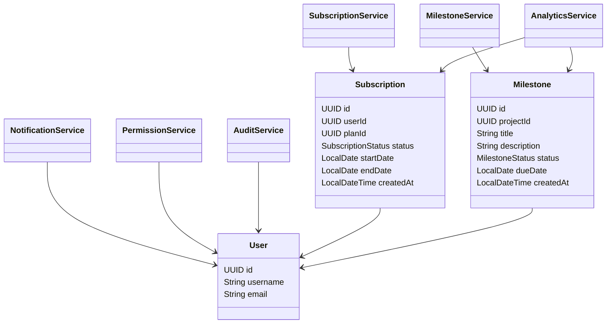
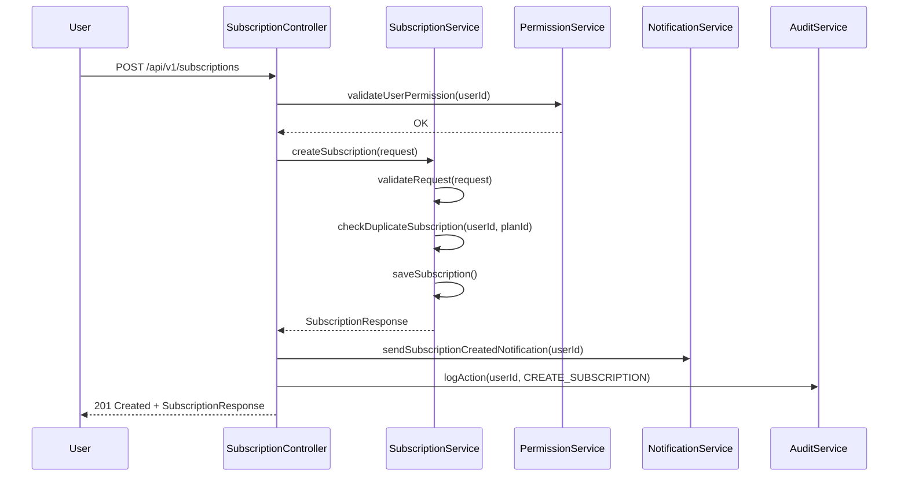
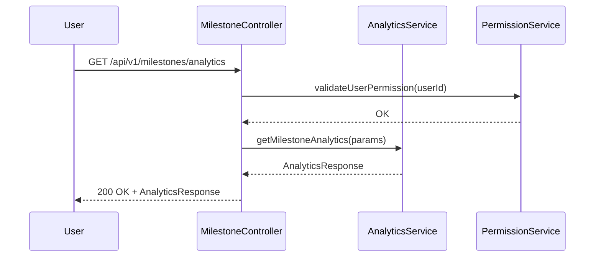
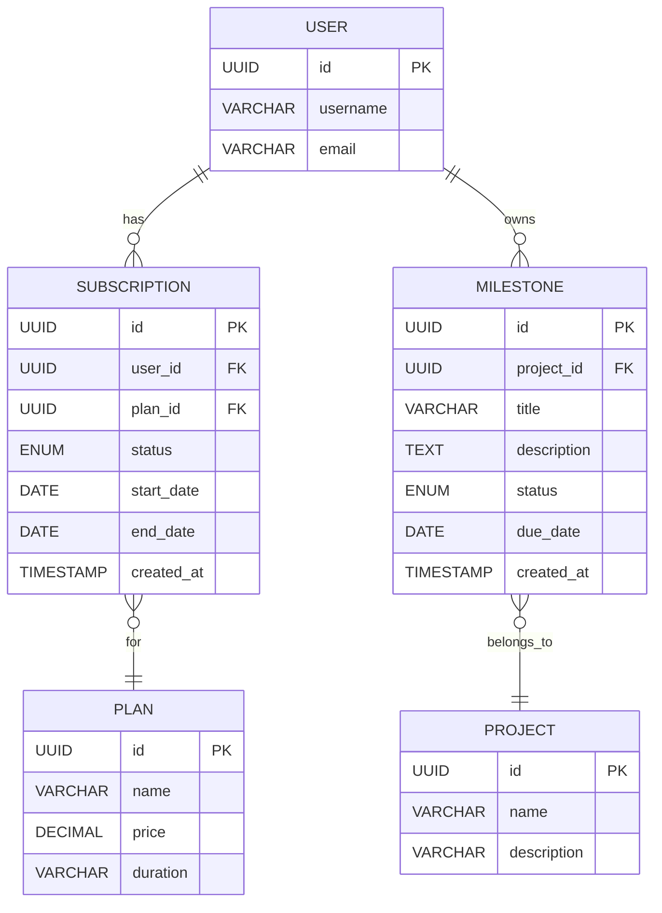

# Low-Level Design (LLD): Subscription & Milestone Management System

## 1. Objective

This document details the Low-Level Design (LLD) for a unified system supporting both Subscription and Milestone Management functionalities. The system enables users to manage subscriptions (create, update, cancel, and view), as well as track project milestones, search/filter milestones, and generate analytics. The design ensures modularity, scalability, and maintainability using Spring Boot best practices, with a focus on robust validation, security, and seamless integration between components. The document merges new subscription requirements with the existing milestone management LLD, providing a comprehensive technical blueprint for implementation.

## 2. API Model

### 2.1 Common Components/Services

| Component/Service       | Responsibility                                                        |
|------------------------|-----------------------------------------------------------------------|
| SubscriptionService    | Handles business logic for subscription lifecycle management           |
| MilestoneService       | Manages creation, update, and retrieval of milestones                  |
| NotificationService    | Sends notifications for subscription/milestone events                  |
| PermissionService      | Validates user permissions for sensitive operations                    |
| UserService            | User authentication and profile management                             |
| AuditService           | Logs all critical actions for auditing purposes                        |
| AnalyticsService       | Aggregates and provides analytics on milestones and subscriptions      |

### 2.2 API Details

| API Name                        | URL                                 | Method | Request Body / Params                | Response Schema         | Auth | Validations                        |
|----------------------------------|-------------------------------------|--------|--------------------------------------|-------------------------|------|------------------------------------|
| Create Subscription              | /api/v1/subscriptions               | POST   | SubscriptionCreateRequest            | SubscriptionResponse    | Yes  | Field, business, duplicate checks  |
| Update Subscription              | /api/v1/subscriptions/{id}          | PUT    | SubscriptionUpdateRequest            | SubscriptionResponse    | Yes  | Field, status, permission checks   |
| Cancel Subscription              | /api/v1/subscriptions/{id}/cancel   | POST   | None                                 | SubscriptionResponse    | Yes  | Status, permission checks          |
| Get Subscription                 | /api/v1/subscriptions/{id}          | GET    | Path Variable                        | SubscriptionResponse    | Yes  | Existence, permission checks       |
| List Subscriptions               | /api/v1/subscriptions               | GET    | Query Params (filter, page, size)    | SubscriptionListResponse| Yes  | Pagination, filter validation      |
| Create Milestone                 | /api/v1/milestones                  | POST   | MilestoneCreateRequest               | MilestoneResponse       | Yes  | Field, business, duplicate checks  |
| Update Milestone                 | /api/v1/milestones/{id}             | PUT    | MilestoneUpdateRequest               | MilestoneResponse       | Yes  | Field, status, permission checks   |
| Search/Filter Milestones         | /api/v1/milestones/search           | GET    | Query Params (filter, page, size)    | MilestoneListResponse   | Yes  | Pagination, filter validation      |
| Get Milestone Analytics          | /api/v1/milestones/analytics        | GET    | Query Params (date range, type)      | AnalyticsResponse       | Yes  | Date range, type validation        |

#### Request/Response Schemas (DTOs)

**SubscriptionCreateRequest**
```json
{
  "userId": "UUID",
  "planId": "UUID",
  "startDate": "yyyy-MM-dd",
  "paymentMethod": "string"
}
```

**SubscriptionResponse**
```json
{
  "id": "UUID",
  "userId": "UUID",
  "planId": "UUID",
  "status": "ACTIVE|CANCELLED|EXPIRED",
  "startDate": "yyyy-MM-dd",
  "endDate": "yyyy-MM-dd",
  "createdAt": "yyyy-MM-dd'T'HH:mm:ssZ"
}
```

**MilestoneCreateRequest**
```json
{
  "projectId": "UUID",
  "title": "string",
  "description": "string",
  "dueDate": "yyyy-MM-dd"
}
```

**MilestoneResponse**
```json
{
  "id": "UUID",
  "projectId": "UUID",
  "title": "string",
  "description": "string",
  "status": "OPEN|COMPLETED|CANCELLED",
  "dueDate": "yyyy-MM-dd",
  "createdAt": "yyyy-MM-dd'T'HH:mm:ssZ"
}
```

### 2.3 Exceptions

| Exception Name                | HTTP Status | Description                                      |
|------------------------------|-------------|--------------------------------------------------|
| ResourceNotFoundException     | 404         | Entity not found                                 |
| ValidationException           | 400         | Input validation failed                          |
| DuplicateResourceException    | 409         | Duplicate subscription/milestone                 |
| UnauthorizedException         | 401         | Authentication required                          |
| ForbiddenException            | 403         | Insufficient permissions                         |
| SubscriptionStatusException   | 400         | Invalid subscription state for operation         |
| InternalServerErrorException  | 500         | Unhandled server error                           |

## 3. Functional Design

### 3.1 Class Diagram (Mermaid)



### 3.2 UML Sequence Diagram (Mermaid)

#### Create Subscription Flow


#### Milestone Analytics Flow


### 3.3 Components Table

| Component/Service       | Description                                                                 |
|------------------------|-----------------------------------------------------------------------------|
| SubscriptionController | REST controller for subscription endpoints                                   |
| SubscriptionService    | Handles subscription business logic and persistence                         |
| MilestoneController    | REST controller for milestone endpoints                                      |
| MilestoneService       | Handles milestone business logic and persistence                             |
| NotificationService    | Sends notifications for events                                               |
| PermissionService      | Checks user permissions                                                      |
| AuditService           | Logs critical actions                                                        |
| AnalyticsService       | Provides analytics and reporting                                             |
| UserService            | Manages user authentication and profile                                      |

### 3.4 Service Layer Logic and Validations Table

| Service                | Method                        | Logic/Validations                                                                 |
|------------------------|-------------------------------|-----------------------------------------------------------------------------------|
| SubscriptionService    | createSubscription            | Validate input, check duplicates, set status, persist, trigger notification       |
|                        | updateSubscription            | Validate input, check status, permission check, update fields                     |
|                        | cancelSubscription            | Check status, permission check, set status, trigger notification                  |
|                        | getSubscription               | Check existence, permission check                                                 |
| MilestoneService       | createMilestone               | Validate input, check duplicates, persist, trigger notification                   |
|                        | updateMilestone               | Validate input, check status, permission check, update fields                     |
|                        | searchMilestones              | Validate filters, paginate, return results                                        |
| AnalyticsService       | getMilestoneAnalytics         | Validate params, aggregate data, return analytics                                 |
| NotificationService    | sendSubscriptionCreatedNotification | Compose and send notification to user                                    |
| PermissionService      | validateUserPermission        | Check user roles and resource access                                              |
| AuditService           | logAction                     | Record action with timestamp and user details                                     |

## 4. Integrations

| System/Service         | Integration Type  | Purpose/Notes                                 |
|------------------------|-------------------|-----------------------------------------------|
| Email/SMS Gateway      | REST/SMTP         | Send notifications to users                   |
| Payment Gateway        | REST              | Process subscription payments                 |
| Authentication Service | REST/JWT          | Authenticate and authorize users              |
| Audit Log System       | REST/DB           | Persist audit logs                            |

## 5. DB Details

### 5.1 ER Model (Mermaid)



### 5.2 DB Validations

| Table         | Field          | Validation/Constraint                 |
|---------------|---------------|---------------------------------------|
| SUBSCRIPTION  | user_id        | FK to USER(id), not null              |
| SUBSCRIPTION  | plan_id        | FK to PLAN(id), not null              |
| SUBSCRIPTION  | status         | ENUM (ACTIVE, CANCELLED, EXPIRED)     |
| SUBSCRIPTION  | start_date     | Not null, >= today                    |
| SUBSCRIPTION  | end_date       | Nullable, >= start_date               |
| MILESTONE     | project_id     | FK to PROJECT(id), not null           |
| MILESTONE     | title          | Not null, unique per project          |
| MILESTONE     | status         | ENUM (OPEN, COMPLETED, CANCELLED)     |
| USER          | email          | Unique, not null                      |
| PLAN          | name           | Unique, not null                      |
| PROJECT       | name           | Unique, not null                      |

## 6. Dependencies

- Spring Boot 3.x
- Spring Data JPA
- Spring Security (JWT)
- Hibernate Validator
- PostgreSQL (or compatible RDBMS)
- Lombok
- MapStruct (for DTO mapping)
- OpenAPI/Swagger (API documentation)
- External: Email/SMS Gateway, Payment Gateway

## 7. Assumptions

- All APIs require JWT authentication unless explicitly stated.
- Subscription plans are pre-defined and managed externally.
- Payment processing is handled via a secure external gateway; only payment status is tracked internally.
- NotificationService supports both email and SMS channels.
- All date/time fields are stored in UTC.
- Milestone analytics are aggregated in real-time from the primary database.
- User roles and permissions are managed centrally via PermissionService.
- Audit logs are immutable and append-only.

---

**End of LLD Document**
