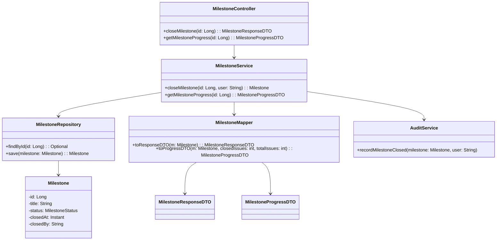
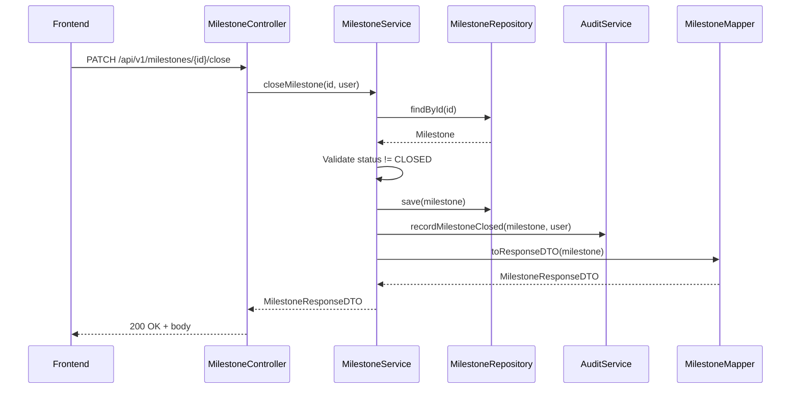
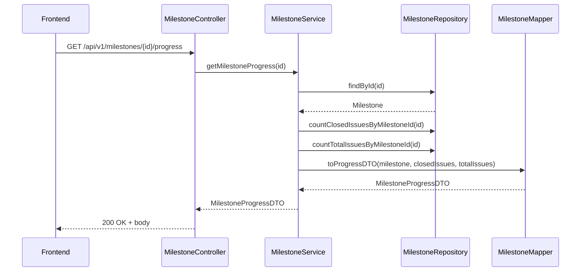
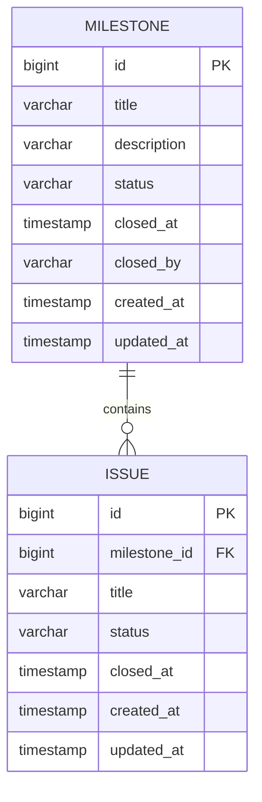

# Low-Level Design (LLD): Milestone Management Service

## 1. Objective

This document details the Low-Level Design for the Milestone Management features: 'Close a Milestone' and 'View Milestone Progress' within the GitLab application server. The objective is to enable users to close project milestones and view their progress efficiently, ensuring data consistency, auditability, and seamless integration with existing systems (PostgreSQL, Redis, Sidekiq, Vue.js frontend). The design adheres to Spring Boot best practices, ensuring maintainability, scalability, and clear separation of concerns.

## 2. API Model

### 2.1 Common Components/Services
- **MilestoneService**: Business logic for milestone operations.
- **MilestoneRepository**: Spring Data JPA repository for DB access.
- **MilestoneController**: REST API endpoints.
- **MilestoneMapper**: Converts between entities and DTOs.
- **MilestoneExceptionHandler**: Centralized exception handling.
- **AuditService**: Records milestone state changes.

### 2.2 API Details

| API Name                | URL                                 | Method | Request Body           | Response Body        | Status Codes | Auth Required | Description                        |
|------------------------|-------------------------------------|--------|-----------------------|----------------------|--------------|--------------|------------------------------------|
| Close Milestone        | /api/v1/milestones/{id}/close       | PATCH  | -                     | MilestoneResponseDTO | 200, 400, 404, 409 | Yes          | Closes the specified milestone     |
| View Milestone Progress| /api/v1/milestones/{id}/progress    | GET    | -                     | MilestoneProgressDTO | 200, 404     | Yes          | Fetches milestone progress details |

#### Request/Response Schemas

- **MilestoneResponseDTO**
  ```json
  {
    "id": 123,
    "title": "Release Q2",
    "status": "CLOSED",
    "closedAt": "2024-06-10T12:34:56Z",
    "closedBy": "user123"
  }
  ```

- **MilestoneProgressDTO**
  ```json
  {
    "id": 123,
    "title": "Release Q2",
    "status": "ACTIVE",
    "totalIssues": 50,
    "closedIssues": 45,
    "progressPercent": 90
  }
  ```

### 2.3 Exceptions

| Exception Name         | HTTP Status | Description                                   |
|-----------------------|-------------|-----------------------------------------------|
| MilestoneNotFound     | 404         | Milestone with given ID does not exist        |
| MilestoneAlreadyClosed| 409         | Milestone is already closed                   |
| ValidationException   | 400         | Invalid input or state                        |
| UnauthorizedException | 401         | User not authenticated/authorized             |

## 3. Functional Design

### 3.1 Class Diagram (Mermaid)



### 3.2 UML Sequence Diagram (Mermaid)

#### Close Milestone


#### View Milestone Progress


### 3.3 Components Table

| Component              | Type        | Responsibility                                  |
|------------------------|-------------|-------------------------------------------------|
| MilestoneController    | REST        | API endpoints                                   |
| MilestoneService       | Service     | Business logic                                  |
| MilestoneRepository    | Repository  | DB access (JPA)                                 |
| MilestoneMapper        | Utility     | Entity/DTO conversion                           |
| AuditService           | Service     | Audit logging                                   |
| Milestone              | Entity      | Milestone domain model                          |
| MilestoneResponseDTO   | DTO         | API response for close milestone                |
| MilestoneProgressDTO   | DTO         | API response for milestone progress             |

### 3.4 Service Layer Logic and Validations Table

| Method                        | Logic/Validation                                                                 |
|-------------------------------|---------------------------------------------------------------------------------|
| closeMilestone(id, user)      | 1. Fetch milestone by ID. 2. If not found, throw 404. 3. If already closed, 409. 4. Set status to CLOSED, set closedAt, closedBy. 5. Save. 6. Audit. |
| getMilestoneProgress(id)      | 1. Fetch milestone by ID. 2. If not found, throw 404. 3. Count closed/total issues. 4. Compute percent. 5. Return DTO. |

## 4. Integrations Table

| Integration         | Direction | Protocol | Purpose                                      |
|---------------------|-----------|----------|----------------------------------------------|
| PostgreSQL          | Outbound  | JDBC     | Persistent storage for milestones/issues      |
| Redis               | Outbound  | Redis    | Caching (optional, e.g., milestone progress)  |
| Sidekiq             | Outbound  | Redis    | Background jobs (e.g., audit, notifications)  |
| Vue.js Frontend     | Inbound   | HTTP/REST| User interface for milestone operations       |

## 5. DB Details

### 5.1 ER Model (Mermaid)



### 5.2 DB Validations

- **MILESTONE.status**: Enum ('ACTIVE', 'CLOSED'), not null
- **MILESTONE.closed_at**: Nullable, required if status = 'CLOSED'
- **MILESTONE.closed_by**: Nullable, required if status = 'CLOSED'
- **ISSUE.status**: Enum ('OPEN', 'CLOSED'), not null
- **Foreign Key**: ISSUE.milestone_id references MILESTONE.id

## 6. Dependencies

- Spring Boot 3.x
- Spring Data JPA
- PostgreSQL Driver
- Redis (Spring Data Redis)
- Lombok (for DTOs, Entities)
- MapStruct (for Mapper)
- Spring Security (for authentication)
- JUnit/Mockito (for testing)

## 7. Assumptions

- Only authenticated users can close milestones or view progress.
- Milestones cannot be reopened once closed (idempotent close operation).
- Milestone progress is based on count of issues linked to the milestone.
- Audit logs are persisted asynchronously (e.g., via Sidekiq jobs).
- All date-times are UTC and ISO 8601 formatted.
- Error responses follow a standard error schema.

---

**File generated for: 'Close a Milestone' and 'View Milestone Progress' user stories.**
