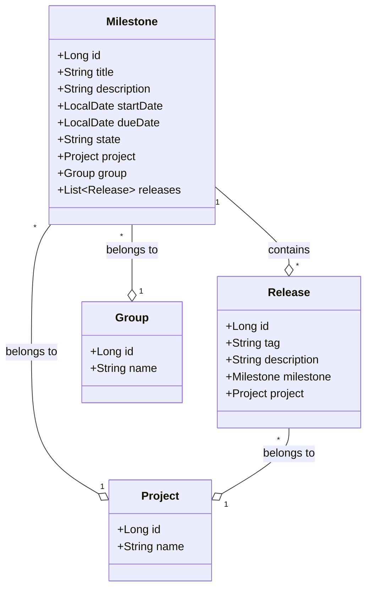
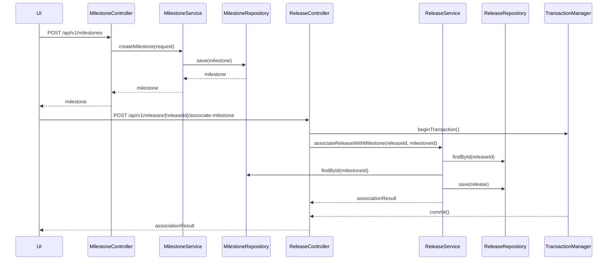
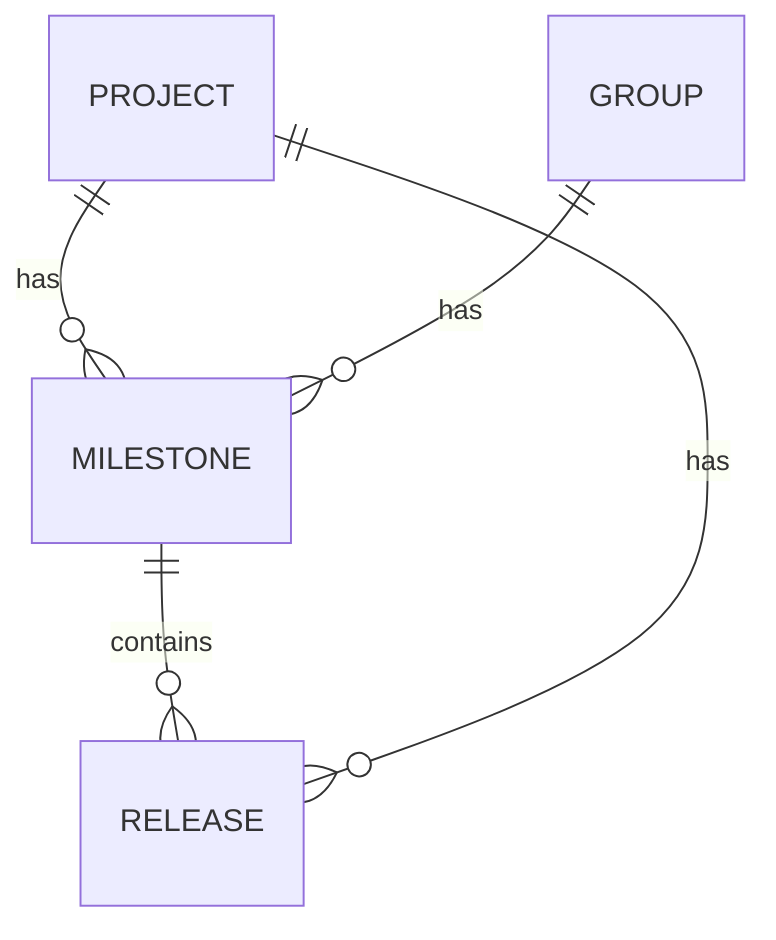

# Low-Level Design (LLD) Document: Milestone and Release Management

## 1. Objective
This document details the low-level design for the implementation of Milestone and Release management in the GitLab application server. The goal is to enable project managers to create and manage milestones within projects or groups, and allow developers to associate releases with these milestones. The design ensures unique milestone titles within a project/group, atomic association of releases to milestones, and robust handling of concurrent operations. All logic, validations, and integrations are consolidated for a production-ready Spring Boot implementation.

## 2. API Model

### 2.1 Common Components/Services
- **MilestoneService**: Handles business logic for milestone creation and management.
- **ReleaseService**: Manages release creation and association with milestones.
- **MilestoneRepository**: Data access layer for milestones.
- **ReleaseRepository**: Data access layer for releases.
- **ValidationUtils**: Shared validation logic for input fields.
- **TransactionManager**: Ensures atomic operations during associations.

### 2.2 API Details

| Operation                     | REST Method | Type     | URL                                         | Request JSON                                                                                       | Response JSON                                                                                  |
|-------------------------------|-------------|----------|----------------------------------------------|----------------------------------------------------------------------------------------------------|-----------------------------------------------------------------------------------------------|
| Create Milestone              | POST        | Success  | /api/v1/milestones                          | {"title": "Sprint 1", "description": "Initial sprint", "startDate": "2024-07-01", "dueDate": "2024-07-15", "projectId": 123, "groupId": null} | {"id": 1, "title": "Sprint 1", "state": "active", ...}                                    |
| Create Milestone              | POST        | Failure  | /api/v1/milestones                          | {"title": "Sprint 1", ...}                                                                      | {"error": "Milestone title must be unique within project/group"}                            |
| Associate Release with Milestone | POST     | Success  | /api/v1/releases/{releaseId}/associate-milestone | {"milestoneId": 1}                                                                              | {"releaseId": 10, "milestoneId": 1, "status": "associated"}                              |
| Associate Release with Milestone | POST     | Failure  | /api/v1/releases/{releaseId}/associate-milestone | {"milestoneId": 1}                                                                              | {"error": "Release already associated with a milestone"}                                     |

### 2.3 Exceptions
- **MilestoneTitleNotUniqueException**: Thrown when a milestone title already exists within the project/group.
- **InvalidDateRangeException**: Thrown when the start date is after the due date.
- **ReleaseTagNotUniqueException**: Thrown when a release tag is not unique within a project.
- **ReleaseAlreadyAssociatedException**: Thrown when attempting to associate a release with more than one milestone.
- **AtomicUpdateException**: Thrown if atomic association fails due to concurrency.

## 3. Functional Design

### 3.1 Class Diagram

### 3.2 UML Sequence Diagram

### 3.3 Components
| Component           | Purpose                                      | New/Existing |
|---------------------|----------------------------------------------|--------------|
| MilestoneService    | Business logic for milestones                | New          |
| MilestoneRepository | Data access for milestones                   | New          |
| ReleaseService      | Business logic for releases                  | New          |
| ReleaseRepository   | Data access for releases                     | New          |
| ValidationUtils     | Input validation                             | New          |
| TransactionManager  | Atomic operations for associations           | New          |
| Project, Group      | Existing domain models                       | Existing     |

### 3.4 Service Layer Logic and Validations
| FieldName           | Validation                                   | ErrorMessage                                         | ClassUsed           |
|---------------------|----------------------------------------------|-----------------------------------------------------|---------------------|
| title               | Unique within project/group                  | Milestone title must be unique within project/group  | MilestoneService    |
| startDate, dueDate  | startDate <= dueDate                         | Start date must be before or equal to due date       | MilestoneService    |
| tag                 | Unique within project                        | Release tag must be unique within project            | ReleaseService      |
| releaseId           | Only one milestone per release               | Release already associated with a milestone          | ReleaseService      |

## 4. Integrations
| SystemToBeIntegrated | IntegratedFor                | IntegrationType |
|----------------------|-----------------------------|-----------------|
| PostgreSQL           | Milestone/Release persistence| DB              |
| GitLab UI            | Milestone/Release management | API             |
| GitLab API           | Milestone/Release management | REST/GraphQL    |

## 5. DB Details

### 5.1 ER Model

### 5.2 DB Validations
- **Milestone.title**: Unique constraint within (project_id, group_id)
- **Release.tag**: Unique constraint within project_id
- **Milestone.start_date <= Milestone.due_date**: Check constraint
- **Release.milestone_id**: Foreign key, nullable, but only one milestone per release
- **Release.milestone_id**: Unique constraint (release_id, milestone_id)

## 6. Dependencies
- Spring Boot framework (v2.7+)
- PostgreSQL database
- JPA/Hibernate for ORM
- GitLab application server

## 7. Assumptions
- Each milestone is associated with either a project or a group, not both simultaneously.
- Release tags are unique within a project.
- A release can only be linked to one milestone at a time.
- All APIs are secured and authenticated.
- The system handles concurrency at the DB and service layer for atomic operations.
- No legacy LLD exists; this is the first iteration.
