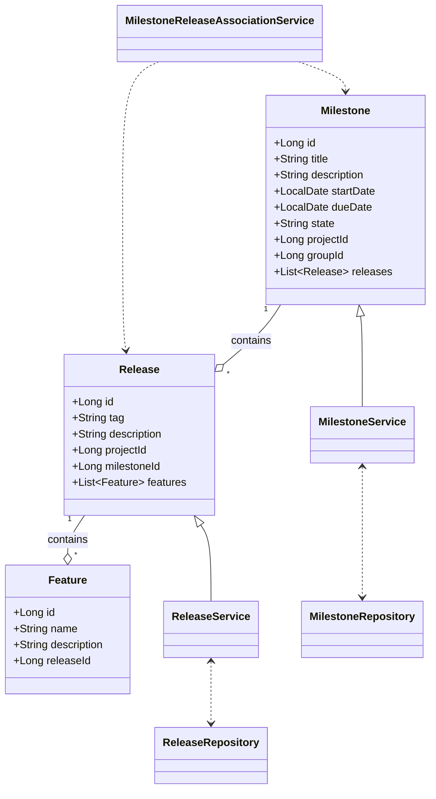
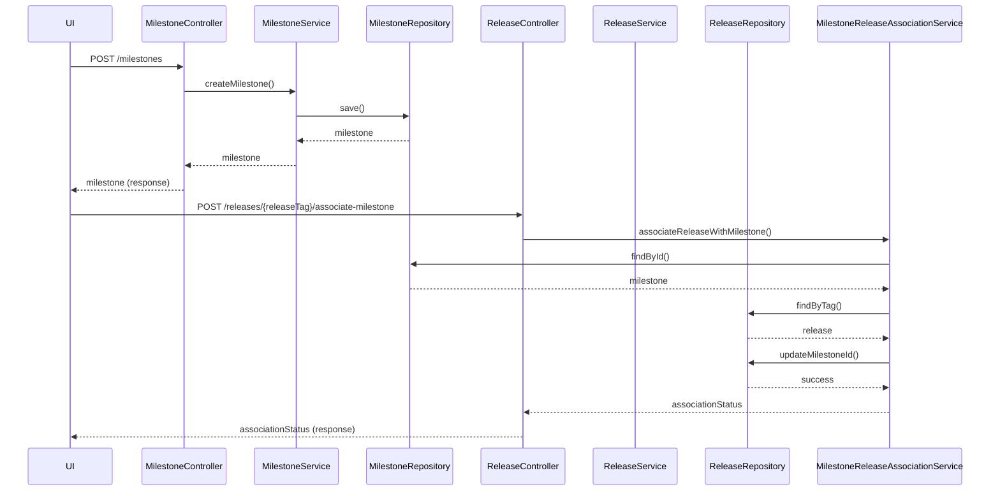
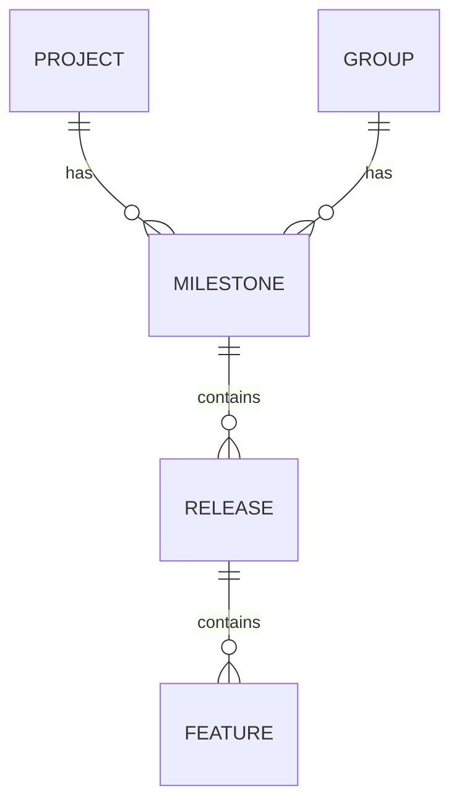

# Low-Level Design (LLD): Milestone Creation & Release Association

## 1. Objective
This document details the low-level design for enabling milestone creation and associating releases with milestones in the GitLab application server. The goal is to allow project managers to define and track milestones within projects or groups, and for developers to associate releases with these milestones, thereby improving progress tracking and feature/release management. The design ensures data integrity, uniqueness, atomicity, and high concurrency handling, following Spring Boot best practices and production-ready standards.

## 2. API Model

### 2.1 Common Components/Services
- **MilestoneService**: Handles milestone creation, validation, and state management.
- **ReleaseService**: Handles release creation, validation, and association with milestones.
- **MilestoneRepository**: Data access layer for milestones.
- **ReleaseRepository**: Data access layer for releases.
- **MilestoneReleaseAssociationService**: Manages the linking of releases to milestones atomically.
- **ExceptionHandler**: Centralized error handling for API responses.
- **ValidationUtils**: Utility for common validation logic.

### 2.2 API Details
| Operation                      | REST Method | Type            | URL                                   | Request JSON                                                                                                  | Response JSON                                                                                   |
|-------------------------------|-------------|-----------------|---------------------------------------|---------------------------------------------------------------------------------------------------------------|-------------------------------------------------------------------------------------------------|
| Create Milestone               | POST        | Success/Failure | /api/v1/projects/{projectId}/milestones | { "title": "string", "description": "string", "startDate": "yyyy-MM-dd", "dueDate": "yyyy-MM-dd", "groupId": "optional" } | { "id": 1, "title": "string", "state": "active", "description": "string", "startDate": "yyyy-MM-dd", "dueDate": "yyyy-MM-dd", "projectId": 1, "groupId": 2 } |
| Associate Release with Milestone | POST        | Success/Failure | /api/v1/projects/{projectId}/releases/{releaseTag}/associate-milestone | { "milestoneId": 1 }                                                                                         | { "releaseTag": "v1.0.0", "milestoneId": 1, "associationStatus": "success" }             |
| Get Milestone Details          | GET         | Success/Failure | /api/v1/projects/{projectId}/milestones/{milestoneId} | -                                                                                                             | { "id": 1, "title": "string", "state": "active", "description": "string", "startDate": "yyyy-MM-dd", "dueDate": "yyyy-MM-dd", "releases": [ ... ] } |
| Get Release Details            | GET         | Success/Failure | /api/v1/projects/{projectId}/releases/{releaseTag} | -                                                                                                             | { "releaseTag": "v1.0.0", "milestoneId": 1, "features": [ ... ] }                        |

### 2.3 Exceptions
| Exception Name                        | Scenario/Service                                 | Error Message                                         |
|---------------------------------------|--------------------------------------------------|-------------------------------------------------------|
| MilestoneTitleNotUniqueException      | MilestoneService                                 | "Milestone title must be unique within project/group" |
| InvalidDateRangeException            | MilestoneService                                 | "Start date must be before or equal to due date"      |
| MilestoneNotFoundException           | MilestoneReleaseAssociationService               | "Milestone not found"                                 |
| ReleaseTagNotUniqueException         | ReleaseService                                   | "Release tag must be unique within the project"       |
| ReleaseAlreadyAssociatedException    | MilestoneReleaseAssociationService               | "Release already associated with a milestone"         |
| AssociationAtomicityException        | MilestoneReleaseAssociationService               | "Failed to associate release atomically"              |
| DatabaseConcurrencyException         | All Services                                     | "Concurrent update error, please retry"               |

## 3. Functional Design

### 3.1 Class Diagram

### 3.2 UML Sequence Diagram

### 3.3 Components
| Component Name                         | Purpose                                            | New/Existing |
|----------------------------------------|----------------------------------------------------|--------------|
| MilestoneService                       | Business logic for milestones                      | New          |
| ReleaseService                         | Business logic for releases                        | Existing     |
| MilestoneRepository                    | Data access for milestones                         | New          |
| ReleaseRepository                      | Data access for releases                           | Existing     |
| MilestoneReleaseAssociationService     | Handles release-milestone association atomically   | New          |
| ExceptionHandler                       | Centralized exception handling                     | Existing     |
| ValidationUtils                        | Common validation logic                            | Existing     |

### 3.4 Service Layer Logic and Validations
| FieldName         | Validation                                   | ErrorMessage                                         | ClassUsed                     |
|-------------------|----------------------------------------------|------------------------------------------------------|-------------------------------|
| title             | Unique within project/group                  | "Milestone title must be unique within project/group" | MilestoneService              |
| startDate, dueDate| startDate <= dueDate                         | "Start date must be before or equal to due date"      | MilestoneService              |
| tag               | Unique within project                        | "Release tag must be unique within the project"       | ReleaseService                |
| milestoneId       | Exists in DB                                | "Milestone not found"                                 | MilestoneReleaseAssociationService |
| releaseTag        | Not already associated with a milestone      | "Release already associated with a milestone"         | MilestoneReleaseAssociationService |

## 4. Integrations
| SystemToBeIntegrated | IntegratedFor                | IntegrationType |
|----------------------|------------------------------|-----------------|
| PostgreSQL           | Milestone and Release storage| DB              |
| GitLab UI            | Milestone/Release management | REST API        |
| GitLab GraphQL API   | Release/Milestone queries    | GraphQL         |

## 5. DB Details

### 5.1 ER Model

### 5.2 DB Validations
- **Milestone title**: Unique constraint on (project_id, title) and (group_id, title)
- **Release tag**: Unique constraint on (project_id, tag)
- **Milestone dates**: Check constraint: start_date <= due_date
- **Release-Milestone association**: release.milestone_id is nullable, but can only be set to one milestone at a time
- **Foreign keys**: Proper FK constraints for project_id, group_id, milestone_id, release_id

## 6. Dependencies
- Spring Boot 2.x/3.x
- PostgreSQL 12+
- JPA/Hibernate
- GitLab application server modules (existing Release management)
- REST/GraphQL API infrastructure

## 7. Assumptions
- Each milestone is unique within its project or group (not globally)
- A release can only be associated with one milestone at a time
- Milestones can belong to either a project or a group, not both simultaneously
- All date fields are in ISO-8601 (yyyy-MM-dd) format
- The system is already using Spring Boot and standard JPA repositories
- Concurrency is handled via DB-level constraints and application-level optimistic locking
- All APIs are secured and authenticated via existing mechanisms

---

**End of LLD Document**
