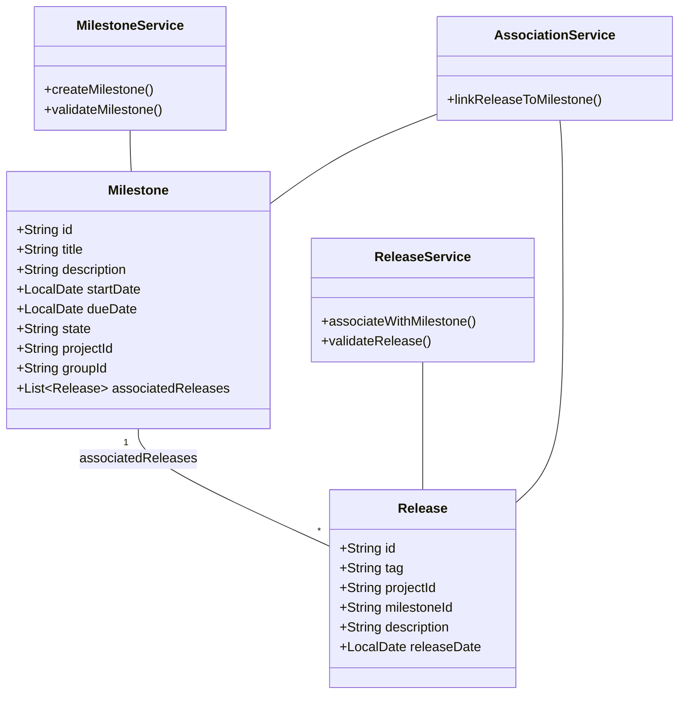
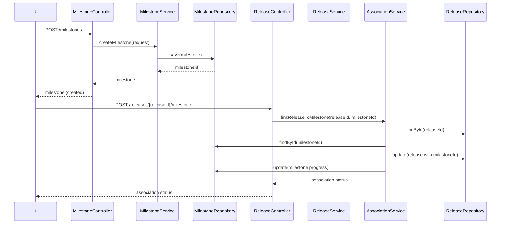
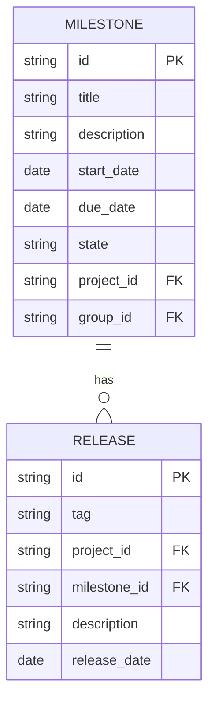

# Low-Level Design (LLD): Milestone Creation and Release Association

## 1. Objective
This document details the low-level design for implementing two key features in the GitLab application server: (1) enabling project managers to create milestones for projects or groups, and (2) allowing developers to associate releases with milestones. The design ensures robust validation, atomic operations, and high concurrency handling, providing a production-ready solution for milestone and release management. All APIs, models, services, and integrations are consolidated to reflect both current and future extensibility.

## 2. API Model

### 2.1 Common Components/Services
- **MilestoneService**: Handles milestone creation, validation, and state management.
- **ReleaseService**: Manages releases and their association with milestones.
- **MilestoneRepository**: Data access for milestones.
- **ReleaseRepository**: Data access for releases.
- **AssociationService**: Handles linking releases to milestones atomically.
- **ValidationUtil**: Shared validation utilities for input checks.

### 2.2 API Details
| Operation                       | REST Method | Type            | URL                                      | Request JSON                                                                                   | Response JSON                                                                                  |
|----------------------------------|-------------|-----------------|-------------------------------------------|-----------------------------------------------------------------------------------------------|-----------------------------------------------------------------------------------------------|
| Create Milestone                | POST        | Success/Failure | /api/v1/milestones                       | { "title": "string", "description": "string", "startDate": "yyyy-MM-dd", "dueDate": "yyyy-MM-dd", "projectId": "string", "groupId": "string" } | { "id": "string", "title": "string", "description": "string", "startDate": "yyyy-MM-dd", "dueDate": "yyyy-MM-dd", "state": "active", "projectId": "string", "groupId": "string" } |
| Associate Release with Milestone | POST        | Success/Failure | /api/v1/releases/{releaseId}/milestone    | { "milestoneId": "string" }                                                                 | { "releaseId": "string", "milestoneId": "string", "status": "associated" }                                                |
| Get Milestone                   | GET         | Success/Failure | /api/v1/milestones/{milestoneId}          | -                                                                                             | { "id": "string", "title": "string", "description": "string", "startDate": "yyyy-MM-dd", "dueDate": "yyyy-MM-dd", "state": "active", "projectId": "string", "groupId": "string", "associatedReleases": [ ... ] } |
| Get Release                     | GET         | Success/Failure | /api/v1/releases/{releaseId}              | -                                                                                             | { "id": "string", "tag": "string", "milestoneId": "string", ... }                                                         |

### 2.3 Exceptions
- **MilestoneTitleNotUniqueException**: Thrown if a milestone title is not unique within a project/group.
- **InvalidDateRangeException**: Thrown if start date is after due date.
- **ReleaseTagNotUniqueException**: Thrown if a release tag is not unique within a project.
- **ReleaseAlreadyAssociatedException**: Thrown if a release is already associated with a milestone.
- **MilestoneNotFoundException**: Thrown if the specified milestone does not exist.
- **ReleaseNotFoundException**: Thrown if the specified release does not exist.
- **DatabaseConcurrencyException**: Thrown if a concurrent update conflict occurs.

## 3. Functional Design

### 3.1 Class Diagram

### 3.2 UML Sequence Diagram

### 3.3 Components
| Component Name       | Purpose                                             | New/Existing |
|---------------------|-----------------------------------------------------|--------------|
| MilestoneService    | Business logic for milestone creation/validation     | New          |
| ReleaseService      | Business logic for release association/validation    | New          |
| AssociationService  | Atomic linking of releases to milestones             | New          |
| MilestoneRepository | Data access for milestones                          | Existing     |
| ReleaseRepository   | Data access for releases                            | Existing     |
| ValidationUtil      | Centralized validation logic                        | New          |

### 3.4 Service Layer Logic and Validations
| FieldName     | Validation                                   | ErrorMessage                                    | ClassUsed           |
|--------------|----------------------------------------------|------------------------------------------------|---------------------|
| title        | Unique within project/group                   | Milestone title must be unique                  | MilestoneService    |
| startDate    | startDate <= dueDate                         | Start date must be before or equal to due date  | MilestoneService    |
| tag          | Unique within project                        | Release tag must be unique within project       | ReleaseService      |
| milestoneId  | Exists and valid                             | Milestone not found                             | AssociationService  |
| releaseId    | Exists and not already associated            | Release not found or already associated         | AssociationService  |

## 4. Integrations
| SystemToBeIntegrated | IntegratedFor                        | IntegrationType |
|---------------------|--------------------------------------|-----------------|
| PostgreSQL          | Persisting milestones and releases    | DB              |
| GitLab UI           | Milestone/release creation & linking | API             |
| GraphQL             | Querying milestone/release data       | API             |

## 5. DB Details

### 5.1 ER Model

### 5.2 DB Validations
- **Milestone.title**: Unique constraint on (title, project_id) and (title, group_id)
- **Milestone.start_date, Milestone.due_date**: Check constraint (start_date <= due_date)
- **Release.tag**: Unique constraint on (tag, project_id)
- **Release.milestone_id**: Foreign key constraint to Milestone.id; only one milestone per release
- **Transactional integrity**: Use transactions to ensure atomic association of release and milestone

## 6. Dependencies
- Spring Boot (REST API framework)
- PostgreSQL (database)
- GitLab application server (host system)
- GraphQL (for querying milestone/release data)

## 7. Assumptions
- Each milestone is uniquely identified within a project or group by its title.
- A release can only be associated with one milestone at a time.
- All date fields are in ISO 8601 (yyyy-MM-dd) format.
- UI/API clients handle user authentication and authorization.
- System is deployed in an environment supporting high concurrency (e.g., with proper DB isolation levels).
- All validations are enforced both at the API and DB level for data integrity.

---

**End of LLD**
