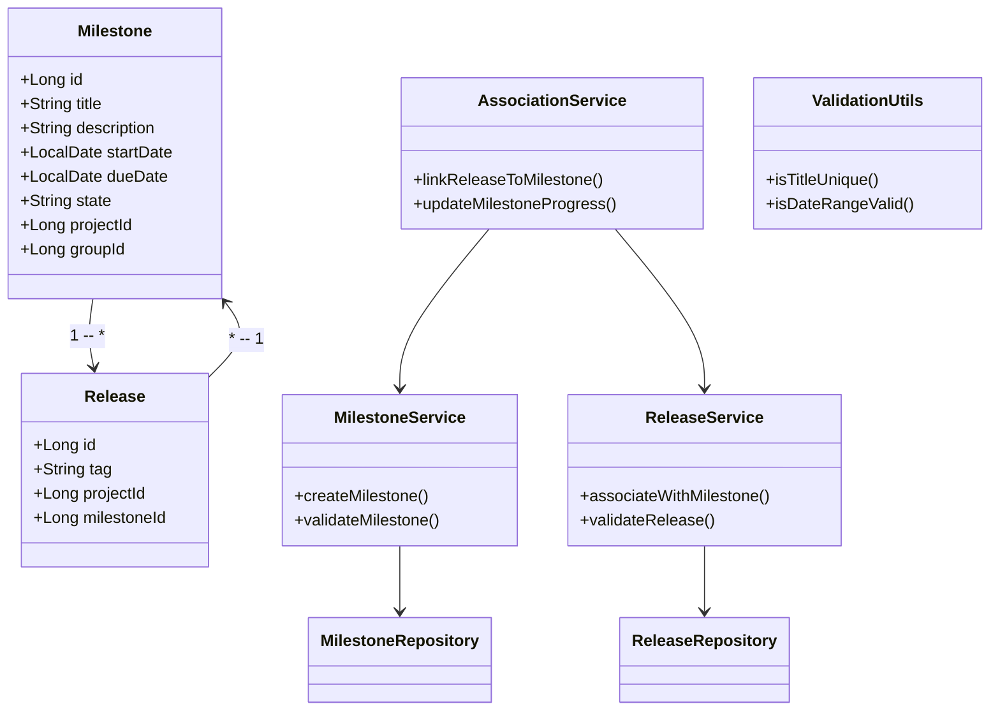
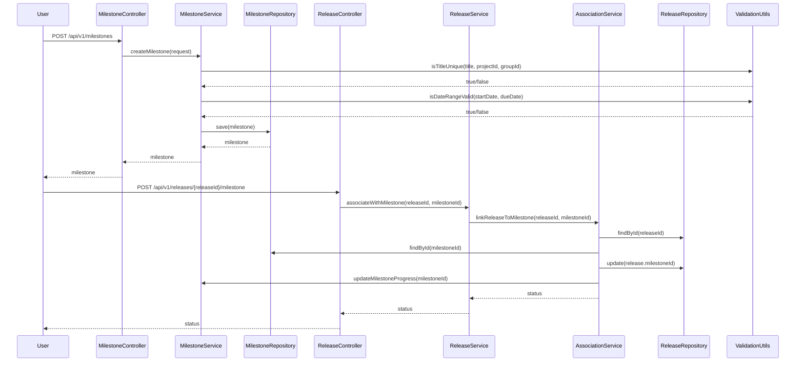
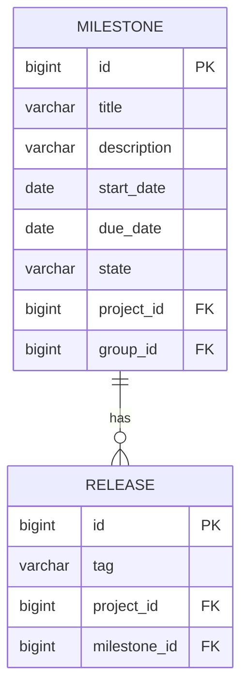

# Low-Level Design (LLD): Milestone Creation and Release Association

## 1. Objective
This document details the low-level design for implementing two core features in the GitLab application server: (1) enabling project managers to create milestones within projects or groups, and (2) allowing developers to associate releases with milestones. The design ensures unique milestone titles within a project or group, enforces business and data validations, and provides a robust association mechanism between releases and milestones. The solution leverages Spring Boot best practices, PostgreSQL as the data store, and supports both RESTful and GraphQL APIs for integration.

## 2. API Model

### 2.1 Common Components/Services
- **MilestoneService**: Handles creation, validation, and management of milestones.
- **ReleaseService**: Manages releases and their associations with milestones.
- **MilestoneRepository**: Data access for milestones.
- **ReleaseRepository**: Data access for releases.
- **AssociationService**: Handles linking releases to milestones and updating progress.
- **ValidationUtils**: Utility for common validation logic.

### 2.2 API Details
| Operation                         | REST Method | Type     | URL                                   | Request JSON                                                                                                 | Response JSON                                                                                                 |
|-----------------------------------|-------------|----------|---------------------------------------|-------------------------------------------------------------------------------------------------------------|--------------------------------------------------------------------------------------------------------------|
| Create Milestone                  | POST        | Success  | /api/v1/milestones                    | { "title": "string", "description": "string", "startDate": "yyyy-MM-dd", "dueDate": "yyyy-MM-dd", "projectId": "long", "groupId": "long (optional)" } | { "id": "long", "title": "string", "description": "string", "startDate": "yyyy-MM-dd", "dueDate": "yyyy-MM-dd", "state": "active", "projectId": "long", "groupId": "long (optional)" } |
| Create Milestone                  | POST        | Failure  | /api/v1/milestones                    | { ... }                                                                                                     | { "error": "Milestone title must be unique within project or group" }                                      |
| Associate Release with Milestone  | POST        | Success  | /api/v1/releases/{releaseId}/milestone| { "milestoneId": "long" }                                                                                 | { "releaseId": "long", "milestoneId": "long", "status": "associated" }                                 |
| Associate Release with Milestone  | POST        | Failure  | /api/v1/releases/{releaseId}/milestone| { ... }                                                                                                     | { "error": "Release tag must be unique within project" }                                                   |
| Get Milestone                     | GET         | Success  | /api/v1/milestones/{id}               | -                                                                                                           | { "id": "long", "title": "string", "description": "string", "startDate": "yyyy-MM-dd", "dueDate": "yyyy-MM-dd", "state": "active", "projectId": "long", "groupId": "long (optional)" } |
| Get Release                       | GET         | Success  | /api/v1/releases/{id}                 | -                                                                                                           | { "id": "long", "tag": "string", "milestoneId": "long (optional)" }                                   |

### 2.3 Exceptions
- **DuplicateMilestoneTitleException**: Thrown when a milestone title already exists within the given project or group.
- **InvalidDateRangeException**: Thrown when the start date is after the due date.
- **ReleaseTagNotUniqueException**: Thrown when a release tag is not unique within a project.
- **MilestoneNotFoundException**: Thrown when the milestone to associate is not found.
- **ReleaseAlreadyAssociatedException**: Thrown when a release is already associated with a milestone.
- **DatabaseConcurrencyException**: Thrown on concurrent update conflicts.

## 3. Functional Design

### 3.1 Class Diagram

### 3.2 UML Sequence Diagram

### 3.3 Components
| Component Name      | Purpose                                               | New/Existing |
|---------------------|-------------------------------------------------------|--------------|
| MilestoneService    | Business logic for milestone management               | New          |
| ReleaseService      | Business logic for release management                 | New          |
| AssociationService  | Handles linking releases to milestones                | New          |
| MilestoneRepository | Data access for milestones                            | New          |
| ReleaseRepository   | Data access for releases                              | New          |
| ValidationUtils     | Shared validation logic                               | New          |
| MilestoneController | REST API endpoint for milestone operations            | New          |
| ReleaseController   | REST API endpoint for release operations              | New          |

### 3.4 Service Layer Logic and Validations
| FieldName         | Validation                                             | ErrorMessage                                         | ClassUsed           |
|-------------------|--------------------------------------------------------|------------------------------------------------------|---------------------|
| title             | Unique within project/group                            | Milestone title must be unique within project/group   | ValidationUtils     |
| startDate, dueDate| startDate <= dueDate                                   | Start date must be before or equal to due date        | ValidationUtils     |
| tag (Release)     | Unique within project                                  | Release tag must be unique within project             | ValidationUtils     |
| milestoneId       | Must exist                                             | Milestone not found                                  | AssociationService  |
| releaseId         | Must exist                                             | Release not found                                    | AssociationService  |
| releaseId         | Not already associated with another milestone          | Release already associated with a milestone           | AssociationService  |

## 4. Integrations
| SystemToBeIntegrated | IntegratedFor                    | IntegrationType |
|----------------------|----------------------------------|-----------------|
| PostgreSQL           | Persistence of milestones/releases| DB              |
| GitLab UI/API        | User interaction                 | REST, GraphQL   |

## 5. DB Details

### 5.1 ER Model

### 5.2 DB Validations
- **Milestone.title**: Unique constraint on (title, project_id) and (title, group_id)
- **Milestone.start_date <= Milestone.due_date**: Enforced at application level
- **Release.tag**: Unique constraint on (tag, project_id)
- **Release.milestone_id**: Foreign key to Milestone.id, nullable (only one milestone per release)
- **Release.milestone_id**: Enforced to be unique per release

## 6. Dependencies
- Spring Boot 2.x/3.x (for REST API, DI, validation)
- Spring Data JPA (for ORM)
- PostgreSQL (as the database)
- GitLab application server (integration context)

## 7. Assumptions
- A milestone can belong to either a project or a group, not both simultaneously.
- Release tags are unique within a project.
- Only one milestone can be associated with a release at a time.
- All date fields are in UTC and follow ISO-8601 format.
- All APIs are secured and authenticated (security implementation is out of scope).
- The system is horizontally scalable and handles high concurrency for milestone/release creation and association.

---

**End of LLD Document**
