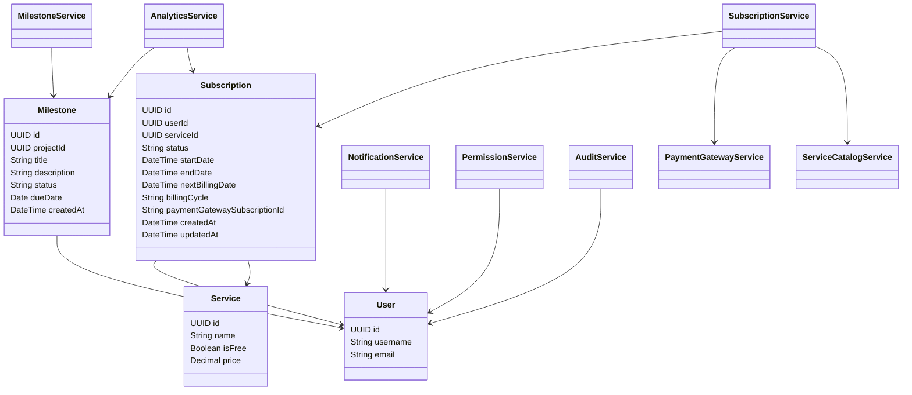
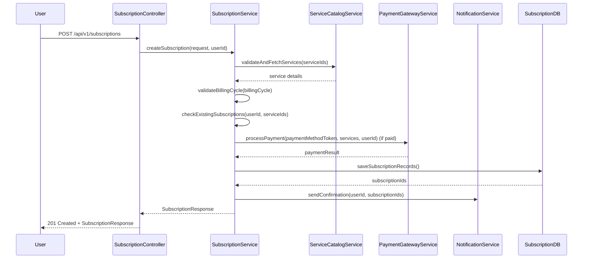
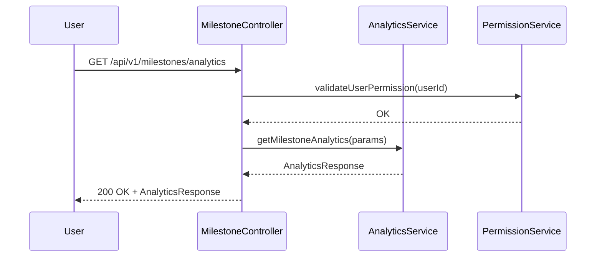
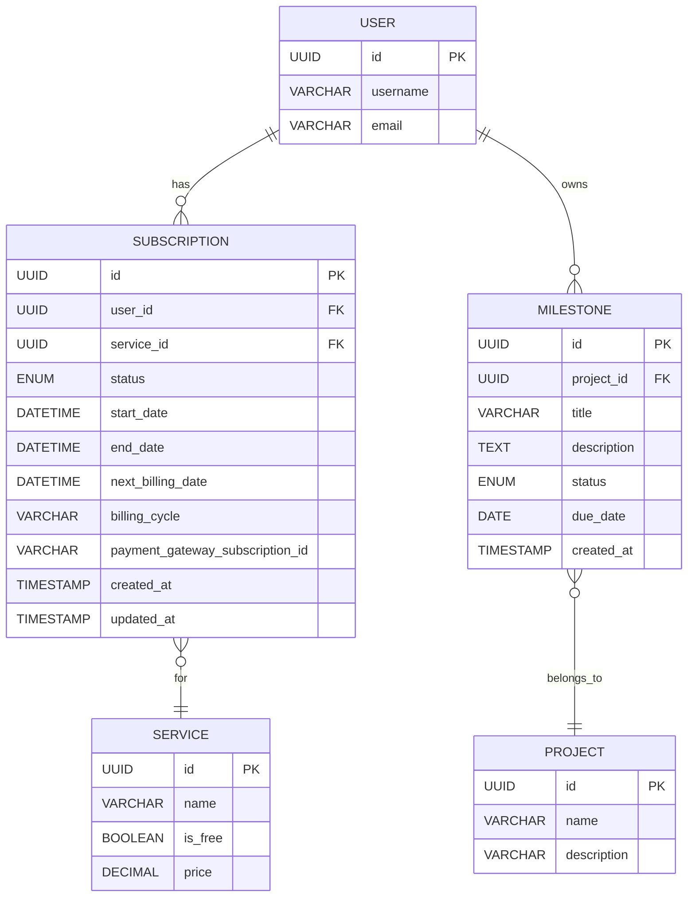

# Low-Level Design (LLD): Subscription & Milestone Management System

## 1. Objective

This document details the Low-Level Design (LLD) for a unified system supporting both Subscription and Milestone Management functionalities. The system enables users to manage subscriptions (create, update, cancel, and view), as well as track project milestones, search/filter milestones, and generate analytics. The design ensures modularity, scalability, and maintainability using Spring Boot best practices, with a focus on robust validation, security, and seamless integration between components. The document merges new subscription requirements (including the /api/v1/subscriptions endpoint for users to subscribe to company services) with the existing milestone management LLD, providing a comprehensive technical blueprint for implementation.

## 2. API Model

### 2.1 Common Components/Services

| Component/Service       | Responsibility                                                        |
|------------------------|-----------------------------------------------------------------------|
| SubscriptionService    | Handles business logic for subscription lifecycle management           |
| MilestoneService       | Manages creation, update, and retrieval of milestones                  |
| NotificationService    | Sends notifications for subscription/milestone events                  |
| PermissionService      | Validates user permissions for sensitive operations                    |
| UserService            | User authentication and profile management                             |
| AuditService           | Logs all critical actions for auditing purposes                        |
| AnalyticsService       | Aggregates and provides analytics on milestones and subscriptions      |
| PaymentGatewayService  | Handles payment processing for paid subscriptions                      |
| ServiceCatalogService  | Validates and fetches service details for subscriptions                |

### 2.2 API Details

| Operation                        | REST Method | Type              | URL                                 | Request JSON / Params                | Response JSON / Schema         |
|-----------------------------------|-------------|-------------------|-------------------------------------|--------------------------------------|-------------------------------|
| Create Subscription               | POST        | Success/Failure   | /api/v1/subscriptions               | See SubscriptionCreateRequest below   | See SubscriptionResponse below|
| Update Subscription               | PUT         | Success/Failure   | /api/v1/subscriptions/{id}          | SubscriptionUpdateRequest             | SubscriptionResponse          |
| Cancel Subscription               | POST        | Success/Failure   | /api/v1/subscriptions/{id}/cancel   | None                                 | SubscriptionResponse          |
| Get Subscription                  | GET         | Success/Failure   | /api/v1/subscriptions/{id}          | Path Variable                        | SubscriptionResponse          |
| List Subscriptions                | GET         | Success/Failure   | /api/v1/subscriptions               | Query Params (filter, page, size)     | SubscriptionListResponse      |
| Create Milestone                  | POST        | Success/Failure   | /api/v1/milestones                  | MilestoneCreateRequest                | MilestoneResponse             |
| Update Milestone                  | PUT         | Success/Failure   | /api/v1/milestones/{id}             | MilestoneUpdateRequest                | MilestoneResponse             |
| Search/Filter Milestones          | GET         | Success/Failure   | /api/v1/milestones/search           | Query Params (filter, page, size)     | MilestoneListResponse         |
| Get Milestone Analytics           | GET         | Success/Failure   | /api/v1/milestones/analytics        | Query Params (date range, type)       | AnalyticsResponse             |

#### SubscriptionCreateRequest (for /api/v1/subscriptions)
```json
{
  "serviceIds": ["UUID", ...],
  "paymentMethodToken": "string (optional, required for paid)",
  "billingCycle": "monthly|yearly",
  "couponCode": "string (optional)"
}
```

#### SubscriptionResponse (for /api/v1/subscriptions)
```json
{
  "subscriptionId": "UUID",
  "userId": "UUID",
  "subscribedServices": [
    {
      "serviceId": "UUID",
      "serviceName": "string",
      "status": "active|pending_payment",
      "startDate": "date-time",
      "nextBillingDate": "date-time",
      "billingCycle": "monthly|yearly"
    }
  ],
  "message": "Subscription successful."
}
```

#### ErrorResponse (common for 4xx/5xx)
```json
{
  "timestamp": "date-time",
  "status": 400,
  "error": "string",
  "message": "string",
  "path": "string"
}
```

#### ErrorResponseWithDetails (for 422)
```json
{
  "timestamp": "date-time",
  "status": 422,
  "error": "string",
  "message": "string",
  "path": "string",
  "details": [
    {"field": "string", "message": "string"}
  ]
}
```

### 2.3 Exceptions

| Exception Name                | HTTP Status | Description                                      |
|------------------------------|-------------|--------------------------------------------------|
| ResourceNotFoundException     | 404         | Entity not found                                 |
| ValidationException           | 400         | Input validation failed                          |
| DuplicateResourceException    | 409         | Duplicate subscription/milestone                 |
| UnauthorizedException         | 401         | Authentication required                          |
| ForbiddenException            | 403         | Insufficient permissions                         |
| SubscriptionStatusException   | 400         | Invalid subscription state for operation         |
| PaymentRequiredException      | 402         | Payment failed or declined                       |
| UnprocessableEntityException  | 422         | Semantic validation errors                       |
| InternalServerErrorException  | 500         | Unhandled server error                           |

## 3. Functional Design

### 3.1 Class Diagram (Mermaid)



### 3.2 UML Sequence Diagram (Mermaid)

#### Create Subscription Flow


#### Milestone Analytics Flow


### 3.3 Components Table

| Component/Service       | Description                                                                 |
|------------------------|-----------------------------------------------------------------------------|
| SubscriptionController | REST controller for subscription endpoints                                   |
| SubscriptionService    | Handles subscription business logic and persistence                         |
| MilestoneController    | REST controller for milestone endpoints                                      |
| MilestoneService       | Handles milestone business logic and persistence                             |
| NotificationService    | Sends notifications for events                                               |
| PermissionService      | Checks user permissions                                                      |
| AuditService           | Logs critical actions                                                        |
| AnalyticsService       | Provides analytics and reporting                                             |
| UserService            | Manages user authentication and profile                                      |
| PaymentGatewayService  | Handles payment processing for paid subscriptions                            |
| ServiceCatalogService  | Validates and fetches service details for subscriptions                      |

### 3.4 Service Layer Logic and Validations Table

| FieldName                | Validation/Logic                                                                 | ErrorMessage                                   | ClassUsed                |
|-------------------------|----------------------------------------------------------------------------------|------------------------------------------------|--------------------------|
| serviceIds              | Required, array of UUIDs, minItems:1, valid services                             | "Invalid or missing serviceIds"                | SubscriptionService      |
| billingCycle            | Required, enum: [monthly, yearly]                                                | "Invalid or missing billingCycle"              | SubscriptionService      |
| paymentMethodToken      | Required if any service is paid, string                                          | "Payment method required for paid services"    | SubscriptionService      |
| couponCode              | Optional, string                                                                 |                                                | SubscriptionService      |
| userId                  | Required, valid UUID, must match authenticated user                              | "Invalid user"                                | SubscriptionService      |
| status                  | Inclusion in [active, pending_payment, cancelled, expired]                       | "Invalid subscription status"                  | Subscription            |
| (userId, serviceId)     | Unique when status='active'                                                      | "Duplicate active subscription"                | Subscription            |
| startDate               | Not null, set to current time on create                                          |                                                | Subscription            |
| nextBillingDate         | Calculated based on billingCycle                                                 |                                                | Subscription            |
| serviceId               | Must exist in Service Catalog                                                    | "Service not found"                            | ServiceCatalogService    |
| paymentGatewaySubscriptionId | Nullable, set if payment processed                                         |                                                | Subscription            |

## 4. Integrations

| SystemToBeIntegrated    | IntegratedFor                       | IntegrationType |
|------------------------|--------------------------------------|-----------------|
| Payment Gateway        | Process subscription payments        | API             |
| Notification Service   | Send confirmation/alerts             | API             |
| Service Catalog        | Validate and fetch service details   | API             |
| Authentication Service | JWT validation, user info            | API             |
| Audit Log System       | Persist audit logs                   | API/DB          |

## 5. DB Details

### 5.1 ER Model (Mermaid)



### 5.2 DB Validations

| Table         | Field          | Validation/Constraint                 |
|---------------|---------------|---------------------------------------|
| SUBSCRIPTION  | user_id        | FK to USER(id), not null              |
| SUBSCRIPTION  | service_id     | FK to SERVICE(id), not null           |
| SUBSCRIPTION  | status         | ENUM (active, pending_payment, cancelled, expired) |
| SUBSCRIPTION  | billing_cycle  | ENUM (monthly, yearly), not null      |
| SUBSCRIPTION  | start_date     | Not null, >= now                      |
| SUBSCRIPTION  | end_date       | Nullable, >= start_date               |
| SUBSCRIPTION  | payment_gateway_subscription_id | Nullable            |
| SUBSCRIPTION  | (user_id, service_id, status) | Unique when status='active' |
| MILESTONE     | project_id     | FK to PROJECT(id), not null           |
| MILESTONE     | title          | Not null, unique per project          |
| MILESTONE     | status         | ENUM (OPEN, COMPLETED, CANCELLED)     |
| USER          | email          | Unique, not null                      |
| SERVICE       | name           | Unique, not null                      |
| PROJECT       | name           | Unique, not null                      |

## 6. Dependencies

- Spring Boot 3.x
- Spring Data JPA
- Spring Security (JWT)
- Hibernate Validator
- PostgreSQL (or compatible RDBMS)
- Lombok
- MapStruct (for DTO mapping)
- OpenAPI/Swagger (API documentation)
- External: Email/SMS Gateway, Payment Gateway

## 7. Assumptions

- All APIs require JWT authentication unless explicitly stated.
- Subscription services are pre-defined and managed externally (Service Catalog).
- Payment processing is handled via a secure external gateway; only payment status and gateway subscription ID are tracked internally.
- NotificationService supports both email and SMS channels.
- All date/time fields are stored in UTC.
- User roles and permissions are managed centrally via PermissionService.
- Audit logs are immutable and append-only.
- Rate limiting is enforced on /api/v1/subscriptions (max 60 requests/minute).
- PCI DSS compliance is ensured by handling only payment tokens, not raw payment data.
- All communication is over HTTPS.
- Sensitive data (e.g., payment tokens) is never logged.

---

**End of LLD Document**
