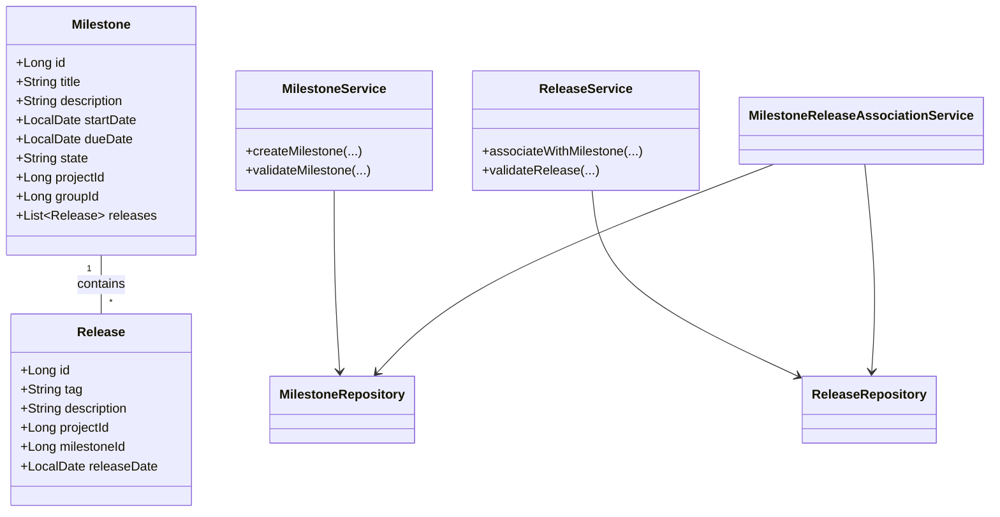
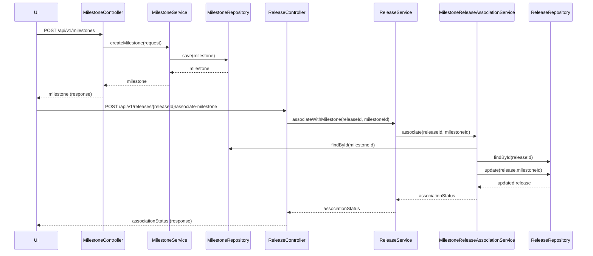
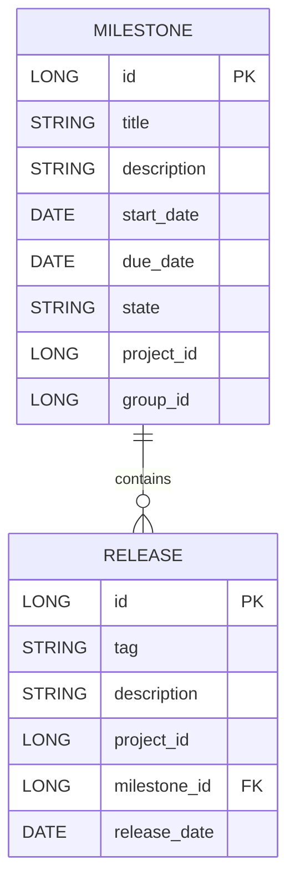

# Low-Level Design (LLD) Document: Milestone Creation & Release Association

## 1. Objective
This document details the low-level design for implementing milestone creation and release association features in the GitLab application server. The goal is to enable project managers to create milestones, track progress, and allow developers to associate releases with milestones for better feature and fix tracking. The design ensures data integrity, uniqueness, and high concurrency handling, following Spring Boot best practices. All APIs, models, validations, and integrations are consolidated for a production-ready implementation.

## 2. API Model

### 2.1 Common Components/Services
- **MilestoneService**: Handles all milestone-related business logic and validations.
- **ReleaseService**: Manages release creation and associations with milestones.
- **MilestoneRepository**: Data access layer for milestones.
- **ReleaseRepository**: Data access layer for releases.
- **MilestoneReleaseAssociationService**: Manages the linking of releases to milestones.
- **ValidationUtils**: Utility class for common validation logic.

### 2.2 API Details
| Operation                        | REST Method | Type           | URL                                   | Request JSON                                                                 | Response JSON                                                                 |
|----------------------------------|-------------|----------------|---------------------------------------|------------------------------------------------------------------------------|------------------------------------------------------------------------------|
| Create Milestone                 | POST        | Success/Failure| /api/v1/milestones                    | {"title": "string", "description": "string", "startDate": "yyyy-MM-dd", "dueDate": "yyyy-MM-dd", "projectId": "long", "groupId": "long"} | {"id": "long", "title": "string", "description": "string", "startDate": "yyyy-MM-dd", "dueDate": "yyyy-MM-dd", "state": "active"} |
| Associate Release with Milestone | POST        | Success/Failure| /api/v1/releases/{releaseId}/associate-milestone | {"milestoneId": "long"}                                                   | {"releaseId": "long", "milestoneId": "long", "associationStatus": "success"}                             |
| Get Milestone Details            | GET         | Success/Failure| /api/v1/milestones/{milestoneId}      | N/A                                                                         | {"id": "long", "title": "string", "description": "string", "startDate": "yyyy-MM-dd", "dueDate": "yyyy-MM-dd", "state": "active", "associatedReleases": [ ... ]} |
| Get Release Details              | GET         | Success/Failure| /api/v1/releases/{releaseId}          | N/A                                                                         | {"id": "long", "tag": "string", "milestoneId": "long", ...}                                               |

### 2.3 Exceptions
- **MilestoneTitleNotUniqueException**: Thrown when a milestone title is not unique within a project or group.
- **InvalidDateRangeException**: Thrown when the start date is after the due date.
- **ReleaseTagNotUniqueException**: Thrown when a release tag is not unique within a project.
- **MilestoneNotFoundException**: Thrown when a milestone is not found for association.
- **ReleaseNotFoundException**: Thrown when a release is not found for association.
- **ReleaseAlreadyAssociatedException**: Thrown when a release is already associated with a milestone.
- **DatabaseConcurrencyException**: Thrown on concurrent update conflicts.

## 3. Functional Design

### 3.1 Class Diagram

### 3.2 UML Sequence Diagram

### 3.3 Components
| Component Name                        | Purpose                                         | New/Existing |
|---------------------------------------|-------------------------------------------------|--------------|
| MilestoneService                      | Handles milestone business logic                | New          |
| ReleaseService                        | Handles release business logic                  | Existing     |
| MilestoneRepository                   | Milestone data access                           | New          |
| ReleaseRepository                     | Release data access                             | Existing     |
| MilestoneReleaseAssociationService    | Manages release-milestone associations          | New          |
| ValidationUtils                       | Common validation logic                         | New          |

### 3.4 Service Layer Logic and Validations
| FieldName        | Validation                                   | ErrorMessage                                         | ClassUsed                       |
|------------------|----------------------------------------------|------------------------------------------------------|----------------------------------|
| title            | Unique within project/group                   | Milestone title must be unique                        | MilestoneService                |
| startDate, dueDate| startDate <= dueDate                         | Start date must be before or equal to due date        | MilestoneService                |
| tag              | Unique within project                         | Release tag must be unique in project                 | ReleaseService                  |
| milestoneId      | Exists in DB                                 | Milestone not found                                   | MilestoneReleaseAssociationService |
| releaseId        | Exists in DB                                 | Release not found                                     | MilestoneReleaseAssociationService |
| releaseId        | Not already associated with another milestone | Release already associated with a milestone           | MilestoneReleaseAssociationService |

## 4. Integrations
| SystemToBeIntegrated | IntegratedFor                  | IntegrationType |
|----------------------|-------------------------------|-----------------|
| PostgreSQL           | Persist milestones/releases    | DB              |
| GitLab UI            | Milestone/release management   | REST API        |
| GitLab GraphQL API   | Release-milestone queries      | GraphQL API     |

## 5. DB Details

### 5.1 ER Model

### 5.2 DB Validations
- **Milestone.title**: Unique constraint within (project_id, group_id)
- **Milestone.start_date <= Milestone.due_date**: Enforced at application layer
- **Release.tag**: Unique constraint within project_id
- **Release.milestone_id**: Foreign key to Milestone.id, nullable (a release may not be associated)
- **Release**: Only one milestone association per release (enforced by unique constraint on release_id in association)

## 6. Dependencies
- PostgreSQL database for persistent storage
- Spring Boot framework for REST APIs and service layers
- GitLab application server for hosting and orchestration

## 7. Assumptions
- Milestone titles are unique within either a project or a group, not globally
- A release can be associated with only one milestone at a time
- All date fields use ISO 8601 format (yyyy-MM-dd)
- Concurrency is handled via optimistic locking or database transactions
- The system is deployed in a secure, production-ready environment
- Only authenticated users can create milestones or associate releases

---

**Absolute Path:** `/workspace/Generated_LLD.md`
