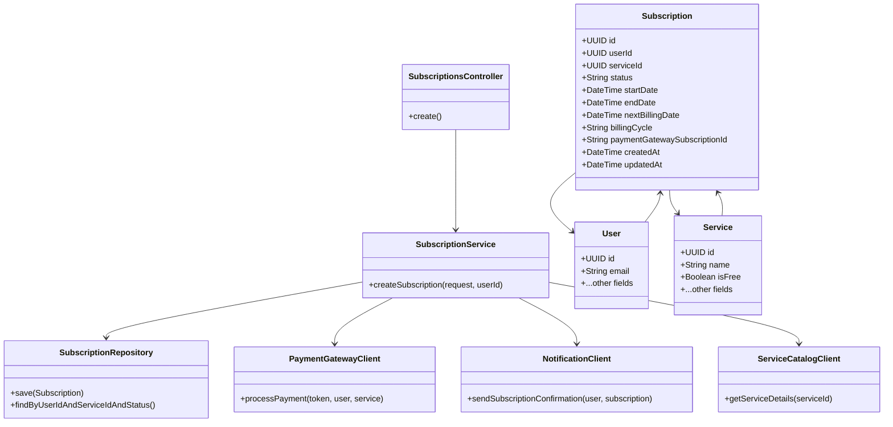
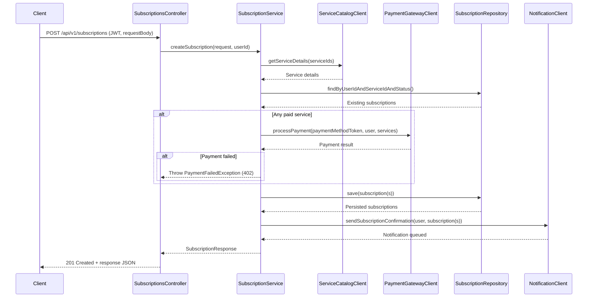

# Low-Level Design (LLD) Document: Subscription API

## 1. Objective

The objective of this document is to provide a comprehensive low-level design for the `/api/v1/subscriptions` endpoint, enabling registered users to subscribe to company services via a secure API. The endpoint supports both free and paid services, handles payment integration, and ensures robust validation, error handling, and notification. The design consolidates all user stories and requirements, ensuring a unified, production-ready solution following Spring Boot best practices.

## 2. API Model

### 2.1 Common Components/Services
- **Authentication Service**: Validates JWT tokens and extracts user identity.
- **User Service**: Verifies user existence and retrieves user details.
- **Service Catalog/Product Service**: Validates service IDs and fetches service details.
- **Payment Gateway Service**: Handles payment processing for paid services.
- **Notification Service**: Sends confirmation and error notifications.
- **Subscription Database**: Stores subscription records and enforces constraints.

### 2.2 API Details

| Operation                | REST Method | Type            | URL                      | Request JSON                                                                                          | Response JSON                                                                                                                         |
|-------------------------|-------------|-----------------|--------------------------|------------------------------------------------------------------------------------------------------|---------------------------------------------------------------------------------------------------------------------------------------|
| Create Subscription     | POST        | Success (201)   | /api/v1/subscriptions    | `{ "serviceIds": ["<uuid>"], "paymentMethodToken": "<string>", "billingCycle": "monthly", "couponCode": "<string>" }` | `{ "subscriptionId": "<uuid>", "userId": "<uuid>", "subscribedServices": [{ "serviceId": "<uuid>", "serviceName": "<string>", "status": "active", "startDate": "<datetime>", "nextBillingDate": "<datetime>", "billingCycle": "monthly" }], "message": "Subscription successful." }` |
| Bad Request             | POST        | Failure (400)   | /api/v1/subscriptions    | Invalid/missing fields                                                                               | `{ "timestamp": "<datetime>", "status": 400, "error": "Bad Request", "message": "<error>", "path": "/api/v1/subscriptions" }` |
| Unauthorized            | POST        | Failure (401)   | /api/v1/subscriptions    | Missing/invalid JWT                                                                                  | `{ "timestamp": "<datetime>", "status": 401, "error": "Unauthorized", "message": "<error>", "path": "/api/v1/subscriptions" }` |
| Payment Required        | POST        | Failure (402)   | /api/v1/subscriptions    | Payment failed                                                                                       | `{ "timestamp": "<datetime>", "status": 402, "error": "Payment Required", "message": "<error>", "path": "/api/v1/subscriptions" }` |
| Not Found               | POST        | Failure (404)   | /api/v1/subscriptions    | Invalid serviceId/user                                                                               | `{ "timestamp": "<datetime>", "status": 404, "error": "Not Found", "message": "<error>", "path": "/api/v1/subscriptions" }` |
| Conflict                | POST        | Failure (409)   | /api/v1/subscriptions    | Already subscribed                                                                                   | `{ "timestamp": "<datetime>", "status": 409, "error": "Conflict", "message": "<error>", "path": "/api/v1/subscriptions" }` |
| Unprocessable Entity    | POST        | Failure (422)   | /api/v1/subscriptions    | Semantic validation errors                                                                          | `{ "timestamp": "<datetime>", "status": 422, "error": "Unprocessable Entity", "message": "<error>", "path": "/api/v1/subscriptions", "details": [{ "field": "<field>", "message": "<error>" }] }` |
| Internal Server Error   | POST        | Failure (500)   | /api/v1/subscriptions    | Server error                                                                                        | `{ "timestamp": "<datetime>", "status": 500, "error": "Internal Server Error", "message": "<error>", "path": "/api/v1/subscriptions" }` |

### 2.3 Exceptions

**Custom/Business Exceptions:**
- **InvalidRequestException**: Thrown for missing or invalid request fields (400).
- **AuthenticationException**: Thrown for missing/invalid JWT (401).
- **PaymentFailedException**: Thrown when payment fails (402).
- **ResourceNotFoundException**: Thrown when serviceId or user not found (404).
- **AlreadySubscribedException**: Thrown when user is already subscribed (409).
- **ValidationException**: Thrown for semantic validation errors (422).
- **GenericServerException**: Thrown for unexpected errors (500).

Grouped by scenario/service:
- **Input Validation**: InvalidRequestException, ValidationException
- **Authentication**: AuthenticationException
- **Payment**: PaymentFailedException
- **Resource Lookup**: ResourceNotFoundException
- **Subscription Logic**: AlreadySubscribedException
- **General**: GenericServerException

## 3. Functional Design

### 3.1 Class Diagram


### 3.2 UML Sequence Diagram


### 3.3 Components

| Component                   | Purpose                                                      | New/Existing |
|-----------------------------|--------------------------------------------------------------|--------------|
| SubscriptionsController     | Handles API requests for subscriptions                       | New          |
| SubscriptionService         | Business logic for creating subscriptions                    | New          |
| SubscriptionRepository      | Data access for Subscription entities                        | New          |
| Subscription                | Entity/model for subscription records                        | New          |
| User                        | Represents user (existing, extended with subscriptions)      | Existing     |
| Service                     | Represents company service (existing, extended as needed)    | Existing     |
| PaymentGatewayClient        | Integrates with payment gateway (Stripe/Braintree)           | New          |
| NotificationClient          | Sends notifications/emails                                  | New          |
| ServiceCatalogClient        | Fetches service details from catalog                         | New          |

### 3.4 Service Layer Logic and Validations

| FieldName             | Validation                                                                 | ErrorMessage                                 | ClassUsed                |
|----------------------|-----------------------------------------------------------------------------|----------------------------------------------|--------------------------|
| serviceIds           | Required, array, min 1, UUID format                                         | "serviceIds must be a non-empty array of UUIDs" | SubscriptionsController  |
| billingCycle         | Required, enum [monthly, yearly]                                            | "billingCycle must be 'monthly' or 'yearly'" | SubscriptionsController  |
| paymentMethodToken   | Required if any service is paid                                             | "paymentMethodToken required for paid service" | SubscriptionsController  |
| couponCode           | Optional, string                                                            | "couponCode must be a string"                | SubscriptionsController  |
| userId               | Must match authenticated user, required, UUID format                        | "Invalid userId"                             | Subscription             |
| serviceId            | Must exist in Service Catalog, UUID format                                  | "Invalid serviceId"                          | ServiceCatalogClient     |
| status               | Must be one of [active, pending_payment, cancelled, expired]                 | "Invalid status value"                       | Subscription             |
| billingCycle         | Must be one of [monthly, yearly]                                            | "Invalid billingCycle value"                 | Subscription             |
| Uniqueness           | (userId, serviceId, status='active') unique                                 | "Already subscribed to this service"         | SubscriptionRepository   |
| startDate            | Set to current time before create                                           | -                                            | Subscription             |
| nextBillingDate      | Calculated based on billingCycle before create                              | -                                            | Subscription             |

## 4. Integrations

| SystemToBeIntegrated      | IntegratedFor                                 | IntegrationType |
|--------------------------|-----------------------------------------------|-----------------|
| Authentication Service   | JWT validation, user extraction               | API             |
| User Service             | User existence/lookup                         | API             |
| Service Catalog Service  | Validate/fetch service details                | API             |
| Payment Gateway Service  | Payment processing for paid subscriptions     | API             |
| Notification Service     | Send confirmation/failure notifications       | API             |
| Subscription Database    | Store/retrieve subscription records           | DB              |

## 5. DB Details

### 5.1 ER Model
```mermaid
erDiagram
    USER ||--o{ SUBSCRIPTION : has
    SERVICE ||--o{ SUBSCRIPTION : has
    SUBSCRIPTION {
        UUID id PK
        UUID userId FK
        UUID serviceId FK
        STRING status
        DATETIME startDate
        DATETIME endDate
        DATETIME nextBillingDate
        STRING billingCycle
        STRING paymentGatewaySubscriptionId
        DATETIME createdAt
        DATETIME updatedAt
    }
    USER {
        UUID id PK
        STRING email
        ...
    }
    SERVICE {
        UUID id PK
        STRING name
        BOOLEAN isFree
        ...
    }
```

### 5.2 DB Validations
- **userId**: NOT NULL, valid UUID, foreign key to USER(id)
- **serviceId**: NOT NULL, valid UUID, foreign key to SERVICE(id)
- **status**: NOT NULL, ENUM [active, pending_payment, cancelled, expired]
- **billingCycle**: NOT NULL, ENUM [monthly, yearly]
- **startDate**: NOT NULL, default CURRENT_TIMESTAMP
- **Uniqueness**: Unique constraint on (userId, serviceId, status='active')
- **Indexes**: userId, serviceId, paymentGatewaySubscriptionId

## 6. Dependencies
- **Authentication Service**: Required for JWT validation.
- **Service Catalog/Product Service**: Required for service validation and details.
- **Payment Gateway**: Required for paid subscriptions.
- **Notification Service**: Required for confirmation emails.
- **Subscription Database**: Required for storing subscription records.

## 7. Assumptions
- All requests are made over HTTPS.
- JWT tokens are validated upstream or by middleware.
- Payment tokens are PCI-compliant and never stored in raw form.
- Service Catalog contains up-to-date information on all services.
- Notification Service is reliable for email delivery.
- Rate limiting is enforced at API gateway or application (60 requests/minute).
- All integrations are available and responsive at runtime.
- Only the authenticated user can create subscriptions for themselves.
- Coupon codes are validated by the payment gateway or a separate promo service.

---

**End of LLD Document**
