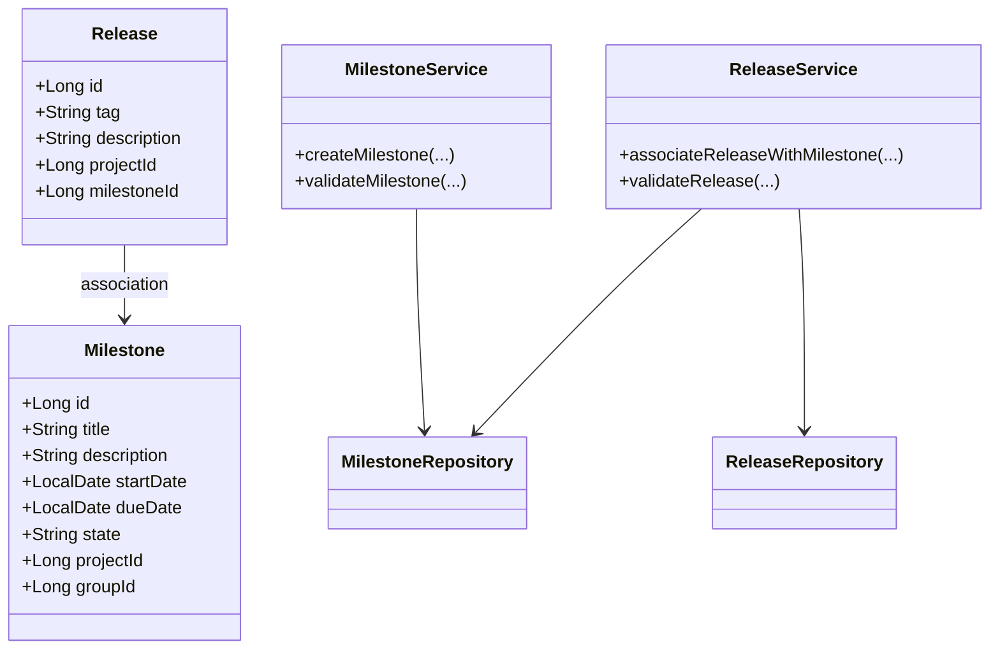
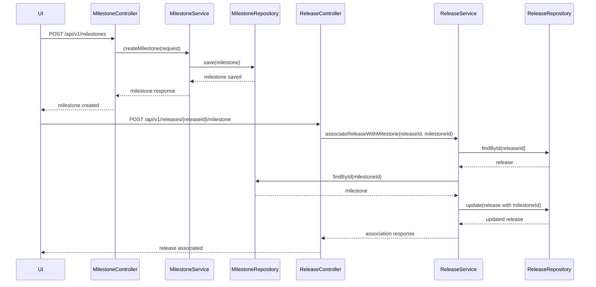
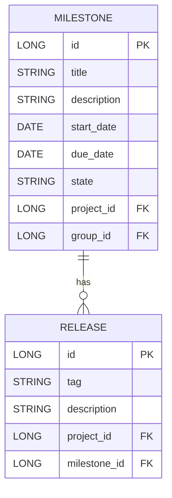

# Low-Level Design (LLD) Document: Milestone and Release Association

## 1. Objective
This document details the low-level design for implementing two primary features in the GitLab application server: (1) enabling project managers to create milestones for projects or groups, and (2) allowing developers to associate releases with milestones. The goal is to provide robust tracking of progress and feature inclusion through milestones and their linked releases. The design ensures data integrity, high concurrency handling, and compliance with business rules for milestone and release management.

## 2. API Model

### 2.1 Common Components/Services
- **MilestoneService**: Handles business logic for milestone creation and management.
- **ReleaseService**: Manages release creation and association with milestones.
- **MilestoneRepository**: Data access layer for milestones.
- **ReleaseRepository**: Data access layer for releases.
- **ValidationUtils**: Utility for common validation logic.
- **ExceptionHandler**: Centralized exception handling for API errors.

### 2.2 API Details
| Operation                         | REST Method | Type     | URL                                 | Request JSON                                                                                  | Response JSON                                                                                 |
|-----------------------------------|-------------|----------|-------------------------------------|-----------------------------------------------------------------------------------------------|-----------------------------------------------------------------------------------------------|
| Create Milestone                  | POST        | Success  | /api/v1/milestones                  | { "title": "string", "description": "string", "startDate": "yyyy-MM-dd", "dueDate": "yyyy-MM-dd", "projectId": "long", "groupId": "long (optional)" } | { "id": "long", "title": "string", "description": "string", "startDate": "yyyy-MM-dd", "dueDate": "yyyy-MM-dd", "state": "active", "projectId": "long", "groupId": "long (optional)" } |
| Create Milestone                  | POST        | Failure  | /api/v1/milestones                  | { ... }                                                                                       | { "error": "Milestone title must be unique within project or group" }                      |
| Associate Release with Milestone  | POST        | Success  | /api/v1/releases/{releaseId}/milestone | { "milestoneId": "long" }                                                                  | { "releaseId": "long", "milestoneId": "long", "status": "associated" }             |
| Associate Release with Milestone  | POST        | Failure  | /api/v1/releases/{releaseId}/milestone | { ... }                                                                                       | { "error": "Release tag must be unique within project" }                                   |

### 2.3 Exceptions
- **MilestoneTitleNotUniqueException**: Thrown when a milestone title already exists within the project or group.
- **InvalidDateRangeException**: Thrown when the start date is after the due date.
- **ReleaseTagNotUniqueException**: Thrown when a release tag is not unique within the project.
- **ReleaseAlreadyAssociatedException**: Thrown when a release is already associated with a milestone.
- **MilestoneNotFoundException**: Thrown when the specified milestone does not exist.
- **ReleaseNotFoundException**: Thrown when the specified release does not exist.
- **DatabaseConflictException**: Thrown on concurrency or atomicity issues during creation/association.

## 3. Functional Design

### 3.1 Class Diagram

### 3.2 UML Sequence Diagram

### 3.3 Components
| Component Name        | Purpose                                              | New/Existing |
|----------------------|------------------------------------------------------|--------------|
| MilestoneService     | Business logic for milestone management              | New          |
| ReleaseService       | Business logic for release management                | New          |
| MilestoneRepository  | Data access for milestones                           | Existing     |
| ReleaseRepository    | Data access for releases                             | Existing     |
| ValidationUtils      | Common validation logic                              | New          |
| ExceptionHandler     | Centralized API exception handling                   | Existing     |

### 3.4 Service Layer Logic and Validations
| FieldName        | Validation                                   | ErrorMessage                                         | ClassUsed           |
|------------------|----------------------------------------------|------------------------------------------------------|---------------------|
| title            | Unique within project or group                | Milestone title must be unique within project/group   | MilestoneService    |
| startDate, dueDate| startDate <= dueDate                         | Start date must be before or equal to due date        | MilestoneService    |
| tag              | Unique within project                        | Release tag must be unique within project             | ReleaseService      |
| milestoneId      | Exists in DB                                 | Milestone not found                                   | ReleaseService      |
| releaseId        | Exists in DB                                 | Release not found                                     | ReleaseService      |
| releaseId        | Not already associated with a milestone      | Release already associated with a milestone           | ReleaseService      |

## 4. Integrations
| SystemToBeIntegrated | IntegratedFor                | IntegrationType |
|----------------------|------------------------------|-----------------|
| PostgreSQL           | Milestone persistence        | DB              |
| PostgreSQL           | Release persistence          | DB              |
| GitLab UI            | Milestone/release management | API             |
| GitLab API           | Milestone/release management | API             |

## 5. DB Details

### 5.1 ER Model

### 5.2 DB Validations
- **Milestone.title**: Unique constraint on (title, project_id) and (title, group_id)
- **Milestone.start_date, Milestone.due_date**: Check constraint to ensure start_date <= due_date
- **Release.tag**: Unique constraint on (tag, project_id)
- **Release.milestone_id**: Foreign key constraint to Milestone.id (nullable, but only one milestone per release)

## 6. Dependencies
- Spring Boot framework (REST API, JPA/Hibernate)
- PostgreSQL database
- GitLab application server
- GitLab UI and API clients

## 7. Assumptions
- A milestone can belong to either a project or a group, not both simultaneously.
- Milestone titles must be unique within their scope (project or group).
- A release can only be linked to one milestone at a time.
- All date fields are in ISO format (yyyy-MM-dd).
- Concurrency is handled at the DB level using unique constraints and transactions.
- The system is already integrated with authentication and authorization modules.
- Only active milestones can be associated with releases.
