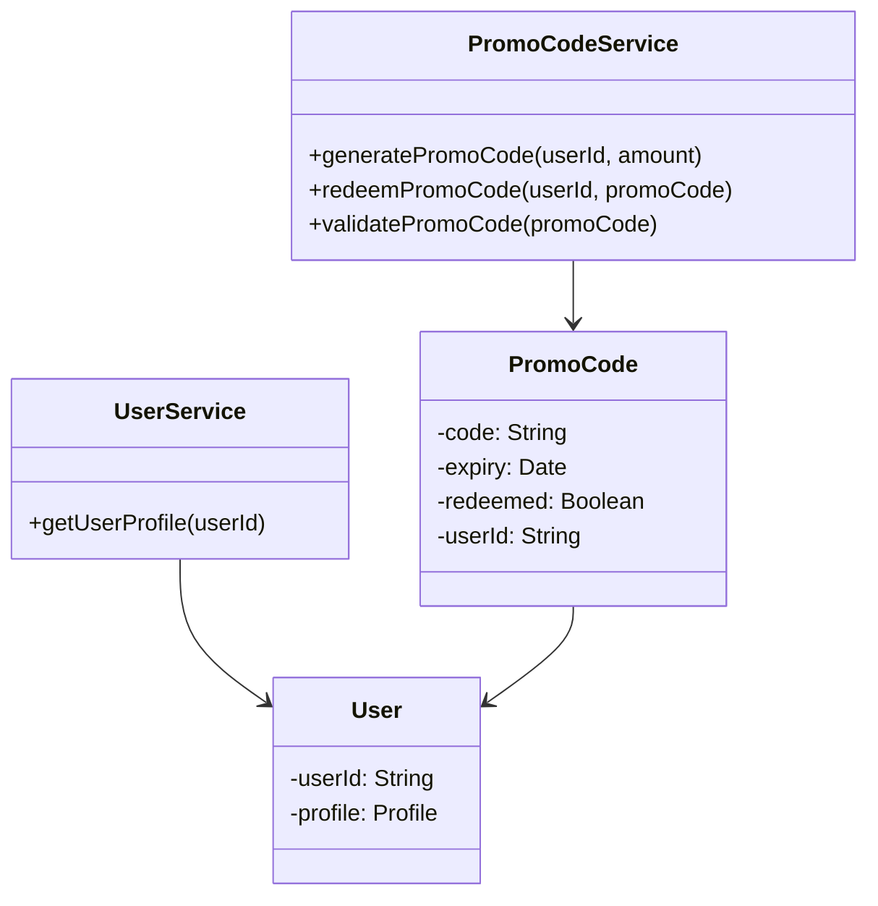
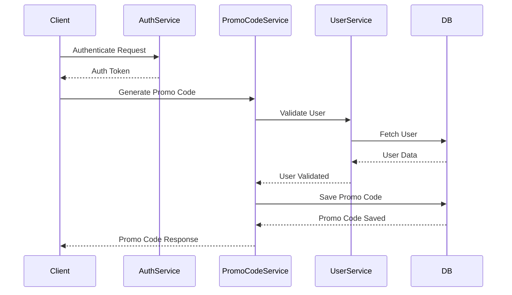
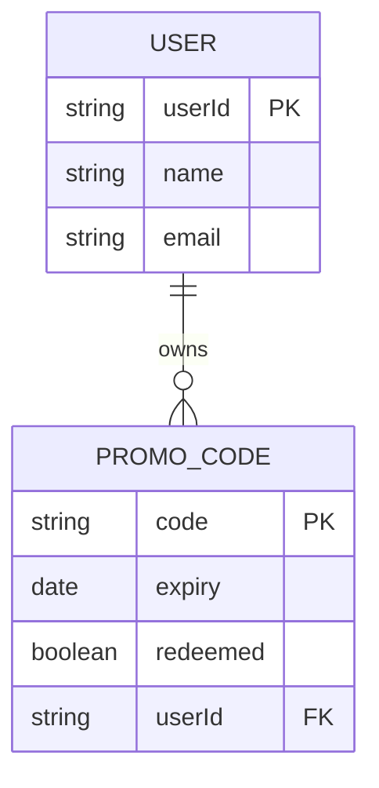

# Low-Level Design (LLD) Document

## 1. Objective
This document details the low-level design for the requirements outlined in the provided user stories. The goal is to ensure a production-ready, unified system design that adheres to Spring Boot best practices. The design covers API models, service logic, validations, database details, integrations, and dependencies. All components are consolidated to provide a clear and developer-friendly reference for implementation.

## 2. API Model

### 2.1 Common Components/Services
- **AuthenticationService**: Handles user authentication and authorization.
- **PromoCodeService**: Manages promo code generation, validation, and redemption.
- **UserService**: Handles user data and profile management.
- **ExceptionHandler**: Centralized exception handling for REST APIs.

### 2.2 API Details
| Operation                | REST Method | Type            | URL                       | Request JSON                                    | Response JSON                                   |
|--------------------------|-------------|-----------------|---------------------------|-------------------------------------------------|-------------------------------------------------|
| Generate Promo Code      | POST        | Success/Failure | /api/promo/generate       | { "userId": "string", "amount": "number" }    | { "promoCode": "string", "expiry": "date" }   |
| Redeem Promo Code        | POST        | Success/Failure | /api/promo/redeem         | { "userId": "string", "promoCode": "string" } | { "status": "string", "discount": "number" }  |
| Get User Profile         | GET         | Success/Failure | /api/user/{userId}        | -                                               | { "userId": "string", "profile": {...} }      |
| Validate Promo Code      | POST        | Success/Failure | /api/promo/validate       | { "promoCode": "string" }                      | { "isValid": "boolean", "reason": "string" } |

### 2.3 Exceptions
- **PromoCodeExpiredException**: Thrown when a promo code is expired during redemption or validation.
- **PromoCodeNotFoundException**: Thrown when a promo code does not exist.
- **InvalidUserException**: Thrown when user information is invalid or missing.
- **PromoCodeAlreadyRedeemedException**: Thrown when a promo code has already been redeemed.
- **InsufficientBalanceException**: Thrown when the user does not have enough balance for an operation.

## 3. Functional Design

### 3.1 Class Diagram

### 3.2 UML Sequence Diagram

### 3.3 Components
| Component Name      | Purpose                                   | New/Existing |
|---------------------|-------------------------------------------|--------------|
| PromoCodeService    | Promo code logic (generate, redeem, etc.) | New          |
| UserService         | User profile management                   | Existing     |
| AuthenticationService| Auth and authorization                   | Existing     |
| ExceptionHandler    | Centralized exception handling            | New          |

### 3.4 Service Layer Logic and Validations
| FieldName     | Validation                        | ErrorMessage                        | ClassUsed             |
|---------------|-----------------------------------|-------------------------------------|-----------------------|
| userId        | Not null, exists in DB            | InvalidUserException                | UserService           |
| promoCode     | Not null, exists, not expired     | PromoCodeNotFoundException, PromoCodeExpiredException | PromoCodeService      |
| amount        | > 0                               | InsufficientBalanceException        | PromoCodeService      |
| promoCode     | Not already redeemed              | PromoCodeAlreadyRedeemedException   | PromoCodeService      |

## 4. Integrations
| SystemToBeIntegrated | IntegratedFor          | IntegrationType |
|----------------------|-----------------------|-----------------|
| User DB              | Fetch user profiles   | DB              |
| Notification Service | Send promo notifications | API           |
| Payment Gateway      | Validate transactions | API             |

## 5. DB Details

### 5.1 ER Model

### 5.2 DB Validations
- **userId**: Primary key in USER table, foreign key in PROMO_CODE table.
- **promoCode**: Unique, not null, must not be expired or redeemed.
- **expiry**: Must be a future date at creation.

## 6. Dependencies
- Spring Boot 2.7+
- Spring Data JPA
- Spring Security
- MySQL/PostgreSQL (DB)
- External Notification Service
- Payment Gateway API

## 7. Assumptions
- All users are authenticated before accessing promo code APIs.
- Promo codes are unique per user and cannot be transferred.
- Expiry dates are enforced at both application and DB level.
- Notification service is available and reliable for sending promo code alerts.
- Payment gateway integration is synchronous and returns immediate response.
