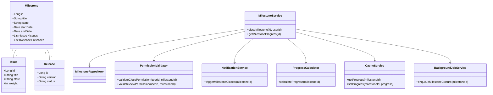

# Low-Level Design (LLD) Document: Milestone Close & View Progress

## 1. Objective
This document provides a consolidated low-level design for the implementation of two key features in the GitLab application server: (1) closing a milestone, and (2) viewing milestone progress. The design ensures that project managers can mark milestones as completed, triggering all necessary updates and notifications, while team members can view real-time progress and status of milestones. The solution is designed for scalability, data consistency, and seamless integration with existing systems and frontend components.

## 2. API Model

### 2.1 Common Components/Services
- **MilestoneService**: Business logic for milestone operations (close, fetch progress)
- **MilestoneRepository**: Data access for Milestone entities
- **IssueService**: Updates issues/merge requests on milestone closure
- **NotificationService**: Triggers webhooks/notifications
- **PermissionValidator**: Validates user permissions
- **ProgressCalculator**: Calculates milestone progress
- **CacheService**: Handles Redis caching for milestone progress
- **BackgroundJobService**: Manages asynchronous closure via Sidekiq

### 2.2 API Details
| Operation                | REST Method | Type     | URL                                   | Request JSON                                                                 | Response JSON                                                                 |
|--------------------------|-------------|----------|---------------------------------------|------------------------------------------------------------------------------|------------------------------------------------------------------------------|
| Close Milestone          | POST        | Success  | /api/v1/milestones/{id}/close         | { "userId": "string" }                                                    | { "status": "closed", "milestoneId": 123, "closedAt": "2024-06-10T12:00:00Z" } |
| Close Milestone          | POST        | Failure  | /api/v1/milestones/{id}/close         | { "userId": "string" }                                                    | { "error": "MilestoneNotActiveException" }                                 |
| View Milestone Progress  | GET         | Success  | /api/v1/milestones/{id}/progress      | N/A                                                                          | { "milestoneId": 123, "progress": 0.85, "completedIssues": 17, "totalIssues": 20, "elapsedDays": 13, "totalDays": 15, "releases": [{"id":1,"status":"released"}], "weightedProgress": 0.9 } |
| View Milestone Progress  | GET         | Failure  | /api/v1/milestones/{id}/progress      | N/A                                                                          | { "error": "PermissionDeniedException" }                                   |

### 2.3 Exceptions
- **MilestoneNotActiveException**: Attempt to close a milestone not in 'active' state
- **PermissionDeniedException**: User lacks permission for the operation
- **MilestoneNotFoundException**: Milestone ID does not exist
- **DataConsistencyException**: Inconsistent state between cache and DB
- **AsyncJobFailedException**: Background closure job failed

## 3. Functional Design

### 3.1 Class Diagram

### 3.2 UML Sequence Diagram

### 3.3 Components
| Component               | Purpose                                          | New/Existing |
|-------------------------|--------------------------------------------------|--------------|
| MilestoneService        | Handles business logic for milestones            | Existing     |
| MilestoneRepository     | Data access for milestones                       | Existing     |
| IssueService            | Updates issues/merge requests on closure         | Existing     |
| NotificationService     | Sends notifications/webhooks                     | Existing     |
| PermissionValidator     | Checks user permissions                          | Existing     |
| ProgressCalculator      | Computes milestone progress                      | New          |
| CacheService            | Manages Redis caching for progress               | Existing     |
| BackgroundJobService    | Handles async closure jobs (Sidekiq)             | Existing     |

### 3.4 Service Layer Logic and Validations
| FieldName         | Validation                                    | ErrorMessage                        | ClassUsed            |
|-------------------|-----------------------------------------------|-------------------------------------|----------------------|
| milestone.state   | Must be 'active' to close                     | MilestoneNotActiveException         | MilestoneService     |
| userId            | Must have close permission                     | PermissionDeniedException           | PermissionValidator  |
| milestoneId       | Must exist                                    | MilestoneNotFoundException          | MilestoneService     |
| milestoneId       | Data consistency between cache and DB          | DataConsistencyException            | CacheService         |
| userId            | Must have view permission                      | PermissionDeniedException           | PermissionValidator  |

## 4. Integrations
| SystemToBeIntegrated | IntegratedFor                | IntegrationType |
|----------------------|-----------------------------|-----------------|
| Sidekiq              | Async milestone closure      | Job Queue       |
| Redis                | Progress caching             | Cache           |
| PostgreSQL           | Milestone/issues storage     | DB              |
| Webhook endpoints    | Notifications on closure     | API             |
| Vue.js Frontend      | Progress bar display         | API             |

## 5. DB Details

### 5.1 ER Model

### 5.2 DB Validations
- **milestone.state**: Enum constraint ('active', 'closed', 'upcoming')
- **issue.state**: Enum constraint ('open', 'closed')
- **milestone_id**: Foreign key constraints on issues and releases
- **Unique**: Milestone title unique per project

## 6. Dependencies
- Sidekiq for background job processing
- Redis for caching progress data
- PostgreSQL for persistent storage
- Vue.js frontend for progress visualization
- Webhook endpoints for notifications

## 7. Assumptions
- User authentication and authorization are handled by a central security module
- All milestone closure operations for large milestones are processed asynchronously
- Progress calculations factor in weighted issues if the feature is enabled
- Data consistency between cache and DB is managed via cache invalidation on updates
- All API endpoints are secured and follow RESTful conventions

---

*Generated by Crew Manager LLD Agent*
