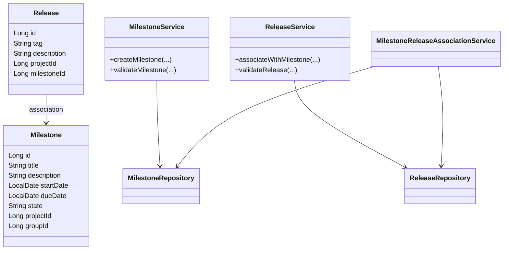
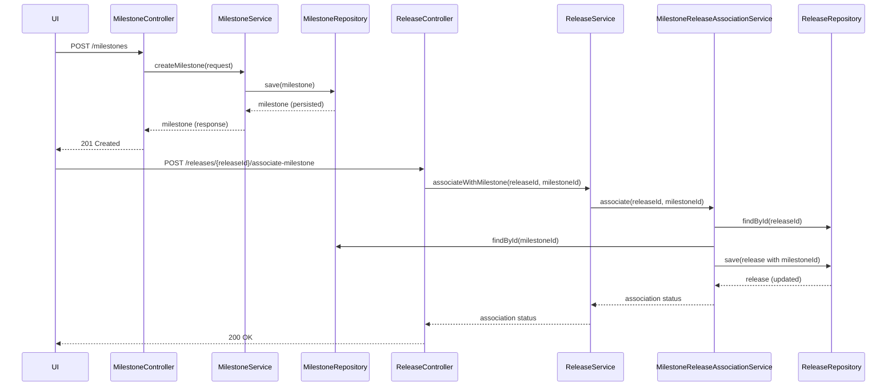
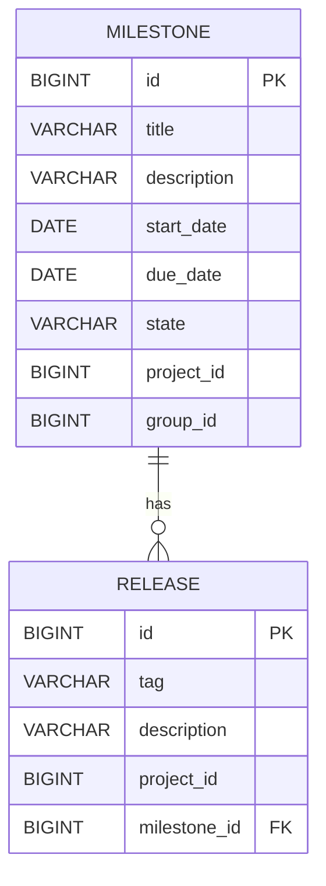

# Low-Level Design (LLD) Document: Milestone Creation & Release Association

## 1. Objective
This document details the low-level design for the implementation of two key features in the GitLab application server: (1) creation of milestones within projects or groups, and (2) association of releases with milestones. The goal is to enable project managers and developers to track progress and feature inclusion efficiently. The design ensures unique milestone and release identification, robust validation, and atomic operations for high concurrency scenarios. All logic, validations, models, APIs, and integrations are consolidated for a production-ready Spring Boot implementation.

## 2. API Model

### 2.1 Common Components/Services
- **MilestoneService**: Handles business logic for milestone creation and management.
- **ReleaseService**: Manages release creation and association with milestones.
- **MilestoneRepository**: JPA repository for Milestone entity.
- **ReleaseRepository**: JPA repository for Release entity.
- **MilestoneReleaseAssociationService**: Manages linking releases to milestones.
- **ValidationUtils**: Utility for common validation logic.

### 2.2 API Details
| Operation                      | REST Method | Type     | URL                                 | Request JSON                                                                                          | Response JSON                                                                                       |
|-------------------------------|-------------|----------|-------------------------------------|------------------------------------------------------------------------------------------------------|-----------------------------------------------------------------------------------------------------|
| Create Milestone               | POST        | Success  | /api/v1/milestones                  | {"title": "string", "description": "string", "startDate": "yyyy-MM-dd", "dueDate": "yyyy-MM-dd", "projectId": "Long", "groupId": "Long"} | {"id": "Long", "title": "string", "description": "string", "startDate": "yyyy-MM-dd", "dueDate": "yyyy-MM-dd", "state": "active", "projectId": "Long", "groupId": "Long"} |
| Create Milestone               | POST        | Failure  | /api/v1/milestones                  | (same as above)                                                                                       | {"errorCode": "string", "message": "string"}                                                  |
| Associate Release with Milestone| POST        | Success  | /api/v1/releases/{releaseId}/associate-milestone | {"milestoneId": "Long"}                                                                             | {"releaseId": "Long", "milestoneId": "Long", "status": "associated"}                       |
| Associate Release with Milestone| POST        | Failure  | /api/v1/releases/{releaseId}/associate-milestone | (same as above)                                                                                       | {"errorCode": "string", "message": "string"}                                                  |

### 2.3 Exceptions
- **MilestoneTitleNotUniqueException**: Thrown if milestone title is not unique within project/group.
- **InvalidDateRangeException**: Thrown if start date is after due date.
- **ReleaseTagNotUniqueException**: Thrown if release tag is not unique within project.
- **ReleaseAlreadyAssociatedException**: Thrown if a release is already associated with a milestone.
- **MilestoneNotFoundException**: Thrown if milestone does not exist.
- **ReleaseNotFoundException**: Thrown if release does not exist.
- **DatabaseConcurrencyException**: Thrown on concurrent update conflicts.

## 3. Functional Design

### 3.1 Class Diagram

### 3.2 UML Sequence Diagram

### 3.3 Components
| Component Name                        | Purpose                                      | New/Existing |
|---------------------------------------|----------------------------------------------|--------------|
| MilestoneService                      | Business logic for milestones                | New          |
| ReleaseService                        | Business logic for releases                  | New          |
| MilestoneRepository                   | DB access for milestones                     | New          |
| ReleaseRepository                     | DB access for releases                       | New          |
| MilestoneReleaseAssociationService    | Handles release-milestone associations       | New          |
| ValidationUtils                       | Common validation logic                      | New          |

### 3.4 Service Layer Logic and Validations
| FieldName     | Validation                                    | ErrorMessage                                         | ClassUsed                        |
|--------------|------------------------------------------------|------------------------------------------------------|----------------------------------|
| title        | Unique within project/group                    | Milestone title must be unique within project/group   | MilestoneService                 |
| startDate    | startDate <= dueDate                           | Start date must be before or equal to due date       | MilestoneService                 |
| tag          | Unique within project                          | Release tag must be unique within project            | ReleaseService                   |
| milestoneId  | Exists in DB                                  | Milestone not found                                  | MilestoneReleaseAssociationService|
| releaseId    | Exists in DB                                  | Release not found                                    | MilestoneReleaseAssociationService|
| releaseId    | Not already associated with another milestone  | Release already associated with a milestone          | MilestoneReleaseAssociationService|

## 4. Integrations
| SystemToBeIntegrated | IntegratedFor                        | IntegrationType |
|---------------------|--------------------------------------|-----------------|
| PostgreSQL          | Milestone and Release persistence     | DB              |
| GitLab UI           | Milestone and Release management      | REST API        |
| GitLab GraphQL      | Milestone and Release queries         | GraphQL API     |

## 5. DB Details

### 5.1 ER Model

### 5.2 DB Validations
- **Milestone.title**: Unique constraint on (title, project_id) and (title, group_id)
- **Release.tag**: Unique constraint on (tag, project_id)
- **Milestone.start_date <= Milestone.due_date**: Enforced at service layer
- **Release.milestone_id**: Foreign key, nullable (one-to-zero-or-one relationship)
- **Release.milestone_id**: Unique constraint (a release can be associated with only one milestone)

## 6. Dependencies
- Spring Boot 2.x/3.x
- Spring Data JPA
- PostgreSQL JDBC Driver
- Spring Web (REST Controllers)
- Spring Validation
- GitLab UI/GraphQL clients

## 7. Assumptions
- Milestones are unique by title within a project or group, not globally.
- A release can only be associated with one milestone at a time.
- Milestone state is set to 'active' upon creation and can be updated by other flows.
- All API endpoints are secured and authenticated (not shown here).
- Concurrency is handled at the DB and service layer using transactions and unique constraints.
- No soft deletes; records are physically deleted if removed.
- Date fields use ISO 8601 format (yyyy-MM-dd).

---

**End of LLD Document**
