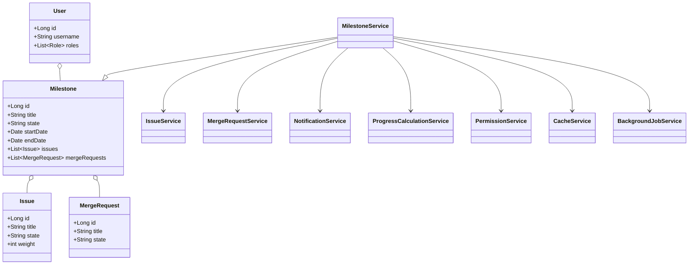
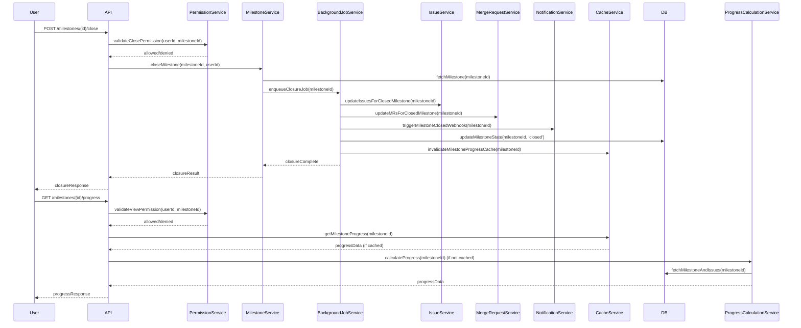
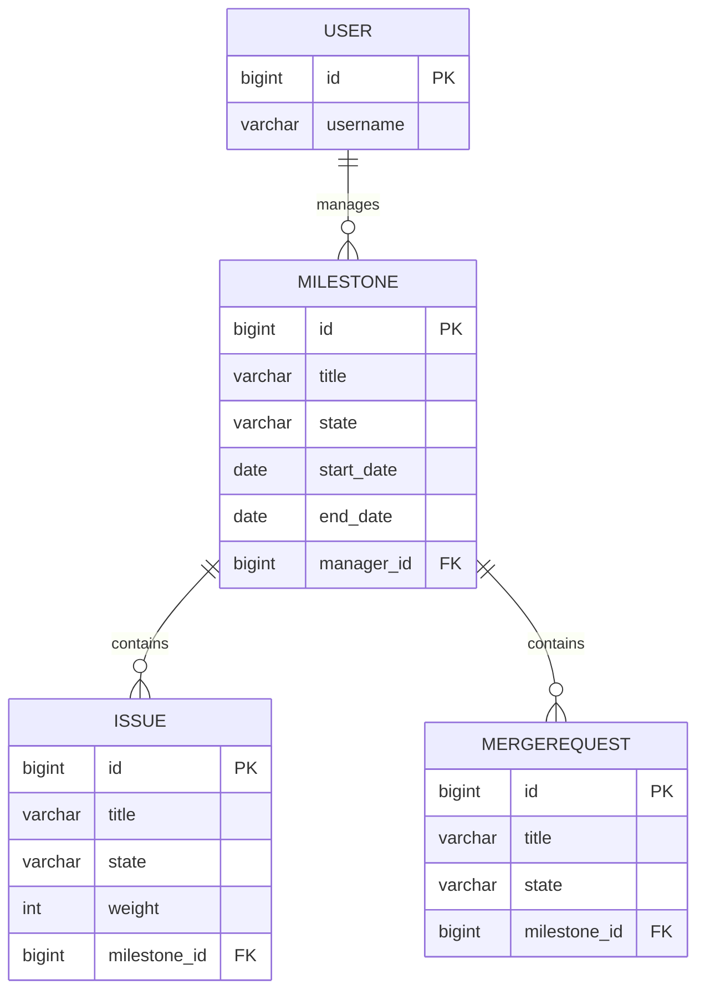

# Low-Level Design (LLD) Document: Milestone Management (SCRUM-64)

## 1. Objective
This document details the consolidated Low-Level Design (LLD) for the Milestone Management module in the GitLab application server. It covers the requirements for closing a milestone and viewing milestone progress, ensuring robust handling of milestone state transitions, progress tracking, and real-time updates. The design ensures data consistency, asynchronous processing for large milestones, and efficient handling of concurrent requests, following Spring Boot best practices.

## 2. API Model

### 2.1 Common Components/Services
- **MilestoneService**: Handles business logic for milestones (close, view progress).
- **MilestoneRepository**: Data access for milestones.
- **IssueService**: Updates issues related to milestones.
- **MergeRequestService**: Updates merge requests related to milestones.
- **NotificationService**: Triggers webhooks/notifications.
- **ProgressCalculationService**: Calculates milestone progress.
- **PermissionService**: Validates user permissions.
- **CacheService**: Manages Redis cache for milestone progress.
- **BackgroundJobService**: Handles asynchronous milestone closure (Sidekiq-like pattern).

### 2.2 API Details
| Operation                | REST Method | Type     | URL                                   | Request JSON                                                                 | Response JSON                                                                 |
|--------------------------|-------------|----------|---------------------------------------|------------------------------------------------------------------------------|------------------------------------------------------------------------------|
| Close Milestone          | POST        | Success  | /api/v1/milestones/{id}/close         | `{ "userId": "string" }`                                                  | `{ "status": "closed", "milestoneId": 123, "message": "Milestone closed successfully." }` |
| Close Milestone          | POST        | Failure  | /api/v1/milestones/{id}/close         | `{ "userId": "string" }`                                                  | `{ "error": "Only active milestones can be closed." }`                     |
| View Milestone Progress  | GET         | Success  | /api/v1/milestones/{id}/progress      | -                                                                            | `{ "milestoneId": 123, "progress": 0.75, "completedIssues": 15, "totalIssues": 20, "daysElapsed": 10, "totalDays": 20, "releases": [{"id":1,"status":"released"}], "weightedProgress": 0.8 }` |
| View Milestone Progress  | GET         | Failure  | /api/v1/milestones/{id}/progress      | -                                                                            | `{ "error": "User does not have permission to view this milestone." }`     |

### 2.3 Exceptions
- **MilestoneNotActiveException**: Thrown when trying to close a non-active milestone.
- **PermissionDeniedException**: Thrown when user lacks permission for an operation.
- **MilestoneNotFoundException**: Thrown if the milestone ID does not exist.
- **DataConsistencyException**: Thrown if cached and DB values mismatch.
- **AsyncJobFailedException**: Thrown if background closure job fails.

## 3. Functional Design

### 3.1 Class Diagram

### 3.2 UML Sequence Diagram

### 3.3 Components
| Component                  | Purpose                                                  | New/Existing |
|----------------------------|----------------------------------------------------------|--------------|
| MilestoneService           | Orchestrates milestone operations                        | Existing     |
| MilestoneRepository        | Data access for milestones                               | Existing     |
| IssueService               | Updates issues related to milestones                     | Existing     |
| MergeRequestService        | Updates merge requests related to milestones             | Existing     |
| NotificationService        | Triggers webhooks/notifications                         | Existing     |
| ProgressCalculationService | Calculates milestone progress                            | New          |
| PermissionService          | Validates user permissions                              | Existing     |
| CacheService               | Manages Redis cache for milestone progress               | New          |
| BackgroundJobService       | Handles asynchronous milestone closure                   | New          |

### 3.4 Service Layer Logic and Validations
| FieldName     | Validation                                      | ErrorMessage                                 | ClassUsed                |
|---------------|--------------------------------------------------|----------------------------------------------|--------------------------|
| milestoneId   | Must exist and be active                         | Only active milestones can be closed.         | MilestoneService         |
| userId        | Must have permission to close/view milestone     | User does not have permission.                | PermissionService        |
| milestoneId   | Must exist                                      | Milestone not found.                          | MilestoneService         |
| issues        | All issues must be updated on closure            | Issue update failed.                          | IssueService             |
| mergeRequests | All MRs must be updated on closure               | Merge request update failed.                  | MergeRequestService      |
| cache         | Consistency between cache and DB                 | Data inconsistency detected.                  | CacheService             |
| asyncJob      | Closure job must complete successfully           | Background job failed.                        | BackgroundJobService     |

## 4. Integrations
| SystemToBeIntegrated | IntegratedFor                      | IntegrationType |
|---------------------|-------------------------------------|-----------------|
| PostgreSQL          | Milestone, Issue, MR persistence    | DB              |
| Redis               | Milestone progress caching           | Cache           |
| Sidekiq/Background  | Asynchronous milestone closure      | Job Queue       |
| Webhooks            | Notifications on milestone closure  | API             |
| Vue.js Frontend     | Real-time milestone progress view   | API             |

## 5. DB Details

### 5.1 ER Model

### 5.2 DB Validations
- **milestone.state**: Enum constraint ('active', 'closed', 'archived')
- **issue.state**: Enum constraint ('open', 'closed')
- **merge_request.state**: Enum constraint ('open', 'closed', 'merged')
- **Foreign Key Constraints**: milestone_id in issues and merge_requests must reference valid milestones
- **Unique Constraints**: Milestone title unique per project

## 6. Dependencies
- PostgreSQL database for persistence
- Redis for caching milestone progress
- Sidekiq or equivalent background job processor for async closure
- Webhook endpoints for notifications
- Vue.js frontend for progress visualization

## 7. Assumptions
- User authentication and authorization are handled by a central security module
- All API endpoints are secured and require valid user tokens
- Background jobs are reliably processed and retried on failure
- Real-time updates are achieved using cache invalidation and frontend polling or websockets
- Weighted issues are supported if configured at project level
- All integrations (DB, cache, jobs, webhooks) are available and operational

---

**End of LLD Document**
