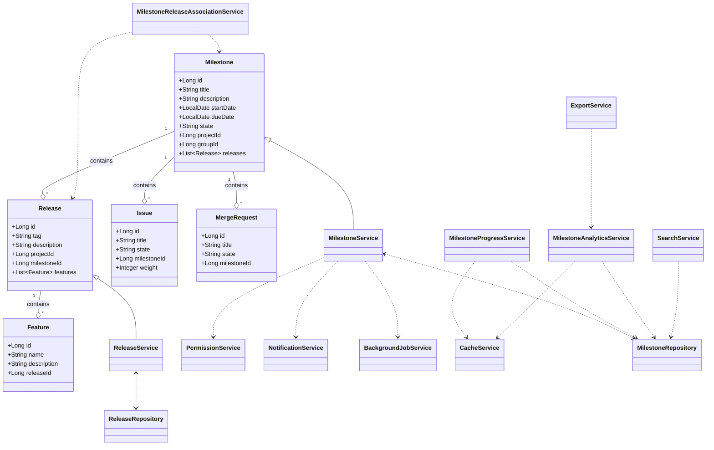
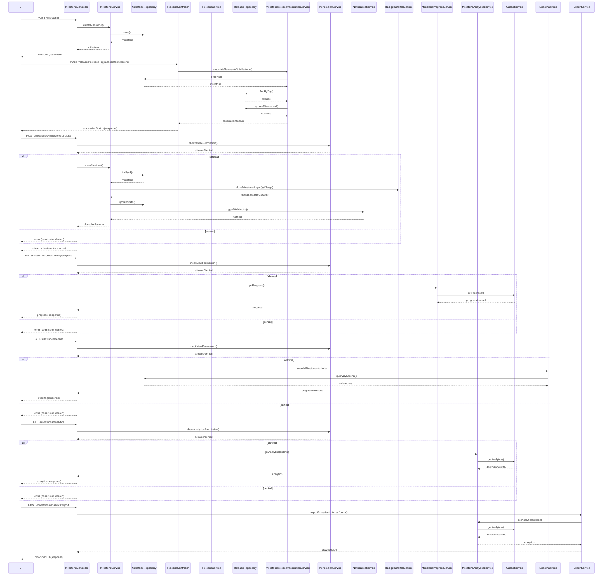
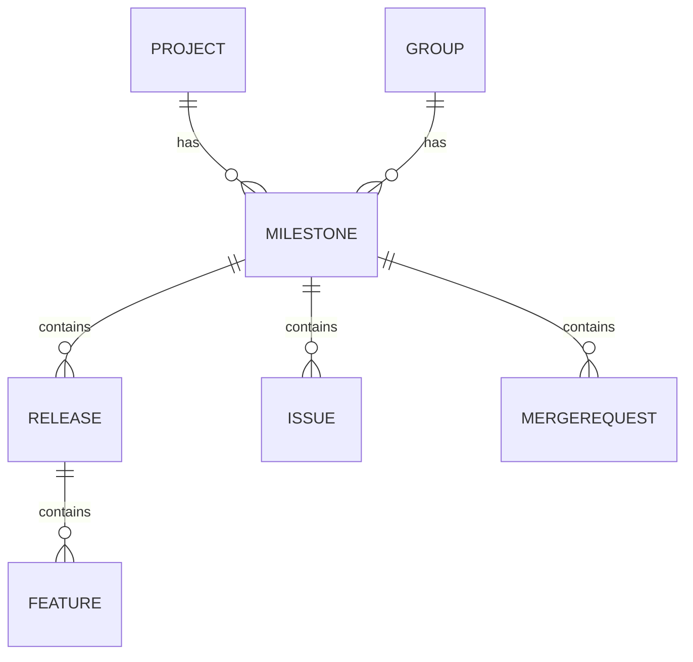

# Low-Level Design (LLD): Milestone Management, Search, Filter & Analytics

## 1. Objective
This document provides the consolidated low-level design for milestone management, search, filtering, and analytics in the GitLab application server. It covers milestone creation, release association, milestone closure, progress tracking, advanced search/filtering, and milestone analytics. The design enables project managers and leaders to define, track, close, search, filter, and analyze milestones efficiently. It ensures data integrity, atomicity, high concurrency handling, and real-time progress and analytics visibility, following Spring Boot best practices for production-ready implementation.

## 2. API Model

### 2.1 Common Components/Services
- **MilestoneService**: Handles milestone creation, closure, validation, state management, and search/filter logic.
- **ReleaseService**: Handles release creation, validation, and association with milestones.
- **MilestoneRepository**: Data access layer for milestones.
- **ReleaseRepository**: Data access layer for releases.
- **MilestoneReleaseAssociationService**: Manages the linking of releases to milestones atomically.
- **MilestoneProgressService**: Calculates and provides milestone progress data.
- **MilestoneAnalyticsService**: Aggregates and provides analytics metrics for milestones.
- **ExceptionHandler**: Centralized error handling for API responses.
- **ValidationUtils**: Utility for common validation logic.
- **PermissionService**: Validates user permissions for milestone operations and analytics access.
- **NotificationService**: Triggers webhooks/notifications on milestone closure.
- **BackgroundJobService**: Handles asynchronous milestone closure for large milestones (e.g., via Sidekiq).
- **CacheService**: Maintains real-time milestone progress and analytics using Redis.
- **SearchService**: Integrates with Elasticsearch for advanced milestone search (if enabled).
- **ExportService**: Handles exporting analytics data.

### 2.2 API Details
| Operation                              | REST Method | Type            | URL                                                                 | Request JSON                                                                                                  | Response JSON                                                                                   |
|----------------------------------------|-------------|-----------------|---------------------------------------------------------------------|---------------------------------------------------------------------------------------------------------------|-------------------------------------------------------------------------------------------------|
| Create Milestone                       | POST        | Success/Failure | /api/v1/projects/{projectId}/milestones                             | { "title": "string", "description": "string", "startDate": "yyyy-MM-dd", "dueDate": "yyyy-MM-dd", "groupId": "optional" } | { "id": 1, "title": "string", "state": "active", "description": "string", "startDate": "yyyy-MM-dd", "dueDate": "yyyy-MM-dd", "projectId": 1, "groupId": 2 } |
| Associate Release with Milestone       | POST        | Success/Failure | /api/v1/projects/{projectId}/releases/{releaseTag}/associate-milestone | { "milestoneId": 1 }                                                                                         | { "releaseTag": "v1.0.0", "milestoneId": 1, "associationStatus": "success" }             |
| Get Milestone Details                  | GET         | Success/Failure | /api/v1/projects/{projectId}/milestones/{milestoneId}               | -                                                                                                             | { "id": 1, "title": "string", "state": "active", "description": "string", "startDate": "yyyy-MM-dd", "dueDate": "yyyy-MM-dd", "releases": [ ... ] } |
| Get Release Details                    | GET         | Success/Failure | /api/v1/projects/{projectId}/releases/{releaseTag}                  | -                                                                                                             | { "releaseTag": "v1.0.0", "milestoneId": 1, "features": [ ... ] }                        |
| Close Milestone                        | POST        | Success/Failure | /api/v1/projects/{projectId}/milestones/{milestoneId}/close         | -                                                                                                             | { "id": 1, "state": "closed", "closedAt": "yyyy-MM-dd'T'HH:mm:ss", "updatedIssues": [ ... ], "updatedMergeRequests": [ ... ] } |
| Get Milestone Progress                 | GET         | Success/Failure | /api/v1/projects/{projectId}/milestones/{milestoneId}/progress      | -                                                                                                             | { "milestoneId": 1, "progressPercent": 75, "completedIssues": 15, "totalIssues": 20, "completedWeight": 30, "totalWeight": 40, "daysElapsed": 10, "totalDays": 20, "associatedReleases": [ ... ] } |
| Search & Filter Milestones             | GET         | Success/Failure | /api/v1/milestones/search                                          | { "title": "string", "description": "string", "state": "active|closed", "dateFrom": "yyyy-MM-dd", "dateTo": "yyyy-MM-dd", "projectId": 1, "groupId": 2, "personal": true, "page": 1, "size": 20, "sort": "field,asc|desc" } | { "results": [ { "id": 1, "title": "string", "state": "active", ... } ], "total": 100, "page": 1, "size": 20 } |
| Get Milestone Analytics Dashboard      | GET         | Success/Failure | /api/v1/milestones/analytics                                      | { "projectId": 1, "groupId": 2, "dateFrom": "yyyy-MM-dd", "dateTo": "yyyy-MM-dd" }                                                        | { "completionRate": 0.85, "avgTimeToCompletion": 12.5, "estimateAccuracy": 0.92, "trend": [ ... ], "charts": [ ... ] } |
| Export Milestone Analytics             | POST        | Success/Failure | /api/v1/milestones/analytics/export                               | { "projectId": 1, "groupId": 2, "dateFrom": "yyyy-MM-dd", "dateTo": "yyyy-MM-dd", "format": "csv|json|xlsx" }                           | { "downloadUrl": "https://.../export/analytics_2023-05-01.csv" } |

### 2.3 Exceptions
| Exception Name                            | Scenario/Service                                 | Error Message                                         |
|-------------------------------------------|--------------------------------------------------|-------------------------------------------------------|
| MilestoneTitleNotUniqueException          | MilestoneService                                 | "Milestone title must be unique within project/group" |
| InvalidDateRangeException                | MilestoneService, SearchService                  | "Start date must be before or equal to due date"      |
| MilestoneNotFoundException               | MilestoneService, MilestoneReleaseAssociationService | "Milestone not found"                                 |
| ReleaseTagNotUniqueException             | ReleaseService                                   | "Release tag must be unique within the project"       |
| ReleaseAlreadyAssociatedException        | MilestoneReleaseAssociationService               | "Release already associated with a milestone"         |
| AssociationAtomicityException            | MilestoneReleaseAssociationService               | "Failed to associate release atomically"              |
| DatabaseConcurrencyException             | All Services                                     | "Concurrent update error, please retry"               |
| MilestoneClosureNotAllowedException      | MilestoneService                                 | "Only active milestones can be closed"                |
| MilestoneClosurePermissionException      | PermissionService                                | "User does not have permission to close milestone"    |
| MilestoneProgressViewPermissionException | PermissionService                                | "User does not have permission to view milestone progress" |
| MilestoneAnalyticsPermissionException    | PermissionService                                | "User does not have permission to view analytics"     |
| DataConsistencyException                 | MilestoneProgressService, MilestoneAnalyticsService | "Data inconsistency detected between cache and DB"    |
| InvalidSearchInputException              | SearchService                                    | "Invalid search input"                                |
| AnalyticsExportException                 | ExportService                                    | "Failed to export analytics data"                     |

## 3. Functional Design

### 3.1 Class Diagram

### 3.2 UML Sequence Diagram

### 3.3 Components
| Component Name                         | Purpose                                            | New/Existing |
|----------------------------------------|----------------------------------------------------|--------------|
| MilestoneService                       | Business logic for milestones (creation, closure, search/filter)   | Existing/Updated |
| ReleaseService                         | Business logic for releases                        | Existing     |
| MilestoneRepository                    | Data access for milestones                         | Existing     |
| ReleaseRepository                      | Data access for releases                           | Existing     |
| MilestoneReleaseAssociationService      | Handles release-milestone association atomically   | Existing     |
| MilestoneProgressService               | Calculates milestone progress                      | Existing     |
| MilestoneAnalyticsService              | Aggregates analytics metrics for milestones        | New          |
| SearchService                          | Advanced search/filter logic, integrates with Elasticsearch | New   |
| ExportService                          | Handles analytics data export                      | New          |
| PermissionService                      | Validates user permissions                         | Existing/Updated |
| NotificationService                    | Triggers webhooks/notifications                    | Existing     |
| BackgroundJobService                   | Handles async closure for large milestones         | Existing     |
| CacheService                           | Maintains real-time progress and analytics (Redis) | Existing/Updated |
| ExceptionHandler                       | Centralized exception handling                     | Existing     |
| ValidationUtils                        | Common validation logic                            | Existing     |

### 3.4 Service Layer Logic and Validations
| FieldName         | Validation                                   | ErrorMessage                                         | ClassUsed                     |
|-------------------|----------------------------------------------|------------------------------------------------------|-------------------------------|
| title             | Unique within project/group                  | "Milestone title must be unique within project/group" | MilestoneService              |
| startDate, dueDate| startDate <= dueDate                         | "Start date must be before or equal to due date"      | MilestoneService, SearchService|
| tag               | Unique within project                        | "Release tag must be unique within the project"       | ReleaseService                |
| milestoneId       | Exists in DB                                 | "Milestone not found"                                 | MilestoneReleaseAssociationService |
| releaseTag        | Not already associated with a milestone      | "Release already associated with a milestone"         | MilestoneReleaseAssociationService |
| milestone.state   | Only 'active' milestones can be closed       | "Only active milestones can be closed"                | MilestoneService              |
| user.permission   | User must have permission to close/view/search/analytics | "User does not have permission"                       | PermissionService             |
| search input      | Input sanitized, prevent SQL injection       | "Invalid search input"                                | SearchService                 |
| cache/db sync     | Data consistency between cache and DB        | "Data inconsistency detected between cache and DB"    | MilestoneProgressService, MilestoneAnalyticsService |
| analytics export  | Export format and data validation            | "Failed to export analytics data"                     | ExportService                 |

## 4. Integrations
| SystemToBeIntegrated | IntegratedFor                | IntegrationType |
|----------------------|------------------------------|-----------------|
| PostgreSQL           | Milestone and Release storage| DB              |
| GitLab UI            | Milestone/Release management | REST API        |
| GitLab GraphQL API   | Release/Milestone queries    | GraphQL         |
| Redis                | Milestone progress & analytics caching   | Cache           |
| Sidekiq              | Background milestone closure | Job Queue       |
| Webhook endpoints    | Milestone closure notifications | Webhook      |
| Elasticsearch        | Milestone search/filter      | Search Engine   |
| Grafana/D3.js        | Analytics dashboard frontend | Visualization   |

## 5. DB Details

### 5.1 ER Model

### 5.2 DB Validations
- **Milestone title**: Unique constraint on (project_id, title) and (group_id, title)
- **Release tag**: Unique constraint on (project_id, tag)
- **Milestone dates**: Check constraint: start_date <= due_date
- **Milestone state**: Only 'active' milestones can be closed (enforced by application logic)
- **Release-Milestone association**: release.milestone_id is nullable, but can only be set to one milestone at a time
- **Foreign keys**: Proper FK constraints for project_id, group_id, milestone_id, release_id, issue.milestone_id, mergerequest.milestone_id
- **Issue and MergeRequest**: Issues/MRs must reference an existing milestone if milestone_id is set
- **Search index**: Milestone table indexed on title, description, state, start_date, due_date for efficient search/filter (and integrated with Elasticsearch if enabled)
- **Analytics data**: Aggregated analytics may be cached in Redis for performance

## 6. Dependencies
- Spring Boot 2.x/3.x
- PostgreSQL 12+
- JPA/Hibernate
- Redis
- Sidekiq (for background jobs)
- Elasticsearch (for search/filter)
- Grafana or D3.js (for analytics dashboard)
- GitLab application server modules (existing Release management)
- REST/GraphQL API infrastructure
- Vue.js frontend components

## 7. Assumptions
- Each milestone is unique within its project or group (not globally)
- A release can only be associated with one milestone at a time
- Milestones can belong to either a project or a group, not both simultaneously
- All date fields are in ISO-8601 (yyyy-MM-dd) format
- The system is already using Spring Boot and standard JPA repositories
- Concurrency is handled via DB-level constraints and application-level optimistic locking
- All APIs are secured and authenticated via existing mechanisms
- Only users with appropriate permissions can close, view, search, or analyze milestones
- Progress calculations factor in weighted issues if enabled
- Background jobs are used for closing large milestones to ensure responsiveness
- Real-time progress and analytics are maintained via Redis cache, with fallback to DB if needed
- Search and filter operations are optimized for high concurrency and large datasets
- Analytics dashboard visualizations are rendered on the frontend using D3.js or Grafana
- Analytics export supports CSV, JSON, and XLSX formats

---

**End of LLD Document**
