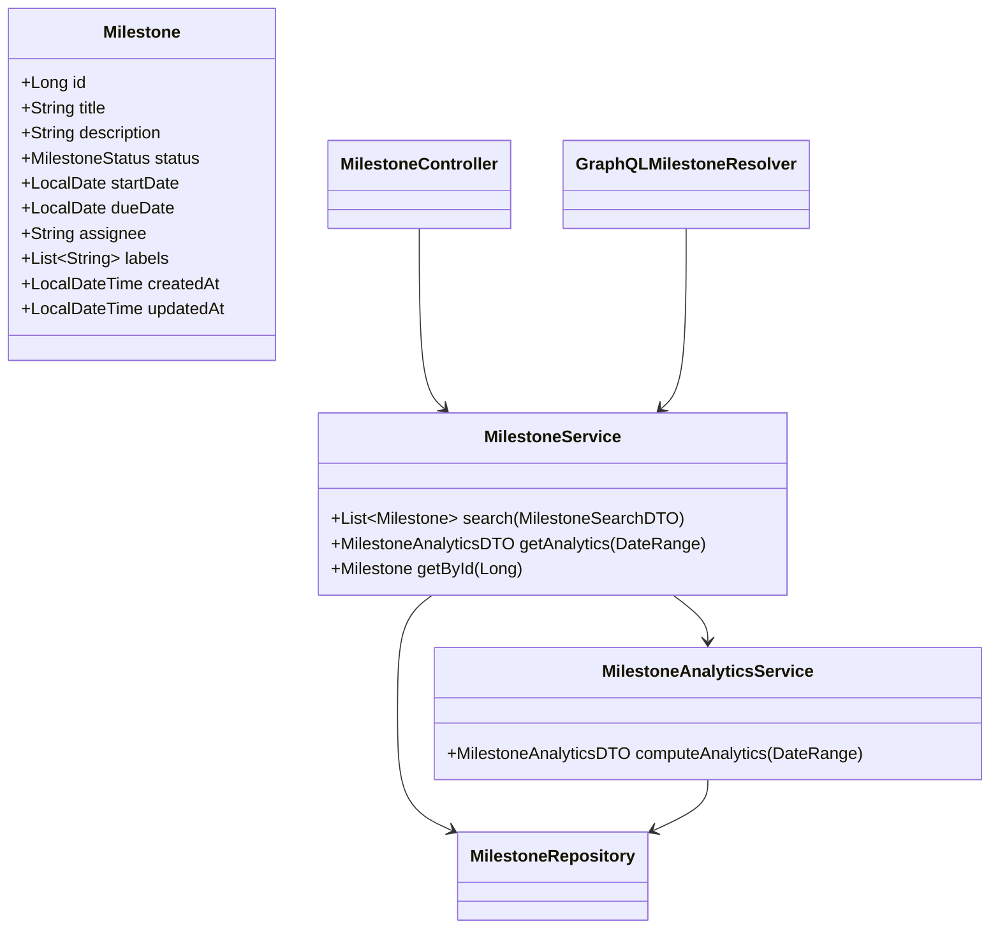
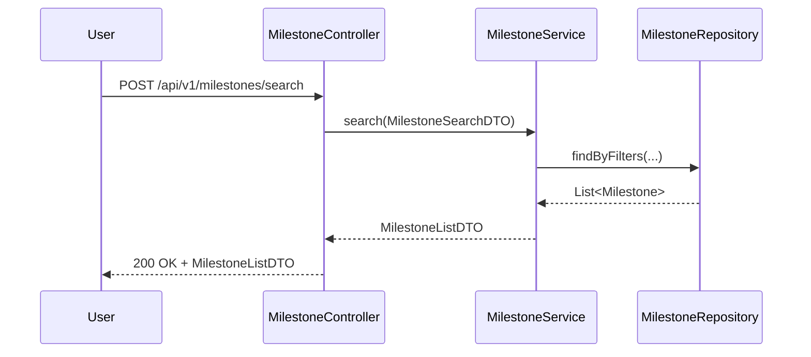
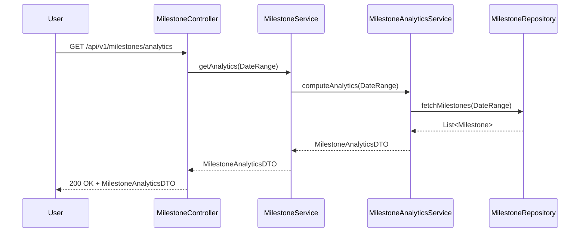
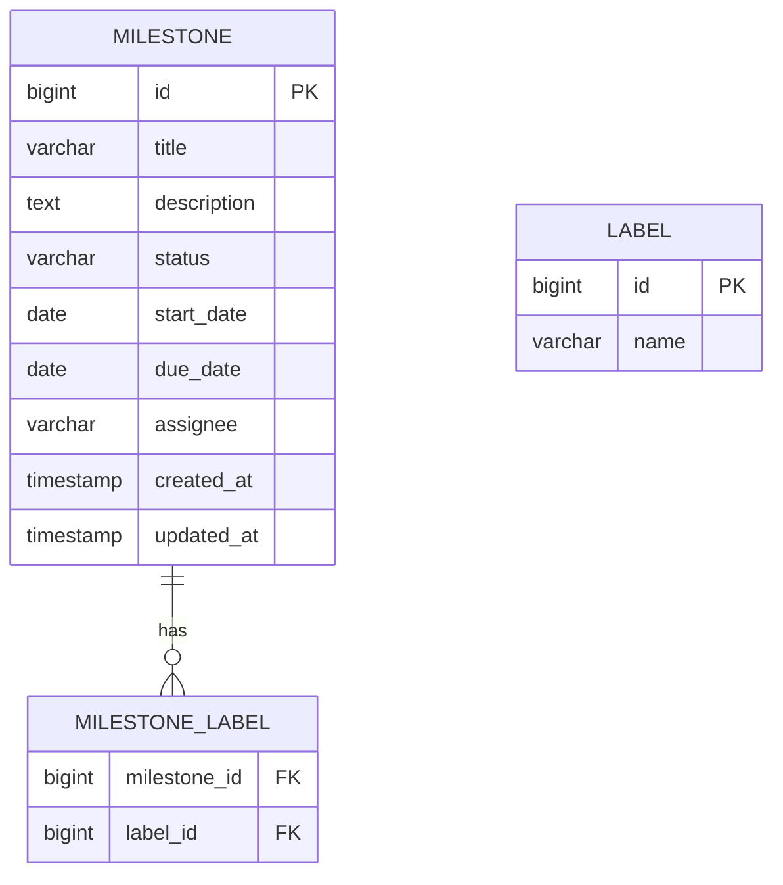

# Low-Level Design (LLD): Milestone Search, Filter, and Analytics for GitLab-like Application

## 1. Objective

This document details the low-level design for implementing the 'Search and Filter Milestones' and 'Milestone Analytics' features in a GitLab-like application. The goal is to enable users to efficiently search and filter project milestones using various criteria and to provide comprehensive analytics dashboards for milestone tracking and insights. The design leverages Spring Boot best practices, PostgreSQL for data storage, optional Elasticsearch for advanced search, and analytics integration via a custom engine or Grafana. The solution ensures scalability, maintainability, and seamless integration with existing services.

---

## 2. API Model

### 2.1 Common Components/Services
- **MilestoneService**: Business logic for milestone operations (search, filter, analytics).
- **MilestoneRepository**: JPA repository for milestone persistence.
- **MilestoneAnalyticsService**: Aggregates and computes analytics data.
- **MilestoneController**: REST API endpoints for milestone features.
- **GraphQLMilestoneResolver**: GraphQL resolver for milestone queries.
- **ExceptionHandler**: Centralized error handling.
- **ElasticsearchService** (optional): For advanced search capabilities.

### 2.2 API Details

| API Name                    | URL/Endpoint                      | Method | Request Schema         | Response Schema         | Validations/Notes                |
|-----------------------------|-----------------------------------|--------|-----------------------|-------------------------|-----------------------------------|
| Search/Filter Milestones    | `/api/v1/milestones/search`       | POST   | `MilestoneSearchDTO`  | `MilestoneListDTO`      | Validations on filter params      |
| Get Milestone Analytics     | `/api/v1/milestones/analytics`    | GET    | Query Params          | `MilestoneAnalyticsDTO` | Auth required, date range checks  |
| Get Milestone by ID         | `/api/v1/milestones/{id}`         | GET    | Path Variable         | `MilestoneDTO`          | 404 if not found                  |
| GraphQL Milestone Query     | `/graphql`                        | POST   | GraphQL Query         | GraphQL Response        | Schema validation                 |

#### Request/Response Schemas

- **MilestoneSearchDTO**
  ```json
  {
    "title": "string (optional)",
    "status": "OPEN|CLOSED|IN_PROGRESS (optional)",
    "dueDateFrom": "yyyy-MM-dd (optional)",
    "dueDateTo": "yyyy-MM-dd (optional)",
    "assignee": "string (optional)",
    "labels": ["string"],
    "sortBy": "DUE_DATE|CREATED_AT (optional)",
    "order": "ASC|DESC (optional)",
    "page": 0,
    "size": 20
  }
  ```
- **MilestoneListDTO**
  ```json
  {
    "milestones": [MilestoneDTO],
    "total": 100,
    "page": 0,
    "size": 20
  }
  ```
- **MilestoneDTO**
  ```json
  {
    "id": 1,
    "title": "Release 1.0",
    "description": "string",
    "status": "OPEN|CLOSED|IN_PROGRESS",
    "startDate": "yyyy-MM-dd",
    "dueDate": "yyyy-MM-dd",
    "assignee": "string",
    "labels": ["string"],
    "createdAt": "yyyy-MM-dd'T'HH:mm:ssZ",
    "updatedAt": "yyyy-MM-dd'T'HH:mm:ssZ"
  }
  ```
- **MilestoneAnalyticsDTO**
  ```json
  {
    "totalMilestones": 20,
    "openMilestones": 5,
    "closedMilestones": 10,
    "inProgressMilestones": 5,
    "averageCompletionTime": "P5D",
    "milestonesByAssignee": { "user1": 3, "user2": 7 },
    "milestonesByLabel": { "frontend": 4, "backend": 6 },
    "completionTrends": [ { "date": "2024-06-01", "closed": 2 } ]
  }
  ```

### 2.3 Exceptions

| Exception Type              | HTTP Status | Description                               |
|----------------------------|-------------|-------------------------------------------|
| MilestoneNotFoundException | 404         | Milestone not found                       |
| InvalidFilterException     | 400         | Invalid filter/search parameters          |
| UnauthorizedException      | 401         | User not authenticated                    |
| ForbiddenException         | 403         | User lacks permission                     |
| InternalServerError        | 500         | Unexpected server error                   |

---

## 3. Functional Design

### 3.1 Class Diagram (Mermaid)


### 3.2 UML Sequence Diagram (Mermaid)
#### Search and Filter Milestones

#### Milestone Analytics


### 3.3 Components Table
| Component                  | Responsibility                                  |
|----------------------------|-------------------------------------------------|
| MilestoneController        | Exposes REST endpoints for milestone operations  |
| MilestoneService           | Core business logic for milestones               |
| MilestoneRepository        | Data access layer (JPA/Elasticsearch)            |
| MilestoneAnalyticsService  | Aggregates analytics data                        |
| GraphQLMilestoneResolver   | GraphQL endpoint for milestones                  |
| ExceptionHandler           | Centralized exception management                 |
| ElasticsearchService       | (Optional) Search index integration              |

### 3.4 Service Layer Logic and Validations
| Method                                  | Logic/Validation                                                                 |
|------------------------------------------|----------------------------------------------------------------------------------|
| search(MilestoneSearchDTO)               | Validate filters, build dynamic query, support pagination, sanitize input         |
| getAnalytics(DateRange)                  | Validate date range, aggregate stats, handle empty data                          |
| getById(Long id)                        | Check existence, throw 404 if not found                                          |
| computeAnalytics(DateRange)              | Calculate totals, averages, group by assignee/label, trend analysis              |
| GraphQL query (milestones)               | Schema validation, filter mapping, error handling                                |

---

## 4. Integrations
| System/Service         | Integration Type | Purpose/Notes                                   |
|-----------------------|------------------|-------------------------------------------------|
| PostgreSQL            | RDBMS            | Primary data store for milestones                |
| Elasticsearch         | (Optional) Index | Advanced search/filtering (if enabled)           |
| Grafana/Custom Engine | Analytics        | Visualization/dashboard for analytics            |
| Auth Service          | REST/JWT         | User authentication and authorization            |

---

## 5. DB Details

### 5.1 ER Model (Mermaid)


### 5.2 DB Validations
| Field         | Validation Rule                         |
|---------------|-----------------------------------------|
| title         | NOT NULL, length <= 255                 |
| status        | Enum: OPEN, CLOSED, IN_PROGRESS         |
| due_date      | >= start_date                           |
| assignee      | FK to user table or string (if external)|
| labels        | Many-to-many via MILESTONE_LABEL        |
| created_at    | NOT NULL, default now()                 |
| updated_at    | NOT NULL, default now()                 |

---

## 6. Dependencies
- Spring Boot 3.x
- Spring Data JPA
- PostgreSQL Driver
- (Optional) Spring Data Elasticsearch
- Spring Web
- Spring Security (for Auth)
- GraphQL Java
- Lombok
- MapStruct (for DTO mapping)
- Grafana/Custom Analytics Engine

---

## 7. Assumptions
- User authentication and authorization are handled by a separate Auth service.
- Elasticsearch integration is optional and only enabled if configured.
- Analytics dashboard is powered by Grafana or a custom analytics engine, not implemented in this scope.
- All date/times are stored in UTC.
- Pagination defaults to 20 items per page unless specified.
- Labels are managed separately and can be reused across milestones.
- Only active milestones are returned by default unless status filter is specified.

---

*End of Document*
