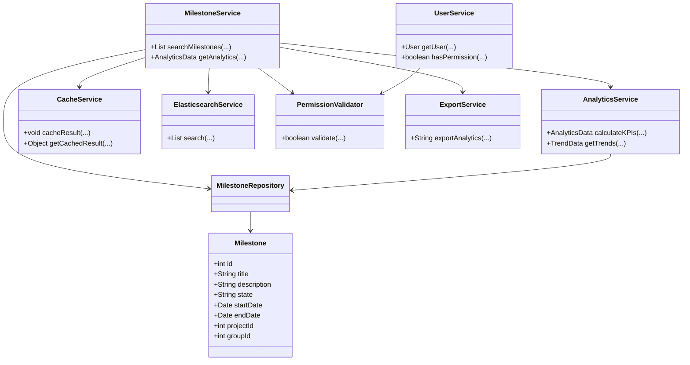
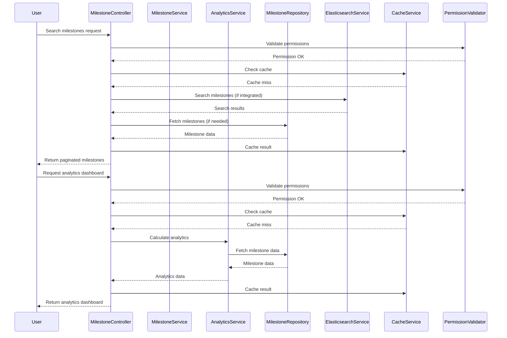
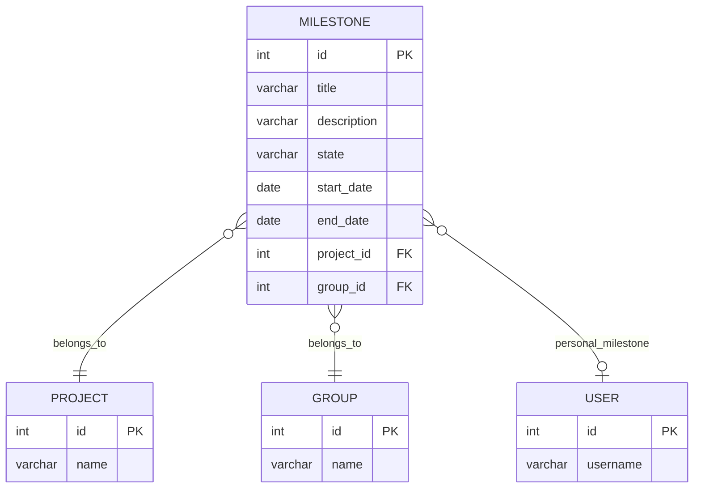

# Low-Level Design (LLD) Document: Milestone Search, Filter, and Analytics

## 1. Objective
This document details the low-level design for implementing two key features in the GitLab application server: (1) Search and Filter Milestones, and (2) Milestone Analytics. The goal is to enable project managers and leaders to efficiently search, filter, and analyze milestones across projects and groups. The design ensures robust search capabilities, comprehensive analytics dashboards, and adherence to security, performance, and scalability requirements. All APIs, services, models, and integrations are consolidated for a unified, production-ready solution.

## 2. API Model

### 2.1 Common Components/Services
- **MilestoneService**: Handles business logic for milestones (search, filter, analytics).
- **MilestoneRepository**: Data access layer for milestones (PostgreSQL).
- **AnalyticsService**: Computes KPIs and analytics for milestones.
- **UserService**: Handles user authentication and authorization.
- **CacheService**: Caches frequent search and analytics queries.
- **ElasticsearchService**: (If integrated) Provides advanced search capabilities.
- **PermissionValidator**: Validates user permissions for accessing milestones and analytics.
- **ExportService**: Handles data export functionality for analytics.

### 2.2 API Details
| Operation                     | REST Method | Type     | URL                                      | Request JSON                                                                                   | Response JSON                                                                                                    |
|-------------------------------|-------------|----------|------------------------------------------|-----------------------------------------------------------------------------------------------|------------------------------------------------------------------------------------------------------------------|
| Search & Filter Milestones    | GET         | Success  | /api/v1/milestones/search                | { "query": "string", "state": "active\|closed", "dateRange": {"from": "yyyy-mm-dd", "to": "yyyy-mm-dd"}, "projectId": "int", "groupId": "int", "personal": "bool", "page": "int", "size": "int", "sort": "string" } | { "milestones": [ {"id": int, "title": "string", "description": "string", "state": "string", "startDate": "yyyy-mm-dd", "endDate": "yyyy-mm-dd", "projectId": int, "groupId": int } ], "total": int, "page": int, "size": int } |
| Search & Filter Milestones    | GET         | Failure  | /api/v1/milestones/search                | Same as above                                                                                | { "error": "Invalid input or permission denied" }                                                               |
| Milestone Analytics Dashboard | GET         | Success  | /api/v1/milestones/analytics             | { "projectId": "int", "groupId": "int", "dateRange": {"from": "yyyy-mm-dd", "to": "yyyy-mm-dd"} } | { "completionRate": float, "avgTimeToCompletion": float, "estimateAccuracy": float, "trendData": [ {"date": "yyyy-mm-dd", "completionRate": float } ], "charts": [ {"type": "string", "data": "object" } ] } |
| Milestone Analytics Dashboard | GET         | Failure  | /api/v1/milestones/analytics             | Same as above                                                                                | { "error": "Invalid input or permission denied" }                                                               |
| Export Analytics Data         | POST        | Success  | /api/v1/milestones/analytics/export      | { "projectId": "int", "groupId": "int", "dateRange": {"from": "yyyy-mm-dd", "to": "yyyy-mm-dd"}, "format": "csv\|xlsx" } | { "downloadUrl": "string" }                                                                                    |
| Export Analytics Data         | POST        | Failure  | /api/v1/milestones/analytics/export      | Same as above                                                                                | { "error": "Export failed or permission denied" }                                                               |

### 2.3 Exceptions
- **InvalidSearchInputException**: Thrown if search/filter parameters are malformed or potentially malicious (e.g., SQL injection attempt).
- **PermissionDeniedException**: Thrown if user lacks permission to view milestones or analytics.
- **AnalyticsCalculationException**: Thrown if analytics computation fails due to data inconsistency.
- **ExportFailedException**: Thrown if export operation fails.
- **MilestoneNotFoundException**: Thrown if requested milestone does not exist.

## 3. Functional Design

### 3.1 Class Diagram

### 3.2 UML Sequence Diagram

### 3.3 Components
| Component            | Purpose                                              | New/Existing |
|----------------------|------------------------------------------------------|--------------|
| MilestoneService     | Business logic for milestones                        | Existing     |
| MilestoneRepository  | Data access for milestones                           | Existing     |
| AnalyticsService     | Compute analytics and KPIs                           | New          |
| UserService          | User authentication and authorization                | Existing     |
| CacheService         | Caching for search and analytics                     | New          |
| ElasticsearchService | Advanced search (if integrated)                      | Existing     |
| PermissionValidator  | Validates user permissions                           | New          |
| ExportService        | Handles data export for analytics                    | New          |

### 3.4 Service Layer Logic and Validations
| FieldName         | Validation                                   | ErrorMessage                              | ClassUsed           |
|-------------------|----------------------------------------------|-------------------------------------------|---------------------|
| query             | No SQL/meta-characters, length < 256         | Invalid search input                      | MilestoneService    |
| state             | Enum: [active, closed]                       | Invalid state value                       | MilestoneService    |
| dateRange         | Valid date format, from <= to                | Invalid date range                        | MilestoneService    |
| projectId/groupId | Must exist and user must have access         | Permission denied                         | PermissionValidator |
| page/size         | page >= 0, 1 <= size <= 100                  | Invalid pagination parameters             | MilestoneService    |
| sort              | Allowed fields only                          | Invalid sort parameter                    | MilestoneService    |
| analytics input   | Valid project/group, date range, permissions | Invalid analytics input or permission     | AnalyticsService    |
| export format     | Enum: [csv, xlsx]                            | Invalid export format                     | ExportService       |

## 4. Integrations
| SystemToBeIntegrated | IntegratedFor           | IntegrationType |
|----------------------|------------------------|-----------------|
| PostgreSQL           | Milestone storage       | DB              |
| Elasticsearch        | Milestone search        | API             |
| Grafana (optional)   | Analytics dashboard     | API             |
| D3.js (frontend)     | Analytics visualization | JS Library      |
| Internal Auth System | User authentication     | API             |

## 5. DB Details

### 5.1 ER Model

### 5.2 DB Validations
- **Milestone.title**: NOT NULL, length <= 128
- **Milestone.state**: CHECK (state IN ('active', 'closed'))
- **Milestone.start_date, end_date**: end_date >= start_date
- **Milestone.project_id/group_id**: Foreign key constraints

## 6. Dependencies
- PostgreSQL database for milestone storage
- Elasticsearch for advanced search (optional, if integrated)
- Grafana or custom analytics engine for dashboard (optional)
- D3.js or similar JS library for frontend visualizations
- Internal authentication/authorization system

## 7. Assumptions
- Elasticsearch is available and integrated for search; fallback to SQL if not.
- Analytics dashboard is backend-driven; frontend will consume REST APIs and render charts.
- User permissions are enforced at both API and service layer.
- Caching is implemented using Redis or similar in-memory store.
- Exported analytics data is stored temporarily and secured.
- All date/times are in UTC and ISO 8601 format.
- Non-functional requirements (performance, concurrency) are met via horizontal scaling and optimized queries.

---
