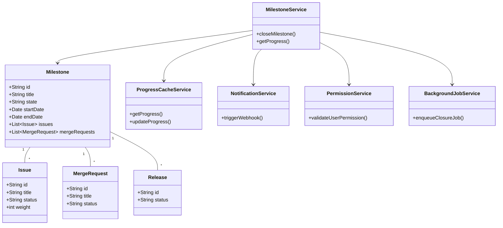
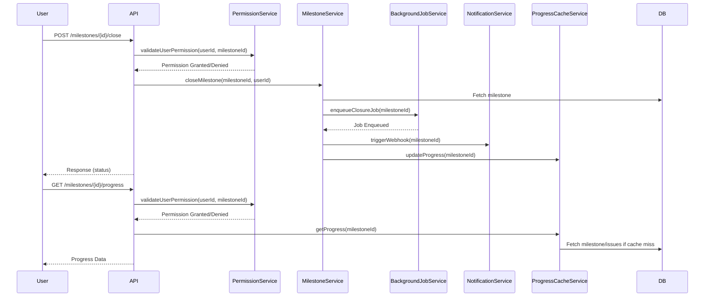
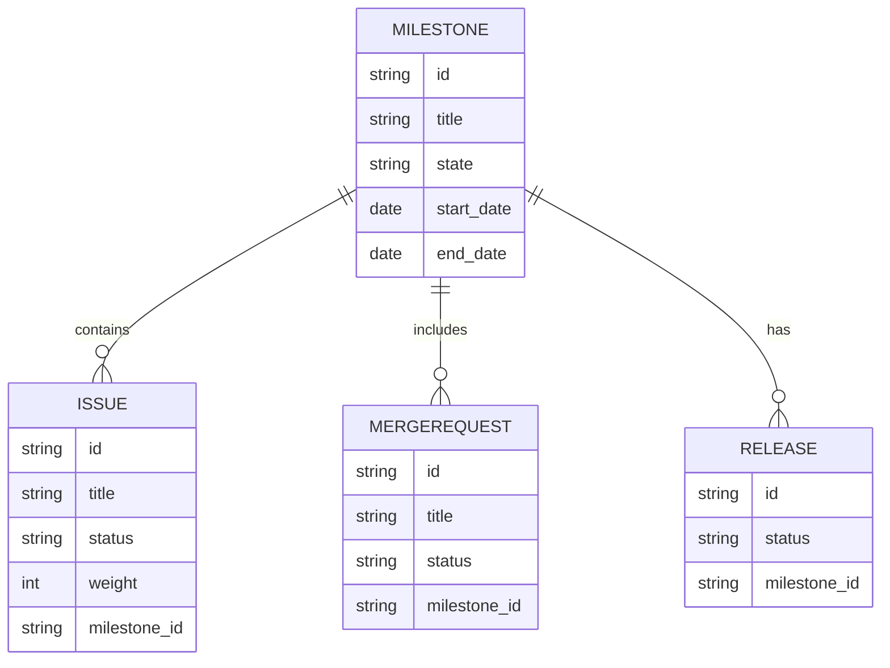

# Low-Level Design (LLD) Document

## 1. Objective
This document describes the consolidated low-level design for the milestone management features in the GitLab application server. It covers the ability for project managers to close milestones and for team members to view milestone progress. The design ensures robust state management, real-time progress visibility, and asynchronous processing for large data sets. All APIs, models, validations, and integrations are unified to deliver a production-ready, scalable solution.

## 2. API Model

### 2.1 Common Components/Services
- **MilestoneService**: Handles business logic for milestone operations (close, view progress)
- **MilestoneRepository**: Data access layer for Milestone entities
- **IssueService**: Updates issues related to milestones
- **MergeRequestService**: Updates merge requests related to milestones
- **NotificationService**: Triggers webhooks/notifications
- **ProgressCacheService**: Manages milestone progress caching (uses Redis)
- **PermissionService**: Validates user permissions
- **BackgroundJobService**: Handles asynchronous milestone closure (uses Sidekiq)

### 2.2 API Details
| Operation                | REST Method | Type     | URL                                   | Request JSON                                                                 | Response JSON                                                                 |
|-------------------------|-------------|----------|---------------------------------------|------------------------------------------------------------------------------|------------------------------------------------------------------------------|
| Close Milestone         | POST        | Success  | /api/v1/milestones/{id}/close         | { "userId": "string" }                                                      | { "status": "closed", "milestoneId": "string", "updatedAt": "datetime" }     |
|                         |             | Failure  | /api/v1/milestones/{id}/close         | { "userId": "string" }                                                      | { "error": "string", "code": "string" }                                      |
| View Milestone Progress | GET         | Success  | /api/v1/milestones/{id}/progress      | N/A                                                                         | { "milestoneId": "string", "completedIssues": int, "totalIssues": int, "progressPercent": float, "timeElapsed": int, "totalTime": int, "releases": [ { "id": "string", "status": "string" } ] } |
|                         |             | Failure  | /api/v1/milestones/{id}/progress      | N/A                                                                         | { "error": "string", "code": "string" }                                      |

### 2.3 Exceptions
- **MilestoneNotActiveException**: Thrown when attempting to close a non-active milestone
- **PermissionDeniedException**: Thrown when user lacks permission for the operation
- **MilestoneNotFoundException**: Thrown if the milestone does not exist
- **ProgressCalculationException**: Thrown on errors during progress calculation
- **DataConsistencyException**: Thrown if cache and DB values are inconsistent

## 3. Functional Design

### 3.1 Class Diagram

### 3.2 UML Sequence Diagram

### 3.3 Components
| Component              | Purpose                                             | New/Existing |
|------------------------|-----------------------------------------------------|--------------|
| MilestoneService       | Business logic for milestone operations             | Existing     |
| MilestoneRepository    | Data access for milestones                          | Existing     |
| IssueService           | Update issues on milestone closure                  | Existing     |
| MergeRequestService    | Update merge requests on milestone closure          | Existing     |
| NotificationService    | Trigger webhooks/notifications                      | Existing     |
| ProgressCacheService   | Cache and serve milestone progress                  | New          |
| PermissionService      | Validate user permissions                           | Existing     |
| BackgroundJobService   | Handle async closure for large milestones           | New          |

### 3.4 Service Layer Logic and Validations
| FieldName     | Validation                                 | ErrorMessage                                   | ClassUsed              |
|---------------|--------------------------------------------|------------------------------------------------|------------------------|
| milestoneId   | Must exist and be active                   | Milestone not found or not active              | MilestoneService       |
| userId        | Must have permission to close/view         | Permission denied                              | PermissionService      |
| issues        | All issues must be updated on closure      | Issue update failed                            | IssueService          |
| mergeRequests | All MRs must be updated on closure         | Merge request update failed                    | MergeRequestService    |
| cache         | DB/cache consistency on progress view      | Data consistency error                         | ProgressCacheService   |

## 4. Integrations
| SystemToBeIntegrated | IntegratedFor               | IntegrationType |
|---------------------|-----------------------------|-----------------|
| Sidekiq             | Async milestone closure      | Background Job  |
| Redis               | Milestone progress caching   | Cache           |
| PostgreSQL          | Milestone data persistence   | Database        |
| Webhooks/3rd-party  | Notifications on closure     | API             |
| Vue.js Frontend     | Milestone progress display   | API             |

## 5. DB Details

### 5.1 ER Model

### 5.2 DB Validations
- **Milestone.state**: Must be one of ['active', 'closed']
- **Issue.status**: Must be one of ['open', 'closed']
- **MergeRequest.status**: Must be one of ['open', 'merged', 'closed']
- **Release.status**: Must be one of ['upcoming', 'released', 'deprecated']
- **Foreign Keys**: All related entities must reference valid milestone IDs

## 6. Dependencies
- Sidekiq for background job processing
- Redis for caching milestone progress
- PostgreSQL for data persistence
- Vue.js frontend for progress visualization
- External webhooks for notifications

## 7. Assumptions
- Only project managers can close milestones
- All milestone progress calculations are based on the latest data in cache or DB
- Weighted issues feature is enabled if weights are present; otherwise, count-based progress is used
- All integrations (Sidekiq, Redis, webhooks) are available and configured
- The system is running in a Spring Boot microservice environment

---

**End of LLD Document**

**Absolute Path:** /app/15f27afc-596d-47a2-97dc-3633ce21616a/Generated_LLD.md
