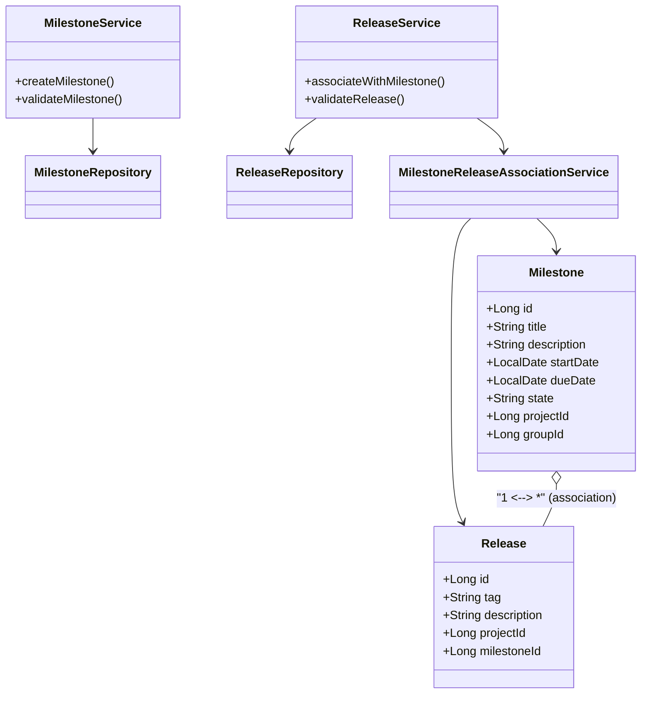
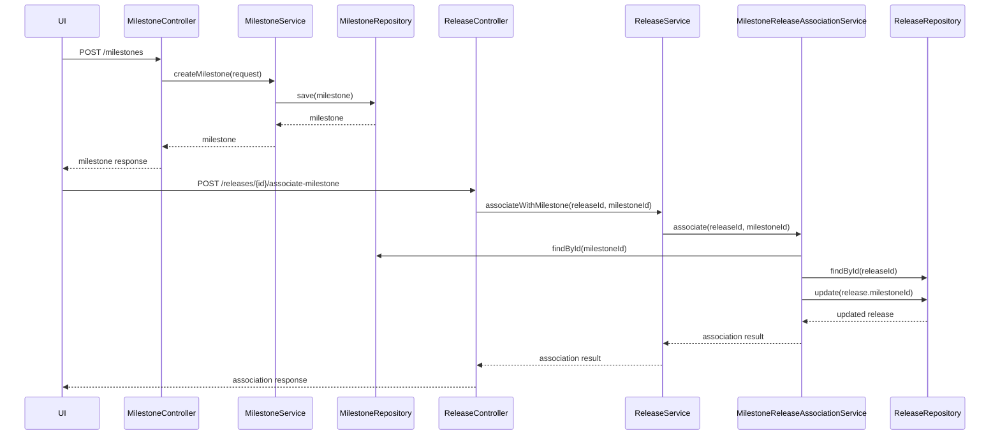
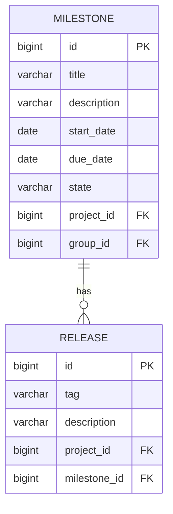

# Low-Level Design (LLD): Milestone Creation & Release Association

## 1. Objective
This document details the low-level design for two primary user stories: (1) enabling project managers to create milestones within a project or group, and (2) allowing developers to associate releases with milestones. The goal is to facilitate progress tracking and feature/release management in a GitLab-like system, ensuring robust validation, atomicity, and high concurrency support. The design leverages Spring Boot best practices, PostgreSQL, and RESTful/GraphQL APIs.

## 2. API Model

### 2.1 Common Components/Services
- **MilestoneService**: Handles milestone creation, validation, and state management.
- **ReleaseService**: Manages releases and their association with milestones.
- **MilestoneRepository**: Data access for milestones.
- **ReleaseRepository**: Data access for releases.
- **MilestoneReleaseAssociationService**: Handles linking releases to milestones.
- **ExceptionHandler**: Centralized business/validation exception handling.

### 2.2 API Details
| Operation                       | REST Method | Type             | URL                                 | Request JSON                                                                 | Response JSON                                                               |
|----------------------------------|-------------|------------------|--------------------------------------|------------------------------------------------------------------------------|-------------------------------------------------------------------------------|
| Create Milestone                | POST        | Success/Failure  | /api/v1/milestones                   | {"title": "string", "description": "string", "startDate": "yyyy-MM-dd", "dueDate": "yyyy-MM-dd", "projectId": "long", "groupId": "long"} | {"id": "long", "title": "string", "state": "active", ...}              |
| Associate Release with Milestone| POST        | Success/Failure  | /api/v1/releases/{releaseId}/associate-milestone | {"milestoneId": "long"}                                                    | {"releaseId": "long", "milestoneId": "long", "status": "associated"} |
| Get Milestone Details           | GET         | Success/Failure  | /api/v1/milestones/{id}              | -                                                                            | {"id": "long", "title": "string", ...}                                  |
| Get Release Details             | GET         | Success/Failure  | /api/v1/releases/{id}                | -                                                                            | {"id": "long", "tag": "string", ...}                                    |

### 2.3 Exceptions
- **DuplicateMilestoneTitleException**: Thrown if milestone title exists within project/group.
- **InvalidDateRangeException**: Thrown if start date is after due date.
- **ReleaseTagNotUniqueException**: Thrown if release tag is not unique within project.
- **ReleaseAlreadyAssociatedException**: Thrown if release is already linked to a milestone.
- **MilestoneNotFoundException**: Thrown if milestone ID is invalid.
- **ReleaseNotFoundException**: Thrown if release ID is invalid.
- **AssociationAtomicityException**: Thrown on partial/failed association.

## 3. Functional Design

### 3.1 Class Diagram

### 3.2 UML Sequence Diagram

### 3.3 Components
| Component Name                        | Purpose                                         | New/Existing |
|---------------------------------------|-------------------------------------------------|--------------|
| MilestoneService                      | Milestone creation/validation                   | New          |
| ReleaseService                        | Release management/association                  | New          |
| MilestoneRepository                   | Milestone entity persistence                    | Existing     |
| ReleaseRepository                     | Release entity persistence                      | Existing     |
| MilestoneReleaseAssociationService    | Handles release-milestone linking               | New          |
| ExceptionHandler                      | Centralized exception handling                  | Existing     |

### 3.4 Service Layer Logic and Validations
| FieldName            | Validation                                      | ErrorMessage                                      | ClassUsed                         |
|----------------------|-------------------------------------------------|---------------------------------------------------|------------------------------------|
| title                | Unique within project/group                     | Milestone title must be unique                    | MilestoneService                   |
| startDate, dueDate   | startDate <= dueDate                            | Start date must be before or equal to due date    | MilestoneService                   |
| tag                  | Unique within project                           | Release tag must be unique within project         | ReleaseService                     |
| milestoneId          | Must exist                                      | Milestone not found                               | MilestoneReleaseAssociationService |
| releaseId            | Must exist                                      | Release not found                                 | MilestoneReleaseAssociationService |
| releaseId            | Only one milestone per release                  | Release already associated with a milestone       | MilestoneReleaseAssociationService |

## 4. Integrations
| SystemToBeIntegrated | IntegratedFor                  | IntegrationType |
|---------------------|-------------------------------|-----------------|
| PostgreSQL          | Milestone/Release persistence | DB              |
| GitLab UI           | Milestone/Release management  | API             |
| REST API            | External integrations         | API             |
| GraphQL API         | External integrations         | API             |

## 5. DB Details

### 5.1 ER Model

### 5.2 DB Validations
- **Milestone.title**: UNIQUE (project_id, group_id, title)
- **Milestone.start_date <= Milestone.due_date**: CHECK constraint
- **Release.tag**: UNIQUE (project_id, tag)
- **Release.milestone_id**: Each release can have at most one associated milestone (FK constraint)

## 6. Dependencies
- Spring Boot (Web, Data JPA, Validation)
- PostgreSQL
- GitLab UI or compatible frontend
- REST/GraphQL API consumers

## 7. Assumptions
- Each milestone is associated with either a project or a group (not both simultaneously).
- Release tags are unique within a project.
- All date fields use ISO 8601 format (yyyy-MM-dd).
- Only active milestones can be associated with releases.
- The system handles concurrency at the DB and service layer to prevent race conditions.
- The API is stateless and follows RESTful conventions.
- Error handling is centralized and returns meaningful error codes/messages.

---

**Absolute Path:** /app/c74cf2a3-b48d-4f6c-b9e1-a06318818ff0/Generated_LLD.md
