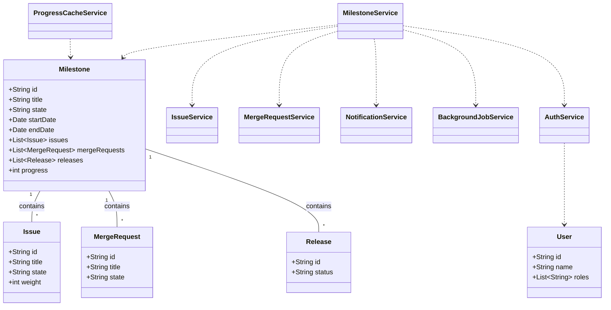
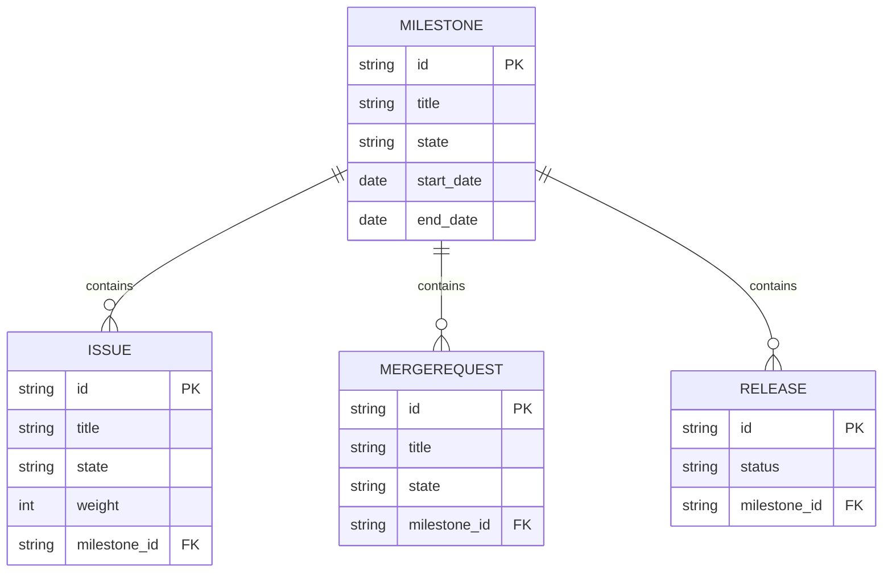

# Low-Level Design (LLD) Document

## 1. Objective
This document describes the low-level design for the features enabling users to close a milestone and view milestone progress within the GitLab application. The goal is to provide a robust, scalable, and maintainable solution for project managers to mark milestones as completed and for team members to monitor milestone progress in real-time. The design ensures data consistency, secure access, and efficient handling of large milestones, while supporting asynchronous operations and real-time updates.

## 2. API Model

### 2.1 Common Components/Services
- **MilestoneService**: Business logic for milestone state transitions and progress calculations.
- **IssueService**: Handles issue-related operations and associations with milestones.
- **MergeRequestService**: Updates merge requests linked to milestones.
- **NotificationService**: Triggers webhooks and notifications.
- **AuthService**: Handles permission and authentication checks.
- **ProgressCacheService**: Manages caching of milestone progress (uses Redis).
- **BackgroundJobService**: Manages asynchronous jobs (uses Sidekiq).

### 2.2 API Details
| Operation                  | REST Method | Type     | URL                                 | Request JSON                                                                 | Response JSON                                                                |
|---------------------------|-------------|----------|-------------------------------------|------------------------------------------------------------------------------|------------------------------------------------------------------------------|
| Close Milestone            | POST        | Success  | /api/v1/milestones/{id}/close       | { "userId": "string" }                                                    | { "status": "closed", "milestoneId": "string", "closedAt": "datetime" } |
| Close Milestone            | POST        | Failure  | /api/v1/milestones/{id}/close       | { "userId": "string" }                                                    | { "error": "Only active milestones can be closed." }                       |
| View Milestone Progress    | GET         | Success  | /api/v1/milestones/{id}/progress    | N/A                                                                          | { "milestoneId": "string", "progress": 0-100, "completedIssues": int, "totalIssues": int, "timeElapsed": int, "totalTime": int, "releases": [ { "id": "string", "status": "string" } ] } |
| View Milestone Progress    | GET         | Failure  | /api/v1/milestones/{id}/progress    | N/A                                                                          | { "error": "Milestone not found or permission denied." }                   |

### 2.3 Exceptions
- **MilestoneNotActiveException**: Thrown when attempting to close a milestone that is not active.
- **PermissionDeniedException**: Thrown when a user lacks permission to close or view a milestone.
- **MilestoneNotFoundException**: Thrown if the milestone ID does not exist.
- **DataConsistencyException**: Thrown if cached and DB values are inconsistent.
- **AsyncJobFailedException**: Thrown if the background closure process fails.

## 3. Functional Design

### 3.1 Class Diagram


### 3.2 UML Sequence Diagram
```mermaid
sequenceDiagram
    participant User
    participant AuthService
    participant MilestoneService
    participant IssueService
    participant MergeRequestService
    participant NotificationService
    participant ProgressCacheService
    participant BackgroundJobService

    User->>AuthService: Request to close milestone
    AuthService-->>User: Validate permissions
    AuthService->>MilestoneService: Pass user context
    MilestoneService->>Milestone: Check state == 'active'
    alt Large milestone
        MilestoneService->>BackgroundJobService: Enqueue closure job
        BackgroundJobService->>MilestoneService: Async closure
    else Small milestone
        MilestoneService->>IssueService: Update issues
        MilestoneService->>MergeRequestService: Update MRs
        MilestoneService->>NotificationService: Trigger webhooks
        MilestoneService->>Milestone: Set state = 'closed'
    end
    MilestoneService->>ProgressCacheService: Update cache
    MilestoneService-->>User: Return closure status

    User->>AuthService: Request milestone progress
    AuthService-->>User: Validate permissions
    AuthService->>MilestoneService: Pass user context
    MilestoneService->>ProgressCacheService: Fetch progress
    alt Cache miss
        ProgressCacheService->>MilestoneService: Notify miss
        MilestoneService->>IssueService: Fetch issues
        MilestoneService->>Calculate progress
        MilestoneService->>ProgressCacheService: Update cache
    end
    MilestoneService-->>User: Return progress data
```

### 3.3 Components
| Component Name          | Purpose                                               | New/Existing |
|------------------------|-------------------------------------------------------|--------------|
| MilestoneService       | Handles milestone state transitions and progress       | Existing     |
| IssueService           | Manages issues and their linkage to milestones        | Existing     |
| MergeRequestService    | Handles merge requests linked to milestones           | Existing     |
| NotificationService    | Triggers webhooks/notifications on milestone changes  | Existing     |
| AuthService            | Validates user permissions                            | Existing     |
| ProgressCacheService   | Caches milestone progress for fast retrieval          | New          |
| BackgroundJobService   | Handles async closure for large milestones            | New          |

### 3.4 Service Layer Logic and Validations
| FieldName     | Validation                                         | ErrorMessage                                    | ClassUsed              |
|--------------|-----------------------------------------------------|-------------------------------------------------|------------------------|
| milestoneId   | Must exist and be in 'active' state                | Only active milestones can be closed.            | MilestoneService       |
| userId        | Must have 'close_milestone' or 'view_milestone' permission | Permission denied.                              | AuthService            |
| issues        | All must be completed before closure (if required) | Cannot close milestone with incomplete issues.   | MilestoneService       |
| progress      | Must be between 0 and 100                          | Invalid progress value.                         | ProgressCacheService   |
| cache         | Must be consistent with DB                         | Data inconsistency detected.                    | ProgressCacheService   |

## 4. Integrations
| SystemToBeIntegrated | IntegratedFor                   | IntegrationType |
|---------------------|----------------------------------|-----------------|
| Sidekiq             | Async milestone closure          | Background Job  |
| Redis               | Milestone progress caching       | Cache           |
| Webhooks/3rd-party  | Notifications on milestone close | API             |
| PostgreSQL          | Persistent storage               | DB              |

## 5. DB Details

### 5.1 ER Model


### 5.2 DB Validations
- **Milestone.state**: Enum constraint ('active', 'closed', 'archived')
- **Issue.state**: Enum constraint ('open', 'closed')
- **MergeRequest.state**: Enum constraint ('open', 'merged', 'closed')
- **Release.status**: Enum constraint ('pending', 'released', 'failed')
- **Foreign Key Constraints**: All references from issues, merge requests, and releases to milestones must be valid.
- **Unique Constraints**: Milestone titles must be unique within a project.

## 6. Dependencies
- Sidekiq for background job processing
- Redis for caching milestone progress
- PostgreSQL for persistent storage
- Vue.js frontend for milestone progress visualization
- Webhook endpoints for notifications

## 7. Assumptions
- Only users with appropriate roles can close or view milestones.
- Large milestones are defined by a configurable threshold (e.g., >100 issues).
- All milestone-related operations are performed within a single project context.
- Webhooks are pre-configured and available for notification triggers.
- The system clock is synchronized across all services for accurate time calculations.
- All API endpoints are secured via JWT or session-based authentication.

---

**End of LLD Document**
