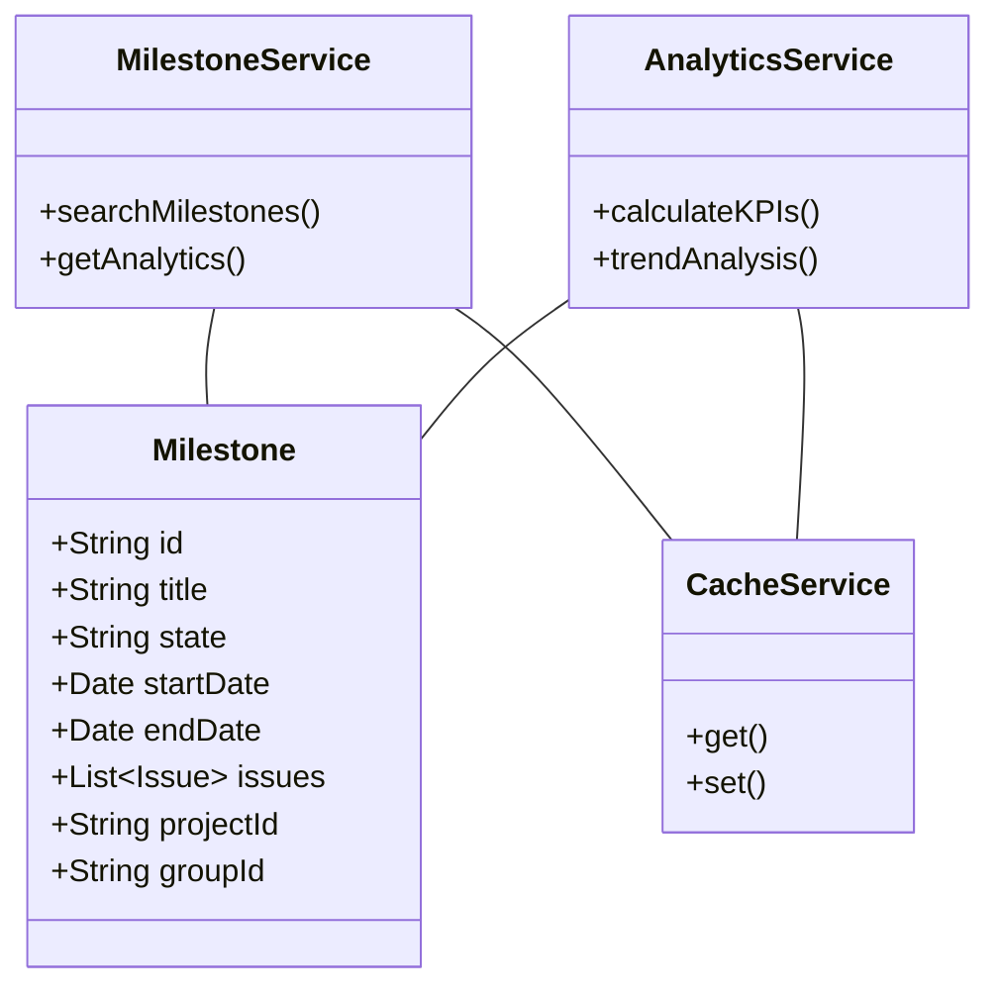
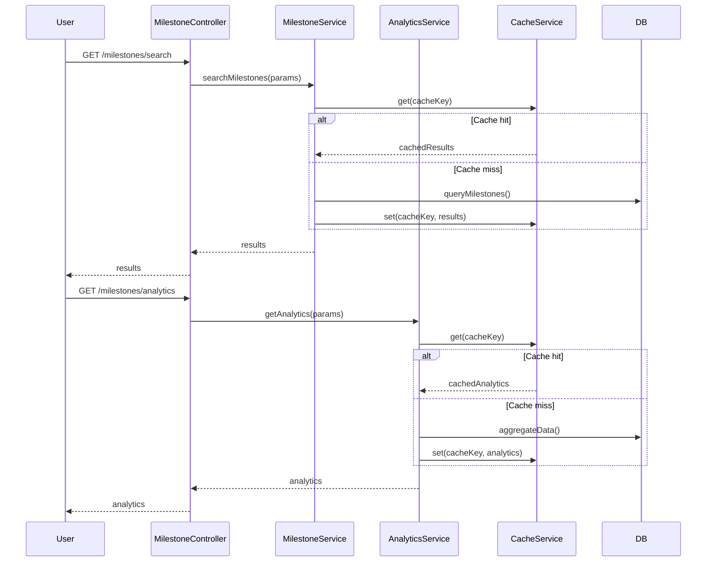
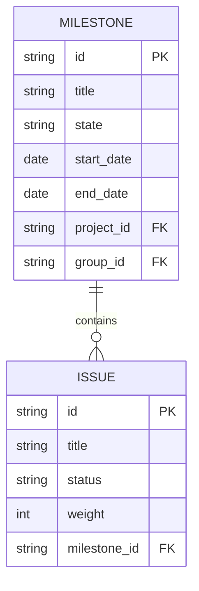

# Low-Level Design (LLD) Document: Search and Filter Milestones & Milestone Analytics

## 1. Objective
This document provides the low-level design for two features in the GitLab application server:
- Search and Filter Milestones
- Milestone Analytics

The goal is to enable project managers and leaders to efficiently search/filter milestones and to view analytics for better project performance insights.

## 2. Search and Filter Milestones

### 2.1 Functional Requirements
- Search milestones by title, description, state, and date range.
- Filter milestones by project, group, or personal milestones.
- Results are paginated and sortable.

### 2.2 Technical Context
- **System:** GitLab application server
- **Database:** PostgreSQL
- **Search:** Elasticsearch (if integrated)
- **API:** RESTful and GraphQL

### 2.3 API Endpoints
| Operation          | Method | URL                                    | Request Params / Body                                        | Response Example |
|--------------------|--------|----------------------------------------|--------------------------------------------------------------|------------------|
| Search Milestones  | GET    | /api/v1/milestones/search              | title, description, state, start_date, end_date, project_id, group_id, user_id, page, sort | List<Milestone>  |

#### Example Request
```
GET /api/v1/milestones/search?title=Release&state=active&project_id=123&page=1&sort=due_date_desc
```

#### Example Response
```
{
  "milestones": [
    {"id": "1", "title": "Release Q3", "state": "active", ...},
    ...
  ],
  "pagination": {"page": 1, "total_pages": 3}
}
```

### 2.4 Validations
- Validate search input to prevent SQL injection.
- Ensure user has permissions to view milestones in search results.

### 2.5 Business Logic
- Implement smart search algorithm (e.g., fuzzy matching, relevance ranking).
- Cache frequent searches for performance (Redis).

### 2.6 Non-Functional Requirements
- Search results within 3 seconds for complex queries.
- Support high concurrency.

## 3. Milestone Analytics

### 3.1 Functional Requirements
- Dashboard with milestone metrics:
  - Completion rate
  - Average time to completion
  - Estimated vs. actual completion times
- Visualizations (charts/graphs)
- Filter analytics by date range, project, or group
- Data export capability

### 3.2 Technical Context
- **System:** GitLab application server
- **Database:** PostgreSQL
- **Analytics:** Custom analytics engine or Grafana
- **Frontend:** D3.js or similar for charts

### 3.3 API Endpoints
| Operation                | Method | URL                                         | Request Params / Body         | Response Example |
|--------------------------|--------|---------------------------------------------|------------------------------|------------------|
| Get Milestone Analytics  | GET    | /api/v1/milestones/analytics                | project_id, group_id, date_range | AnalyticsData    |

#### Example Response
```
{
  "completion_rate": 0.85,
  "avg_time_to_completion": 12.5,
  "estimate_accuracy": 0.92,
  "trend": [ ... ]
}
```

### 3.4 Validations
- Cross-check analytics data with raw DB values.
- Validate user permissions for analytics access.

### 3.5 Business Logic
- Calculate KPIs from milestone data.
- Trend analysis for improvement/decline.

### 3.6 Non-Functional Requirements
- Dashboard loads within 5 seconds.
- Efficient aggregation for large projects.
- Caching for frequently accessed analytics.

## 4. Class Diagram


## 5. Sequence Diagram


## 6. DB Schema (ER Diagram)


## 7. Dependencies
- Spring Boot 2.x/3.x
- PostgreSQL 12+
- Redis 5+
- Elasticsearch (optional)
- D3.js or Grafana (for analytics dashboard)

## 8. Assumptions
- Only authorized users can search/filter milestones and view analytics.
- Analytics data is refreshed periodically or on-demand.
- All APIs are secured (JWT-based authentication).

---

*Generated by Crew Manager LLD Agent for Jira Stories 5-6: Search and Filter Milestones, Milestone Analytics*
