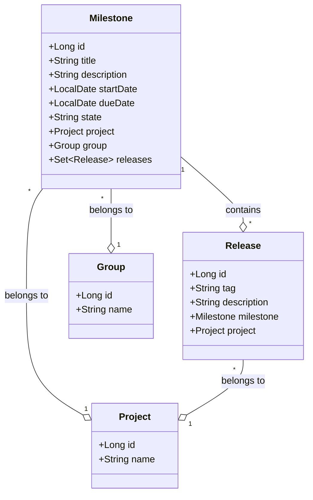
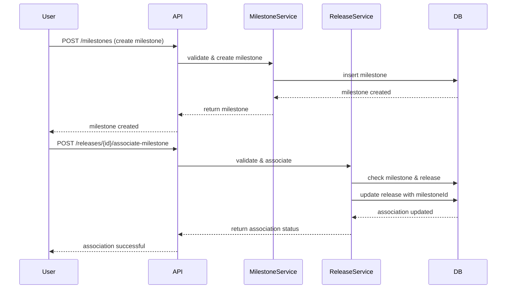
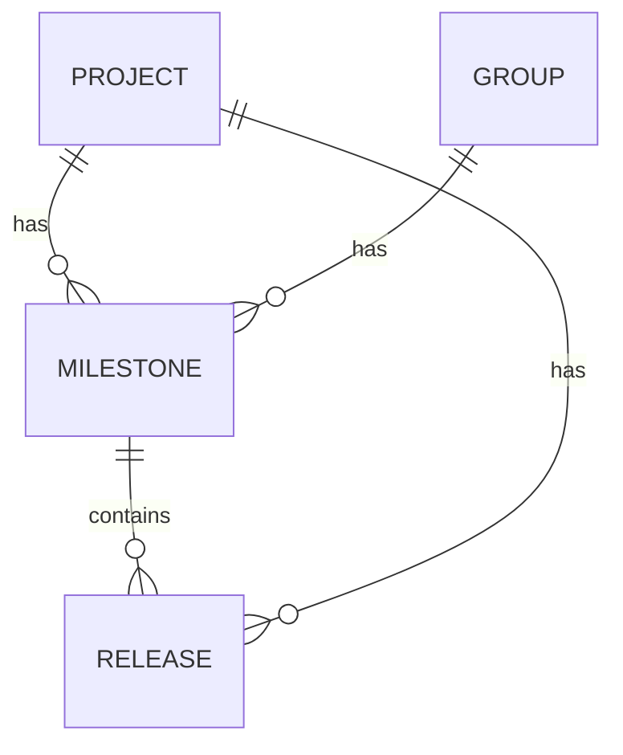

# Low-Level Design (LLD) Document

## 1. Objective
This document details the low-level design for the Milestone and Release management features in the GitLab application server. The design enables project managers and developers to create milestones, associate releases with milestones, and track progress towards project goals. It ensures data integrity, atomic operations, and high concurrency handling, supporting both RESTful and GraphQL APIs. All requirements are implemented using Spring Boot best practices and PostgreSQL as the database.

## 2. API Model

### 2.1 Common Components/Services
- **MilestoneService**: Handles business logic for milestone creation and association.
- **ReleaseService**: Manages release creation and association with milestones.
- **MilestoneRepository**: Data access for milestones.
- **ReleaseRepository**: Data access for releases.
- **ValidationUtils**: Contains validation logic for unique constraints and date checks.

### 2.2 API Details
| Operation                        | REST Method | Type            | URL                                 | Request JSON                                                                                      | Response JSON                                                                                   |
|----------------------------------|-------------|-----------------|-------------------------------------|---------------------------------------------------------------------------------------------------|-------------------------------------------------------------------------------------------------|
| Create Milestone                 | POST        | Success/Failure | /api/v1/projects/{projectId}/milestones | { "title": "string", "description": "string", "startDate": "yyyy-MM-dd", "dueDate": "yyyy-MM-dd" } | { "id": 1, "title": "string", "state": "active", "description": "string", "startDate": "yyyy-MM-dd", "dueDate": "yyyy-MM-dd" } |
| Associate Release with Milestone | POST        | Success/Failure | /api/v1/projects/{projectId}/releases/{releaseId}/associate-milestone | { "milestoneId": 1 }                                                                             | { "releaseId": 1, "milestoneId": 1, "status": "associated" }                              |

### 2.3 Exceptions
- **DuplicateMilestoneTitleException**: Thrown if a milestone title is not unique within a project/group.
- **InvalidDateRangeException**: Thrown if the start date is after the due date.
- **ReleaseTagNotUniqueException**: Thrown if a release tag is not unique within a project.
- **ReleaseAlreadyAssociatedException**: Thrown if a release is already associated with a milestone.
- **MilestoneNotFoundException**: Thrown if the milestone does not exist.
- **ReleaseNotFoundException**: Thrown if the release does not exist.
- **AtomicityException**: Thrown if the association process fails to be atomic.

## 3. Functional Design

### 3.1 Class Diagram

### 3.2 UML Sequence Diagram

### 3.3 Components
| Component Name      | Purpose                                         | New/Existing |
|---------------------|-------------------------------------------------|--------------|
| MilestoneService    | Business logic for milestones                   | New          |
| ReleaseService      | Business logic for releases                     | New          |
| MilestoneRepository | Data access for milestones                      | New          |
| ReleaseRepository   | Data access for releases                        | New          |
| ValidationUtils     | Validation logic for unique and date constraints| New          |

### 3.4 Service Layer Logic and Validations
| FieldName         | Validation                                | ErrorMessage                                 | ClassUsed           |
|-------------------|-------------------------------------------|----------------------------------------------|---------------------|
| title             | Unique within project/group                | Milestone title must be unique               | MilestoneService    |
| startDate, dueDate| startDate <= dueDate                       | Start date must be before or equal to due date| MilestoneService    |
| tag               | Unique within project                      | Release tag must be unique                   | ReleaseService      |
| milestoneId       | Exists in DB                              | Milestone not found                          | ReleaseService      |
| releaseId         | Exists in DB                              | Release not found                            | ReleaseService      |
| releaseId         | Only one milestone per release             | Release already associated with milestone    | ReleaseService      |

## 4. Integrations
| SystemToBeIntegrated | IntegratedFor                   | IntegrationType |
|----------------------|----------------------------------|-----------------|
| PostgreSQL           | Milestone and Release persistence| DB              |
| GitLab UI            | Milestone and Release management | REST API        |
| GitLab UI            | Milestone and Release management | GraphQL API     |

## 5. DB Details

### 5.1 ER Model

### 5.2 DB Validations
- Unique constraint on milestone title within (project_id, group_id)
- Unique constraint on release tag within project_id
- Foreign key constraints for milestone.project_id, milestone.group_id, release.project_id, release.milestone_id
- Check constraint: milestone.start_date <= milestone.due_date
- Release.milestone_id is nullable but can only be set if not already associated

## 6. Dependencies
- Spring Boot Framework
- PostgreSQL Database
- GitLab Application Server
- RESTful and GraphQL API infrastructure

## 7. Assumptions
- A milestone can belong to either a project or a group, but not both simultaneously.
- A release can only be associated with one milestone at a time.
- All date fields are in ISO 8601 format (yyyy-MM-dd).
- Concurrency is handled at the database level using unique constraints and transactions.
- The UI/API layer will handle authentication and authorization.
