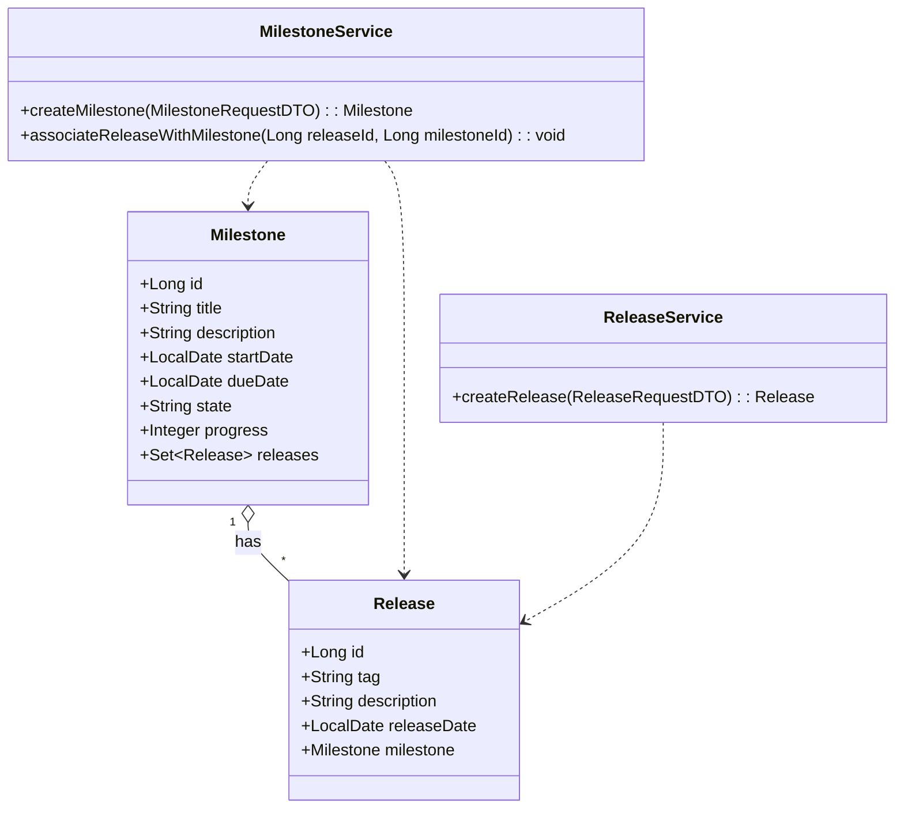
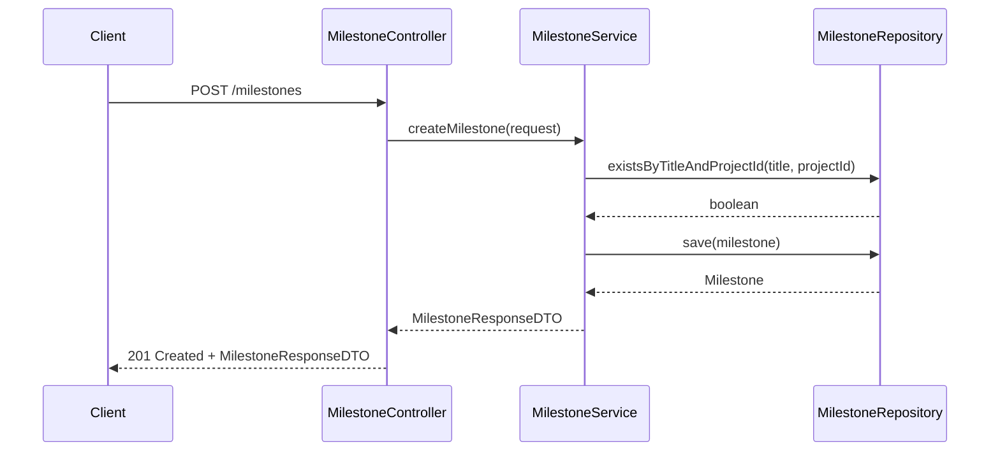
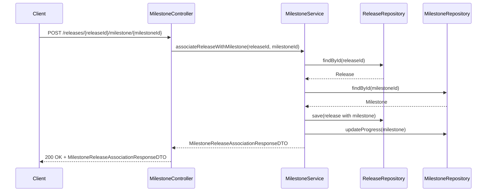
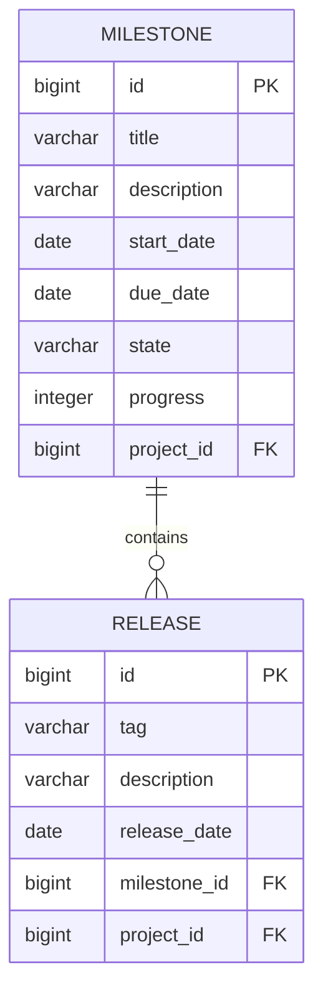

# Low-Level Design (LLD): Milestone & Release Management

## 1. Objective

This document details the low-level design for Milestone and Release management within a GitLab-like application, focusing on the creation of milestones and the association of releases with milestones. The solution leverages Spring Boot and PostgreSQL, providing RESTful and GraphQL APIs for managing milestones and their relationship with releases. The design ensures data integrity, uniqueness constraints, and atomic operations, supporting high concurrency and sub-2-second processing for all operations. The LLD adheres strictly to Spring Boot best practices, ensuring maintainability, scalability, and ease of integration.

## 2. API Model

### 2.1 Common Components/Services

- **MilestoneService**: Handles business logic for milestones (creation, validation, state management).
- **ReleaseService**: Handles release creation and association with milestones.
- **MilestoneRepository**: JPA repository for Milestone entity.
- **ReleaseRepository**: JPA repository for Release entity.
- **Exception Handling**: Global exception handler for API errors.
- **DTOs**: For request/response payloads.
- **Transactional Management**: Ensures atomicity of operations.

### 2.2 API Details

| API Name                        | URL                                 | Method | Request Body / Params                | Response Body                  | Validations & Constraints                                                                                  |
|----------------------------------|-------------------------------------|--------|--------------------------------------|-------------------------------|-----------------------------------------------------------------------------------------------------------|
| Create Milestone                | `/api/v1/projects/{projectId}/milestones` | POST   | `{title, description, startDate, dueDate}` | `MilestoneResponseDTO`         | Title unique within project; startDate <= dueDate; all fields required; state set to 'active'             |
| Associate Release with Milestone | `/api/v1/projects/{projectId}/releases/{releaseId}/milestone/{milestoneId}` | POST   | Path variables                       | `MilestoneReleaseAssociationResponseDTO` | Release tag unique within project; release can be linked to only one milestone; atomic association; updates milestone progress |
| GraphQL: Create Milestone       | `/graphql`                          | POST   | `mutation { createMilestone(...) }`  | `MilestoneType`               | Same as REST                                                                                              |
| GraphQL: Associate Release      | `/graphql`                          | POST   | `mutation { associateReleaseWithMilestone(...) }` | `MilestoneReleaseAssociationType` | Same as REST                                                                                              |

#### Request/Response Schemas

- **MilestoneRequestDTO**
  ```json
  {
    "title": "string",
    "description": "string",
    "startDate": "YYYY-MM-DD",
    "dueDate": "YYYY-MM-DD"
  }
  ```
- **MilestoneResponseDTO**
  ```json
  {
    "id": "long",
    "title": "string",
    "description": "string",
    "startDate": "YYYY-MM-DD",
    "dueDate": "YYYY-MM-DD",
    "state": "active|closed",
    "progress": "int"
  }
  ```
- **MilestoneReleaseAssociationResponseDTO**
  ```json
  {
    "milestoneId": "long",
    "releaseId": "long",
    "status": "associated",
    "milestoneProgress": "int"
  }
  ```

### 2.3 Exceptions

| Exception Name                   | HTTP Status | Description                                      |
|----------------------------------|-------------|--------------------------------------------------|
| MilestoneTitleAlreadyExistsException | 409         | Milestone title already exists in project         |
| InvalidDateRangeException        | 400         | Start date is after due date                     |
| ReleaseTagAlreadyExistsException | 409         | Release tag already exists in project            |
| ReleaseAlreadyAssociatedException| 409         | Release is already associated with a milestone    |
| EntityNotFoundException          | 404         | Milestone or Release not found                   |
| ConcurrencyException             | 409         | Concurrent modification detected                 |
| GeneralValidationException       | 400         | Other validation failures                        |

## 3. Functional Design

### 3.1 Class Diagram (Mermaid)



### 3.2 UML Sequence Diagram (Mermaid)

#### Create Milestone


#### Associate Release with Milestone


### 3.3 Components Table

| Component             | Responsibility                                        |
|----------------------|------------------------------------------------------|
| MilestoneController   | REST/GraphQL endpoints for milestone operations      |
| ReleaseController     | REST/GraphQL endpoints for release operations        |
| MilestoneService      | Business logic for milestones                        |
| ReleaseService        | Business logic for releases                          |
| MilestoneRepository   | JPA repository for Milestone                         |
| ReleaseRepository     | JPA repository for Release                           |
| DTOs                  | Data transfer objects for API requests/responses     |
| Exception Handlers    | Centralized API error handling                      |

### 3.4 Service Layer Logic and Validations Table

| Method                                   | Logic/Validation                                                                                 |
|------------------------------------------|--------------------------------------------------------------------------------------------------|
| createMilestone(request)                 | Validate title uniqueness (project scope); validate startDate <= dueDate; set state 'active'; persist |
| associateReleaseWithMilestone(rId, mId)  | Validate release not already associated; validate milestone exists; update release; update milestone progress; atomic |
| createRelease(request)                   | Validate tag uniqueness (project scope); persist release                                         |

## 4. Integrations

| System/Service     | Integration Type | Purpose/Notes                                 |
|--------------------|------------------|-----------------------------------------------|
| PostgreSQL         | JDBC/JPA         | Persistent storage for milestones and releases |
| GraphQL            | HTTP             | Alternative API interface                     |
| REST API           | HTTP             | Primary API interface                         |

## 5. DB Details

### 5.1 ER Model (Mermaid)



### 5.2 DB Validations

| Table      | Field         | Validation/Constraint                                 |
|------------|--------------|------------------------------------------------------|
| milestone  | title         | UNIQUE (project_id, title)                           |
| milestone  | start_date    | NOT NULL; start_date <= due_date (application logic) |
| milestone  | due_date      | NOT NULL                                             |
| milestone  | state         | NOT NULL; values: 'active', 'closed'                 |
| release    | tag           | UNIQUE (project_id, tag)                             |
| release    | milestone_id  | Each release can be associated with one milestone    |
| release    | project_id    | FK to project                                        |

## 6. Dependencies

- Spring Boot 3.x
- Spring Data JPA
- PostgreSQL Driver
- Spring Web (REST)
- GraphQL Java Spring Boot Starter
- Lombok (for DTOs/Entities)
- Bean Validation (javax.validation)
- MapStruct (optional, for DTO mapping)

## 7. Assumptions

- Project and Group entities exist and are managed externally.
- All operations are performed within the context of a project (projectId is always provided).
- Milestones and releases are soft-deleted or archived elsewhere if needed.
- Timezone handling is managed at the application or DB level.
- Concurrency is handled via optimistic locking or transaction isolation.
- All APIs are secured and authenticated (not detailed here).
- Progress calculation logic for milestones is defined elsewhere (stubbed as integer update).
