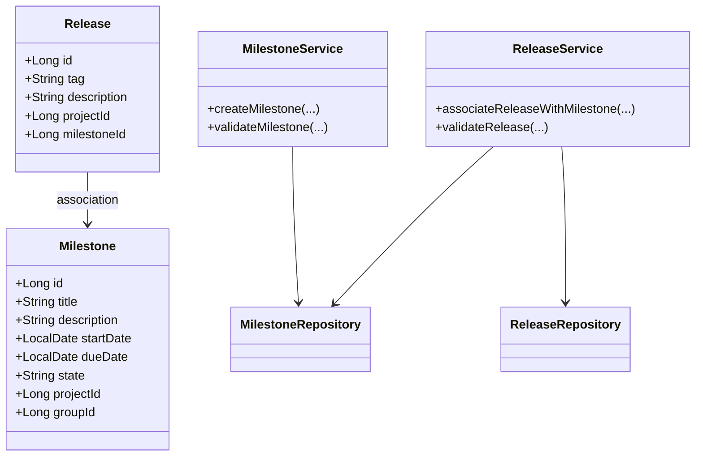
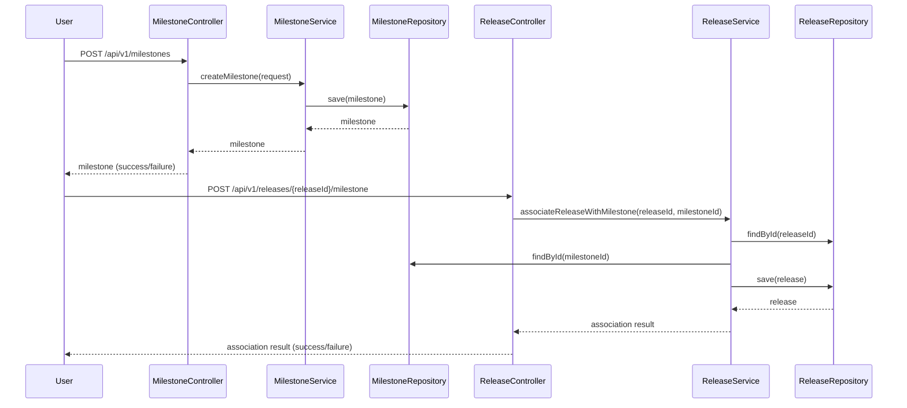
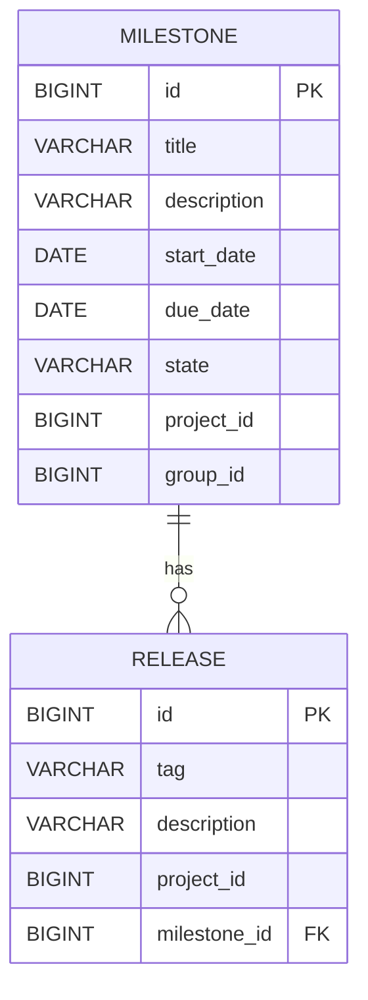

# Low-Level Design (LLD) Document: Milestone Creation & Release Association

## 1. Objective
This document details the low-level design for implementing the following functionalities in the GitLab application server:
- Creation of milestones within a project or group, enabling project managers to track progress towards specific goals.
- Association of releases with milestones, allowing developers to track features and fixes included in each release.
The design ensures data integrity, uniqueness, atomicity, and concurrency handling, following Spring Boot best practices and targeting PostgreSQL as the database.

## 2. API Model
### 2.1 Common Components/Services
- **MilestoneService**: Handles business logic for milestone creation and management.
- **ReleaseService**: Manages release creation and association with milestones.
- **MilestoneRepository**: Data access layer for milestones.
- **ReleaseRepository**: Data access layer for releases.
- **ValidationUtils**: Utility for common validation logic.
- **ExceptionHandler**: Centralized exception handling for API errors.

### 2.2 API Details
| Operation                         | REST Method | Type     | URL                                   | Request JSON                                                                                                                                   | Response JSON                                                                                                                         |
|-----------------------------------|-------------|----------|---------------------------------------|-----------------------------------------------------------------------------------------------------------------------------------------------|----------------------------------------------------------------------------------------------------------------------------------------|
| Create Milestone                  | POST        | Success  | /api/v1/milestones                    | `{ "title": "string", "description": "string", "startDate": "yyyy-MM-dd", "dueDate": "yyyy-MM-dd", "projectId": "long", "groupId": "long (optional)" }` | `{ "id": "long", "title": "string", "description": "string", "startDate": "yyyy-MM-dd", "dueDate": "yyyy-MM-dd", "state": "active", "projectId": "long", "groupId": "long (optional)" }` |
| Create Milestone                  | POST        | Failure  | /api/v1/milestones                    | (same as above)                                                                                                                               | `{ "error": "Milestone title must be unique within project or group" }`                                                           |
| Associate Release with Milestone  | POST        | Success  | /api/v1/releases/{releaseId}/milestone | `{ "milestoneId": "long" }`                                                                                                                | `{ "releaseId": "long", "milestoneId": "long", "status": "associated" }`                                                   |
| Associate Release with Milestone  | POST        | Failure  | /api/v1/releases/{releaseId}/milestone | (same as above)                                                                                                                               | `{ "error": "Release already associated with a milestone" }`                                                                      |

### 2.3 Exceptions
- **MilestoneTitleNotUniqueException**: Thrown when milestone title is not unique within a project or group.
- **StartDateAfterDueDateException**: Thrown when milestone start date is after due date.
- **ReleaseTagNotUniqueException**: Thrown when release tag is not unique within a project.
- **ReleaseAlreadyAssociatedException**: Thrown when a release is already linked to a milestone.
- **MilestoneNotFoundException**: Thrown when a milestone does not exist for association.
- **DatabaseConcurrencyException**: Thrown on concurrent update conflicts.

## 3. Functional Design
### 3.1 Class Diagram

### 3.2 UML Sequence Diagram

### 3.3 Components
| Component Name         | Purpose                                    | New/Existing |
|-----------------------|---------------------------------------------|--------------|
| MilestoneService      | Business logic for milestones               | New          |
| ReleaseService        | Business logic for releases                 | New          |
| MilestoneRepository   | Data access for milestones                  | New          |
| ReleaseRepository     | Data access for releases                    | New          |
| ValidationUtils       | Common validation logic                     | New          |
| ExceptionHandler      | Centralized API error handling              | New          |

### 3.4 Service Layer Logic and Validations
| FieldName     | Validation                                           | ErrorMessage                                          | ClassUsed         |
|---------------|------------------------------------------------------|-------------------------------------------------------|-------------------|
| title         | Unique within project/group                          | Milestone title must be unique within project/group    | MilestoneService  |
| startDate     | Must be before or equal to dueDate                   | Start date must be before or equal to due date         | MilestoneService  |
| tag           | Unique within project                                | Release tag must be unique within project              | ReleaseService    |
| milestoneId   | Must exist for association                           | Milestone not found                                   | ReleaseService    |
| releaseId     | Only one milestone per release                       | Release already associated with a milestone            | ReleaseService    |

## 4. Integrations
| SystemToBeIntegrated | IntegratedFor             | IntegrationType |
|---------------------|--------------------------|-----------------|
| PostgreSQL          | Milestone/Release storage | DB              |
| GitLab UI           | Milestone/Release APIs    | REST            |
| GitLab GraphQL      | Milestone/Release APIs    | GraphQL         |

## 5. DB Details
### 5.1 ER Model

### 5.2 DB Validations
- **Milestone.title**: Unique constraint within (project_id, group_id)
- **Milestone.start_date <= Milestone.due_date**: Enforced at application layer, can be enforced with a CHECK constraint
- **Release.tag**: Unique constraint within project_id
- **Release.milestone_id**: FK to Milestone.id, nullable (only one milestone per release)
- **Release.milestone_id**: Unique constraint (a release can be associated with only one milestone)

## 6. Dependencies
- Spring Boot (Web, Data JPA, Validation)
- PostgreSQL
- GitLab UI and API consumers
- Jackson (for JSON serialization)

## 7. Assumptions
- A milestone is always associated with either a project or a group, not both simultaneously.
- Milestone state is set to 'active' upon creation and may be updated later for completion/archival.
- Release-milestone association is one-to-one per release; a milestone can have multiple releases.
- All date fields are in ISO 8601 format (yyyy-MM-dd).
- Concurrency is handled at the DB level using unique constraints and transaction isolation.
- All APIs are secured and authenticated (not detailed here).

---

**Absolute Path:** `/workspace/Generated_LLD.md`
