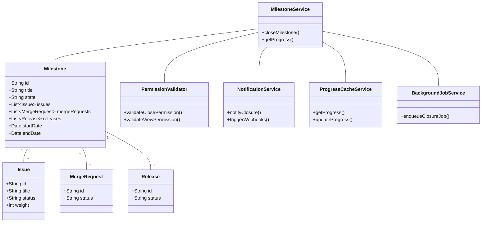
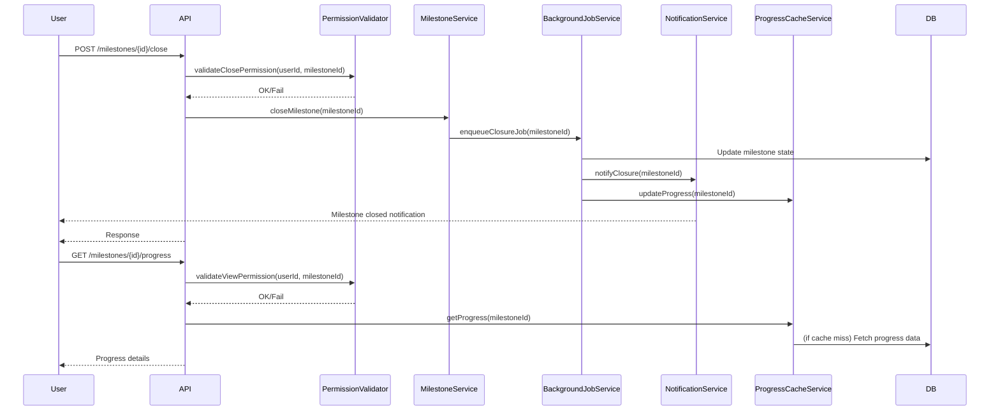
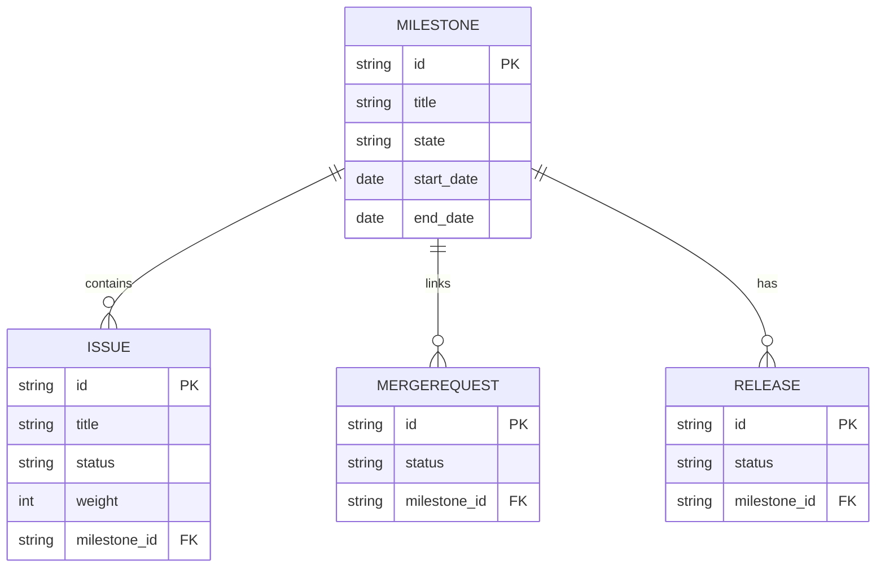

# Low-Level Design (LLD) for SCRUM-64: Close and View the Milestone

## 1. Objective
This document provides the consolidated Low-Level Design (LLD) for the implementation of two user stories: closing a milestone and viewing milestone progress in the GitLab application server. The goal is to enable project managers to close milestones, update associated entities, and allow team members to visualize milestone progress in real time. The design ensures data consistency, proper permission handling, and efficient asynchronous processing for large milestones, following Spring Boot best practices.

## 2. API Model

### 2.1 Common Components/Services
- **MilestoneService**: Handles business logic for milestone state transitions and progress calculations.
- **IssueService**: Manages issues associated with milestones.
- **MergeRequestService**: Updates merge requests linked to milestones.
- **NotificationService**: Sends notifications and triggers webhooks.
- **PermissionValidator**: Validates user permissions for milestone operations.
- **ProgressCacheService**: Handles caching of progress data (uses Redis).
- **BackgroundJobService**: Manages asynchronous milestone closure (integrates with Sidekiq).

### 2.2 API Details
| Operation                  | REST Method | Type     | URL                                 | Request JSON                                                                 | Response JSON                                                                |
|---------------------------|-------------|----------|-------------------------------------|------------------------------------------------------------------------------|------------------------------------------------------------------------------|
| Close Milestone           | POST        | Success  | /api/v1/milestones/{id}/close       | { "userId": "string" }                                                      | { "status": "closed", "milestoneId": "string", "message": "Milestone closed successfully" } |
| Close Milestone           | POST        | Failure  | /api/v1/milestones/{id}/close       | { "userId": "string" }                                                      | { "error": "Milestone is not active or permission denied" }                  |
| View Milestone Progress   | GET         | Success  | /api/v1/milestones/{id}/progress    | N/A                                                                          | { "milestoneId": "string", "progress": 0.85, "completedIssues": 17, "totalIssues": 20, "timeElapsed": 12, "totalTime": 15, "releases": [ { "id": "string", "status": "released" } ] } |
| View Milestone Progress   | GET         | Failure  | /api/v1/milestones/{id}/progress    | N/A                                                                          | { "error": "Milestone not found or permission denied" }                      |

### 2.3 Exceptions
- **MilestoneNotActiveException**: Thrown when attempting to close a non-active milestone.
- **PermissionDeniedException**: Thrown when user lacks permission to close/view milestone.
- **MilestoneNotFoundException**: Thrown when milestone ID does not exist.
- **DataConsistencyException**: Thrown if cached and DB values mismatch during progress view.
- **AsyncJobFailureException**: Thrown if background closure job fails.

## 3. Functional Design

### 3.1 Class Diagram

### 3.2 UML Sequence Diagram

### 3.3 Components
| Component                | Purpose                                             | New/Existing |
|--------------------------|-----------------------------------------------------|--------------|
| MilestoneService         | Business logic for milestone operations              | Existing     |
| IssueService             | Manage issues associated with milestones             | Existing     |
| MergeRequestService      | Manage merge requests linked to milestones           | Existing     |
| NotificationService      | Send notifications and trigger webhooks              | Existing     |
| PermissionValidator      | Validate user permissions                            | Existing     |
| ProgressCacheService     | Cache and serve milestone progress                   | New          |
| BackgroundJobService     | Handle async closure jobs (Sidekiq integration)      | New          |

### 3.4 Service Layer Logic and Validations
| FieldName         | Validation                                             | ErrorMessage                                 | ClassUsed             |
|-------------------|--------------------------------------------------------|----------------------------------------------|-----------------------|
| milestone.state   | Must be 'active' to close                              | Milestone is not active                      | MilestoneService      |
| userId            | Must have permission to close/view milestone           | Permission denied                            | PermissionValidator   |
| milestoneId       | Must exist in DB                                       | Milestone not found                          | MilestoneService      |
| progress data     | Cache and DB values must match                         | Data consistency error                       | ProgressCacheService  |

## 4. Integrations
| SystemToBeIntegrated | IntegratedFor                      | IntegrationType |
|---------------------|-------------------------------------|-----------------|
| Sidekiq             | Asynchronous milestone closure      | Background Job  |
| Redis               | Caching milestone progress          | Cache           |
| Notification/Webhook| Notify users, trigger webhooks      | API             |
| PostgreSQL          | Persistent storage                  | Database        |
| Vue.js Frontend     | Display milestone progress          | API             |

## 5. DB Details

### 5.1 ER Model

### 5.2 DB Validations
- `milestone.state` must be one of ['active', 'closed'] (CHECK constraint)
- `issue.status` must be one of ['open', 'closed'] (CHECK constraint)
- Foreign key constraints between `issue`, `mergerequest`, `release` and `milestone`
- Unique constraint on `milestone.title` per project

## 6. Dependencies
- Spring Boot 2.x/3.x
- PostgreSQL 12+
- Redis 6+
- Sidekiq (via integration layer)
- Vue.js frontend (for progress view)

## 7. Assumptions
- Only project managers can close milestones; team members can view progress.
- All milestone-related updates (issues, merge requests) are handled transactionally.
- Sidekiq is available and properly configured for background jobs.
- Redis is available for caching progress data.
- All APIs are secured via JWT/OAuth2 authentication.
- The frontend will poll or subscribe to progress updates for near real-time UI.

---

**Absolute Path:** `/app/22d1bf77-74af-459a-bfff-831be26b0a87/Generated_LLD.md`
**GitHub Upload Path:** PROMO CODE JAVA LLD/LLD_ForSCRUM-64.md

This LLD was uploaded to Confluence page "PROMO CODE JAVA LLD FILE" in space "TEST" and to the GitHub repository "amreshmahato1/Java_Testing" under the folder "PROMO CODE JAVA LLD" as "LLD_ForSCRUM-64.md". All actions were logged for audit and troubleshooting.
