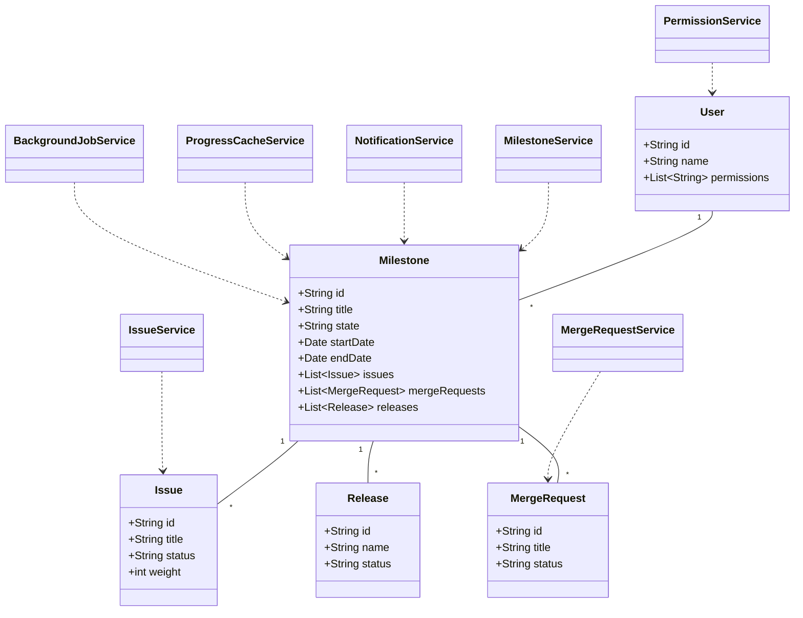
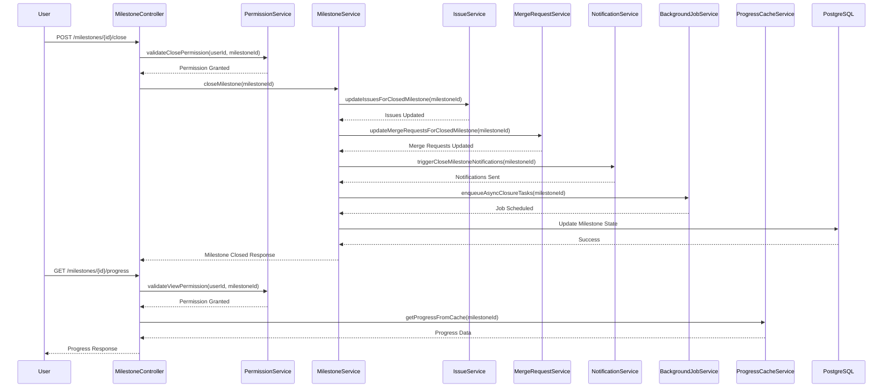
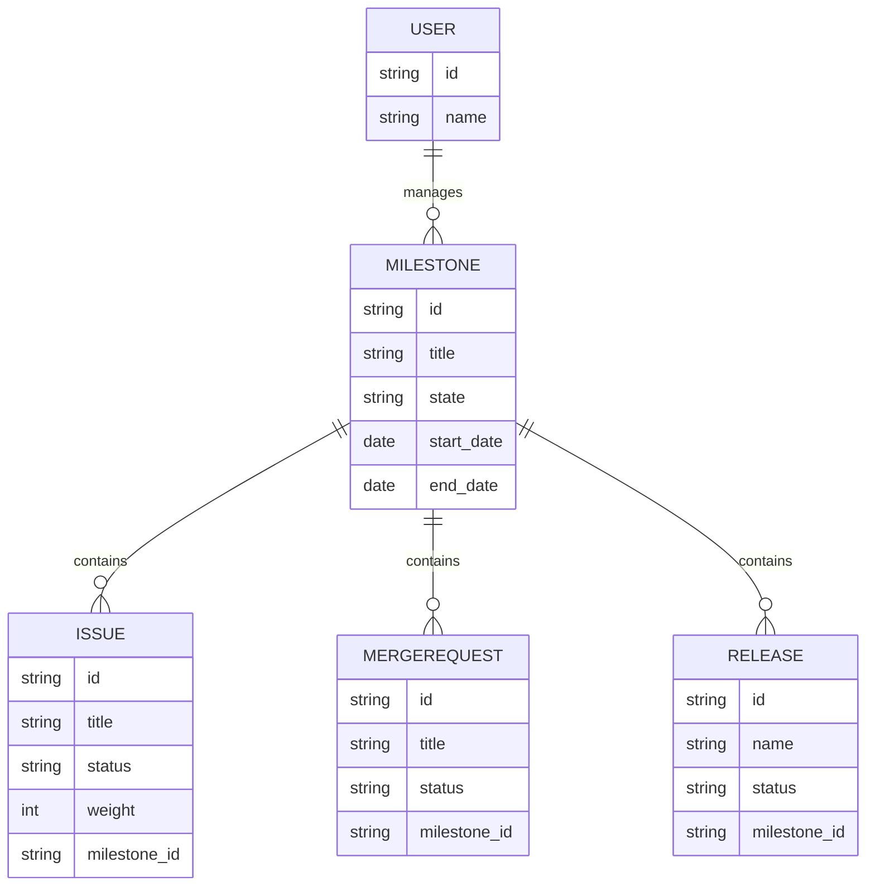

# Low-Level Design (LLD) Document for SCRUM-64: Close a Milestone & View Milestone Progress

## 1. Objective
This document describes the low-level design for two user stories: closing a milestone and viewing milestone progress within the GitLab application server. The goal is to enable project managers to close milestones, updating all related metrics and reports, and to allow team members to view real-time progress of milestones, including completed/remaining issues, time progress, and associated releases. The design ensures data consistency, asynchronous processing for large milestones, and efficient, real-time progress visualization. All APIs, models, logic, and integrations are consolidated for a unified, production-ready solution.

## 2. API Model
### 2.1 Common Components/Services
- **MilestoneService**: Handles business logic for milestone state transitions and progress calculations.
- **IssueService**: Manages issues associated with milestones.
- **MergeRequestService**: Updates merge requests linked to milestones.
- **NotificationService**: Triggers webhooks/notifications on milestone events.
- **ProgressCacheService**: Manages milestone progress caching (Redis).
- **PermissionService**: Validates user permissions.
- **BackgroundJobService**: Handles asynchronous milestone closure (Sidekiq/Job Scheduler).

### 2.2 API Details
| Operation                 | REST Method | Type           | URL                                 | Request JSON                                                                                       | Response JSON                                                                                     |
|--------------------------|-------------|----------------|-------------------------------------|----------------------------------------------------------------------------------------------------|---------------------------------------------------------------------------------------------------|
| Close Milestone          | POST        | Success/Failure| /api/v1/milestones/{id}/close       | `{ "userId": "string", "reason": "string (optional)" }`                                         | `{ "status": "closed", "milestoneId": "string", "closedAt": "datetime", "message": "string" }` |
| View Milestone Progress  | GET         | Success/Failure| /api/v1/milestones/{id}/progress    | N/A                                                                                                | `{ "milestoneId": "string", "progress": { "completedIssues": int, "totalIssues": int, "percent": float, "weightedPercent": float, "timeElapsed": int, "totalTime": int, "releases": [ { "id": "string", "status": "string" } ] } }` |

### 2.3 Exceptions
| Exception Name                    | Scenario/Service                | Description                                      |
|-----------------------------------|---------------------------------|--------------------------------------------------|
| MilestoneNotFoundException        | MilestoneService                | Milestone with given ID does not exist           |
| MilestoneAlreadyClosedException   | MilestoneService                | Attempt to close an already closed milestone     |
| PermissionDeniedException         | PermissionService               | User lacks permission to close/view milestone    |
| InvalidMilestoneStateException    | MilestoneService                | Milestone not in 'active' state for closure      |
| DataConsistencyException          | ProgressCacheService            | Cache and DB values mismatch                     |
| AsyncJobFailedException           | BackgroundJobService            | Asynchronous closure job failed                  |

## 3. Functional Design
### 3.1 Class Diagram

### 3.2 UML Sequence Diagram

### 3.3 Components
| Component Name         | Purpose                                              | New/Existing |
|-----------------------|------------------------------------------------------|--------------|
| MilestoneService      | Handles milestone state changes and logic            | Existing     |
| IssueService          | Updates issues on milestone closure                  | Existing     |
| MergeRequestService   | Updates merge requests on milestone closure          | Existing     |
| NotificationService   | Sends notifications/webhooks                         | Existing     |
| ProgressCacheService  | Caches milestone progress for fast retrieval         | New          |
| PermissionService     | Validates user permissions                           | Existing     |
| BackgroundJobService  | Handles async processing for large milestones        | New          |
| MilestoneController   | Exposes REST APIs                                    | New          |

### 3.4 Service Layer Logic and Validations
| FieldName        | Validation                                         | ErrorMessage                                 | ClassUsed             |
|------------------|----------------------------------------------------|----------------------------------------------|-----------------------|
| milestone.state  | Must be 'active' to close                          | Only active milestones can be closed          | MilestoneService      |
| user.permissions | Must include 'close_milestone'                     | User lacks permission to close milestone      | PermissionService     |
| user.permissions | Must include 'view_milestone'                      | User lacks permission to view milestone       | PermissionService     |
| cache/DB values  | Must be consistent                                | Data inconsistency detected                   | ProgressCacheService  |
| milestone.id     | Must exist in DB                                  | Milestone not found                           | MilestoneService      |
| async job status | Must complete successfully                         | Milestone closure job failed                  | BackgroundJobService  |

## 4. Integrations
| SystemToBeIntegrated | IntegratedFor                  | IntegrationType |
|---------------------|-------------------------------|-----------------|
| PostgreSQL          | Milestone, Issue, MergeRequest | DB              |
| Redis               | Milestone Progress Caching     | Cache           |
| Sidekiq/Job Queue   | Async Milestone Closure        | Background Job  |
| Webhook/Notification| Notify external systems        | API             |
| Vue.js Frontend     | Milestone Progress UI          | REST API        |

## 5. DB Details
### 5.1 ER Model

### 5.2 DB Validations
- `milestone.state` must be one of ['active', 'closed'] (CHECK constraint)
- `issue.status` must be one of ['open', 'closed'] (CHECK constraint)
- `merge_request.status` must be one of ['open', 'merged', 'closed'] (CHECK constraint)
- Foreign key constraints between issues/merge requests/releases and milestone
- User permissions managed via join table or role mapping

## 6. Dependencies
- PostgreSQL database for persistence
- Redis for caching milestone progress
- Sidekiq or equivalent job queue for async processing
- Webhook/notification infrastructure for event triggers
- Vue.js frontend for progress visualization

## 7. Assumptions
- Milestone closure is a rare event and can be handled asynchronously for large data sets
- All user permissions are pre-validated and available via PermissionService
- Progress data is cached for performance and consistency is periodically reconciled with DB
- All integrations (webhooks, notifications) are idempotent and handle retries
- System is deployed in a Spring Boot microservice architecture
- All APIs are secured and authenticated via standard mechanisms

---

**File generated by LLD Automation for SCRUM-64.**
