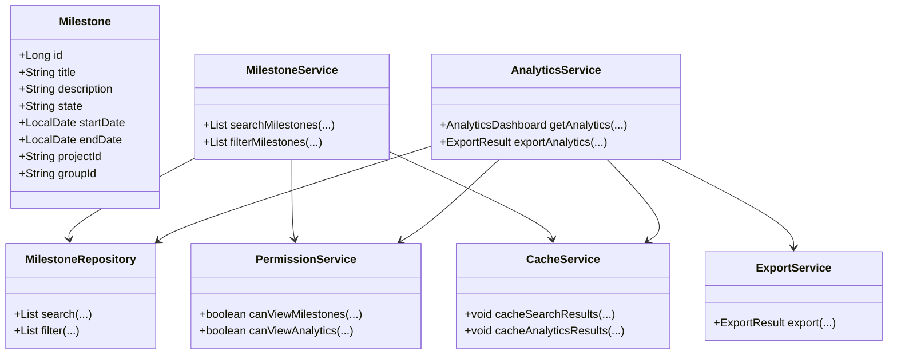
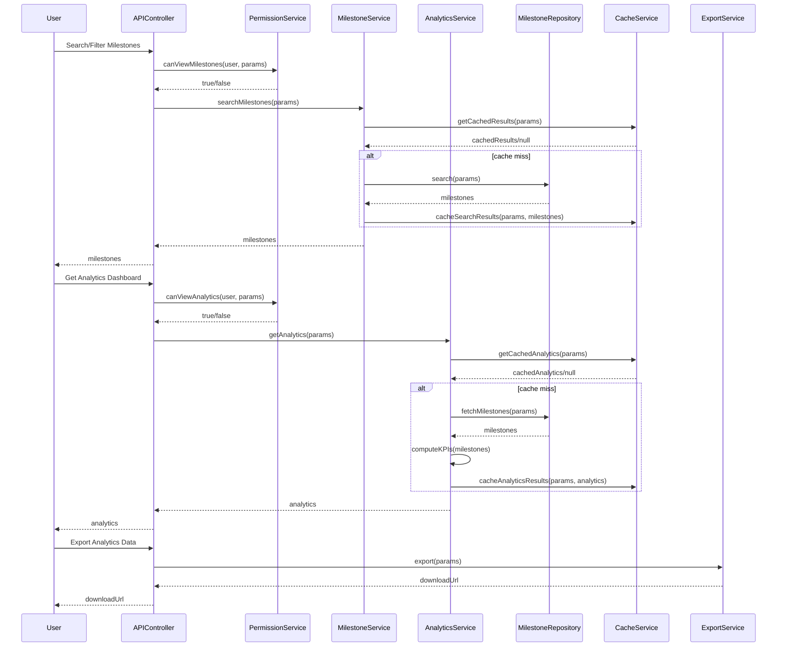
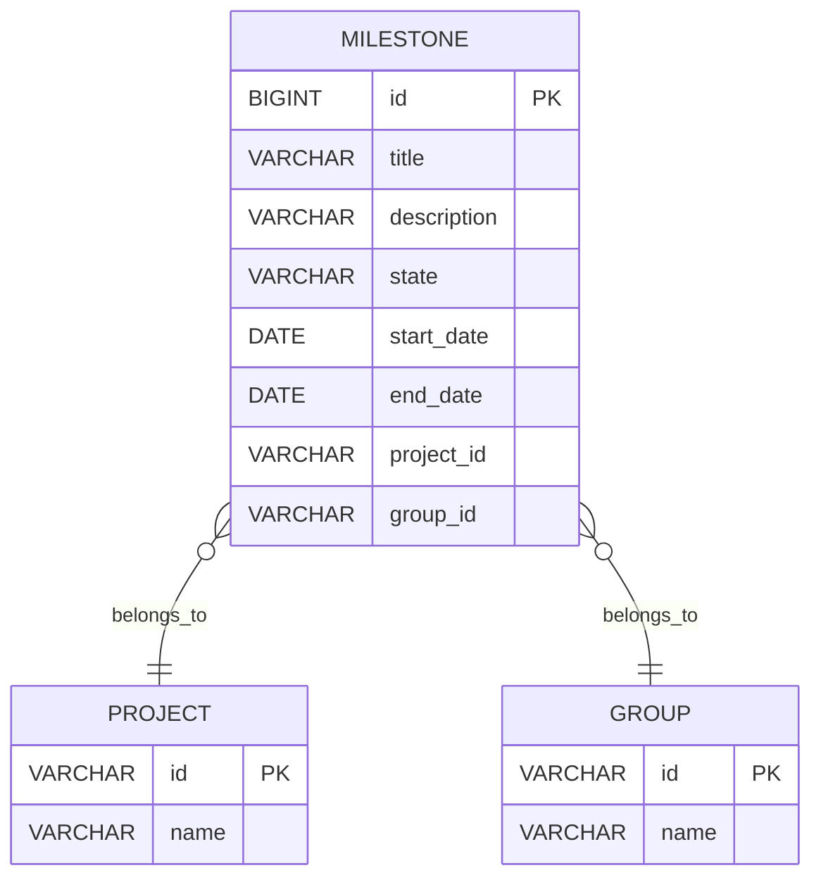

# Low-Level Design (LLD) Document: Milestone Search, Filter, and Analytics

## 1. Objective
This document details the low-level design for implementing milestone search, filter, and analytics functionalities in the GitLab application server. The goal is to enable project managers and leaders to efficiently search, filter, and analyze milestones across projects and groups. The design ensures robust, secure, and performant APIs and services, supporting advanced search, filtering, and analytics dashboards with interactive visualizations and data export capabilities. All requirements are consolidated from the latest user stories and are ready for direct implementation following Spring Boot best practices.

## 2. API Model

### 2.1 Common Components/Services
- **MilestoneService**: Handles business logic for searching, filtering, and analytics of milestones.
- **MilestoneRepository**: Data access layer for milestones (PostgreSQL, with optional Elasticsearch integration).
- **AnalyticsService**: Aggregates and computes milestone analytics and KPIs.
- **PermissionService**: Validates user permissions for accessing milestones and analytics.
- **CacheService**: Caches frequent search and analytics queries for performance.
- **ExportService**: Handles data export functionality for analytics.

### 2.2 API Details
| Operation                        | REST Method | Type     | URL                                         | Request JSON                                                                                                    | Response JSON                                                                                                                        |
|----------------------------------|-------------|----------|---------------------------------------------|------------------------------------------------------------------------------------------------------------------|-------------------------------------------------------------------------------------------------------------------------------------|
| Search & Filter Milestones       | GET         | Success  | /api/v1/milestones/search                   | { "query": "string", "state": "active|closed", "dateRange": {"from": "date", "to": "date"}, "projectId": "string", "groupId": "string", "personal": true, "page": 1, "size": 20, "sort": "field,asc|desc" } | { "milestones": [ { "id": 1, "title": "string", "description": "string", "state": "active|closed", "startDate": "date", "endDate": "date", "projectId": "string", "groupId": "string" } ], "total": 100, "page": 1, "size": 20 } |
| Search & Filter Milestones       | GET         | Failure  | /api/v1/milestones/search                   | Same as above                                                                                                   | { "error": "InvalidInputException | PermissionDeniedException | InternalServerError" }                                           |
| Get Milestone Analytics Dashboard| GET         | Success  | /api/v1/milestones/analytics                | { "projectId": "string", "groupId": "string", "dateRange": {"from": "date", "to": "date"} }                                           | { "completionRate": 0.85, "avgTimeToCompletion": "5d", "estimateAccuracy": 0.9, "trend": [ { "date": "date", "metric": 0.8 } ], "charts": [ { "type": "bar|line", "data": [...] } ] } |
| Get Milestone Analytics Dashboard| GET         | Failure  | /api/v1/milestones/analytics                | Same as above                                                                                                   | { "error": "PermissionDeniedException | DataAccuracyException | InternalServerError" }                                          |
| Export Analytics Data            | POST        | Success  | /api/v1/milestones/analytics/export         | { "projectId": "string", "groupId": "string", "dateRange": {"from": "date", "to": "date"}, "format": "csv|xlsx" }                    | { "downloadUrl": "string" }                                                                                                      |
| Export Analytics Data            | POST        | Failure  | /api/v1/milestones/analytics/export         | Same as above                                                                                                   | { "error": "PermissionDeniedException | ExportFailedException | InternalServerError" }                                           |

### 2.3 Exceptions
- **InvalidInputException**: Triggered by malformed or malicious search/filter input (e.g., SQL injection attempts).
- **PermissionDeniedException**: User lacks permission to view milestones or analytics.
- **DataAccuracyException**: Analytics data cannot be validated against raw database values.
- **ExportFailedException**: Failure during analytics data export.
- **InternalServerError**: Generic server error for unhandled exceptions.

## 3. Functional Design

### 3.1 Class Diagram

### 3.2 UML Sequence Diagram

### 3.3 Components
| Component Name     | Purpose                                                 | New/Existing |
|--------------------|---------------------------------------------------------|--------------|
| MilestoneService   | Business logic for milestone search/filter/analytics    | Existing     |
| MilestoneRepository| Data access for milestones (PostgreSQL/Elasticsearch)   | Existing     |
| AnalyticsService   | Compute and aggregate analytics for milestones          | New          |
| PermissionService  | Validate user permissions for milestones/analytics      | Existing     |
| CacheService       | Cache search and analytics results                      | New          |
| ExportService      | Export analytics data                                   | New          |

### 3.4 Service Layer Logic and Validations
| FieldName        | Validation                                 | ErrorMessage                                 | ClassUsed           |
|------------------|--------------------------------------------|----------------------------------------------|---------------------|
| query            | No SQL injection, max length 256           | InvalidInputException                        | MilestoneService    |
| state            | Enum: active, closed                       | InvalidInputException                        | MilestoneService    |
| dateRange        | Valid date format, from <= to              | InvalidInputException                        | MilestoneService    |
| projectId/groupId| Must exist and be accessible to user       | PermissionDeniedException                    | PermissionService   |
| personal         | Boolean                                    | InvalidInputException                        | MilestoneService    |
| page/size        | Positive integers, max size 100            | InvalidInputException                        | MilestoneService    |
| sort             | Valid field, asc/desc                      | InvalidInputException                        | MilestoneService    |
| analytics data   | Cross-check with DB for accuracy           | DataAccuracyException                        | AnalyticsService    |
| export format    | Enum: csv, xlsx                            | ExportFailedException                        | ExportService       |

## 4. Integrations
| SystemToBeIntegrated | IntegratedFor              | IntegrationType |
|----------------------|---------------------------|-----------------|
| PostgreSQL           | Milestone storage/query    | DB              |
| Elasticsearch        | Full-text search (optional)| API             |
| Grafana/D3.js        | Analytics visualization    | API/Library     |
| Internal Auth Service| User permissions           | API             |

## 5. DB Details

### 5.1 ER Model

### 5.2 DB Validations
- **title**: NOT NULL, max length 128
- **description**: max length 1024
- **state**: CHECK (state IN ('active', 'closed'))
- **start_date, end_date**: end_date >= start_date
- **project_id/group_id**: Foreign key constraints to PROJECT/GROUP

## 6. Dependencies
- Spring Boot 2.x/3.x
- PostgreSQL 12+
- Optional: Elasticsearch 7.x+
- Optional: Grafana, D3.js for analytics visualization
- Internal authentication/authorization service

## 7. Assumptions
- User authentication and authorization are handled by a central service.
- Elasticsearch integration is optional and only used if configured.
- Analytics dashboard uses either a custom engine or integrates with Grafana/D3.js.
- All APIs are RESTful and follow standard error handling conventions.
- Non-functional requirements (performance, concurrency) are met via caching and efficient query design.
- Data export supports CSV and XLSX formats only.
