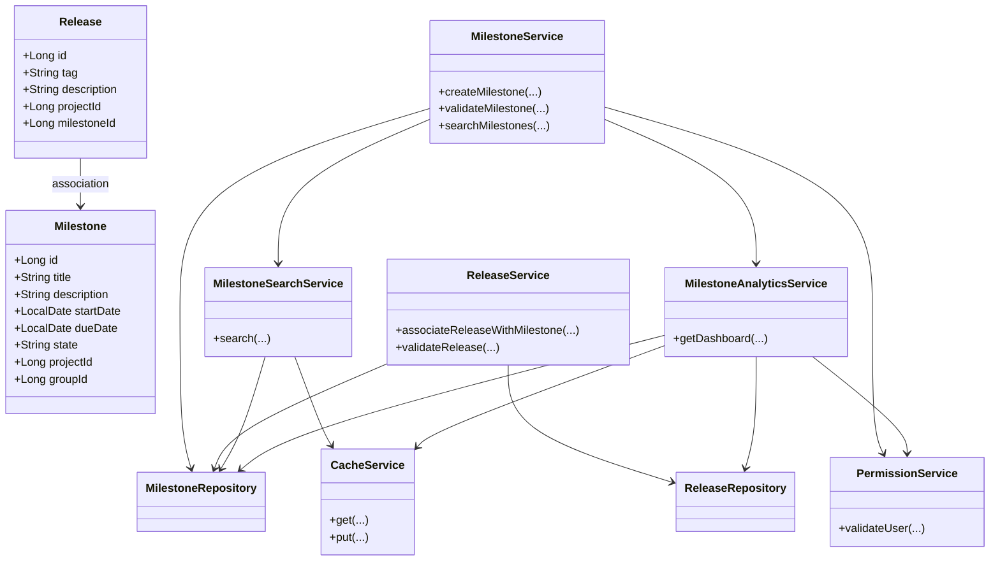
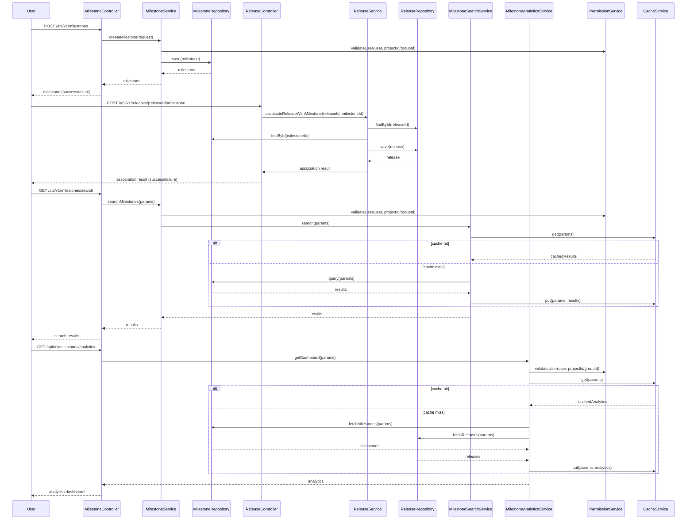
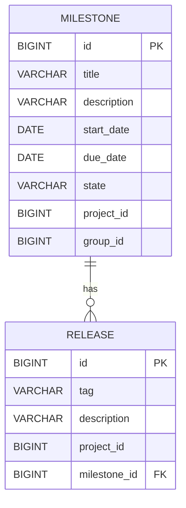

# Low-Level Design (LLD) Document: Milestone Management, Search, and Analytics

## 1. Objective
This document details the low-level design for milestone management, search/filter, and analytics functionalities in the GitLab application server. The design consolidates requirements for:
- Creating milestones and associating releases (existing functionality)
- Searching and filtering milestones across projects, groups, and personal scopes
- Providing milestone analytics dashboards for project insights
The design ensures data integrity, performance, and scalability, following Spring Boot best practices and targeting PostgreSQL as the database.

## 2. API Model
### 2.1 Common Components/Services
- **MilestoneService**: Handles business logic for milestone creation, management, search, and analytics.
- **ReleaseService**: Manages release creation and association with milestones.
- **MilestoneRepository**: Data access layer for milestones.
- **ReleaseRepository**: Data access layer for releases.
- **MilestoneSearchService**: Handles advanced search and filtering logic, including integration with Elasticsearch (if available).
- **MilestoneAnalyticsService**: Aggregates and computes analytics for milestones.
- **ValidationUtils**: Utility for common validation logic.
- **ExceptionHandler**: Centralized exception handling for API errors.
- **PermissionService**: Validates user permissions for milestone and analytics access.
- **CacheService**: Caches frequent search and analytics queries for performance.

### 2.2 API Details
| Operation                         | REST Method | Type     | URL                                             | Request JSON                                                                                                                                   | Response JSON                                                                                                                         |
|-----------------------------------|-------------|----------|-------------------------------------------------|-----------------------------------------------------------------------------------------------------------------------------------------------|----------------------------------------------------------------------------------------------------------------------------------------|
| Create Milestone                  | POST        | Success  | /api/v1/milestones                              | `{ "title": "string", "description": "string", "startDate": "yyyy-MM-dd", "dueDate": "yyyy-MM-dd", "projectId": "long", "groupId": "long (optional)" }` | `{ "id": "long", "title": "string", "description": "string", "startDate": "yyyy-MM-dd", "dueDate": "yyyy-MM-dd", "state": "active", "projectId": "long", "groupId": "long (optional)" }` |
| Create Milestone                  | POST        | Failure  | /api/v1/milestones                              | (same as above)                                                                                                                               | `{ "error": "Milestone title must be unique within project or group" }`                                                           |
| Associate Release with Milestone  | POST        | Success  | /api/v1/releases/{releaseId}/milestone          | `{ "milestoneId": "long" }`                                                                                                                | `{ "releaseId": "long", "milestoneId": "long", "status": "associated" }`                                                   |
| Associate Release with Milestone  | POST        | Failure  | /api/v1/releases/{releaseId}/milestone          | (same as above)                                                                                                                               | `{ "error": "Release already associated with a milestone" }`                                                                      |
| Search & Filter Milestones        | GET         | Success  | /api/v1/milestones/search                       | Query Params: `title=string&description=string&state=active|closed&startDate=yyyy-MM-dd&dueDate=yyyy-MM-dd&projectId=long&groupId=long&personal=true|false&page=int&size=int&sort=field,asc|desc` | `{ "results": [ { "id": "long", "title": "string", "description": "string", "startDate": "yyyy-MM-dd", "dueDate": "yyyy-MM-dd", "state": "active|closed", "projectId": "long", "groupId": "long (optional)" } ], "total": int, "page": int, "size": int }` |
| Search & Filter Milestones        | GET         | Failure  | /api/v1/milestones/search                       | (same as above)                                                                                                                               | `{ "error": "Invalid search parameters" }`                                                                                        |
| Milestone Analytics Dashboard     | GET         | Success  | /api/v1/milestones/analytics                    | Query Params: `projectId=long&groupId=long&startDate=yyyy-MM-dd&endDate=yyyy-MM-dd`                                                           | `{ "completionRate": float, "avgTimeToCompletion": float, "estimateAccuracy": float, "trend": [ { "date": "yyyy-MM-dd", "completionRate": float } ], "exportUrl": "string" }` |
| Milestone Analytics Dashboard     | GET         | Failure  | /api/v1/milestones/analytics                    | (same as above)                                                                                                                               | `{ "error": "Permission denied or invalid parameters" }`                                                                          |

### 2.3 Exceptions
- **MilestoneTitleNotUniqueException**: Thrown when milestone title is not unique within a project or group.
- **StartDateAfterDueDateException**: Thrown when milestone start date is after due date.
- **ReleaseTagNotUniqueException**: Thrown when release tag is not unique within project.
- **ReleaseAlreadyAssociatedException**: Thrown when a release is already linked to a milestone.
- **MilestoneNotFoundException**: Thrown when a milestone does not exist for association or search.
- **DatabaseConcurrencyException**: Thrown on concurrent update conflicts.
- **InvalidSearchParameterException**: Thrown when search/filter parameters are invalid.
- **PermissionDeniedException**: Thrown when user lacks access to milestones or analytics.
- **AnalyticsDataUnavailableException**: Thrown when analytics data cannot be computed.

## 3. Functional Design
### 3.1 Class Diagram

### 3.2 UML Sequence Diagram

### 3.3 Components
| Component Name           | Purpose                                                    | New/Existing |
|-------------------------|------------------------------------------------------------|--------------|
| MilestoneService        | Business logic for milestones (CRUD, search, analytics)    | Existing     |
| ReleaseService          | Business logic for releases                                | Existing     |
| MilestoneRepository     | Data access for milestones                                 | Existing     |
| ReleaseRepository       | Data access for releases                                   | Existing     |
| ValidationUtils         | Common validation logic                                    | Existing     |
| ExceptionHandler        | Centralized API error handling                            | Existing     |
| MilestoneSearchService  | Advanced search/filter logic, Elasticsearch integration    | New          |
| MilestoneAnalyticsService| Analytics aggregation and dashboard logic                 | New          |
| PermissionService       | User permissions validation                                | New          |
| CacheService            | Caching for search and analytics                           | New          |

### 3.4 Service Layer Logic and Validations
| FieldName     | Validation                                           | ErrorMessage                                          | ClassUsed                  |
|---------------|------------------------------------------------------|-------------------------------------------------------|----------------------------|
| title         | Unique within project/group                          | Milestone title must be unique within project/group    | MilestoneService           |
| startDate     | Must be before or equal to dueDate                   | Start date must be before or equal to due date         | MilestoneService           |
| tag           | Unique within project                                | Release tag must be unique within project              | ReleaseService             |
| milestoneId   | Must exist for association                           | Milestone not found                                   | ReleaseService             |
| releaseId     | Only one milestone per release                       | Release already associated with a milestone            | ReleaseService             |
| search input  | Valid search/filter parameters, prevent SQL injection| Invalid search parameters                             | MilestoneSearchService      |
| userId        | User must have permission to view/search/analytics   | Permission denied                                     | PermissionService           |
| analytics     | Data must be accurate, cross-check with DB           | Analytics data unavailable                            | MilestoneAnalyticsService   |

## 4. Integrations
| SystemToBeIntegrated | IntegratedFor             | IntegrationType |
|---------------------|--------------------------|-----------------|
| PostgreSQL          | Milestone/Release storage | DB              |
| GitLab UI           | Milestone/Release APIs    | REST            |
| GitLab GraphQL      | Milestone/Release APIs    | GraphQL         |
| Elasticsearch       | Milestone search/filter   | Search Engine   |
| Grafana/D3.js       | Analytics dashboard       | Visualization   |

## 5. DB Details
### 5.1 ER Model

### 5.2 DB Validations
- **Milestone.title**: Unique constraint within (project_id, group_id)
- **Milestone.start_date <= Milestone.due_date**: Enforced at application layer, can be enforced with a CHECK constraint
- **Release.tag**: Unique constraint within project_id
- **Release.milestone_id**: FK to Milestone.id, nullable (only one milestone per release)
- **Release.milestone_id**: Unique constraint (a release can be associated with only one milestone)
- **Milestone fields for search**: Indexed for performance (title, description, state, dates, project_id, group_id)

## 6. Dependencies
- Spring Boot (Web, Data JPA, Validation)
- PostgreSQL
- Elasticsearch (optional, for advanced search)
- Grafana/D3.js (for analytics dashboard)
- GitLab UI and API consumers
- Jackson (for JSON serialization)

## 7. Assumptions
- A milestone is always associated with either a project or a group, not both simultaneously.
- Milestone state is set to 'active' upon creation and may be updated later for completion/archival.
- Release-milestone association is one-to-one per release; a milestone can have multiple releases.
- All date fields are in ISO 8601 format (yyyy-MM-dd).
- Concurrency is handled at the DB level using unique constraints and transaction isolation.
- All APIs are secured and authenticated (not detailed here).
- Search and analytics endpoints are paginated and support filtering/sorting as described.
- Analytics data is periodically refreshed and can be exported by users.
- Elasticsearch is used if available for search; otherwise, fallback to SQL queries.
- Caching is implemented for frequent search and analytics queries to meet performance SLAs.
