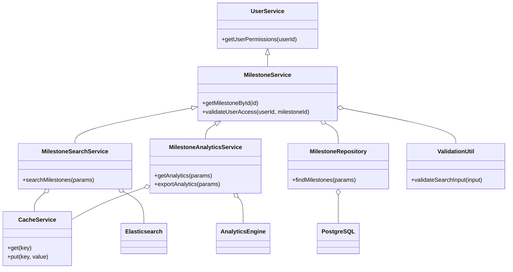
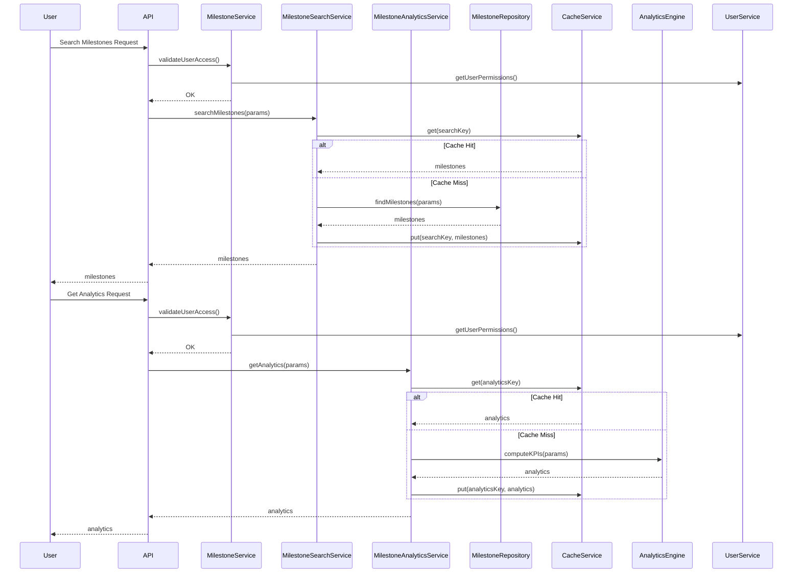
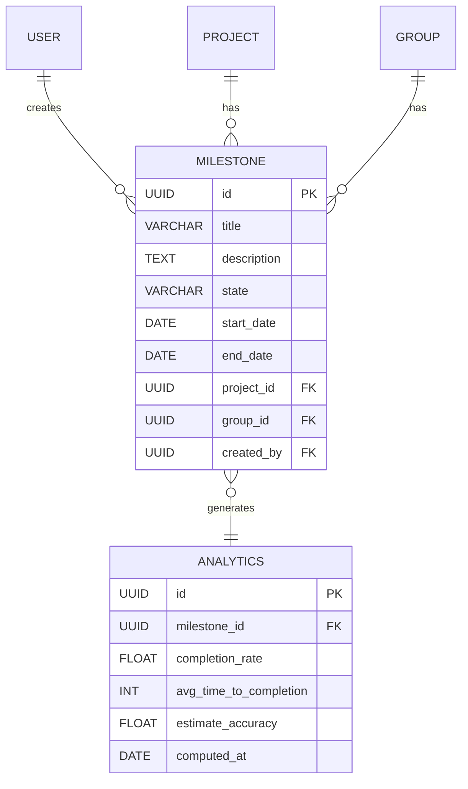

# Low-Level Design (LLD) for SCRUM-75: Search and Filter Milestones & Milestone Analytics

## 1. Objective
This document details the low-level design for two user stories: Search and Filter Milestones, and Milestone Analytics, as part of the GitLab application server. The goal is to enable project managers and leaders to efficiently search, filter, and analyze milestones across projects and groups. The design consolidates requirements for RESTful and GraphQL APIs, analytics dashboards, and robust validations, ensuring performance, security, and scalability. All logic, models, services, and integrations are unified for a production-ready implementation.

## 2. API Model

### 2.1 Common Components/Services
- **MilestoneService**: Business logic for milestone operations
- **MilestoneRepository**: Data access for milestones (PostgreSQL)
- **MilestoneSearchService**: Handles search/filter logic, integrates with Elasticsearch (if enabled)
- **MilestoneAnalyticsService**: Computes analytics and KPIs
- **UserService**: Manages user permissions and authentication
- **CacheService**: Caches frequent searches and analytics
- **ValidationUtil**: Input validation and sanitization

### 2.2 API Details
| Operation                         | REST Method | Type    | URL                                         | Request JSON                                                                                 | Response JSON                                                                                 |
|-----------------------------------|-------------|---------|----------------------------------------------|----------------------------------------------------------------------------------------------|----------------------------------------------------------------------------------------------|
| Search Milestones                 | GET         | Success | /api/milestones/search                      | { "query": "string", "state": "active|closed", "dateRange": {"from": "yyyy-mm-dd", "to": "yyyy-mm-dd"}, "projectId": "UUID", "groupId": "UUID", "personal": true, "page": 1, "size": 20, "sort": "field,asc|desc" } | { "milestones": [ {"id": "UUID", "title": "string", "description": "string", "state": "active|closed", "startDate": "yyyy-mm-dd", "endDate": "yyyy-mm-dd", "projectId": "UUID", "groupId": "UUID" } ], "total": 100 } |
| Search Milestones                 | GET         | Failure | /api/milestones/search                      | -                                                                                        | { "error": "Invalid input" }                                                               |
| Milestone Analytics Dashboard     | GET         | Success | /api/milestones/analytics                   | { "projectId": "UUID", "groupId": "UUID", "dateRange": {"from": "yyyy-mm-dd", "to": "yyyy-mm-dd"} } | { "completionRate": 0.85, "avgTimeToCompletion": 12, "estimateAccuracy": 0.9, "trend": [ ... ], "metrics": { ... } } |
| Milestone Analytics Dashboard     | GET         | Failure | /api/milestones/analytics                   | -                                                                                        | { "error": "Permission denied" }                                                           |
| Export Analytics Data             | POST        | Success | /api/milestones/analytics/export            | { "format": "csv|xlsx", "projectId": "UUID", "groupId": "UUID", "dateRange": {"from": "yyyy-mm-dd", "to": "yyyy-mm-dd"} } | { "downloadUrl": "https://.../export.csv" }                                               |
| Export Analytics Data             | POST        | Failure | /api/milestones/analytics/export            | -                                                                                        | { "error": "Export failed" }                                                               |

### 2.3 Exceptions
- **InvalidSearchInputException**: Raised when search/filter input is invalid or unsafe
- **PermissionDeniedException**: User lacks permission to view milestones or analytics
- **MilestoneNotFoundException**: No milestones found for given criteria
- **AnalyticsComputationException**: Error during analytics calculation
- **ExportFailedException**: Data export failed (e.g., file system error)

## 3. Functional Design

### 3.1 Class Diagram

### 3.2 UML Sequence Diagram

### 3.3 Components
| Component                | Purpose                                        | New/Existing |
|--------------------------|------------------------------------------------|--------------|
| MilestoneService         | Milestone business logic                       | Existing     |
| MilestoneRepository      | Data access for milestones                     | Existing     |
| MilestoneSearchService   | Search/filter logic, Elasticsearch integration | New          |
| MilestoneAnalyticsService| Analytics computation and export               | New          |
| UserService              | User permission/role management                | Existing     |
| CacheService             | Caching for search and analytics               | New          |
| ValidationUtil           | Input validation                               | Existing     |
| AnalyticsEngine          | KPI/trend computation                          | New          |

### 3.4 Service Layer Logic and Validations
| FieldName        | Validation                                    | ErrorMessage                        | ClassUsed                |
|------------------|-----------------------------------------------|-------------------------------------|--------------------------|
| query            | No SQL injection, XSS, or reserved keywords   | Invalid search input                | ValidationUtil           |
| state            | Must be 'active' or 'closed'                  | Invalid milestone state             | ValidationUtil           |
| dateRange        | Valid date format, from <= to                 | Invalid date range                  | ValidationUtil           |
| projectId/groupId| Must exist and user must have access          | Permission denied                   | MilestoneService         |
| personal         | Boolean                                       | Invalid personal flag               | ValidationUtil           |
| page/size        | Positive integers, reasonable max             | Invalid pagination parameters       | ValidationUtil           |
| sort             | Allowed fields only                           | Invalid sort field                  | ValidationUtil           |
| export format    | Must be csv or xlsx                           | Invalid export format               | ValidationUtil           |
| analytics params | User must have analytics access               | Permission denied                   | MilestoneAnalyticsService|

## 4. Integrations
| SystemToBeIntegrated | IntegratedFor     | IntegrationType |
|----------------------|-------------------|-----------------|
| PostgreSQL           | Milestone storage | DB              |
| Elasticsearch        | Search indexing   | API             |
| AnalyticsEngine      | KPI computation   | Internal API    |
| Grafana/D3.js        | Analytics display | Visualization   |
| Cache (Redis/Ehcache)| Search/analytics  | Cache           |

## 5. DB Details

### 5.1 ER Model

### 5.2 DB Validations
- **Milestone.state**: CHECK (state IN ('active', 'closed'))
- **Milestone.title**: NOT NULL, length <= 255
- **Milestone.project_id/group_id**: FK constraints
- **Analytics.milestone_id**: FK constraint, unique per milestone per computed_at

## 6. Dependencies
- PostgreSQL database must be available and accessible
- Elasticsearch cluster (if search enabled)
- Analytics engine or service (internal or external)
- Cache system (Redis, Ehcache, etc.)
- User authentication and authorization service
- Frontend framework for dashboard (D3.js, Grafana, etc.)

## 7. Assumptions
- All users are authenticated via a central UserService
- Elasticsearch is optional; fallback to DB search if unavailable
- Analytics engine is available and can process required KPIs
- Caching is enabled for both search and analytics
- API follows RESTful conventions and uses JSON for data exchange
- Date fields are in ISO 8601 format (yyyy-mm-dd)
- Only authorized users can access milestone data and analytics

---

**Absolute Path:** `/app/7c381f72-f2df-4ac5-aaad-6edb3bc38d21/Generated_LLD.md`
