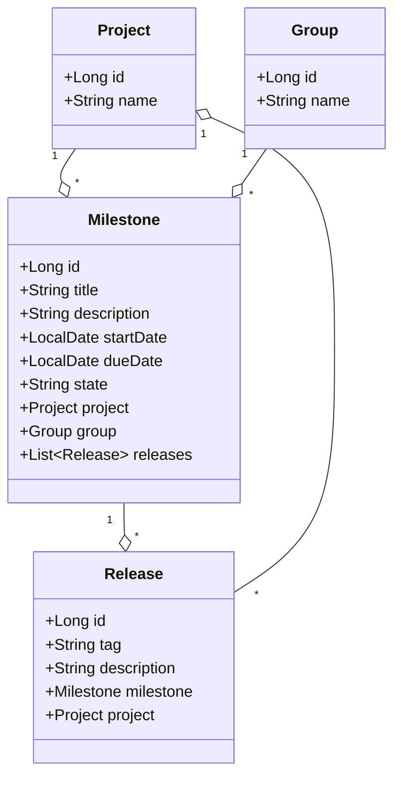
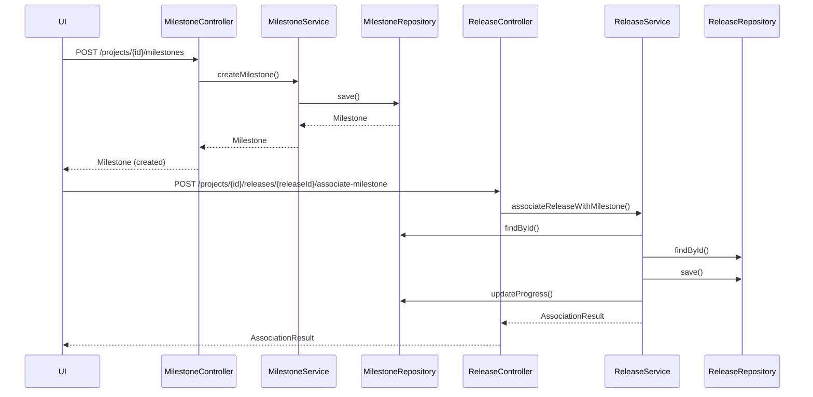
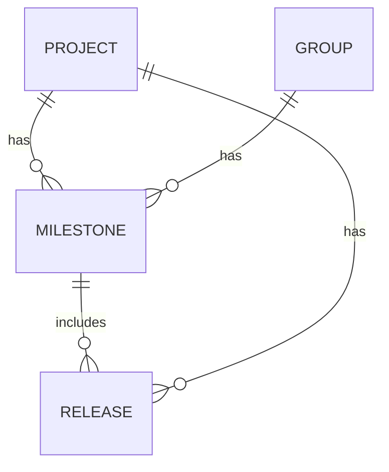

# Jira Story Details

## Summary
Create a milestone and associate release with milestone

## Description
**Story 1: Create a Milestone**

**Summary:** As a project manager, I want to create a milestone for my project or group, so that I can track progress towards specific goals.

**Description:**
The user should be able to create a new milestone with a unique title within a project or group. The milestone should have fields for description, start date, and due date.

**Technical Context:**
- System: GitLab application server
- Database: PostgreSQL
- Model: Milestone

**Acceptance Criteria:**
- User can create a milestone with a title, description, start date, and due date
- The milestone title must be unique within the project or group
- The milestone is associated with either a project or a group
- The created milestone is stored in the PostgreSQL database

**Validations:**
- Milestone title must be unique within a project or group
- Start date must be before or equal to the due date

**Business Logic:**
- Set the milestone state to 'active' upon creation

**Non-Functional Requirements:**
- The creation process should complete within 2 seconds
- The system should handle concurrent milestone creations without data conflicts

---

**Story 2: Associate Release with Milestone**

**Summary:** As a developer, I want to associate a release with a milestone, so that I can track which features are included in each release.

**Description:**
The user should be able to link a release to an existing milestone. This association helps in tracking which features and fixes are included in each release.

**Technical Context:**
- System: GitLab application server
- Database: PostgreSQL
- Models: Milestone, Release
- API: RESTful and GraphQL

**Acceptance Criteria:**
- User can associate a release with a milestone through the UI or API
- The association is correctly stored in the database
- The association is visible in both the milestone and release views

**Validations:**
- Release tag must be unique within a project
- A release can only be associated with one milestone at a time

**Business Logic:**
- Update the milestone's progress when a release is associated

**Non-Functional Requirements:**
- The association process should be atomic to prevent partial updates
- The system should handle high concurrency during release periods

## Status
To Do

----------

# Low-Level Design (LLD): Milestone Creation & Release Association

## 1. Objective
This document details the low-level design for implementing two key features in the GitLab application server: (1) the creation of milestones within a project or group, and (2) the association of releases with milestones. The goal is to enable project managers and developers to track progress and feature inclusion efficiently. The design ensures unique milestone titles within a project/group, atomic associations, and robust validation and concurrency handling, following Spring Boot best practices.

## 2. API Model

### 2.1 Common Components/Services
- **MilestoneService**: Handles business logic for milestone creation and management.
- **ReleaseService**: Manages release creation and associations.
- **MilestoneRepository**: Data access for milestones.
- **ReleaseRepository**: Data access for releases.
- **ProjectService/GroupService**: For project/group context validation.
- **ValidationUtils**: Utility for common validation logic.

### 2.2 API Details
| Operation                      | REST Method | Type    | URL                                    | Request JSON                                                                                                  | Response JSON                                                                                           |
|-------------------------------|-------------|---------|----------------------------------------|--------------------------------------------------------------------------------------------------------------|---------------------------------------------------------------------------------------------------------|
| Create Milestone               | POST        | Success | /api/v1/projects/{projectId}/milestones | {"title": "string", "description": "string", "startDate": "yyyy-MM-dd", "dueDate": "yyyy-MM-dd"}         | {"id": 1, "title": "string", "description": "string", "startDate": "yyyy-MM-dd", "dueDate": "yyyy-MM-dd", "state": "active"} |
| Create Milestone (Group)       | POST        | Success | /api/v1/groups/{groupId}/milestones     | {"title": "string", "description": "string", "startDate": "yyyy-MM-dd", "dueDate": "yyyy-MM-dd"}         | {"id": 1, "title": "string", "description": "string", "startDate": "yyyy-MM-dd", "dueDate": "yyyy-MM-dd", "state": "active"} |
| Associate Release with Milestone| POST        | Success | /api/v1/projects/{projectId}/releases/{releaseId}/associate-milestone | {"milestoneId": 1} | {"releaseId": 1, "milestoneId": 1, "status": "associated"} |
| Create Release                 | POST        | Success | /api/v1/projects/{projectId}/releases   | {"tag": "string", "description": "string"}                                                                  | {"id": 1, "tag": "string", "description": "string"}                                               |

#### Failure Responses (examples)
- 400 Bad Request: Validation errors (see Exceptions)
- 404 Not Found: Project/Group/Milestone/Release not found
- 409 Conflict: Duplicate milestone title or release tag

### 2.3 Exceptions
| Scenario                                      | Exception Name                | Message                                      |
|------------------------------------------------|-------------------------------|-----------------------------------------------|
| Duplicate milestone title within project/group  | MilestoneTitleExistsException | "Milestone title must be unique within the project/group." |
| Start date after due date                      | InvalidDateRangeException     | "Start date must be before or equal to due date." |
| Release tag duplicate within project           | ReleaseTagExistsException     | "Release tag must be unique within the project." |
| Release already associated with milestone      | ReleaseAlreadyLinkedException | "Release is already associated with a milestone." |
| Milestone/Release not found                    | EntityNotFoundException       | "Milestone or Release not found." |
| Association atomicity failure                  | AssociationAtomicityException | "Failed to associate release with milestone. Please retry." |

## 3. Functional Design

### 3.1 Class Diagram

### 3.2 UML Sequence Diagram

### 3.3 Components
| Component Name        | Purpose                                      | New/Existing |
|----------------------|----------------------------------------------|--------------|
| MilestoneService     | Business logic for milestones                 | New          |
| ReleaseService       | Business logic for releases                   | New          |
| MilestoneRepository  | Data access for milestones                    | New          |
| ReleaseRepository    | Data access for releases                      | New          |
| ValidationUtils      | Common validation logic                       | New          |
| ProjectService       | Project context validation                    | Existing     |
| GroupService         | Group context validation                      | Existing     |

### 3.4 Service Layer Logic and Validations
| FieldName    | Validation                                      | ErrorMessage                                            | ClassUsed                |
|--------------|-------------------------------------------------|--------------------------------------------------------|--------------------------|
| title        | Unique within project/group                      | "Milestone title must be unique within the project/group." | MilestoneService         |
| startDate    | startDate <= dueDate                            | "Start date must be before or equal to due date."      | MilestoneService         |
| tag          | Unique within project                            | "Release tag must be unique within the project."       | ReleaseService           |
| milestoneId  | Must exist                                      | "Milestone not found."                                 | ReleaseService           |
| releaseId    | Must exist                                      | "Release not found."                                   | ReleaseService           |
| releaseId    | Only one milestone per release                   | "Release is already associated with a milestone."      | ReleaseService           |

## 4. Integrations
| SystemToBeIntegrated | IntegratedFor                 | IntegrationType |
|---------------------|-------------------------------|-----------------|
| PostgreSQL          | Milestone & Release persistence| DB              |
| GitLab UI           | Milestone/Release management   | REST API        |
| GitLab UI           | Milestone/Release management   | GraphQL API     |

## 5. DB Details

### 5.1 ER Model

### 5.2 DB Validations
- **Milestone**: (project_id, title) or (group_id, title) must be unique (unique constraint)
- **Milestone**: start_date <= due_date (application-level validation, can be enforced by trigger)
- **Release**: (project_id, tag) must be unique (unique constraint)
- **Release**: milestone_id is nullable, but if present, must reference a valid milestone

## 6. Dependencies
- Spring Boot (REST, Data JPA)
- PostgreSQL
- GitLab application server core modules
- Project and Group domain models

## 7. Assumptions
- A milestone can belong to either a project or a group, not both simultaneously.
- Release association is always project-scoped.
- All date fields use ISO format (yyyy-MM-dd).
- Only one milestone can be associated with a release at a time.
- Concurrency is handled at the DB level (unique constraints, transactions).
- User authentication and authorization are handled by existing GitLab mechanisms.

---

**Absolute Path:** /workspace/LLD_For_Create_Milestone_and_Associate_Release.md
