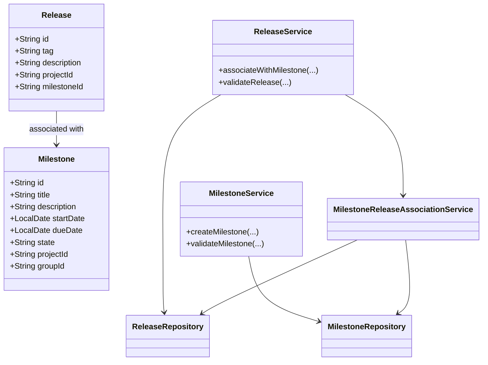
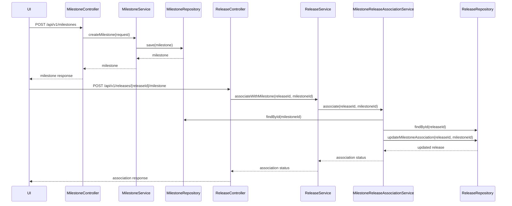
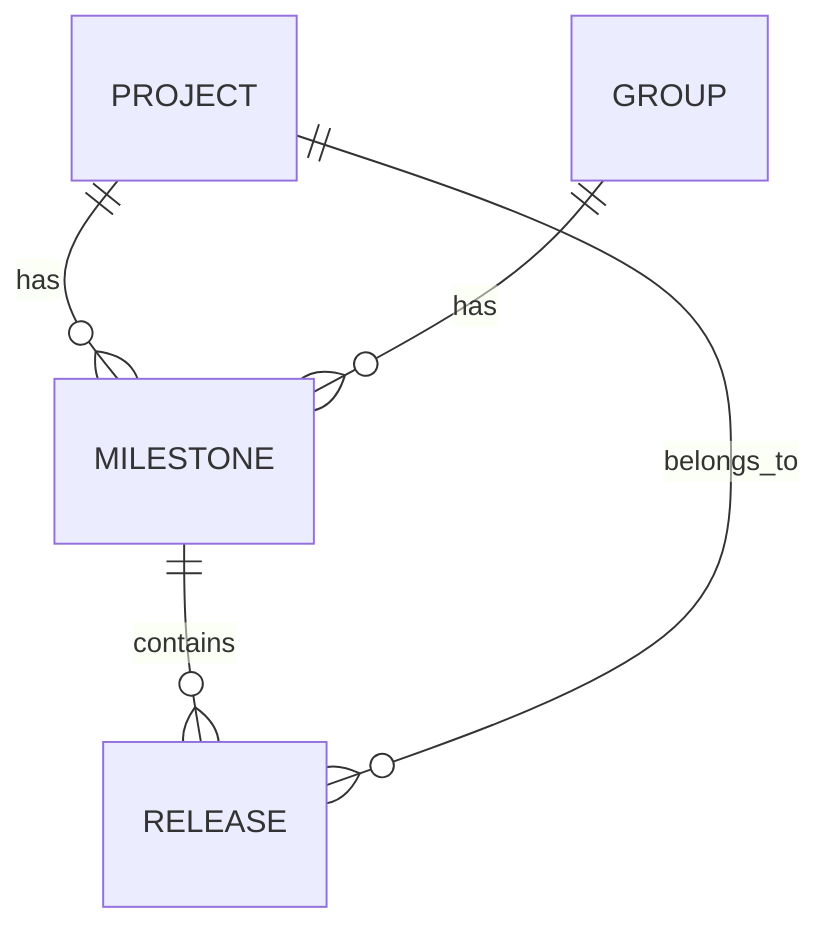

# Low-Level Design (LLD): Milestone Creation and Release Association

## 1. Objective
This document details the low-level design for two user stories: (1) enabling project managers to create milestones within a project or group, and (2) allowing developers to associate releases with milestones. The goal is to provide a unified, production-ready design that supports milestone tracking and release association, ensuring data integrity, high concurrency, and seamless integration with the GitLab application server. The design leverages Spring Boot best practices and targets a PostgreSQL backend.

## 2. API Model

### 2.1 Common Components/Services
- **MilestoneService**: Handles business logic for milestone creation and management.
- **ReleaseService**: Manages release creation and association with milestones.
- **MilestoneRepository**: Data access layer for milestones.
- **ReleaseRepository**: Data access layer for releases.
- **MilestoneReleaseAssociationService**: Manages linking releases to milestones.
- **ValidationUtils**: Shared validation logic for input data.

### 2.2 API Details

| Operation                        | REST Method | Type     | URL                                   | Request JSON                                                                                         | Response JSON                                                                                          |
|----------------------------------|-------------|----------|---------------------------------------|------------------------------------------------------------------------------------------------------|--------------------------------------------------------------------------------------------------------|
| Create Milestone                 | POST        | Success  | /api/v1/milestones                    | {"title": "string", "description": "string", "startDate": "yyyy-MM-dd", "dueDate": "yyyy-MM-dd", "projectId": "string", "groupId": "string"} | {"id": "string", "title": "string", "description": "string", "startDate": "yyyy-MM-dd", "dueDate": "yyyy-MM-dd", "state": "active"} |
| Create Milestone                 | POST        | Failure  | /api/v1/milestones                    | { ... }                                                                                              | {"error": "Milestone title must be unique within project/group"}                                    |
| Associate Release with Milestone | POST        | Success  | /api/v1/releases/{releaseId}/milestone | {"milestoneId": "string"}                                                                         | {"releaseId": "string", "milestoneId": "string", "status": "associated"}                        |
| Associate Release with Milestone | POST        | Failure  | /api/v1/releases/{releaseId}/milestone | { ... }                                                                                              | {"error": "Release tag must be unique within project"}                                              |

### 2.3 Exceptions
- **DuplicateMilestoneTitleException**: Thrown when a milestone title is not unique within a project/group.
- **InvalidDateRangeException**: Thrown when the start date is after the due date.
- **ReleaseTagNotUniqueException**: Thrown if a release tag is not unique within a project.
- **MilestoneNotFoundException**: Thrown when a milestone is not found for association.
- **ReleaseAlreadyAssociatedException**: Thrown if a release is already linked to a milestone.
- **DatabaseConcurrencyException**: Thrown on concurrent update conflicts.

## 3. Functional Design

### 3.1 Class Diagram

### 3.2 UML Sequence Diagram

### 3.3 Components
| Component Name                        | Purpose                                         | New/Existing |
|---------------------------------------|-------------------------------------------------|--------------|
| MilestoneService                      | Business logic for milestones                   | New          |
| ReleaseService                        | Business logic for releases                     | New          |
| MilestoneRepository                   | Data access for milestones                      | New          |
| ReleaseRepository                     | Data access for releases                        | New          |
| MilestoneReleaseAssociationService    | Handles release-milestone associations          | New          |
| ValidationUtils                       | Shared validation logic                         | New          |

### 3.4 Service Layer Logic and Validations
| FieldName      | Validation                                       | ErrorMessage                                      | ClassUsed                        |
|---------------|--------------------------------------------------|---------------------------------------------------|----------------------------------|
| title         | Unique within project/group                       | Milestone title must be unique within project/group| MilestoneService                 |
| startDate     | startDate <= dueDate                              | Start date must be before or equal to due date     | MilestoneService                 |
| tag           | Unique within project                             | Release tag must be unique within project          | ReleaseService                   |
| milestoneId   | Exists in DB                                     | Milestone not found                               | MilestoneReleaseAssociationService|
| releaseId     | Exists in DB                                     | Release not found                                 | MilestoneReleaseAssociationService|
| releaseId     | Not already associated with another milestone     | Release already associated with a milestone        | MilestoneReleaseAssociationService|

## 4. Integrations
| SystemToBeIntegrated | IntegratedFor           | IntegrationType |
|---------------------|------------------------|-----------------|
| PostgreSQL          | Milestone storage       | DB              |
| PostgreSQL          | Release storage         | DB              |
| GitLab UI           | Milestone management    | API             |
| GitLab UI           | Release association     | API             |

## 5. DB Details

### 5.1 ER Model

### 5.2 DB Validations
- **Milestone.title**: Unique constraint on (project_id, title) and (group_id, title)
- **Milestone.start_date, Milestone.due_date**: Check constraint (start_date <= due_date)
- **Release.tag**: Unique constraint on (project_id, tag)
- **Release.milestone_id**: Foreign key constraint referencing Milestone(id), nullable, one-to-one association

## 6. Dependencies
- Spring Boot Framework
- PostgreSQL Database
- GitLab application server
- JPA/Hibernate for ORM

## 7. Assumptions
- Each milestone is associated with either a project or a group, not both simultaneously.
- Release can only be associated with one milestone at a time.
- API endpoints are secured and authenticated via GitLab's existing security mechanisms.
- All date fields are in ISO 8601 format (yyyy-MM-dd).
- Concurrency is managed at the database level using transactions and unique constraints.
- The system is deployed in an environment with high availability and proper backup mechanisms.
