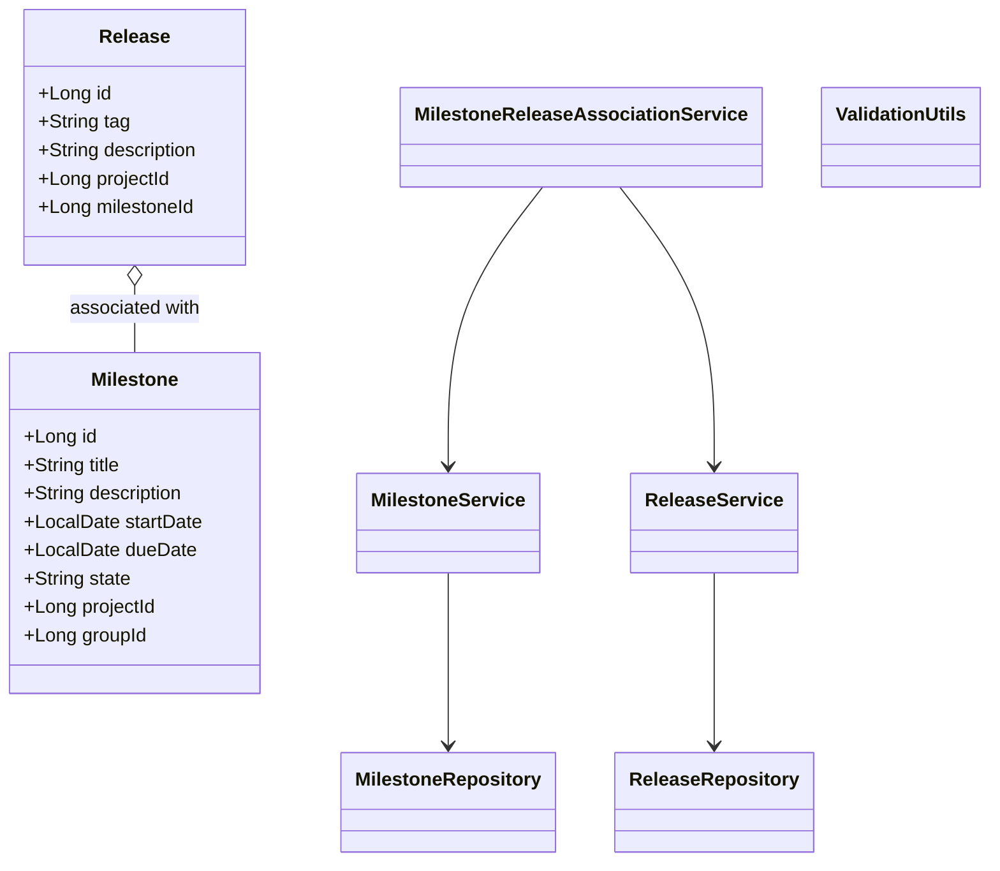
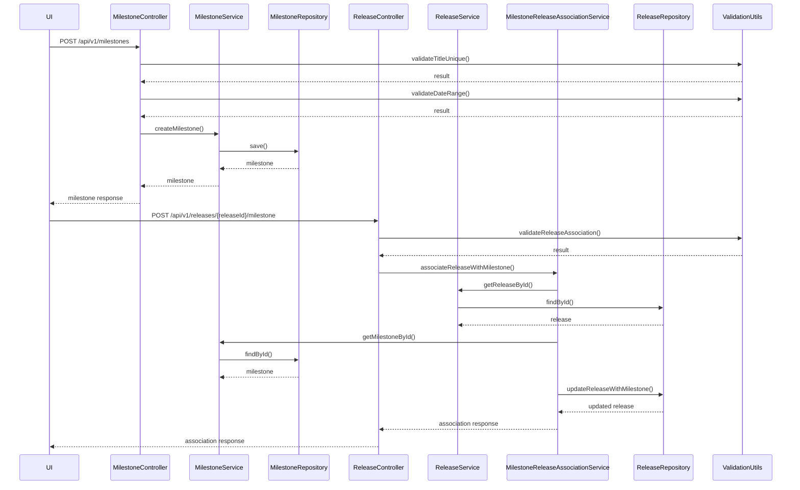
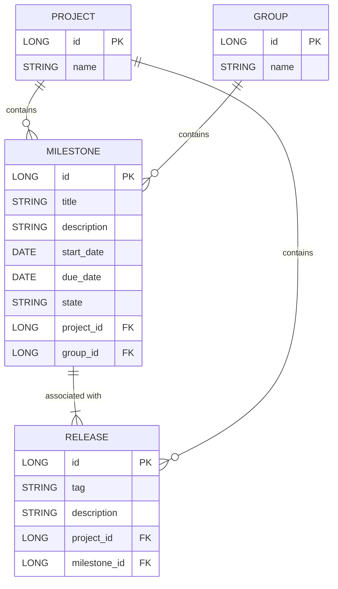

# Low-Level Design (LLD) Document: Milestone Creation & Release Association

## 1. Objective
This document details the low-level design for implementing two key features in the GitLab application server: (1) enabling project managers to create milestones within projects or groups, and (2) allowing developers to associate releases with milestones. The design ensures unique milestone titles within their scope, robust association between releases and milestones, and atomic, concurrent-safe operations. All APIs, models, validations, and integrations are consolidated to support a production-ready, scalable solution.

## 2. API Model

### 2.1 Common Components/Services
- **MilestoneService**: Handles creation and management of milestones.
- **ReleaseService**: Handles creation and management of releases.
- **MilestoneRepository**: Data access for milestones.
- **ReleaseRepository**: Data access for releases.
- **MilestoneReleaseAssociationService**: Manages linking releases to milestones.
- **ValidationUtils**: Utility for common validation logic.

### 2.2 API Details
| Operation                        | REST Method | Type     | URL                                      | Request JSON                                                                 | Response JSON                                                                |
|----------------------------------|-------------|----------|------------------------------------------|------------------------------------------------------------------------------|------------------------------------------------------------------------------|
| Create Milestone                 | POST        | Success  | /api/v1/milestones                       | {"title": "string", "description": "string", "startDate": "yyyy-MM-dd", "dueDate": "yyyy-MM-dd", "projectId": "long", "groupId": "long"} | {"id": "long", "title": "string", "state": "active", "description": "string", "startDate": "yyyy-MM-dd", "dueDate": "yyyy-MM-dd", "projectId": "long", "groupId": "long"} |
| Create Milestone                 | POST        | Failure  | /api/v1/milestones                       | { ... }                                                                      | {"error": "Milestone title must be unique within project/group"}           |
| Associate Release with Milestone | POST        | Success  | /api/v1/releases/{releaseId}/milestone    | {"milestoneId": "long"}                                                  | {"releaseId": "long", "milestoneId": "long", "status": "associated"} |
| Associate Release with Milestone | POST        | Failure  | /api/v1/releases/{releaseId}/milestone    | { ... }                                                                      | {"error": "Release can only be associated with one milestone at a time"}   |

### 2.3 Exceptions
- **MilestoneTitleNotUniqueException**: Thrown when a milestone title is not unique within its scope.
- **InvalidDateRangeException**: Thrown if start date is after due date.
- **ReleaseTagNotUniqueException**: Thrown when a release tag is not unique within a project.
- **ReleaseAlreadyAssociatedException**: Thrown if a release is already linked to a milestone.
- **MilestoneOrReleaseNotFoundException**: Thrown if referenced milestone or release does not exist.
- **DatabaseConcurrencyException**: Thrown on concurrent update conflicts.

## 3. Functional Design

### 3.1 Class Diagram

### 3.2 UML Sequence Diagram

### 3.3 Components
| Component Name                      | Purpose                                         | New/Existing |
|-------------------------------------|-------------------------------------------------|--------------|
| MilestoneService                    | Business logic for milestones                   | New          |
| ReleaseService                      | Business logic for releases                     | Existing     |
| MilestoneRepository                 | Data access for milestones                      | New          |
| ReleaseRepository                   | Data access for releases                        | Existing     |
| MilestoneReleaseAssociationService  | Handles linking releases to milestones          | New          |
| ValidationUtils                     | Common validation logic                         | New          |
| MilestoneController                 | REST API for milestones                         | New          |
| ReleaseController                   | REST API for releases and associations          | Existing     |

### 3.4 Service Layer Logic and Validations
| FieldName         | Validation                                        | ErrorMessage                                         | ClassUsed                        |
|-------------------|--------------------------------------------------|------------------------------------------------------|-----------------------------------|
| title             | Unique within project/group                       | Milestone title must be unique within project/group   | ValidationUtils, MilestoneService |
| startDate, dueDate| startDate <= dueDate                              | Start date must be before or equal to due date        | ValidationUtils                   |
| tag (release)     | Unique within project                             | Release tag must be unique within project             | ValidationUtils, ReleaseService   |
| milestoneId       | Exists                                           | Milestone not found                                  | MilestoneService                  |
| releaseId         | Exists                                           | Release not found                                    | ReleaseService                    |
| releaseId         | Only one milestone association at a time         | Release can only be associated with one milestone     | ValidationUtils                   |

## 4. Integrations
| SystemToBeIntegrated | IntegratedFor                | IntegrationType |
|----------------------|------------------------------|-----------------|
| PostgreSQL           | Persisting milestones        | DB              |
| PostgreSQL           | Persisting releases          | DB              |
| PostgreSQL           | Milestone-release association| DB              |
| GitLab UI            | Milestone and release views  | API             |
| GraphQL API          | Querying milestones/releases | API             |

## 5. DB Details

### 5.1 ER Model

### 5.2 DB Validations
- **Milestone.title**: Unique constraint on (project_id, title) and (group_id, title)
- **Milestone.start_date <= Milestone.due_date**: Enforced at application layer
- **Release.tag**: Unique constraint on (project_id, tag)
- **Release.milestone_id**: Nullable, but if set, must reference an existing milestone
- **Release**: Only one milestone association allowed per release (enforced at application and DB layer)

## 6. Dependencies
- Spring Boot 2.x/3.x
- Spring Data JPA
- PostgreSQL 12+
- GitLab UI (for front-end integration)
- GraphQL API (for advanced queries)

## 7. Assumptions
- Each milestone is associated with either a project or a group, not both simultaneously.
- Release tags are unique within their project scope.
- A release can only be associated with one milestone at a time.
- All date and time fields are in UTC.
- The system is deployed in a horizontally scalable environment, so all uniqueness and atomicity constraints are enforced both at the application and DB level.
- All APIs follow RESTful conventions and return standard HTTP status codes.
- Existing Release model and APIs are already present and will be extended for milestone association.

---

**End of Document**
