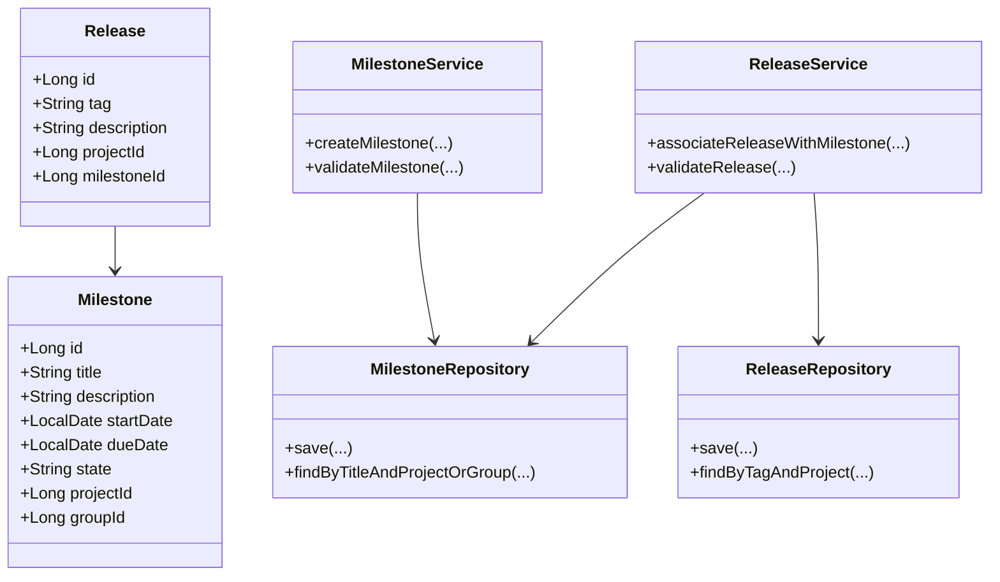
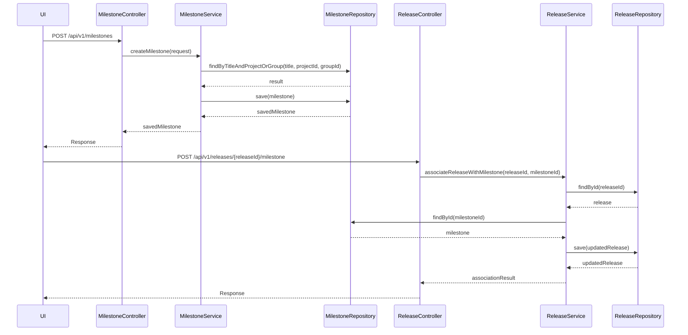
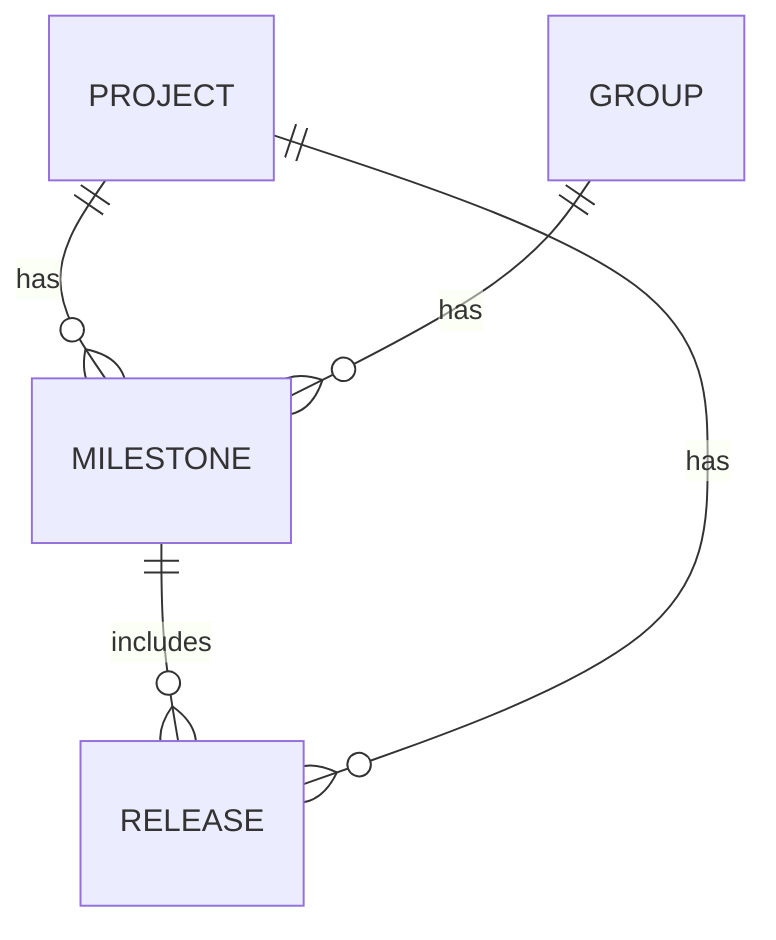

# Low-Level Design (LLD) Document for SCRUM-59: Milestone Creation and Release Association

## 1. Objective
The goal of this requirement is to enable project managers and developers to efficiently create milestones within a project or group and associate releases with these milestones in the GitLab application. This allows for effective tracking of project progress and feature inclusion in releases. The design ensures data integrity, enforces business rules, and provides robust API endpoints for both UI and programmatic access. The system is optimized for concurrency and performance, ensuring atomic operations and preventing data conflicts.

## 2. API Model

### 2.1 Common Components/Services
- **MilestoneService**: Handles business logic for milestone creation and management.
- **ReleaseService**: Manages release creation and association with milestones.
- **MilestoneRepository**: Data access layer for milestones.
- **ReleaseRepository**: Data access layer for releases.
- **ValidationUtils**: Utility for common validation logic.
- **ExceptionHandler**: Centralized handler for custom/business exceptions.

### 2.2 API Details

| Operation                        | REST Method | Type     | URL                                      | Request JSON                                                                                          | Response JSON                                                                                   |
|----------------------------------|-------------|----------|------------------------------------------|------------------------------------------------------------------------------------------------------|--------------------------------------------------------------------------------------------------|
| Create Milestone                 | POST        | Success  | /api/v1/milestones                       | { "title": "string", "description": "string", "startDate": "yyyy-MM-dd", "dueDate": "yyyy-MM-dd", "projectId": "long", "groupId": "long (optional)" } | { "id": "long", "title": "string", "description": "string", "startDate": "yyyy-MM-dd", "dueDate": "yyyy-MM-dd", "state": "active", "projectId": "long", "groupId": "long (optional)" } |
| Create Milestone                 | POST        | Failure  | /api/v1/milestones                       | (same as above)                                                                                      | { "error": "Milestone title must be unique within project/group" }                             |
| Associate Release with Milestone | POST        | Success  | /api/v1/releases/{releaseId}/milestone    | { "milestoneId": "long" }                                                                         | { "releaseId": "long", "milestoneId": "long", "status": "associated" }                      |
| Associate Release with Milestone | POST        | Failure  | /api/v1/releases/{releaseId}/milestone    | (same as above)                                                                                      | { "error": "Release already associated with a milestone" }                                      |

### 2.3 Exceptions
- **MilestoneTitleNotUniqueException**: Thrown when milestone title is not unique within project/group.
- **InvalidDateRangeException**: Thrown when start date is after due date.
- **ReleaseTagNotUniqueException**: Thrown when release tag is not unique within a project.
- **ReleaseAlreadyAssociatedException**: Thrown when a release is already linked to a milestone.
- **MilestoneNotFoundException**: Thrown when the specified milestone does not exist.
- **ProjectOrGroupNotFoundException**: Thrown when the specified project or group does not exist.

## 3. Functional Design

### 3.1 Class Diagram

### 3.2 UML Sequence Diagram

### 3.3 Components
| Component Name         | Purpose                                              | New/Existing |
|-----------------------|------------------------------------------------------|--------------|
| MilestoneService      | Business logic for milestones                        | New          |
| ReleaseService        | Business logic for releases                          | New          |
| MilestoneRepository   | Data access for milestones                           | New          |
| ReleaseRepository     | Data access for releases                             | New          |
| ValidationUtils       | Common validation logic                              | New          |
| ExceptionHandler      | Centralized exception handling                       | New          |
| MilestoneController   | REST API for milestone operations                    | New          |
| ReleaseController     | REST API for release operations                      | New          |

### 3.4 Service Layer Logic and Validations
| FieldName    | Validation                                         | ErrorMessage                                      | ClassUsed           |
|--------------|----------------------------------------------------|---------------------------------------------------|---------------------|
| title        | Unique within project/group                        | Milestone title must be unique within project/group| MilestoneService    |
| startDate    | startDate <= dueDate                               | Start date must be before or equal to due date     | MilestoneService    |
| tag          | Unique within project                              | Release tag must be unique within project          | ReleaseService      |
| milestoneId  | Must exist                                         | Milestone not found                               | ReleaseService      |
| releaseId    | Must exist                                         | Release not found                                 | ReleaseService      |
| releaseId    | Only one milestone association allowed             | Release already associated with a milestone        | ReleaseService      |

## 4. Integrations
| SystemToBeIntegrated | IntegratedFor                  | IntegrationType |
|---------------------|-------------------------------|-----------------|
| PostgreSQL          | Persist milestones and releases| DB              |
| GitLab UI           | Milestone and release management| API             |
| GraphQL API         | Query milestone/release data   | API             |

## 5. DB Details

### 5.1 ER Model

### 5.2 DB Validations
- **Milestone title**: Unique constraint on (title, project_id) and (title, group_id)
- **Release tag**: Unique constraint on (tag, project_id)
- **Milestone dates**: Check constraint to ensure start_date <= due_date
- **Release-milestone association**: Foreign key constraint on release.milestone_id referencing milestone.id; ensure one-to-one association

## 6. Dependencies
- Spring Boot 2.x/3.x
- PostgreSQL 12+
- Spring Data JPA
- GitLab application server
- GraphQL Java (for GraphQL API support)

## 7. Assumptions
- Either projectId or groupId is provided for milestone creation, not both.
- Milestone state is set to 'active' upon creation and may be updated later.
- Only one milestone can be associated with a release at any time.
- All date fields are in ISO-8601 format (yyyy-MM-dd).
- The system is responsible for handling concurrent requests and ensuring atomicity.
- UI and API clients are trusted to provide valid project/group/release IDs.
- Error messages are localized as needed by the frontend.
