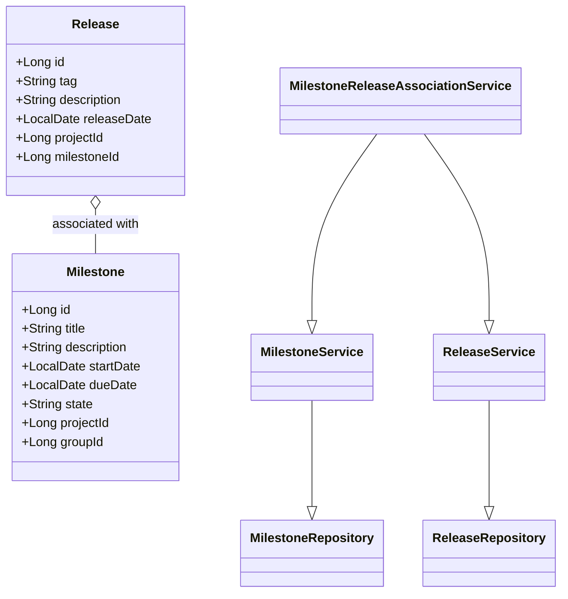
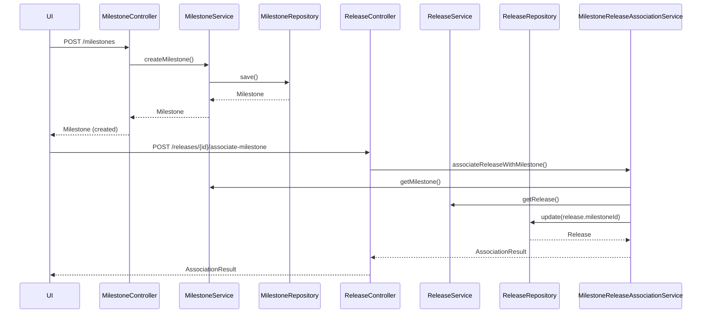
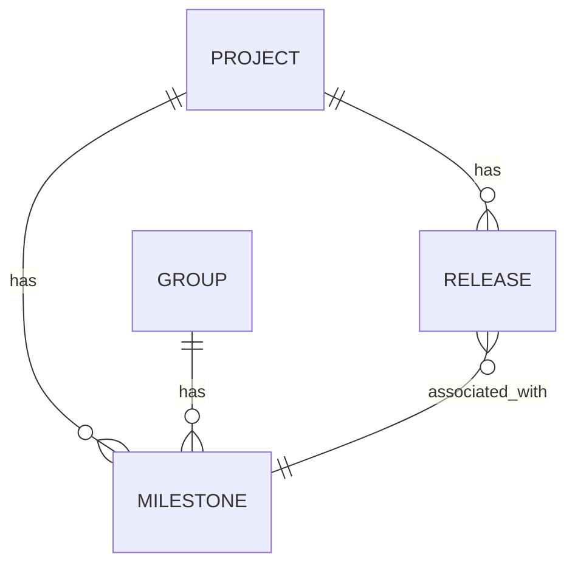

# Jira Story Details (SCRUM-59)

## Summary
Create a milestone and associate release with milestone

## Description
### Story 1: Create a Milestone
**Summary:**
As a project manager, I want to create a milestone for my project or group, so that I can track progress towards specific goals.

**Description:**
The user should be able to create a new milestone with a unique title within a project or group. The milestone should have fields for description, start date, and due date.

**Technical Context:**
- System: GitLab application server
- Database: PostgreSQL
- Model: Milestone

**Acceptance Criteria:**
- User can create a milestone with a title, description, start date, and due date
- The milestone title must be unique within the project or group
- The milestone is associated with either a project or a group
- The created milestone is stored in the PostgreSQL database

**Validations:**
- Milestone title must be unique within a project or group
- Start date must be before or equal to the due date

**Business Logic:**
- Set the milestone state to 'active' upon creation

**Non-Functional Requirements:**
- The creation process should complete within 2 seconds
- The system should handle concurrent milestone creations without data conflicts

---

### Story 2: Associate Release with Milestone
**Summary:**
As a developer, I want to associate a release with a milestone, so that I can track which features are included in each release.

**Description:**
The user should be able to link a release to an existing milestone. This association helps in tracking which features and fixes are included in each release.

**Technical Context:**
- System: GitLab application server
- Database: PostgreSQL
- Models: Milestone, Release
- API: RESTful and GraphQL

**Acceptance Criteria:**
- User can associate a release with a milestone through the UI or API
- The association is correctly stored in the database
- The association is visible in both the milestone and release views

**Validations:**
- Release tag must be unique within a project
- A release can only be associated with one milestone at a time

**Business Logic:**
- Update the milestone's progress when a release is associated

**Non-Functional Requirements:**
- The association process should be atomic to prevent partial updates
- The system should handle high concurrency during release periods

## Status
To Do

----------

# Low-Level Design (LLD) Document: Milestone and Release Association

## 1. Objective
This document outlines the low-level design for the implementation of two user stories: creating a milestone within a project or group, and associating a release with a milestone in the GitLab application server. The goal is to enable project managers to track progress via milestones and allow developers to link releases to these milestones for better traceability of features and fixes. The design ensures data integrity, concurrency handling, and adherence to business rules, while following Spring Boot best practices for a robust, scalable solution.

## 2. API Model
### 2.1 Common Components/Services
- **MilestoneService**: Handles business logic for milestones (creation, validation, association).
- **ReleaseService**: Manages releases and their association with milestones.
- **MilestoneRepository**: Data access for milestones.
- **ReleaseRepository**: Data access for releases.
- **MilestoneReleaseAssociationService**: Manages linking releases to milestones.
- **ValidationUtils**: Shared validation logic.
- **ExceptionHandler**: Centralized error handling for API responses.

### 2.2 API Details
| Operation                        | REST Method | Type     | URL                                   | Request JSON                                                                                           | Response JSON                                                                                 |
|----------------------------------|-------------|----------|---------------------------------------|--------------------------------------------------------------------------------------------------------|-----------------------------------------------------------------------------------------------|
| Create Milestone                 | POST        | Success  | /api/v1/projects/{projectId}/milestones | { "title": "string", "description": "string", "startDate": "yyyy-MM-dd", "dueDate": "yyyy-MM-dd", "groupId": "optional" } | { "id": "long", "title": "string", "description": "string", "startDate": "yyyy-MM-dd", "dueDate": "yyyy-MM-dd", "state": "active", "projectId": "long", "groupId": "optional" } |
|                                  |             | Failure  |                                       |                                                                                                        | { "errorCode": "string", "errorMessage": "string" }                                       |
| Associate Release with Milestone | POST        | Success  | /api/v1/projects/{projectId}/releases/{releaseId}/associate-milestone | { "milestoneId": "long" }                                                                            | { "releaseId": "long", "milestoneId": "long", "status": "associated" }                |
|                                  |             | Failure  |                                       |                                                                                                        | { "errorCode": "string", "errorMessage": "string" }                                       |

### 2.3 Exceptions
- **MilestoneTitleNotUniqueException**: Thrown when a milestone title is not unique within a project/group.
- **InvalidDateRangeException**: Thrown when start date is after due date.
- **ReleaseTagNotUniqueException**: Thrown when a release tag is not unique within a project.
- **ReleaseAlreadyAssociatedException**: Thrown when trying to associate a release with more than one milestone.
- **MilestoneOrReleaseNotFoundException**: Thrown when a referenced milestone or release does not exist.
- **ConcurrentModificationException**: Thrown when concurrent updates cause a conflict.

## 3. Functional Design
### 3.1 Class Diagram

### 3.2 UML Sequence Diagram

### 3.3 Components
| Component Name                         | Purpose                                         | New/Existing |
|----------------------------------------|-------------------------------------------------|--------------|
| MilestoneService                       | Handles milestone business logic                | New          |
| ReleaseService                         | Handles release business logic                  | Existing     |
| MilestoneRepository                    | Data access for milestones                      | New          |
| ReleaseRepository                      | Data access for releases                        | Existing     |
| MilestoneReleaseAssociationService     | Manages release-milestone association           | New          |
| ValidationUtils                        | Shared validation logic                         | New          |
| ExceptionHandler                       | Centralized error handling                      | Existing     |

### 3.4 Service Layer Logic and Validations
| FieldName     | Validation                                      | ErrorMessage                                   | ClassUsed                        |
|---------------|-------------------------------------------------|------------------------------------------------|----------------------------------|
| title         | Unique within project/group                      | Milestone title must be unique                 | MilestoneService, ValidationUtils|
| startDate     | startDate <= dueDate                             | Start date must be before or equal to due date | MilestoneService, ValidationUtils|
| tag           | Unique within project                            | Release tag must be unique                     | ReleaseService, ValidationUtils  |
| milestoneId   | Exists before association                        | Milestone not found                            | MilestoneService                 |
| releaseId     | Exists before association                        | Release not found                              | ReleaseService                   |
| releaseId     | Not already associated with another milestone    | Release already associated                     | MilestoneReleaseAssociationService|

## 4. Integrations
| SystemToBeIntegrated | IntegratedFor               | IntegrationType |
|----------------------|-----------------------------|-----------------|
| PostgreSQL           | Persist milestones/releases | DB              |
| GitLab UI            | Milestone/release management| API             |
| GraphQL API          | Release-milestone queries   | API             |

## 5. DB Details
### 5.1 ER Model

### 5.2 DB Validations
- **Milestone.title**: Unique constraint within (project_id, group_id)
- **Milestone.start_date, Milestone.due_date**: Check constraint (start_date <= due_date)
- **Release.tag**: Unique constraint within project_id
- **Release.milestone_id**: Foreign key, nullable, only one milestone per release

## 6. Dependencies
- GitLab application server (Spring Boot)
- PostgreSQL database
- Existing Release management module
- Project and Group modules for entity references

## 7. Assumptions
- Milestone titles are only required to be unique within the same project or group, not globally.
- A release can only be associated with one milestone at a time, but a milestone can have multiple releases.
- All date fields use ISO 8601 format (yyyy-MM-dd).
- The system is responsible for handling concurrency at the database and service layer.
- The UI and API layers are responsible for input validation before calling the backend.
- All APIs are secured and authenticated.
