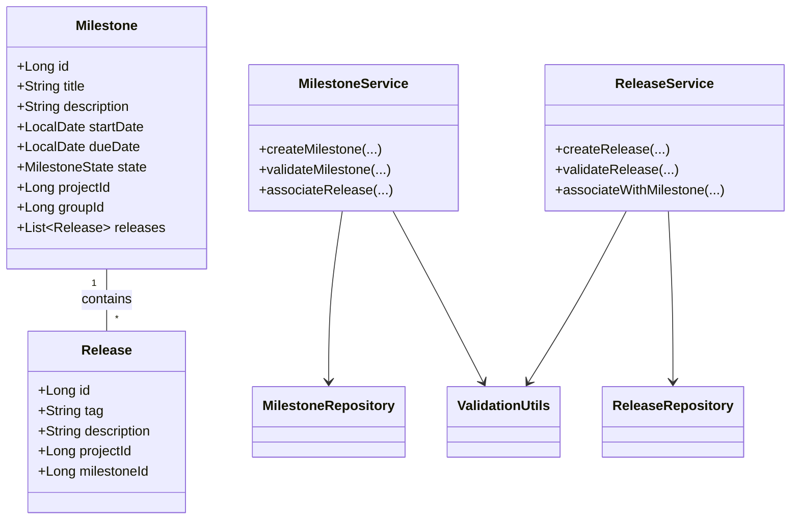
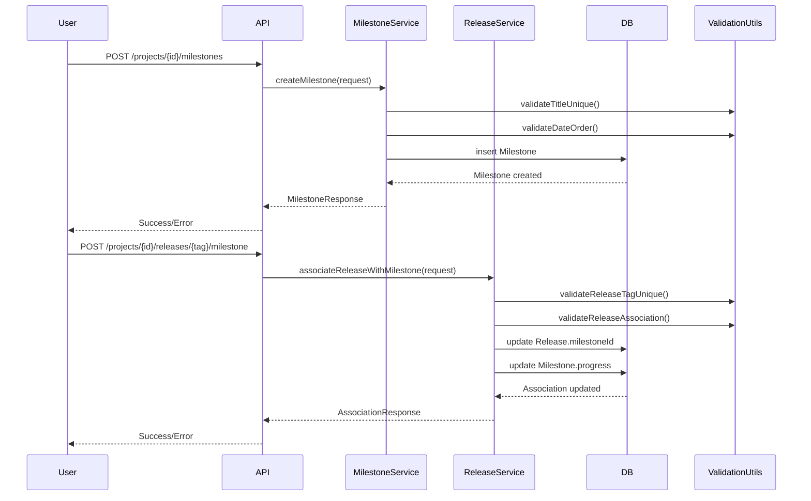
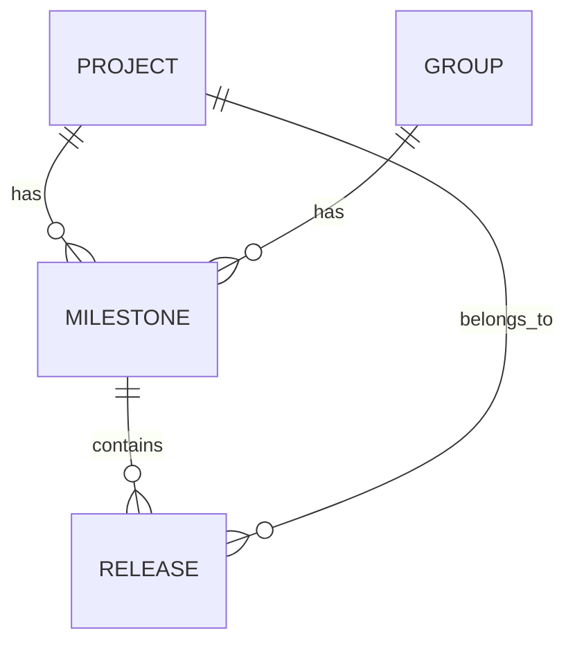

# Low-Level Design (LLD) for SCRUM-59: Create a Milestone and Associate Release with Milestone

## 1. Objective
This document describes the consolidated low-level design for the features enabling milestone creation and release association within the GitLab application server. The goal is to allow project managers to create milestones for projects or groups, and for developers to associate releases with these milestones. The design ensures robust validation, atomic operations, and high concurrency handling, supporting clear tracking of project progress and feature delivery. All APIs, models, and logic are unified for production-ready implementation in a Spring Boot/PostgreSQL environment.

## 2. API Model
### 2.1 Common Components/Services
- **MilestoneService**: Handles creation, validation, and management of milestones.
- **ReleaseService**: Handles release creation and association with milestones.
- **MilestoneRepository**: JPA repository for Milestone entity.
- **ReleaseRepository**: JPA repository for Release entity.
- **ValidationUtils**: Utility for common validation logic.
- **ExceptionHandler**: Global exception handler for API errors.
- **AuditLogger**: Logs creation and association events for audit purposes.

### 2.2 API Details
| Operation                       | REST Method | Type             | URL                                             | Request JSON                                                                                                 | Response JSON                                                                                       |
|----------------------------------|-------------|------------------|--------------------------------------------------|-------------------------------------------------------------------------------------------------------------|------------------------------------------------------------------------------------------------------|
| Create Milestone                | POST        | Success/Failure  | /projects/{id}/milestones                        | {"title": "string", "description": "string", "startDate": "yyyy-MM-dd", "dueDate": "yyyy-MM-dd"}         | {"id": int, "title": "string", "state": "active", ...} or error JSON                                  |
| Create Milestone (Group)        | POST        | Success/Failure  | /groups/{id}/milestones                          | {"title": "string", "description": "string", "startDate": "yyyy-MM-dd", "dueDate": "yyyy-MM-dd"}         | {"id": int, "title": "string", "state": "active", ...} or error JSON                                  |
| Associate Release with Milestone| POST        | Success/Failure  | /projects/{id}/releases/{tag}/milestone          | {"milestoneId": int}                                                                                       | {"releaseId": int, "milestoneId": int, ...} or error JSON                                         |
| Create Milestone (GraphQL)      | mutation    | Success/Failure  | mutation createMilestone                         | input: {title, description, startDate, dueDate, projectId/groupId}                                          | milestone object or error                                                                            |
| Associate Release (GraphQL)     | mutation    | Success/Failure  | mutation associateReleaseWithMilestone           | input: {releaseTag, milestoneId, projectId}                                                                 | release object or error                                                                              |

### 2.3 Exceptions
- **DuplicateMilestoneTitleException**: Raised when milestone title is not unique within project/group.
- **InvalidDateRangeException**: Raised when start date is after due date.
- **ReleaseTagNotUniqueException**: Raised when release tag is not unique within project.
- **ReleaseAlreadyAssociatedException**: Raised when a release is already linked to a milestone.
- **DatabaseException**: Raised for any DB operation failures.
- **ConcurrencyException**: Raised for concurrent update conflicts.

## 3. Functional Design
### 3.1 Class Diagram

### 3.2 UML Sequence Diagram

### 3.3 Components
| Component Name        | Purpose                                              | New/Existing |
|----------------------|------------------------------------------------------|--------------|
| MilestoneService     | Handles milestone creation and management            | New          |
| ReleaseService       | Handles release creation and milestone association   | New          |
| MilestoneRepository  | JPA repository for Milestone entity                  | New          |
| ReleaseRepository    | JPA repository for Release entity                    | New          |
| ValidationUtils      | Shared validation logic                              | New          |
| ExceptionHandler     | Global exception handling                            | New          |
| AuditLogger          | Logs audit events                                    | New          |

### 3.4 Service Layer Logic and Validations
| FieldName     | Validation                                   | ErrorMessage                                 | ClassUsed           |
|--------------|----------------------------------------------|----------------------------------------------|---------------------|
| title        | Unique within project/group                   | Milestone title must be unique               | MilestoneService    |
| startDate    | startDate <= dueDate                         | Start date must be before or equal to due date| MilestoneService    |
| tag          | Unique within project                        | Release tag must be unique                   | ReleaseService      |
| milestoneId  | Release can have only one milestone          | Release already associated with milestone    | ReleaseService      |

## 4. Integrations
| SystemToBeIntegrated | IntegratedFor                | IntegrationType |
|---------------------|------------------------------|-----------------|
| PostgreSQL          | Milestone/Release persistence| DB              |
| GitLab UI           | Milestone/Release management | REST/GraphQL    |
| Audit Logging       | Event logging                | API             |

## 5. DB Details
### 5.1 ER Model

### 5.2 DB Validations
- **Milestone.title**: Unique constraint within (project_id, group_id)
- **Milestone.start_date <= Milestone.due_date**: Enforced at application layer, optionally with DB check constraint
- **Release.tag**: Unique constraint within project_id
- **Release.milestone_id**: Foreign key to Milestone.id, nullable
- **Release.milestone_id**: One-to-one association enforced at application layer

## 6. Dependencies
- Spring Boot 2.x/3.x
- Spring Data JPA
- PostgreSQL 12+
- Spring Web (REST & GraphQL)
- Lombok (for model boilerplate)
- SLF4J/Logback (for logging)

## 7. Assumptions
- Milestones can belong to either a project or a group, not both simultaneously.
- Release can only be associated with one milestone at a time.
- All date fields are in ISO-8601 format (yyyy-MM-dd).
- API authentication and authorization are handled by upstream middleware.
- Concurrency is managed using DB-level constraints and optimistic locking where applicable.
- Non-functional requirements (performance, atomicity) are met via transaction management and proper indexing.

---

**End of Document**
