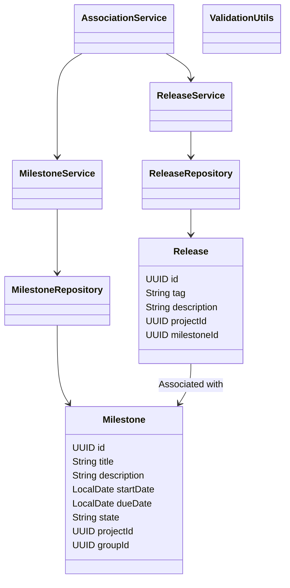
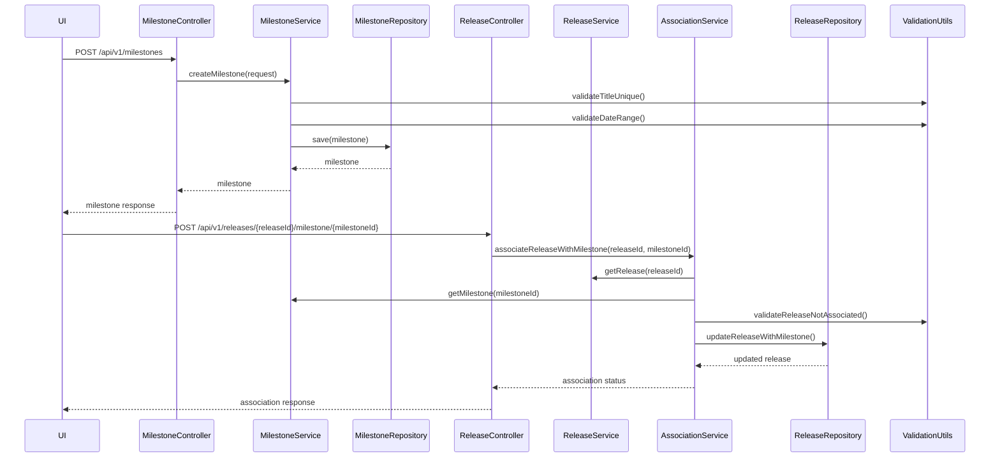
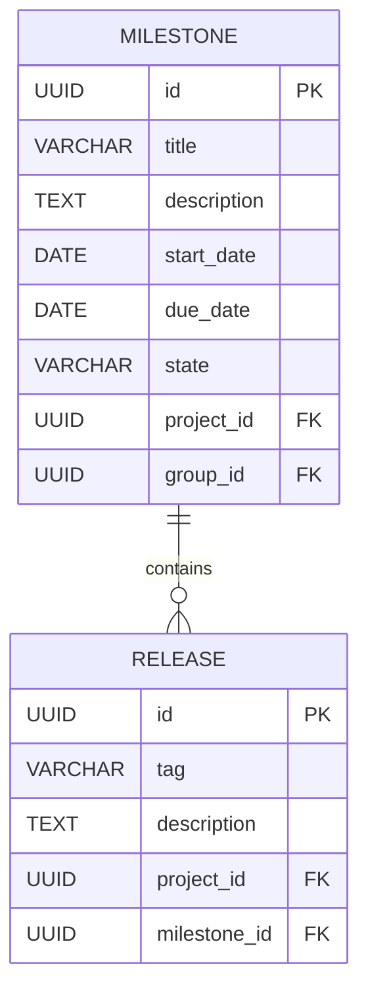

# Low-Level Design (LLD) Document: Milestone Creation and Release Association

## 1. Objective
This document describes the low-level design for implementing two user stories: (1) creating a milestone within a project or group, and (2) associating a release with a milestone in the GitLab application server. The goal is to enable project managers and developers to track project progress and feature inclusion efficiently. The design ensures data integrity, enforces business rules, and provides robust API endpoints for both functionalities. All logic is implemented following Spring Boot best practices and is ready for direct development.

## 2. API Model

### 2.1 Common Components/Services
- **MilestoneService**: Handles milestone creation, validation, and state management.
- **ReleaseService**: Manages release creation and association with milestones.
- **MilestoneRepository**: Data access for milestones.
- **ReleaseRepository**: Data access for releases.
- **AssociationService**: Handles linking releases to milestones.
- **ValidationUtils**: Shared validation logic.

### 2.2 API Details
| Operation                       | REST Method | Type     | URL                                         | Request JSON                                                                                      | Response JSON                                                                                     |
|----------------------------------|-------------|----------|----------------------------------------------|---------------------------------------------------------------------------------------------------|---------------------------------------------------------------------------------------------------|
| Create Milestone                | POST        | Success  | /api/v1/milestones                          | {"title": "string", "description": "string", "startDate": "yyyy-MM-dd", "dueDate": "yyyy-MM-dd", "projectId": "UUID", "groupId": "UUID"} | {"id": "UUID", "title": "string", "description": "string", "startDate": "yyyy-MM-dd", "dueDate": "yyyy-MM-dd", "state": "active", "projectId": "UUID", "groupId": "UUID"} |
| Create Milestone                | POST        | Failure  | /api/v1/milestones                          | (same as above)                                                                                   | {"error": "Milestone title must be unique within project or group"}                            |
| Associate Release with Milestone| POST        | Success  | /api/v1/releases/{releaseId}/milestone/{milestoneId} | N/A                                                                                              | {"releaseId": "UUID", "milestoneId": "UUID", "associationStatus": "success"}            |
| Associate Release with Milestone| POST        | Failure  | /api/v1/releases/{releaseId}/milestone/{milestoneId} | N/A                                                                                              | {"error": "Release already associated with a milestone"}                                       |

### 2.3 Exceptions
- **MilestoneTitleNotUniqueException**: Thrown when a milestone title is not unique within the project or group.
- **InvalidDateRangeException**: Thrown when the start date is after the due date.
- **ReleaseTagNotUniqueException**: Thrown when a release tag is not unique within a project.
- **ReleaseAlreadyAssociatedException**: Thrown when a release is already linked to a milestone.
- **MilestoneNotFoundException**: Thrown when the specified milestone does not exist.
- **ReleaseNotFoundException**: Thrown when the specified release does not exist.

## 3. Functional Design

### 3.1 Class Diagram

### 3.2 UML Sequence Diagram

### 3.3 Components
| Component Name      | Purpose                                         | New/Existing |
|---------------------|-------------------------------------------------|--------------|
| MilestoneService    | Business logic for milestones                   | New          |
| ReleaseService      | Business logic for releases                     | Existing     |
| AssociationService  | Logic for associating releases with milestones  | New          |
| MilestoneRepository | Data access for milestones                      | New          |
| ReleaseRepository   | Data access for releases                        | Existing     |
| ValidationUtils     | Shared validation logic                         | New          |

### 3.4 Service Layer Logic and Validations
| FieldName    | Validation                                      | ErrorMessage                                         | ClassUsed           |
|--------------|-------------------------------------------------|------------------------------------------------------|---------------------|
| title        | Unique within project/group                      | Milestone title must be unique within project/group   | ValidationUtils     |
| startDate    | startDate <= dueDate                            | Start date must be before or equal to due date        | ValidationUtils     |
| tag          | Unique within project                            | Release tag must be unique within project             | ValidationUtils     |
| releaseId    | Release not already associated with milestone    | Release already associated with a milestone           | AssociationService  |

## 4. Integrations
| SystemToBeIntegrated | IntegratedFor                | IntegrationType |
|----------------------|-----------------------------|-----------------|
| PostgreSQL           | Milestone & Release storage | DB              |
| GitLab UI            | Milestone/Release management| API             |

## 5. DB Details

### 5.1 ER Model

### 5.2 DB Validations
- **Milestone.title**: Unique constraint on (title, project_id) and (title, group_id)
- **Milestone.start_date, Milestone.due_date**: Check constraint to ensure start_date <= due_date
- **Release.tag**: Unique constraint on (tag, project_id)
- **Release.milestone_id**: Foreign key constraint, nullable (only one milestone per release)

## 6. Dependencies
- Spring Boot 2.x/3.x
- PostgreSQL database
- GitLab application server
- Spring Data JPA
- REST API framework (Spring Web)

## 7. Assumptions
- Each milestone is associated with either a project or a group, not both simultaneously.
- Release tags are unique within a project.
- A release can only be associated with one milestone at a time.
- All date fields use ISO 8601 format (yyyy-MM-dd).
- All endpoints are secured and require authentication (not detailed here).
- The system is horizontally scalable and handles concurrent requests as per NFRs.

---

**End of LLD Document.**
