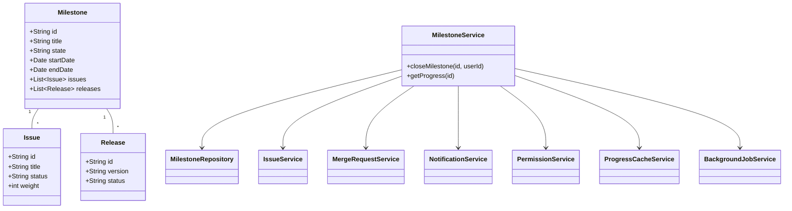
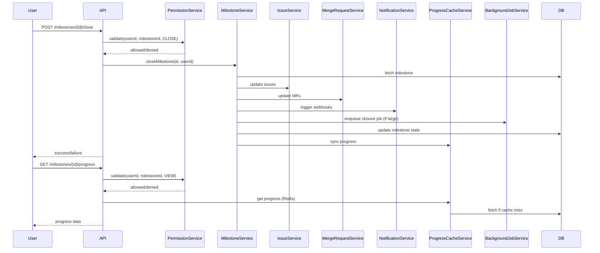
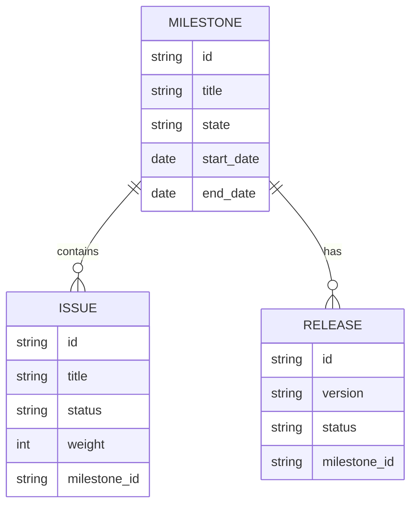

# Low-Level Design (LLD) Document: Milestone Closure and Progress View

## 1. Objective
This document details the low-level design for implementing two core features in the GitLab application server: (1) closing a milestone and (2) viewing milestone progress. The goal is to enable project managers to mark milestones as completed, updating all related issues and metrics, while allowing team members to view real-time progress, including completed issues, time tracking, and associated releases. The design ensures robust permission checks, data consistency, and high performance, following Spring Boot best practices and supporting PostgreSQL, Redis, and Sidekiq integrations.

## 2. API Model
### 2.1 Common Components/Services
- **MilestoneService**: Business logic for milestone operations (close, progress calculation)
- **MilestoneRepository**: Data access for milestones
- **IssueService**: Updates and queries related to issues
- **MergeRequestService**: Handles merge request updates
- **NotificationService**: Triggers webhooks/notifications
- **PermissionService**: Validates user permissions
- **ProgressCacheService**: Manages cached progress data (Redis)
- **BackgroundJobService**: Handles asynchronous tasks (Sidekiq)

### 2.2 API Details
| Operation                | REST Method | Type            | URL                                 | Request JSON                                                                 | Response JSON                                                                                   |
|--------------------------|-------------|-----------------|--------------------------------------|-------------------------------------------------------------------------------|-------------------------------------------------------------------------------------------------|
| Close Milestone          | POST        | Success/Failure | /api/v1/milestones/{id}/close        | `{ "userId": "string" }`                                                  | `{ "status": "success", "milestoneId": "string", "closedAt": "datetime" }`             |
| View Milestone Progress  | GET         | Success/Failure | /api/v1/milestones/{id}/progress     | N/A                                                                         | `{ "milestoneId": "string", "progress": 0-100, "completedIssues": int, "totalIssues": int, "timeElapsed": int, "totalTime": int, "releases": [ { "id": "string", "status": "string" } ] }` |

### 2.3 Exceptions
- **MilestoneNotFoundException**: Thrown if the milestone ID does not exist
- **MilestoneAlreadyClosedException**: Thrown if attempting to close a non-active milestone
- **PermissionDeniedException**: Thrown if user lacks permission
- **IssueUpdateException**: Thrown if associated issues/merge requests cannot be updated
- **ProgressCalculationException**: Thrown if progress metrics cannot be computed
- **CacheSyncException**: Thrown if cache and DB values are inconsistent

## 3. Functional Design
### 3.1 Class Diagram

### 3.2 UML Sequence Diagram

### 3.3 Components
| Component               | Purpose                                            | New/Existing |
|-------------------------|----------------------------------------------------|--------------|
| MilestoneService        | Business logic for milestones                      | Existing     |
| MilestoneRepository     | Data access for milestones                         | Existing     |
| IssueService            | Update and query issues                            | Existing     |
| MergeRequestService     | Update merge requests                              | Existing     |
| NotificationService     | Trigger webhooks/notifications                     | Existing     |
| PermissionService       | Validate user permissions                          | Existing     |
| ProgressCacheService    | Manage cached progress data                        | New          |
| BackgroundJobService    | Handle async closure (Sidekiq)                     | New          |

### 3.4 Service Layer Logic and Validations
| FieldName      | Validation                                    | ErrorMessage                               | ClassUsed           |
|----------------|-----------------------------------------------|--------------------------------------------|---------------------|
| milestoneId    | Must exist and be active                      | Milestone not found or already closed      | MilestoneService    |
| userId         | Must have close/view permission               | Permission denied                          | PermissionService   |
| issues         | All must be completed (for closure)           | Cannot close milestone with open issues    | IssueService        |
| progress cache | Cache must match DB or refresh if outdated    | Progress data inconsistent                 | ProgressCacheService|

## 4. Integrations
| SystemToBeIntegrated | IntegratedFor           | IntegrationType |
|----------------------|------------------------|-----------------|
| Sidekiq              | Async milestone closure | Background Job  |
| Redis                | Progress caching        | Cache           |
| PostgreSQL           | Data persistence       | Database        |
| Webhooks/Notifications | Event triggers        | API             |

## 5. DB Details
### 5.1 ER Model

### 5.2 DB Validations
- Milestone state must be one of: 'active', 'closed'
- Foreign key constraints: issues.milestone_id → milestone.id, releases.milestone_id → milestone.id
- Unique constraint on milestone (title, project_id)
- Not null constraints on all primary fields

## 6. Dependencies
- Spring Boot 2.x/3.x
- PostgreSQL 12+
- Redis 5+
- Sidekiq (for background jobs)
- Vue.js frontend (for progress view)

## 7. Assumptions
- Only project managers can close milestones; team members can only view progress
- All issues must be closed before a milestone can be closed, unless overridden by admin
- Progress calculation uses weighted issues if enabled
- Webhooks are pre-configured for milestone events
- Real-time updates are handled via polling or WebSocket (not detailed here)

---

**Absolute Path:** `/app/64b8601a-dd21-48a3-af90-9f4c62adceba/Generated_LLD.md`

[JIRA_LINK]: SCRUM-64
