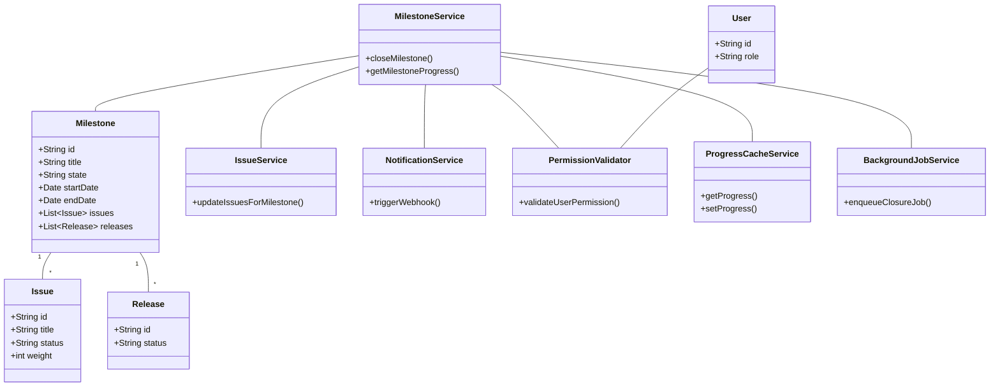
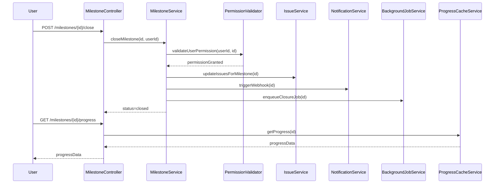
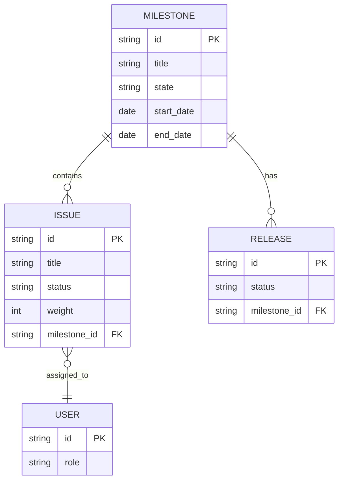

# Low-Level Design (LLD) Document: Milestone Closure and Progress Tracking

## 1. Objective
This document describes the low-level design for two key features in the GitLab application server: closing a milestone and viewing milestone progress. The goal is to enable project managers to close milestones, marking them as completed, and to allow team members to view real-time progress of milestones, including completed issues, time tracking, and associated releases. The design ensures data consistency, robust validation, and efficient handling of large datasets using asynchronous processing and caching. All APIs, models, services, and integrations are consolidated for a unified, production-ready implementation.

## 2. API Model

### 2.1 Common Components/Services
- **MilestoneService**: Handles business logic for milestone operations (close, progress calculation).
- **MilestoneRepository**: Data access layer for milestones.
- **IssueService**: Updates issues related to milestones.
- **NotificationService**: Triggers webhooks/notifications on milestone closure.
- **PermissionValidator**: Validates user permissions for milestone actions.
- **ProgressCacheService**: Manages cached milestone progress data (uses Redis).
- **BackgroundJobService**: Handles asynchronous milestone closure (uses Sidekiq).

### 2.2 API Details
| Operation                | REST Method | Type     | URL                                 | Request JSON                                                                 | Response JSON                                                                 |
|--------------------------|-------------|----------|-------------------------------------|-------------------------------------------------------------------------------|-------------------------------------------------------------------------------|
| Close Milestone          | POST        | Success  | /api/v1/milestones/{id}/close       | `{ "userId": "string" }`                                                  | `{ "status": "closed", "milestoneId": "string", "updatedAt": "datetime" }` |
| Close Milestone          | POST        | Failure  | /api/v1/milestones/{id}/close       | `{ "userId": "string" }`                                                  | `{ "error": "Milestone is not active or permission denied" }`               |
| View Milestone Progress  | GET         | Success  | /api/v1/milestones/{id}/progress    | N/A                                                                          | `{ "milestoneId": "string", "progress": { "completedIssues": int, "totalIssues": int, "progressPercent": float, "timeElapsed": int, "totalTime": int, "releases": [ { "releaseId": "string", "status": "string" } ] } }` |
| View Milestone Progress  | GET         | Failure  | /api/v1/milestones/{id}/progress    | N/A                                                                          | `{ "error": "Milestone not found or permission denied" }`                   |

### 2.3 Exceptions
- **MilestoneNotActiveException**: Thrown when attempting to close a non-active milestone.
- **PermissionDeniedException**: Thrown when the user lacks permission for the operation.
- **MilestoneNotFoundException**: Thrown when the milestone ID is invalid.
- **DataConsistencyException**: Thrown if there is a mismatch between cache and DB.
- **AsyncJobFailedException**: Thrown if the background closure job fails.

## 3. Functional Design

### 3.1 Class Diagram

### 3.2 UML Sequence Diagram

### 3.3 Components
| Component Name         | Purpose                                         | New/Existing |
|-----------------------|-------------------------------------------------|--------------|
| MilestoneService      | Business logic for milestone operations         | Existing     |
| MilestoneRepository   | Data access for milestones                      | Existing     |
| IssueService          | Updates issues related to milestones            | Existing     |
| NotificationService   | Triggers webhooks/notifications                 | Existing     |
| PermissionValidator   | Validates user permissions                      | Existing     |
| ProgressCacheService  | Manages cached milestone progress (Redis)       | New          |
| BackgroundJobService  | Handles async closure (Sidekiq)                 | New          |

### 3.4 Service Layer Logic and Validations
| FieldName     | Validation                                    | ErrorMessage                                  | ClassUsed           |
|---------------|-----------------------------------------------|-----------------------------------------------|---------------------|
| milestoneId   | Must exist and be active                      | Milestone is not active                       | MilestoneService    |
| userId        | Must have permission                          | Permission denied                             | PermissionValidator |
| issues        | All must be closed before milestone closure    | Cannot close milestone with open issues       | MilestoneService    |
| cache/DB      | Data consistency between cache and DB         | Data inconsistency detected                   | ProgressCacheService|

## 4. Integrations
| SystemToBeIntegrated | IntegratedFor           | IntegrationType |
|---------------------|------------------------|-----------------|
| PostgreSQL          | Milestone/Issue storage| DB              |
| Redis               | Milestone progress cache| Cache           |
| Sidekiq             | Async milestone closure | Background Job  |
| Webhooks            | Notifications          | API             |
| Vue.js Frontend     | Milestone progress view | API             |

## 5. DB Details

### 5.1 ER Model

### 5.2 DB Validations
- **Milestone.state**: Enum constraint ('active', 'closed', 'archived')
- **Issue.status**: Enum constraint ('open', 'closed', 'in_progress')
- **Foreign keys**: All FK relationships enforced (issue.milestone_id, release.milestone_id)
- **Unique constraints**: Milestone title unique per project

## 6. Dependencies
- Spring Boot 2.x/3.x
- PostgreSQL 12+
- Redis 5+
- Sidekiq (via Redis)
- Vue.js frontend (for progress view)
- Webhook endpoints (for notifications)

## 7. Assumptions
- Only project managers can close milestones
- All issues must be closed before milestone can be closed
- Weighted issues are optional and factored into progress if enabled
- Progress data is cached and refreshed on-demand or via background jobs
- Asynchronous closure is used for milestones with >100 issues
- All APIs are secured via JWT-based authentication

---

*Generated by Crew Manager LLD Agent*
