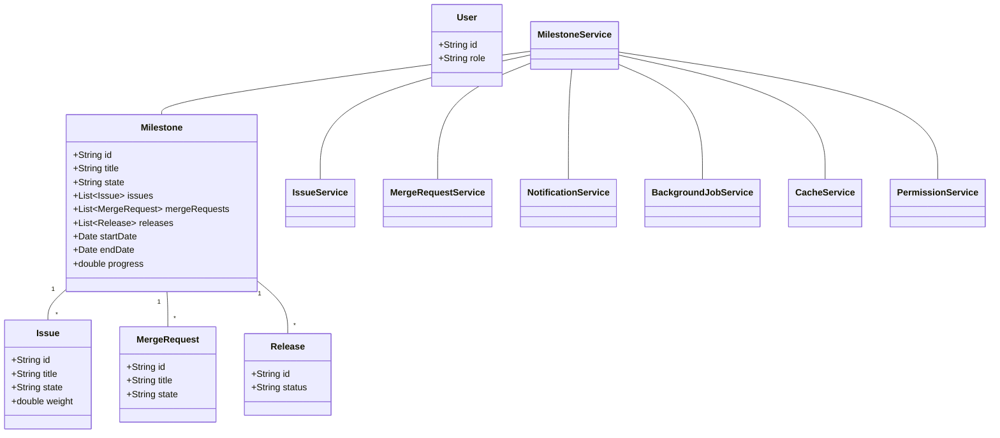
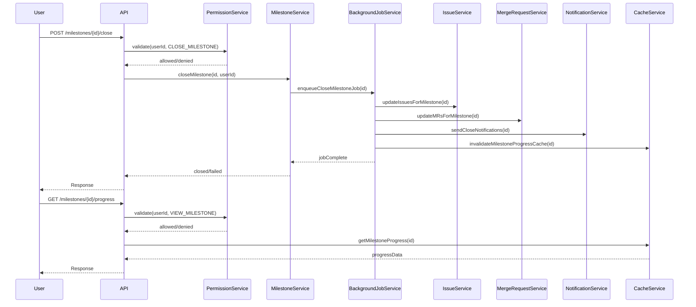
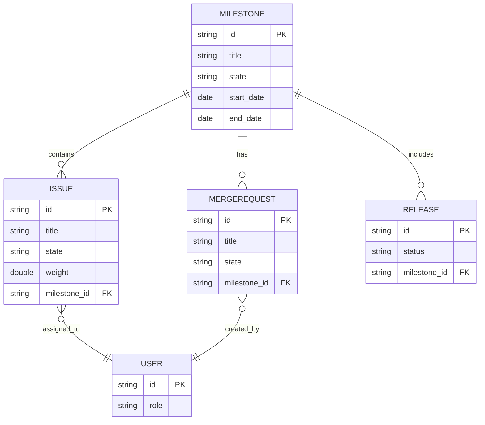

# LLD For SCRUM-64: Close and View the Milestone

## Summary
Close and view the milestone

## Description

### Story 3: Close a Milestone
**Summary:** As a project manager, I want to close a milestone, so that I can mark it as completed and track project progress.

**Description:**
- The user should be able to change the state of a milestone from 'active' to 'closed' when all associated tasks are completed or the milestone is no longer relevant.

**Technical Context:**
- **System:** GitLab application server
- **Database:** PostgreSQL
- **Model:** Milestone
- **Background Jobs:** Sidekiq

**Acceptance Criteria:**
- User can close an active milestone
- The milestone state changes from 'active' to 'closed'
- All associated metrics and reports are updated to reflect the closed state

**Validations:**
- Only active milestones can be closed
- User must have appropriate permissions to close a milestone

**Business Logic:**
- Update all associated issues and merge requests to reflect the closed milestone
- Trigger any configured webhooks or notifications

**Non-Functional Requirements:**
- The closure process should be handled asynchronously for large milestones
- The system should maintain data consistency during the closure process

---

### Story 4: View Milestone Progress
**Summary:** As a team member, I want to view the progress of a milestone, so that I can understand the current status of our project goals.

**Description:**
- The user should be able to see a visual representation of the milestone's progress, including completed and remaining issues, time progress, and any associated releases.

**Technical Context:**
- **System:** GitLab application server
- **Database:** PostgreSQL
- **Caching:** Redis
- **Frontend:** Vue.js components

**Acceptance Criteria:**
- User can view a progress bar showing completed vs. total issues
- User can see time-based progress (e.g., days elapsed vs. total days)
- User can view associated releases and their status
- The view is updated in real-time or with minimal delay

**Validations:**
- Ensure data consistency between cached and database values
- Validate user permissions for viewing milestone details

**Business Logic:**
- Calculate progress based on the number of closed issues vs. total issues
- Factor in the weight of issues if using weighted issues feature

**Non-Functional Requirements:**
- The progress view should load within 1 second
- The system should handle concurrent requests for popular milestones efficiently

---

# Low-Level Design (LLD) for SCRUM-64: Close and View the Milestone

## 1. Objective
This document details the low-level design for the features to close and view milestones in the GitLab application server. The goal is to enable project managers to mark milestones as completed, update all associated entities, and provide team members with a real-time, comprehensive view of milestone progress. The design ensures robust validation, asynchronous processing for large datasets, and efficient, consistent data retrieval and updates. All APIs, models, and logic are consolidated for production-ready implementation following Spring Boot best practices.

## 2. API Model
### 2.1 Common Components/Services
- **MilestoneService:** Business logic for milestone state changes and progress calculations
- **IssueService:** Handles issue status and associations
- **MergeRequestService:** Updates merge requests linked to milestones
- **NotificationService:** Triggers webhooks/notifications on milestone changes
- **BackgroundJobService:** Manages asynchronous milestone closure (using Sidekiq)
- **CacheService:** Handles real-time milestone progress caching (Redis)
- **PermissionService:** Validates user permissions

### 2.2 API Details
| Operation                | REST Method | Type     | URL                                | Request JSON                                                                 | Response JSON                                                                 |
|--------------------------|-------------|----------|-------------------------------------|------------------------------------------------------------------------------|------------------------------------------------------------------------------|
| Close Milestone          | POST        | Success  | /api/v1/milestones/{id}/close       | { "userId": "string" }                                                    | { "status": "closed", "milestoneId": "string", "message": "Milestone closed" } |
|                          |             | Failure  |                                     |                                                                              | { "error": "Milestone is not active or permission denied" }                |
| View Milestone Progress  | GET         | Success  | /api/v1/milestones/{id}/progress    | N/A                                                                          | { "milestoneId": "string", "progress": 0.75, "completedIssues": 15, "totalIssues": 20, "timeElapsedDays": 10, "totalDays": 14, "releases": [{"id":1,"status":"released"}], "weightedProgress": 0.8 } |
|                          |             | Failure  |                                     |                                                                              | { "error": "Milestone not found or permission denied" }                    |

### 2.3 Exceptions
| Exception Name                  | Scenario/Service                     | Description                                      |
|---------------------------------|--------------------------------------|--------------------------------------------------|
| MilestoneNotActiveException     | MilestoneService                     | Thrown if trying to close a non-active milestone  |
| PermissionDeniedException       | PermissionService                    | User lacks permission for the operation           |
| MilestoneNotFoundException      | MilestoneService                     | Milestone ID does not exist                      |
| DataConsistencyException        | CacheService/DB                      | Mismatch between cache and DB                    |
| AsyncJobFailedException         | BackgroundJobService                  | Closure job fails                                |

## 3. Functional Design
### 3.1 Class Diagram

### 3.2 UML Sequence Diagram

### 3.3 Components
| Component Name         | Purpose                                         | New/Existing |
|-----------------------|-------------------------------------------------|--------------|
| MilestoneService      | Handles milestone business logic                 | Existing     |
| IssueService          | Issue status and association management          | Existing     |
| MergeRequestService   | Merge request updates for milestones             | Existing     |
| NotificationService   | Sends webhooks/notifications                     | Existing     |
| BackgroundJobService  | Asynchronous milestone closure                   | New          |
| CacheService          | Real-time progress caching                       | Existing     |
| PermissionService     | User authorization and validation                | Existing     |

### 3.4 Service Layer Logic and Validations
| FieldName        | Validation                                  | ErrorMessage                                 | ClassUsed              |
|------------------|---------------------------------------------|----------------------------------------------|------------------------|
| milestone.state  | Must be 'active' to close                   | Milestone is not active                      | MilestoneService       |
| user.permission  | Must have CLOSE_MILESTONE/VIEW_MILESTONE    | Permission denied                            | PermissionService      |
| milestone.id     | Must exist                                  | Milestone not found                          | MilestoneService       |
| cache.consistency| DB and cache values must match              | Data inconsistency detected                  | CacheService           |
| issues.state     | All issues must be closed (optional check)  | Not all issues are closed                    | IssueService           |

## 4. Integrations
| SystemToBeIntegrated | IntegratedFor           | IntegrationType |
|----------------------|------------------------|-----------------|
| Sidekiq              | Background jobs        | Queue/Job       |
| Redis                | Progress caching       | Cache           |
| GitLab Webhooks      | Notifications         | API/Webhook     |
| PostgreSQL           | Data storage           | Database        |
| Vue.js Frontend      | Progress display       | API             |

## 5. DB Details
### 5.1 ER Model

### 5.2 DB Validations
- **milestone.state**: Enum constraint ('active', 'closed', 'upcoming')
- **issue.state**: Enum constraint ('open', 'closed')
- **merge_request.state**: Enum constraint ('open', 'merged', 'closed')
- **release.status**: Enum constraint ('draft', 'released')
- **FK constraints**: All milestone_id fields must reference existing milestones
- **Unique constraint**: Milestone title must be unique per project

## 6. Dependencies
- Sidekiq for background processing
- Redis for caching milestone progress
- PostgreSQL as the primary data store
- Vue.js frontend for progress visualization
- GitLab webhook infrastructure for notifications

## 7. Assumptions
- Only project managers can close milestones
- All issues under a milestone are closed before closure (unless overridden)
- Progress calculations may use weighted issues if enabled
- Real-time updates are achieved via cache invalidation and refresh
- Background jobs are reliably processed by Sidekiq
- All integrations (webhooks, cache, jobs) are pre-configured and operational
