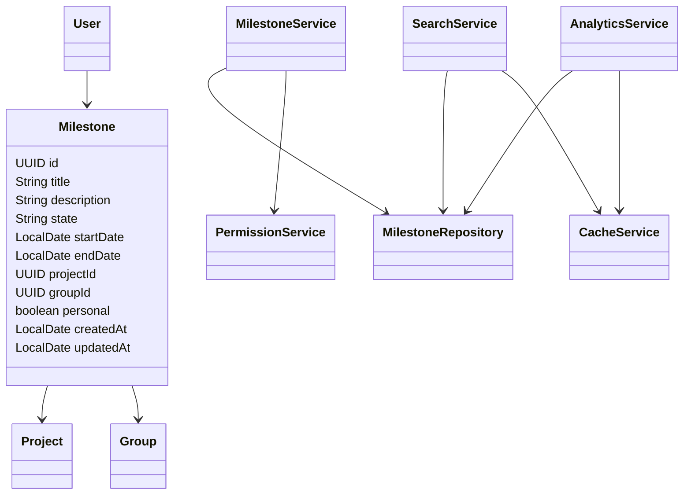
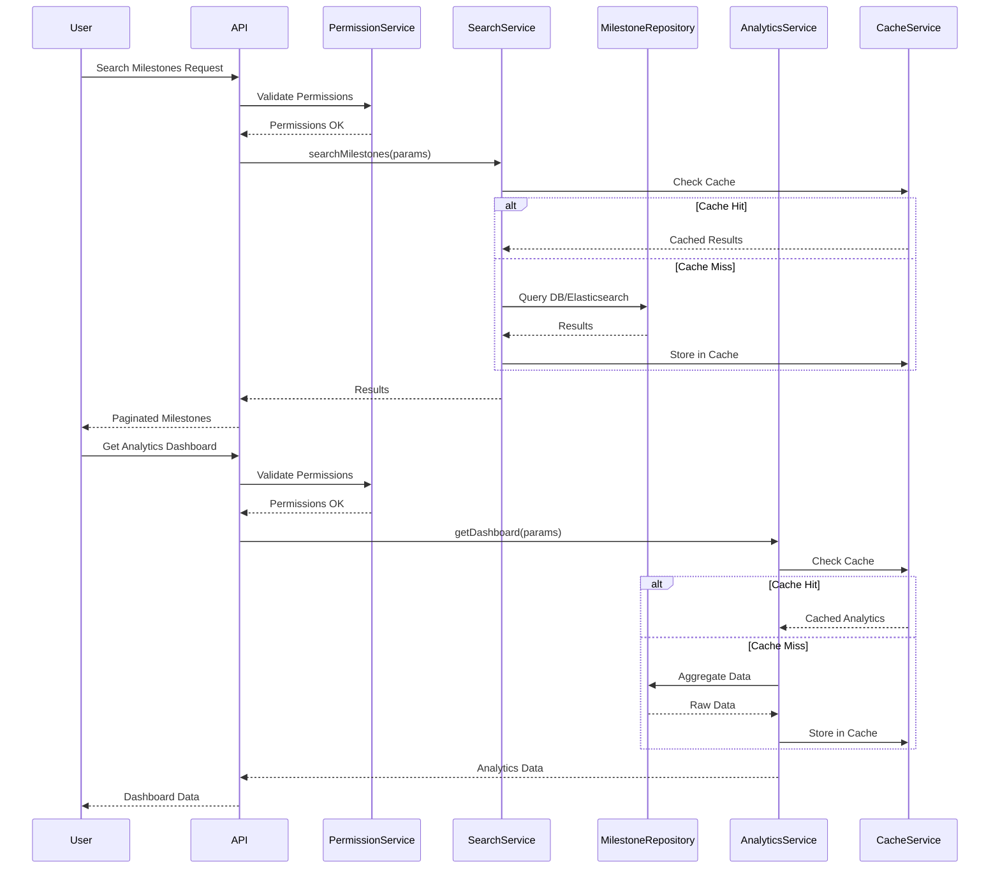
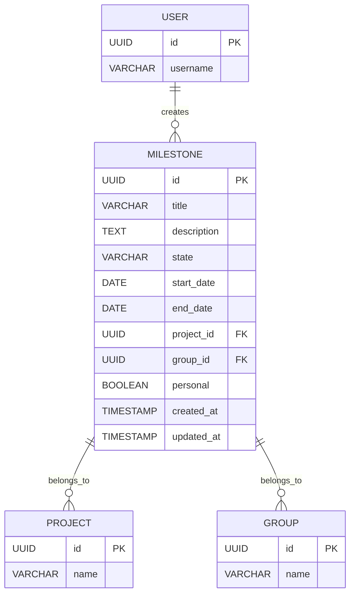

# Low-Level Design (LLD) for Milestone Search, Filter, and Analytics (SCRUM-75)

## 1. Objective
This document details the low-level design for implementing milestone search, filter, and analytics features in the GitLab application server. The goal is to enable project managers and leaders to efficiently search for and analyze milestones across projects and groups. The design covers API endpoints, models, service logic, integrations, validations, and database changes, ensuring a robust, scalable, and production-ready solution. All user stories and requirements from the current and previous iterations are consolidated herein.

## 2. API Model

### 2.1 Common Components/Services
- **MilestoneService**: Core business logic for milestone operations
- **MilestoneRepository**: Data access layer for milestones
- **SearchService**: Handles search and filter logic, integrates with Elasticsearch if enabled
- **AnalyticsService**: Computes milestone analytics and KPIs
- **PermissionService**: Validates user permissions
- **CacheService**: Caches frequent searches and analytics queries
- **DTOs**: Data transfer objects for API requests/responses

### 2.2 API Details
| Operation                          | REST Method | Type           | URL                                         | Request JSON                                                                                           | Response JSON                                                                                               |
|------------------------------------|-------------|----------------|---------------------------------------------|--------------------------------------------------------------------------------------------------------|-------------------------------------------------------------------------------------------------------------|
| Search & Filter Milestones         | GET         | Success/Failure| /api/v1/milestones/search                   | { "query": "string", "state": "active|closed", "dateFrom": "yyyy-MM-dd", "dateTo": "yyyy-MM-dd", "projectId": "UUID", "groupId": "UUID", "personal": true, "page": 1, "size": 20, "sort": "field,asc|desc" } | { "results": [ {"id": "UUID", "title": "string", "description": "string", "state": "active|closed", "startDate": "yyyy-MM-dd", "endDate": "yyyy-MM-dd", "projectId": "UUID", "groupId": "UUID", "personal": true } ], "total": 100, "page": 1, "size": 20 } |
| Get Milestone Analytics Dashboard  | GET         | Success/Failure| /api/v1/milestones/analytics                | { "projectId": "UUID", "groupId": "UUID", "dateFrom": "yyyy-MM-dd", "dateTo": "yyyy-MM-dd" }                                         | { "completionRate": 0.85, "avgTimeToCompletion": 12, "estimateAccuracy": 0.9, "trend": [{"date": "yyyy-MM-dd", "completionRate": 0.8}], "exportUrl": "string" } |
| Export Analytics Data              | POST        | Success/Failure| /api/v1/milestones/analytics/export         | { "projectId": "UUID", "groupId": "UUID", "dateFrom": "yyyy-MM-dd", "dateTo": "yyyy-MM-dd", "format": "csv|xlsx" }                  | { "exportUrl": "string" }                                                                                 |

### 2.3 Exceptions
| Exception Name                      | Scenario/Service                       | Description                                    |
|-------------------------------------|----------------------------------------|------------------------------------------------|
| InvalidSearchInputException         | SearchService                          | Thrown when search/filter input is invalid      |
| PermissionDeniedException           | PermissionService                      | User lacks permission for requested resource    |
| MilestoneNotFoundException          | MilestoneService                       | Milestone ID not found                         |
| AnalyticsDataUnavailableException   | AnalyticsService                       | Analytics data cannot be computed/found         |
| ExportFailedException               | AnalyticsService                       | Export operation failed                        |

## 3. Functional Design

### 3.1 Class Diagram

### 3.2 UML Sequence Diagram

### 3.3 Components
| Component Name      | Purpose                                         | New/Existing |
|---------------------|-------------------------------------------------|--------------|
| MilestoneService    | Business logic for milestone operations         | Existing     |
| MilestoneRepository | Data access for milestones                      | Existing     |
| SearchService       | Handles search/filter logic                     | New          |
| AnalyticsService    | Computes analytics/KPIs                         | New          |
| PermissionService   | Validates user permissions                      | Existing     |
| CacheService        | Caches frequent queries                         | New          |
| DTOs                | API request/response mapping                    | New          |

### 3.4 Service Layer Logic and Validations
| FieldName         | Validation                                 | ErrorMessage                          | ClassUsed           |
|-------------------|--------------------------------------------|---------------------------------------|---------------------|
| query             | No SQL injection, length <= 255            | Invalid search query                  | SearchService       |
| state             | Enum: active/closed                        | Invalid milestone state               | SearchService       |
| dateFrom/dateTo   | Valid date, dateFrom <= dateTo             | Invalid date range                    | SearchService       |
| projectId/groupId | UUID format, must exist                    | Project/Group not found               | PermissionService   |
| personal          | Boolean                                    | Invalid value for personal            | SearchService       |
| userId            | Must have view permission                   | Permission denied                     | PermissionService   |
| analytics params  | Valid date/project/group, permission checks | Invalid analytics request             | AnalyticsService    |

## 4. Integrations
| SystemToBeIntegrated | IntegratedFor                  | IntegrationType |
|----------------------|-------------------------------|-----------------|
| PostgreSQL           | Milestone data storage         | DB              |
| Elasticsearch        | Search acceleration (optional) | API             |
| Grafana/D3.js        | Analytics visualization       | API             |
| Internal Auth System | User permission validation     | API             |

## 5. DB Details

### 5.1 ER Model

### 5.2 DB Validations
- `title`: NOT NULL, length <= 255
- `state`: ENUM('active', 'closed'), NOT NULL
- `start_date`, `end_date`: Valid dates, `start_date` <= `end_date`
- `project_id`, `group_id`: Foreign key constraints
- `personal`: Default false

## 6. Dependencies
- Spring Boot 2.x/3.x (core framework)
- Spring Data JPA (DB access)
- Elasticsearch client (if search acceleration enabled)
- Grafana/D3.js (for analytics dashboard)
- Redis or Caffeine (for caching)
- Internal Auth/Permission system

## 7. Assumptions
- Elasticsearch is optional and only enabled if configured
- Analytics dashboard is read-only; no direct milestone modifications
- User permissions are managed by an internal auth system
- All APIs are secured via OAuth2/JWT
- Milestone data is consistent and normalized in the DB
- Exported analytics data is stored temporarily and cleaned up periodically

---

**Absolute Path to Generated File:** `/app/89d31b54-71d6-4c5c-96ef-368849e16687/Generated_LLD.md`
