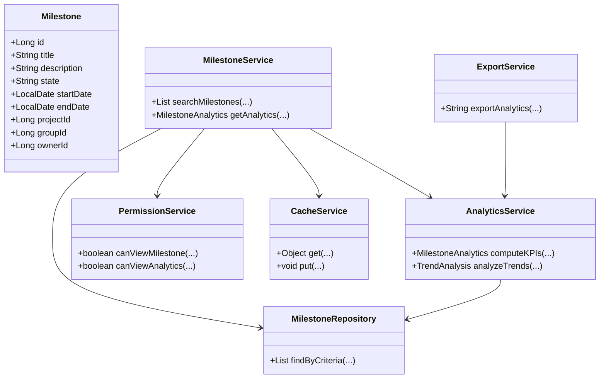
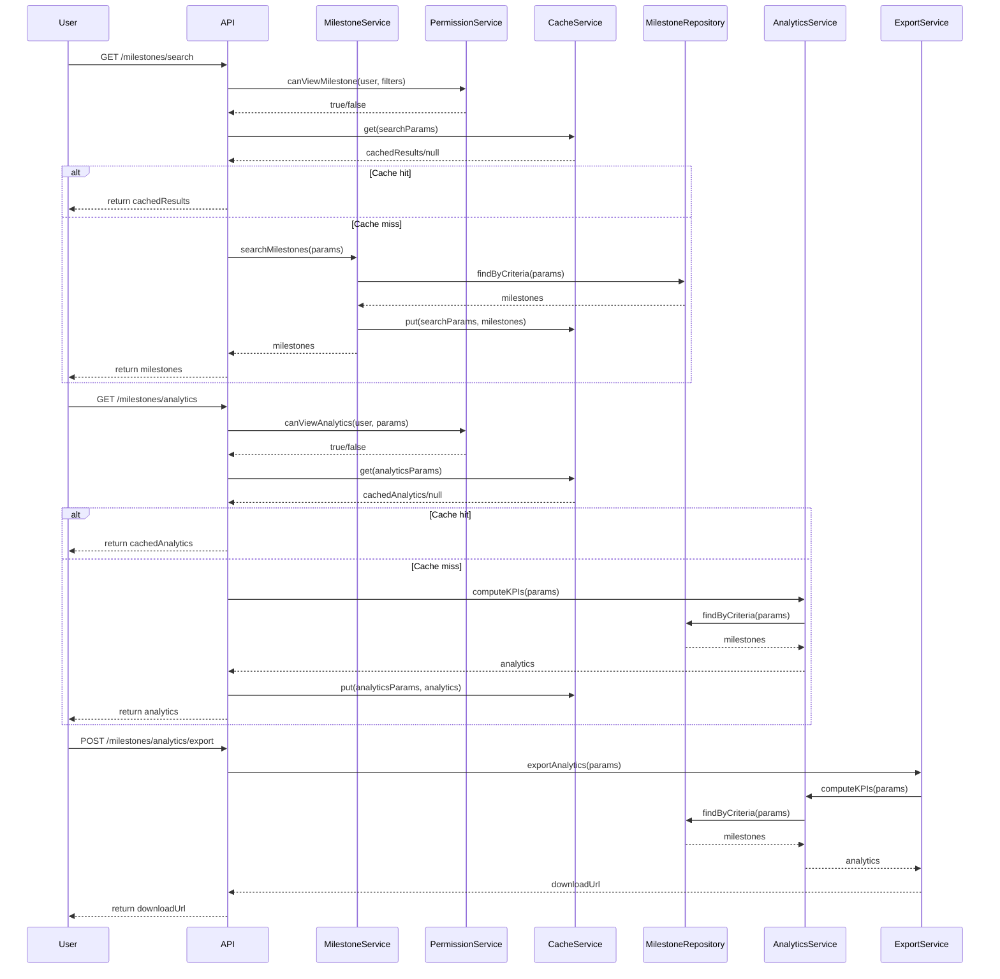
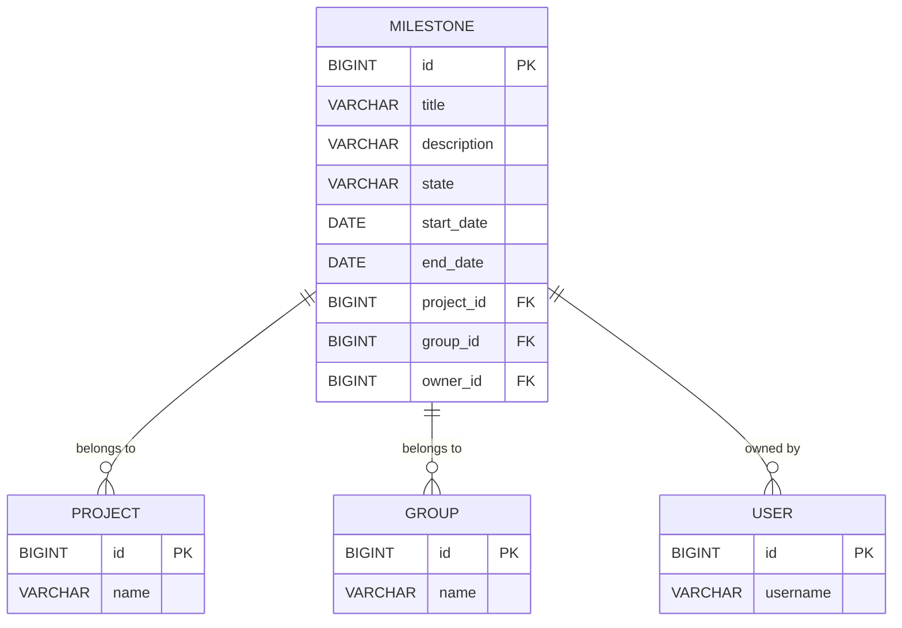

# Low-Level Design (LLD) Document

## 1. Objective
This document provides a consolidated Low-Level Design (LLD) for the implementation of two user stories: Search and Filter Milestones, and Milestone Analytics, within the GitLab application server. The goal is to enable project managers and leaders to efficiently search, filter, and analyze milestones across projects and groups. The design ensures robust, secure, and performant APIs, analytics dashboards, and data management, following Spring Boot best practices and production-ready standards.

## 2. API Model

### 2.1 Common Components/Services
- **MilestoneService**: Handles business logic for milestones, including search, filter, and analytics.
- **MilestoneRepository**: Data access layer for milestone entities.
- **AnalyticsService**: Computes analytics and KPIs for milestones.
- **PermissionService**: Validates user permissions for milestone access and analytics.
- **CacheService**: Caches frequent search and analytics queries.
- **ElasticsearchClient**: Integrates with Elasticsearch for advanced search (if enabled).
- **ExportService**: Handles data export functionality.

### 2.2 API Details
| Operation                               | REST Method | Type      | URL                                         | Request JSON                                                                                 | Response JSON                                                                                 |
|-----------------------------------------|-------------|-----------|---------------------------------------------|----------------------------------------------------------------------------------------------|----------------------------------------------------------------------------------------------|
| Search and filter milestones            | GET         | Success   | /api/v1/milestones/search                   | { "query": "string", "filters": { "state": "active", "projectId": 1, "groupId": 2, "dateRange": { "from": "2024-01-01", "to": "2024-12-31" } }, "sort": "date", "page": 1, "size": 20 } | { "results": [ { "id": 1, "title": "Release 1.0", "state": "active", ... } ], "total": 100, "page": 1, "size": 20 } |
| Get milestone analytics dashboard        | GET         | Success   | /api/v1/milestones/analytics                | { "projectId": 1, "groupId": 2, "dateRange": { "from": "2024-01-01", "to": "2024-12-31" } } | { "completionRate": 0.85, "avgTimeToCompletion": 12, "estimateAccuracy": 0.9, "trends": [ ... ] } |
| Export milestone analytics               | POST        | Success   | /api/v1/milestones/analytics/export         | { "projectId": 1, "groupId": 2, "dateRange": { "from": "2024-01-01", "to": "2024-12-31" }, "format": "csv" } | { "downloadUrl": "https://.../export.csv" } |
| Unauthorized/Forbidden error            | ANY         | Failure   | Any API                                    | N/A                                                                                          | { "error": "Forbidden", "message": "User does not have permission." }                      |
| Validation error                        | ANY         | Failure   | Any API                                    | N/A                                                                                          | { "error": "ValidationError", "message": "Invalid input for field X." }                   |

### 2.3 Exceptions
- **MilestoneNotFoundException**: Thrown when a milestone is not found for the given criteria.
- **PermissionDeniedException**: Thrown when a user does not have permission to view or analyze milestones.
- **InvalidSearchCriteriaException**: Thrown for malformed or unsafe search/filter input.
- **AnalyticsComputationException**: Thrown if analytics computation fails.
- **ExportFailedException**: Thrown if export fails due to system or data issues.

## 3. Functional Design

### 3.1 Class Diagram

### 3.2 UML Sequence Diagram

### 3.3 Components
| Component           | Purpose                                               | New/Existing |
|---------------------|------------------------------------------------------|--------------|
| MilestoneService    | Business logic for milestones                        | Existing     |
| MilestoneRepository | Data access for milestones                           | Existing     |
| AnalyticsService    | Analytics and KPI computation                        | New          |
| PermissionService   | User permission validation                           | Existing     |
| CacheService        | Caching for search and analytics                     | New          |
| ExportService       | Export analytics data                                | New          |
| ElasticsearchClient | Advanced search integration (if enabled)             | Existing     |

### 3.4 Service Layer Logic and Validations
| FieldName         | Validation                                 | ErrorMessage                                 | ClassUsed           |
|-------------------|--------------------------------------------|----------------------------------------------|---------------------|
| query             | No SQL injection, max length 256           | Invalid search query                         | MilestoneService    |
| state             | Must be 'active' or 'closed'               | Invalid milestone state                      | MilestoneService    |
| dateRange         | Valid date format, from <= to              | Invalid date range                           | MilestoneService    |
| projectId/groupId | Must exist and user must have access       | Project/Group not found or access denied     | PermissionService   |
| page/size         | Positive integers, reasonable max limits   | Invalid pagination parameters                | MilestoneService    |
| analytics params  | Valid project/group/date, user permission  | Invalid analytics parameters or access denied| AnalyticsService    |
| export format     | Supported formats: csv, xlsx               | Unsupported export format                    | ExportService       |

## 4. Integrations
| SystemToBeIntegrated | IntegratedFor                  | IntegrationType |
|----------------------|-------------------------------|-----------------|
| PostgreSQL           | Milestone data storage         | DB              |
| Elasticsearch        | Advanced search (optional)     | API             |
| Grafana/D3.js        | Analytics dashboard frontend   | API/Visualization|
| Internal Auth System | User authentication/authorization | API          |

## 5. DB Details

### 5.1 ER Model

### 5.2 DB Validations
- **Unique constraint**: (title, project_id, group_id) to avoid duplicate milestones
- **Foreign key constraints**: project_id, group_id, owner_id must reference valid records
- **Check constraint**: state in ('active', 'closed')
- **Date constraints**: start_date <= end_date

## 6. Dependencies
- Spring Boot 3.x
- Spring Data JPA
- PostgreSQL
- Elasticsearch (optional)
- Grafana or D3.js for analytics dashboard
- Internal authentication/authorization system

## 7. Assumptions
- Elasticsearch is optional and enabled only if configured
- User permissions are managed by a central auth system
- Analytics data is computed in real-time for dashboard, but may be cached for performance
- Export supports CSV and XLSX formats
- All APIs are secured and require authentication
- Milestone entity is already present in the system
- AnalyticsService and ExportService are new additions for this requirement

---

**End of Document**
