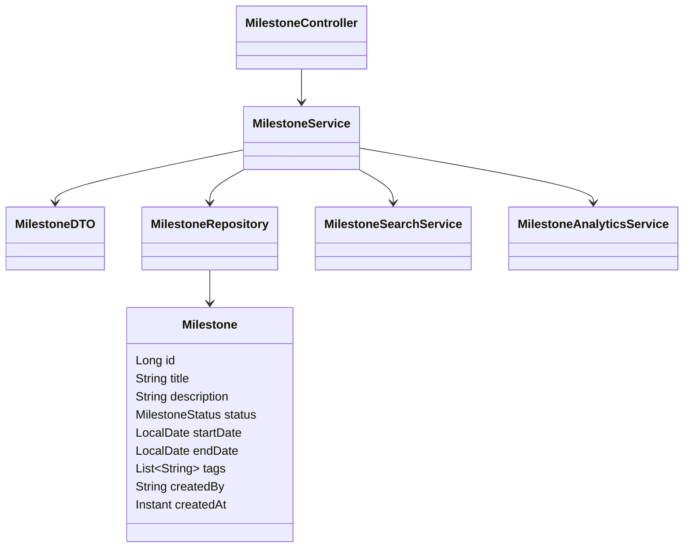
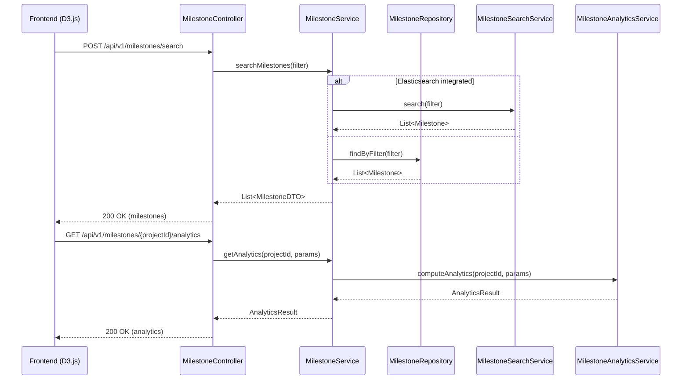
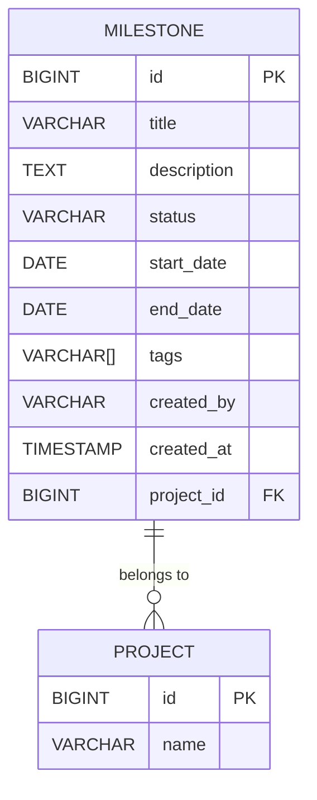

# Low-Level Design (LLD): Milestone Search, Filter, and Analytics for GitLab Application

## 1. Objective

This document details the low-level design for implementing two core features in the GitLab application server: (1) Search and Filter Milestones, and (2) Milestone Analytics. The goal is to enable users to efficiently search, filter, and analyze project milestones, leveraging PostgreSQL for persistence, Elasticsearch for advanced search (if integrated), and a custom analytics engine or Grafana for visualization. The design adheres to Spring Boot best practices, ensuring maintainability, scalability, and seamless integration with frontend (D3.js) and other system components. All APIs, models, validations, and business logic are unified and production-ready for direct implementation.

---

## 2. API Model

### 2.1 Common Components/Services
- **MilestoneService**: Business logic for milestone operations (search, filter, analytics).
- **MilestoneRepository**: Spring Data JPA repository for PostgreSQL.
- **MilestoneSearchService**: Optional; integrates with Elasticsearch for advanced search/filtering.
- **MilestoneAnalyticsService**: Computes analytics data; interfaces with analytics engine or Grafana.
- **MilestoneController**: REST controller exposing milestone APIs.
- **ExceptionHandler**: Centralized error handling.

### 2.2 API Details

| Operation                | REST Method | Type      | URL                                   | Request JSON Schema                                   | Response JSON Schema                                   |
|-------------------------|-------------|-----------|---------------------------------------|-------------------------------------------------------|--------------------------------------------------------|
| Search & Filter         | POST        | Internal  | /api/v1/milestones/search             | `{ "projectId": Long, "status": String, "dateRange": { "from": Date, "to": Date }, "tags": [String], "page": Int, "size": Int, "sort": String }` | `{ "milestones": [MilestoneDTO], "total": Int, "page": Int, "size": Int }` |
| Milestone Analytics     | GET         | Internal  | /api/v1/milestones/{projectId}/analytics | N/A (query params: from, to, groupBy, metric)           | `{ "metrics": [ { "name": String, "value": Number } ], "trend": [ { "date": Date, "count": Int } ] }` |

#### Request/Response Example Schemas

- **MilestoneDTO**:
  ```json
  {
    "id": 123,
    "title": "Release Q2",
    "description": "Major release for Q2",
    "status": "OPEN",
    "startDate": "2024-04-01",
    "endDate": "2024-06-30",
    "tags": ["release", "Q2"],
    "createdBy": "alice",
    "createdAt": "2024-03-01T10:00:00Z"
  }
  ```

### 2.3 Exceptions

| Exception Type                | HTTP Status | Description                              |
|------------------------------|-------------|------------------------------------------|
| MilestoneNotFoundException    | 404         | Milestone not found                      |
| InvalidFilterException        | 400         | Invalid filter/search parameters         |
| AnalyticsUnavailableException | 503         | Analytics engine/service unavailable     |
| InternalServerError           | 500         | Unhandled server error                   |

---

## 3. Functional Design

### 3.1 Mermaid Class Diagram


### 3.2 Mermaid Sequence Diagram


### 3.3 Components Table
| Component                  | Responsibility                                     |
|----------------------------|---------------------------------------------------|
| MilestoneController        | Exposes REST APIs for milestone operations        |
| MilestoneService           | Business logic for search/filter/analytics        |
| MilestoneRepository        | JPA repository for Milestone entity               |
| MilestoneSearchService     | Integrates with Elasticsearch (if enabled)        |
| MilestoneAnalyticsService  | Computes analytics using custom engine/Grafana    |
| ExceptionHandler           | Centralized error handling                        |

### 3.4 Service Layer Logic and Validations Table
| Method                                 | Logic/Validation                                                                                   |
|----------------------------------------|---------------------------------------------------------------------------------------------------|
| searchMilestones(filter)               | Validate filter params (projectId required, valid status/date); delegate to ES or DB; map to DTOs  |
| getAnalytics(projectId, params)        | Validate projectId; check date range; fetch & aggregate data; handle analytics engine errors       |
| MilestoneRepository.findByFilter       | Dynamic query by projectId, status, date range, tags, pagination, sorting                         |
| MilestoneSearchService.search          | Build ES query; handle connection errors; fallback to DB if needed                                |
| MilestoneAnalyticsService.computeAnalytics | Aggregate milestones by status/date/metric; support trend analysis; handle missing data         |

---

## 4. Integrations

| SystemToBeIntegrated | IntegratedFor         | IntegrationType         |
|---------------------|----------------------|------------------------|
| Elasticsearch       | Search & Filter      | REST/Java Client       |
| PostgreSQL          | Milestone Storage    | JPA (Spring Data)      |
| Analytics Engine    | Analytics Computation| REST/Java Client       |
| Grafana (optional)  | Analytics Visualization | REST API           |
| D3.js (Frontend)    | Analytics UI         | REST API (JSON)        |

---

## 5. DB Details

### 5.1 Mermaid ER Diagram


### 5.2 DB Validations
- **id**: Primary key, auto-increment.
- **title**: Not null, max 255 chars.
- **status**: Enum (OPEN, CLOSED, IN_PROGRESS), not null.
- **start_date, end_date**: start_date <= end_date.
- **tags**: Array of strings, optional.
- **created_by**: Not null.
- **created_at**: Not null, default current timestamp.
- **project_id**: Foreign key, references PROJECT(id), not null.

---

## 6. Dependencies
- Spring Boot 3.x
- Spring Data JPA
- PostgreSQL JDBC Driver
- (Optional) Spring Data Elasticsearch
- Jackson (for JSON serialization)
- Lombok (for DTOs/Entities)
- MapStruct (for DTO mapping)
- JUnit & Mockito (for unit testing)

---

## 7. Assumptions
- Elasticsearch is optional; fallback to DB search if not available.
- Analytics engine is either custom or Grafana; API contract is REST/JSON.
- All milestone operations are scoped to a project (projectId required).
- User authentication/authorization is handled by upstream middleware.
- Frontend (D3.js) consumes REST APIs and handles visualization.
- All date/timestamps are in UTC (ISO 8601 format).
- Pagination defaults: page=0, size=20; max size=100.
- Only active (non-deleted) milestones are returned in search/filter.

---

**End of Document**

jira_link: SCRUM-75
