# Low-Level Design (LLD) Document: Milestone Search, Filter, and Analytics

## 1. Objective
This document details the low-level design for implementing advanced milestone search, filtering, and analytics features in the GitLab application server. The goal is to enable project managers and leaders to efficiently search, filter, and analyze milestones across projects and groups. The design ensures robust, secure, and performant APIs, along with comprehensive analytics dashboards, supporting both RESTful and GraphQL paradigms. All requirements are consolidated for direct implementation following Spring Boot best practices.

## 2. API Model

### 2.1 Common Components/Services
- **MilestoneService**: Handles business logic for milestone search, filtering, and analytics.
- **MilestoneRepository**: Data access layer for milestones.
- **AnalyticsService**: Aggregates and computes milestone analytics.
- **PermissionService**: Validates user permissions for accessing milestones and analytics.
- **CacheService**: Caches frequent search and analytics queries.
- **ElasticsearchClient**: (If integrated) Handles advanced search queries.
- **ExportService**: Handles data export functionality.

### 2.2 API Details
| Operation                      | REST Method | Type     | URL                                         | Request JSON                                                                                                   | Response JSON                                                                                                   |
|-------------------------------|-------------|----------|---------------------------------------------|----------------------------------------------------------------------------------------------------------------|-----------------------------------------------------------------------------------------------------------------|
| Search & Filter Milestones     | GET         | Success  | /api/milestones/search                      | {"title": "string", "description": "string", "state": "active|closed", "dateRange": {"from": "yyyy-mm-dd", "to": "yyyy-mm-dd"}, "projectId": "string", "groupId": "string", "personal": true, "page": 1, "size": 20, "sort": "field,asc|desc"} | {"milestones": [{"id": "string", "title": "string", "description": "string", "state": "string", "startDate": "yyyy-mm-dd", "endDate": "yyyy-mm-dd", "projectId": "string", "groupId": "string"}], "total": 100, "page": 1, "size": 20} |
| Search & Filter Milestones     | POST        | Failure  | /api/milestones/search                      | {"invalidField": "..."}                                                                                      | {"error": "Invalid search criteria"}                                                                         |
| Get Milestone Analytics        | GET         | Success  | /api/milestones/analytics                   | {"projectId": "string", "groupId": "string", "dateRange": {"from": "yyyy-mm-dd", "to": "yyyy-mm-dd"}}                                 | {"completionRate": 0.85, "avgTimeToCompletion": 12, "estimateAccuracy": 0.92, "trend": [{"date": "yyyy-mm-dd", "completionRate": 0.8}], "filters": {...}} |
| Get Milestone Analytics        | POST        | Failure  | /api/milestones/analytics                   | {"invalidField": "..."}                                                                                      | {"error": "Invalid analytics request"}                                                                       |
| Export Analytics Data          | GET         | Success  | /api/milestones/analytics/export            | {"projectId": "string", "groupId": "string", "dateRange": {"from": "yyyy-mm-dd", "to": "yyyy-mm-dd"}}                                 | File download (CSV/XLSX/JSON)                                                                                   |
| Export Analytics Data          | POST        | Failure  | /api/milestones/analytics/export            | {"invalidField": "..."}                                                                                      | {"error": "Export failed due to ..."}                                                                        |

### 2.3 Exceptions
- **InvalidSearchCriteriaException**: Thrown when search input is malformed or contains invalid fields.
- **PermissionDeniedException**: Thrown when the user lacks permission to view milestones or analytics.
- **DataExportException**: Thrown when analytics export fails.
- **AnalyticsCalculationException**: Thrown when analytics computation fails due to data issues.
- **DatabaseTimeoutException**: Thrown when queries exceed performance thresholds.

## 3. Functional Design

### 3.1 Class Diagram

### 3.2 UML Sequence Diagram

### 3.3 Components
| Component Name         | Purpose                                              | New/Existing |
|-----------------------|------------------------------------------------------|--------------|
| MilestoneService      | Business logic for milestones                        | Existing     |
| MilestoneRepository   | Data access for milestones                           | Existing     |
| AnalyticsService      | Analytics computation and aggregation                | New          |
| PermissionService     | User permission validation                           | Existing     |
| CacheService          | Caching search and analytics results                 | New          |
| ElasticsearchClient   | Advanced search (if Elasticsearch is integrated)     | Existing     |
| ExportService         | Export analytics data                                | New          |

### 3.4 Service Layer Logic and Validations
| FieldName      | Validation                                      | ErrorMessage                           | ClassUsed           |
|---------------|-------------------------------------------------|----------------------------------------|---------------------|
| title         | No SQL/meta chars, max length 255                | Invalid title format                   | MilestoneService    |
| description   | No SQL/meta chars, max length 1024               | Invalid description format             | MilestoneService    |
| state         | Enum: active/closed                              | Invalid state value                    | MilestoneService    |
| dateRange     | Valid date format, from <= to                    | Invalid date range                     | MilestoneService    |
| projectId     | Must exist, user must have access                | Project not found or access denied     | PermissionService   |
| groupId       | Must exist, user must have access                | Group not found or access denied       | PermissionService   |
| personal      | Boolean                                          | Invalid personal flag                  | MilestoneService    |
| page, size    | Positive integers, max size 100                  | Invalid pagination parameters          | MilestoneService    |
| sort          | Valid field, asc/desc                            | Invalid sort parameter                 | MilestoneService    |
| analytics     | Data cross-checked with DB, valid params         | Analytics data mismatch or invalid     | AnalyticsService    |
| export        | Valid filters, export format supported           | Export failed or unsupported format    | ExportService       |

## 4. Integrations
| SystemToBeIntegrated | IntegratedFor                  | IntegrationType |
|---------------------|-------------------------------|-----------------|
| PostgreSQL          | Milestone storage/retrieval    | DB              |
| Elasticsearch       | Advanced milestone search      | API             |
| Grafana/D3.js       | Analytics visualization        | API/Frontend    |
| Internal Auth       | Permission validation          | API             |

## 5. DB Details

### 5.1 ER Model

```mermaid
erDiagram
    MILESTONE {
        string id PK
        string title
        string description
        string state
        date start_date
        date end_date
        string project_id FK
        string group_id FK
    }
    PROJECT {
        string id PK
        string name
    }
    GROUP {
        string id PK
        string name
    }
    MILESTONE ||--|| PROJECT : belongs_to
    MILESTONE ||--|| GROUP : belongs_to
```

### 5.2 DB Validations
- **title**: NOT NULL, VARCHAR(255)
- **description**: VARCHAR(1024)
- **state**: ENUM('active', 'closed'), NOT NULL
- **start_date, end_date**: DATE, end_date >= start_date
- **project_id/group_id**: Foreign key constraints
- **Unique constraint**: (title, project_id, group_id)

## 6. Dependencies
- Spring Boot 2.x+
- PostgreSQL 12+
- Elasticsearch 7.x (optional, for advanced search)
- Grafana/D3.js (for analytics dashboard)
- Internal authentication and authorization modules

## 7. Assumptions
- Elasticsearch is available and integrated for advanced search; fallback to DB search if not.
- Analytics dashboard is implemented using Grafana or D3.js, but backend aggregates all data.
- User permissions are managed by a centralized PermissionService.
- All APIs are secured and validated for input and output.
- Caching is implemented for both search and analytics queries to meet performance SLAs.
- The system is horizontally scalable to handle high concurrency.
- Export functionality supports CSV, XLSX, and JSON formats.
