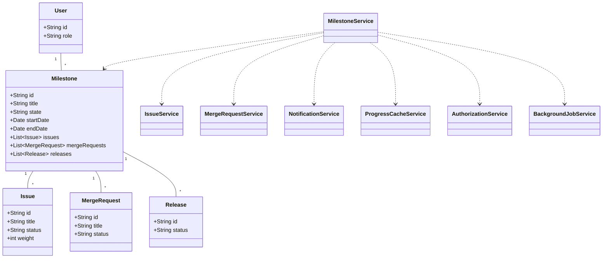
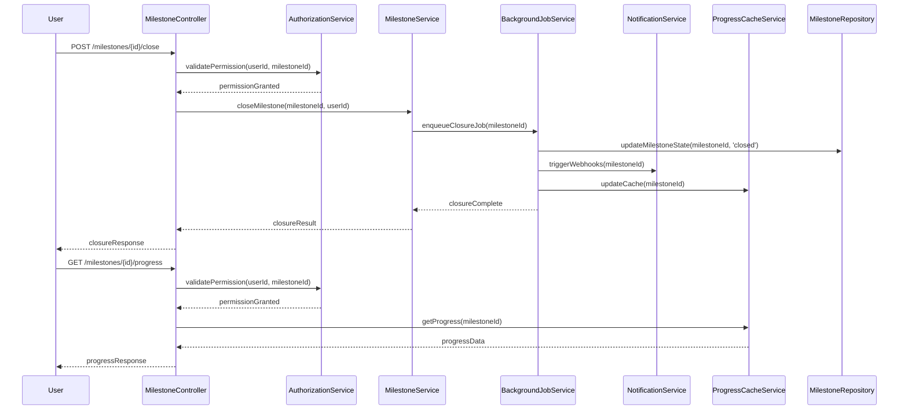
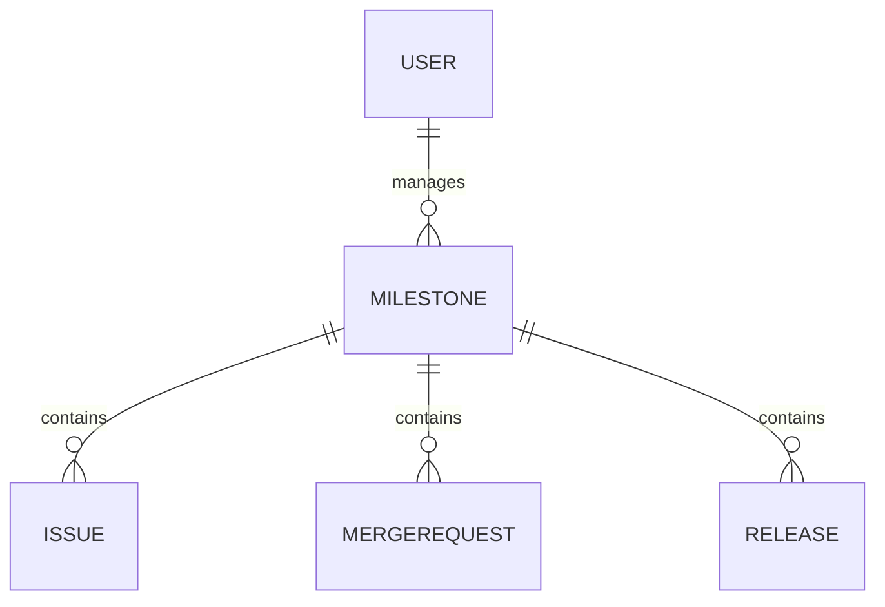

# Low-Level Design (LLD) Document: Milestone Closure and Progress Tracking

## 1. Objective
This document details the low-level design for the features enabling milestone closure and progress tracking in the GitLab application server. The goal is to allow project managers to close milestones, update associated metrics, and provide team members with real-time visibility into milestone progress. The design ensures data consistency, robust validation, and efficient handling of large datasets, supporting asynchronous processing and real-time updates. All APIs and services are designed for production readiness in a Spring Boot environment.

## 2. API Model

### 2.1 Common Components/Services
- **MilestoneService**: Handles business logic for milestone state changes and progress calculations.
- **MilestoneRepository**: Data access layer for milestone entities.
- **IssueService**: Updates issues related to milestones.
- **MergeRequestService**: Updates merge requests associated with milestones.
- **NotificationService**: Triggers webhooks and notifications.
- **ProgressCacheService**: Manages real-time milestone progress caching (Redis).
- **AuthorizationService**: Validates user permissions.
- **BackgroundJobService**: Handles asynchronous milestone closure (Sidekiq integration).

### 2.2 API Details

| Operation                | REST Method | Type     | URL                                    | Request JSON                                                                 | Response JSON                                                                |
|-------------------------|-------------|----------|----------------------------------------|------------------------------------------------------------------------------|------------------------------------------------------------------------------|
| Close Milestone         | POST        | Success  | /api/v1/milestones/{id}/close          | `{ "userId": "string" }`                                                    | `{ "status": "closed", "milestoneId": "string", "updatedAt": "datetime" }`   |
| Close Milestone         | POST        | Failure  | /api/v1/milestones/{id}/close          | `{ "userId": "string" }`                                                    | `{ "error": "MilestoneNotActiveException" }`                                 |
| View Milestone Progress | GET         | Success  | /api/v1/milestones/{id}/progress       | N/A                                                                         | `{ "milestoneId": "string", "progress": 0.85, "completedIssues": 17, "totalIssues": 20, "timeElapsed": 12, "totalTime": 15, "releases": [{ "id": "string", "status": "released" }] }` |
| View Milestone Progress | GET         | Failure  | /api/v1/milestones/{id}/progress       | N/A                                                                         | `{ "error": "MilestoneNotFoundException" }`                                  |

### 2.3 Exceptions
- **MilestoneNotActiveException**: Thrown when attempting to close a non-active milestone.
- **PermissionDeniedException**: Thrown when a user lacks permission to close/view a milestone.
- **MilestoneNotFoundException**: Thrown when a milestone does not exist.
- **DataConsistencyException**: Thrown if cached and DB values are inconsistent.
- **AsyncJobFailedException**: Thrown if background closure fails.

## 3. Functional Design

### 3.1 Class Diagram

### 3.2 UML Sequence Diagram

### 3.3 Components
| Component              | Purpose                                         | New/Existing |
|------------------------|-------------------------------------------------|--------------|
| MilestoneService       | Business logic for milestone operations         | Existing     |
| IssueService           | Manage issues linked to milestones              | Existing     |
| MergeRequestService    | Manage merge requests for milestones            | Existing     |
| NotificationService    | Send webhooks/notifications on state changes    | Existing     |
| ProgressCacheService   | Cache and serve real-time progress data         | New          |
| AuthorizationService   | Validate user permissions                       | Existing     |
| BackgroundJobService   | Handle async milestone closure                  | New          |
| MilestoneRepository    | Data access for milestones                      | Existing     |

### 3.4 Service Layer Logic and Validations
| FieldName         | Validation                                  | ErrorMessage                          | ClassUsed             |
|-------------------|---------------------------------------------|---------------------------------------|-----------------------|
| milestone.state   | Must be 'active' to close                   | MilestoneNotActiveException           | MilestoneService      |
| user.permission   | Must have close/view permission             | PermissionDeniedException             | AuthorizationService  |
| milestoneId       | Must exist in DB                            | MilestoneNotFoundException            | MilestoneService      |
| cache vs. DB      | Must be consistent                          | DataConsistencyException              | ProgressCacheService  |
| closure job       | Must complete successfully                  | AsyncJobFailedException               | BackgroundJobService  |

## 4. Integrations
| SystemToBeIntegrated | IntegratedFor                | IntegrationType |
|----------------------|-----------------------------|-----------------|
| Sidekiq              | Async milestone closure      | Job Queue       |
| Redis                | Real-time progress caching   | Cache           |
| PostgreSQL           | Milestone persistence       | Database        |
| Webhooks             | Notifications on closure    | API             |
| Vue.js Frontend      | Progress visualization      | API             |

## 5. DB Details

### 5.1 ER Model

### 5.2 DB Validations
- **milestone.state**: CHECK constraint to allow only 'active', 'closed', 'upcoming'
- **issue.status**: CHECK constraint for valid statuses ('open', 'closed', etc.)
- **Foreign keys**: Ensure referential integrity between milestones, issues, merge requests, and releases
- **Unique constraints**: Ensure unique milestone titles per project

## 6. Dependencies
- Sidekiq for background job processing
- Redis for caching progress data
- PostgreSQL as the primary data store
- Webhook endpoints for notifications
- Vue.js frontend components for progress visualization

## 7. Assumptions
- User permissions are managed centrally and exposed via AuthorizationService
- All milestone-related updates are atomic and transactional
- Large milestone closures are always handled asynchronously
- Progress data is cached for popular milestones and refreshed on-demand
- All APIs follow RESTful conventions and are secured via standard authentication mechanisms

---

**File generated at absolute path:** `/app/c31b2868-bc00-45f8-86e5-faf065502d29/LLD_For_STORY-3.md`

[JIRA_LINK]: STORY-3