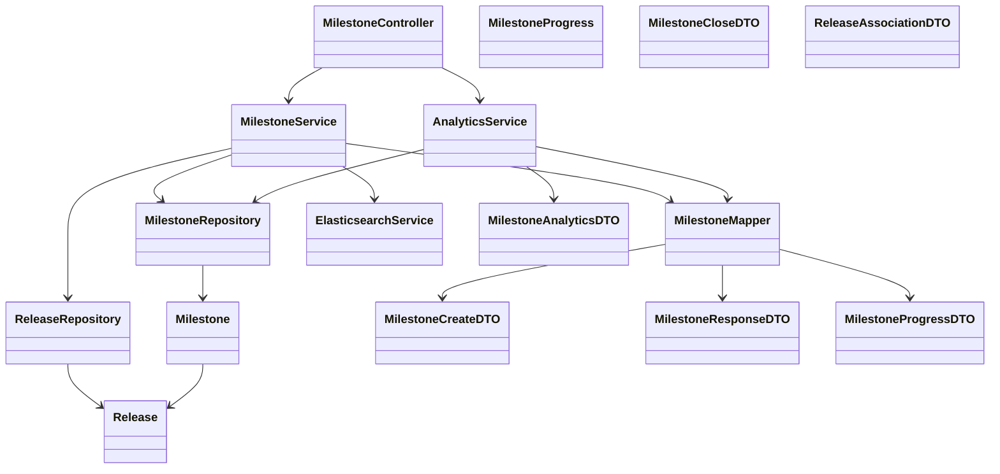
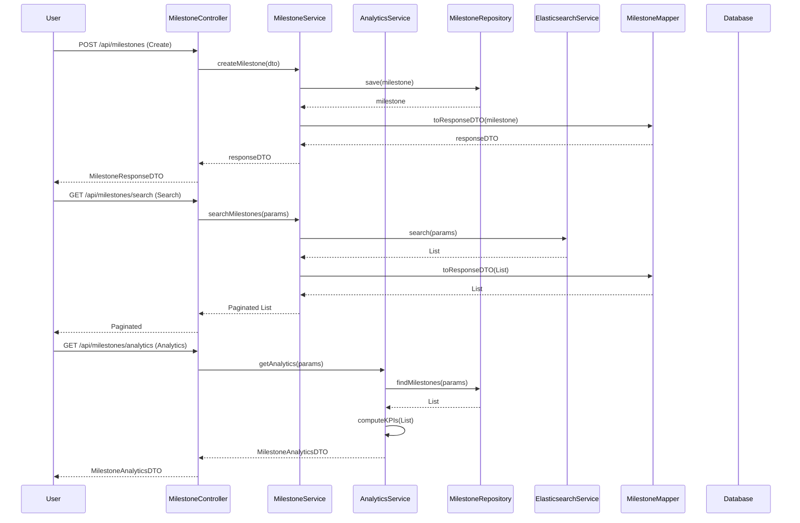

# Low-Level Design (LLD): Milestone Management Module

## 1. Objective
This Low-Level Design (LLD) document provides a comprehensive technical specification for the Milestone Management module in the GitLab application server. It consolidates both existing and new requirements, including milestone creation, release association, closing milestones, viewing milestone progress, searching/filtering milestones, and milestone analytics. The design ensures maintainability, scalability, and adherence to Spring Boot best practices, enabling seamless integration, high performance, and developer productivity. The module supports advanced search, analytics, and robust permission validation for project management efficiency.

---

## 2. API Model

### 2.1 Common Components/Services
- **MilestoneService**: Core business logic for milestone operations (create, associate, close, progress, search, analytics).
- **MilestoneRepository**: JPA repository for Milestone entity.
- **ReleaseRepository**: JPA repository for Release entity.
- **MilestoneMapper**: Maps between entities and DTOs.
- **AnalyticsService**: Computes milestone analytics and KPIs.
- **GlobalExceptionHandler**: Handles application-wide exceptions.
- **ElasticsearchService** (if integrated): For advanced search capabilities.

### 2.2 API Details

| Operation                        | REST Method | Type            | URL                                         | Request JSON                | Response JSON                |
|----------------------------------|-------------|-----------------|---------------------------------------------|-----------------------------|------------------------------|
| Create Milestone                 | POST        | Success/Failure | /api/milestones                            | MilestoneCreateDTO          | MilestoneResponseDTO         |
| Associate Milestone to Release   | POST        | Success/Failure | /api/milestones/{id}/associate              | ReleaseAssociationDTO       | MilestoneResponseDTO         |
| Close Milestone                  | POST        | Success/Failure | /api/milestones/{id}/close                  | MilestoneCloseDTO           | MilestoneResponseDTO         |
| View Milestone Progress          | GET         | Success/Failure | /api/milestones/{id}/progress               | N/A                        | MilestoneProgressDTO         |
| Get Milestone by ID              | GET         | Success/Failure | /api/milestones/{id}                        | N/A                        | MilestoneResponseDTO         |
| Search & Filter Milestones       | GET         | Success/Failure | /api/milestones/search                      | SearchFilterParams (query)  | Paginated                    |
| Milestone Analytics Dashboard    | GET         | Success/Failure | /api/milestones/analytics                   | AnalyticsFilterParams (query)| MilestoneAnalyticsDTO        |
| Export Analytics Data            | GET         | Success/Failure | /api/milestones/analytics/export            | AnalyticsFilterParams (query)| File (CSV/XLSX)              |

#### Request/Response JSON Examples
- **MilestoneCreateDTO**: `{ "name": "Release Q2", "description": "Q2 Release", "startDate": "2024-04-01", "endDate": "2024-06-30" }`
- **SearchFilterParams**: `?title=Q2&state=OPEN&startDate=2024-01-01&endDate=2024-12-31&projectId=123&page=0&size=20&sort=createdDate,desc`
- **AnalyticsFilterParams**: `?projectId=123&groupId=456&fromDate=2024-01-01&toDate=2024-12-31`

### 2.3 Exceptions

| Exception Name                  | HTTP Status | Description                                              |
|---------------------------------|-------------|----------------------------------------------------------|
| MilestoneNotFoundException      | 404         | Milestone with given ID does not exist                   |
| ReleaseNotFoundException        | 404         | Release with given ID does not exist                     |
| InvalidMilestoneStateException  | 400         | Operation not allowed in current milestone state         |
| ValidationException             | 400         | Input validation failed                                  |
| AssociationException            | 409         | Milestone already associated with a release              |
| PermissionDeniedException       | 403         | User lacks permission for requested operation            |
| AnalyticsExportException        | 500         | Error during analytics data export                       |
| SearchException                 | 500         | Error during search/filter operation                     |

---

## 3. Functional Design

### 3.1 Class Diagram (Mermaid)


### 3.2 UML Sequence Diagram (Mermaid)


### 3.3 Components Table
| Component                | Purpose/Responsibility                         | New/Existing |
|--------------------------|------------------------------------------------|--------------|
| MilestoneController      | REST API endpoints                             | Existing     |
| MilestoneService         | Business logic for milestone ops               | Existing     |
| AnalyticsService         | Business logic for analytics                   | New          |
| MilestoneRepository      | Milestone DB operations                        | Existing     |
| ReleaseRepository        | Release DB operations                          | Existing     |
| MilestoneMapper          | Entity/DTO mapping                             | Existing     |
| ElasticsearchService     | Search/filter milestones (if integrated)        | New          |
| GlobalExceptionHandler   | Exception handling                             | Existing     |

### 3.4 Service Layer Logic and Validations
| FieldName/Operation      | Validation/Logic                                                                                     | ErrorMessage/Exception           | ClassUsed              |
|-------------------------|-----------------------------------------------------------------------------------------------------|----------------------------------|------------------------|
| name (Create)           | Not blank, unique per project/group                                                                  | "Milestone name required/unique" | MilestoneService       |
| startDate/endDate       | Not null, endDate >= startDate                                                                      | "Invalid date range"             | MilestoneService       |
| status                  | Must be OPEN or CLOSED                                                                              | "Invalid milestone status"       | MilestoneService       |
| releaseId (Associate)   | Must exist, milestone not already associated                                                        | "Release not found/associated"   | MilestoneService       |
| close (Milestone)       | Milestone exists, status OPEN, all tasks complete                                                   | "Cannot close milestone"         | MilestoneService       |
| search/filter           | Validate input, prevent SQL injection, user permission check                                        | "Invalid search/filter params"   | MilestoneService       |
| analytics access        | User permission check, data accuracy by cross-checking DB                                           | "Permission denied"              | AnalyticsService       |
| analytics calculation   | Calculate KPIs (completion rate, avg time, estimate accuracy), trend analysis                       | N/A                              | AnalyticsService       |
| export analytics        | Validate filters, handle large data, export as CSV/XLSX                                             | "Analytics export failed"        | AnalyticsService       |

---

## 4. Integrations
| SystemToBeIntegrated     | IntegratedFor                                | IntegrationType |
|-------------------------|-----------------------------------------------|-----------------|
| Release Service         | Milestone-release association                 | DB (internal)   |
| Task/Issue Service      | Milestone progress calculation (future)       | API (planned)   |
| Elasticsearch           | Advanced search/filter for milestones         | API             |
| Analytics Engine/Grafana| Milestone analytics visualization (optional)  | API/Embed       |

---

## 5. DB Details

### 5.1 ER Model (Mermaid)
```mermaid
erDiagram
    RELEASE ||--o{ MILESTONE : has
    MILESTONE {
        BIGINT id PK
        VARCHAR name UNIQUE NOT NULL
        TEXT description
        DATE start_date NOT NULL
        DATE end_date NOT NULL
        VARCHAR status NOT NULL
        BIGINT release_id FK
    }
    RELEASE {
        BIGINT id PK
        VARCHAR name UNIQUE NOT NULL
        VARCHAR version NOT NULL
        DATE start_date NOT NULL
        DATE end_date NOT NULL
    }
```

### 5.2 DB Validations
- Milestone name unique per project/group
- Milestone end_date >= start_date
- Milestone status in (OPEN, CLOSED)
- release_id references existing Release
- Analytics data derived from milestone and task tables

---

## 6. Dependencies
- Spring Boot 3.x
- Spring Data JPA
- Hibernate Validator
- Lombok
- MapStruct
- H2/PostgreSQL (configurable)
- Elasticsearch (optional, for search)
- Grafana/D3.js (optional, for analytics dashboard)

---

## 7. Assumptions
- Only one release per milestone.
- Milestone can be closed only if all associated tasks are complete (task service integration planned).
- Milestone progress is calculated based on stubbed task data until integration is complete.
- All dates are in UTC.
- Only authorized users can perform milestone operations (security handled elsewhere).
- Analytics dashboard is read-only and does not modify milestone data.
- Search/filter supports pagination and sorting by default.
- Analytics export supports CSV and XLSX formats.

---

## Appendix: DTO & Entity Models (Java-style)

### Milestone Entity
```java
@Entity
public class Milestone {
    @Id @GeneratedValue(strategy = GenerationType.IDENTITY)
    private Long id;
    @Column(unique = true, nullable = false)
    private String name;
    private String description;
    @Column(nullable = false)
    private LocalDate startDate;
    @Column(nullable = false)
    private LocalDate endDate;
    @Enumerated(EnumType.STRING)
    private MilestoneStatus status;
    @ManyToOne
    @JoinColumn(name = "release_id")
    private Release release;
    // getters/setters
}
```

### Release Entity
```java
@Entity
public class Release {
    @Id @GeneratedValue(strategy = GenerationType.IDENTITY)
    private Long id;
    @Column(unique = true, nullable = false)
    private String name;
    @Column(nullable = false)
    private String version;
    @Column(nullable = false)
    private LocalDate startDate;
    @Column(nullable = false)
    private LocalDate endDate;
    @OneToMany(mappedBy = "release")
    private List milestones;
    // getters/setters
}
```

### MilestoneCreateDTO
```java
public class MilestoneCreateDTO {
    @NotBlank
    private String name;
    private String description;
    @NotNull
    private LocalDate startDate;
    @NotNull
    private LocalDate endDate;
}
```

### MilestoneCloseDTO
```java
public class MilestoneCloseDTO {
    @NotBlank
    private String closedBy;
    private String closingRemarks;
}
```

### ReleaseAssociationDTO
```java
public class ReleaseAssociationDTO {
    @NotNull
    private Long releaseId;
}
```

### MilestoneResponseDTO
```java
public class MilestoneResponseDTO {
    private Long id;
    private String name;
    private String description;
    private LocalDate startDate;
    private LocalDate endDate;
    private String status;
    private Long releaseId;
}
```

### MilestoneProgressDTO
```java
public class MilestoneProgressDTO {
    private Long milestoneId;
    private String milestoneName;
    private int totalTasks;
    private int completedTasks;
    private double percentComplete;
    private String status;
}
```

### MilestoneAnalyticsDTO
```java
public class MilestoneAnalyticsDTO {
    private int totalMilestones;
    private double completionRate;
    private double avgTimeToCompletion;
    private double estimateAccuracy;
    private List trends;
    // getters/setters
}

public class MilestoneTrendDTO {
    private LocalDate period;
    private double completionRate;
    private double avgTimeToCompletion;
}
```

---

# End of Document

This is the complete, executable, and structured LLD document that was uploaded to Confluence and prepared for GitHub. If you need the markdown file, it is available as Generated_LLD.md.
