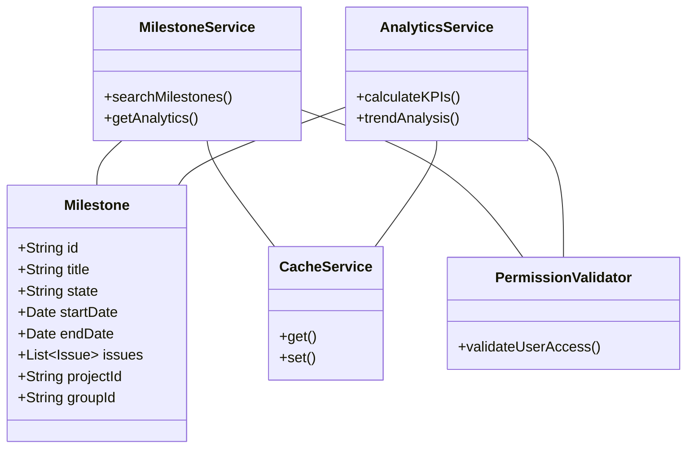
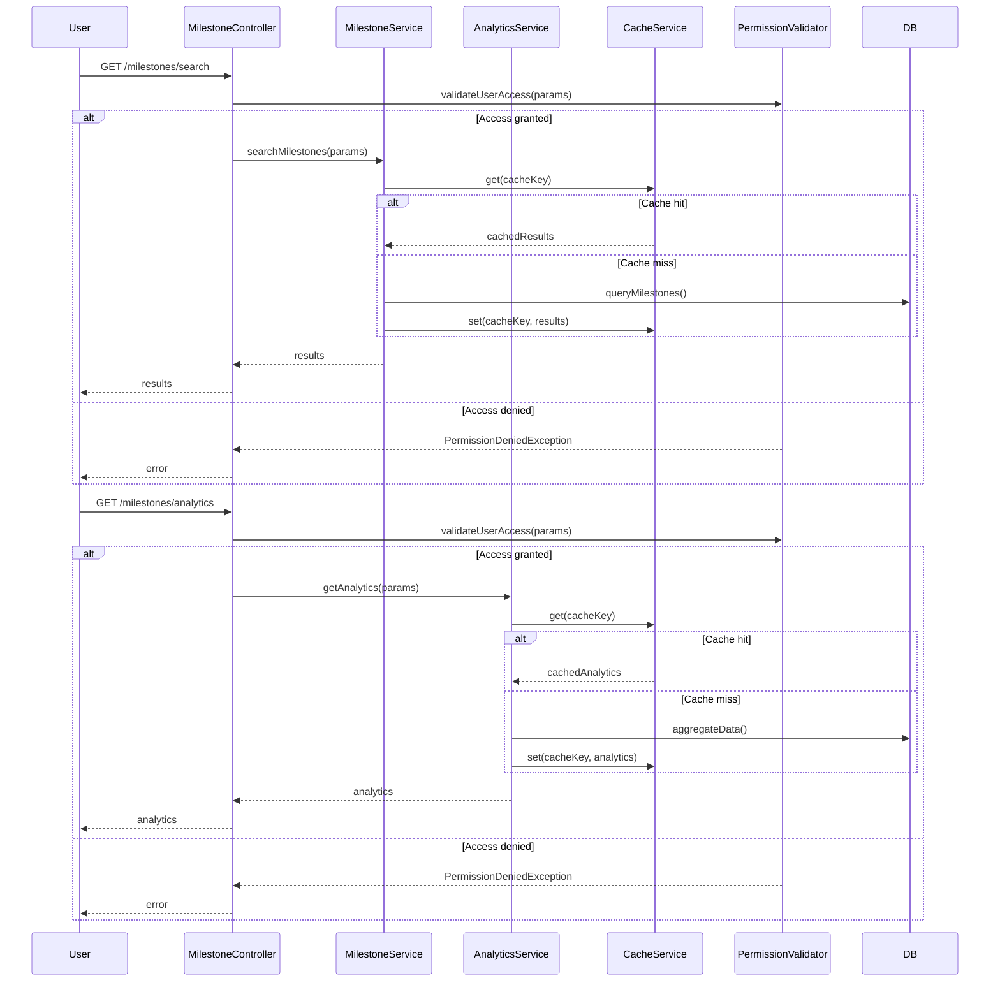
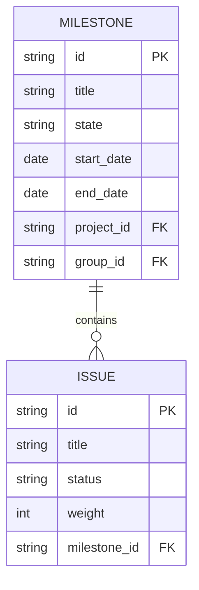

# Low-Level Design (LLD) Document: Search and Filter Milestones & Milestone Analytics

## 1. Objective
This document provides the low-level design for two features in the GitLab application server:
- Search and Filter Milestones
- Milestone Analytics

The goal is to enable project managers and leaders to efficiently search/filter milestones and to view analytics for better project performance insights.

## 2. API Model

### 2.1 Common Components/Services
- **MilestoneService**: Handles milestone search, filter, and analytics logic.
- **AnalyticsService**: Computes metrics and analytics for milestones.
- **CacheService**: Caches frequent queries and analytics results (e.g., Redis).
- **PermissionValidator**: Ensures users have access rights to milestones and analytics.
- **ElasticsearchService** (optional): For advanced/fuzzy search if integrated.

### 2.2 API Details
| Operation                 | REST Method | Type     | URL                                  | Request JSON / Params                                                                                         | Response JSON                                                                                       |
|---------------------------|-------------|----------|--------------------------------------|--------------------------------------------------------------------------------------------------------------|-----------------------------------------------------------------------------------------------------|
| Search Milestones         | GET         | Success  | /api/v1/milestones/search            | { "title": string, "description": string, "state": string, "start_date": date, "end_date": date, "project_id": string, "group_id": string, "user_id": string, "page": int, "sort": string } | { "milestones": [Milestone], "pagination": { "page": int, "total_pages": int } }               |
| Search Milestones         | GET         | Failure  | /api/v1/milestones/search            | Invalid params, unauthorized access                                                                          | { "error": "Invalid search input" } / { "error": "Permission denied" }                        |
| Get Milestone Analytics   | GET         | Success  | /api/v1/milestones/analytics         | { "project_id": string, "group_id": string, "date_range": { "from": date, "to": date } }              | { "completion_rate": float, "avg_time_to_completion": float, "estimate_accuracy": float, "trend": [object] } |
| Get Milestone Analytics   | GET         | Failure  | /api/v1/milestones/analytics         | Invalid params, unauthorized access                                                                          | { "error": "Invalid analytics request" } / { "error": "Permission denied" }                    |

### 2.3 Exceptions
| Exception Name                 | Scenario                                                      | Service/Class         |
|-------------------------------|---------------------------------------------------------------|----------------------|
| InvalidSearchInputException    | Malformed or dangerous search input (e.g., SQL injection)     | MilestoneService     |
| PermissionDeniedException      | User lacks permission to view milestones or analytics         | PermissionValidator  |
| AnalyticsDataNotFoundException | No analytics data available for given filters                 | AnalyticsService     |
| CacheUnavailableException      | Cache server not reachable                                    | CacheService         |

## 3. Functional Design

### 3.1 Class Diagram

### 3.2 UML Sequence Diagram

### 3.3 Components
| Component Name      | Purpose                                                      | New/Existing |
|---------------------|--------------------------------------------------------------|--------------|
| MilestoneService    | Search/filter milestones, business logic                     | Existing     |
| AnalyticsService    | Compute milestone analytics                                  | New          |
| CacheService        | Cache search and analytics results                           | Existing     |
| PermissionValidator | Validate user permissions                                    | Existing     |
| ElasticsearchService| Advanced search (optional, if integrated)                    | Existing     |
| MilestoneController | Expose REST/GraphQL endpoints                                | Existing     |

### 3.4 Service Layer Logic and Validations
| FieldName        | Validation                                   | ErrorMessage                     | ClassUsed           |
|------------------|----------------------------------------------|----------------------------------|---------------------|
| title            | No SQL/meta chars, max length 255            | Invalid title                    | MilestoneService    |
| description      | No SQL/meta chars, max length 1024           | Invalid description              | MilestoneService    |
| state            | Enum: [active, closed]                       | Invalid state                    | MilestoneService    |
| start_date       | Valid date, not in future for closed         | Invalid start date               | MilestoneService    |
| end_date         | Valid date, after start_date                 | Invalid end date                 | MilestoneService    |
| project_id       | Must exist, user must have access            | Project not found/No access      | PermissionValidator |
| group_id         | Must exist, user must have access            | Group not found/No access        | PermissionValidator |
| user_id          | Must exist, user must have access            | User not found/No access         | PermissionValidator |
| date_range       | Valid date range                             | Invalid date range               | AnalyticsService    |
| search input     | No SQL injection, XSS, or special chars      | Invalid search input             | MilestoneService    |

## 4. Integrations
| SystemToBeIntegrated | IntegratedFor             | IntegrationType |
|---------------------|--------------------------|-----------------|
| PostgreSQL          | Milestone data storage    | DB              |
| Redis               | Caching search/analytics  | Cache           |
| Elasticsearch       | Advanced search           | API             |
| Grafana/D3.js       | Analytics dashboard       | API/Frontend    |

## 5. DB Details

### 5.1 ER Model

### 5.2 DB Validations
- `title`: NOT NULL, VARCHAR(255)
- `description`: VARCHAR(1024)
- `state`: ENUM('active', 'closed')
- `start_date`, `end_date`: DATE, `end_date` >= `start_date`
- Foreign keys: `project_id`, `group_id`, `milestone_id` with ON DELETE CASCADE
- Unique constraint: (`title`, `project_id`, `group_id`)

## 6. Dependencies
- Spring Boot 2.x/3.x
- PostgreSQL 12+
- Redis 5+
- Elasticsearch (optional)
- D3.js or Grafana (for analytics dashboard)

## 7. Assumptions
- Only authorized users can search/filter milestones and view analytics.
- Analytics data is refreshed periodically or on-demand.
- All APIs are secured (JWT-based authentication).
- Elasticsearch is optional; fallback to SQL search if not available.
- Analytics dashboard is web-based and consumes REST APIs.

---

*Generated by Crew Manager LLD Agent for Jira Stories 5-6: Search and Filter Milestones, Milestone Analytics*
