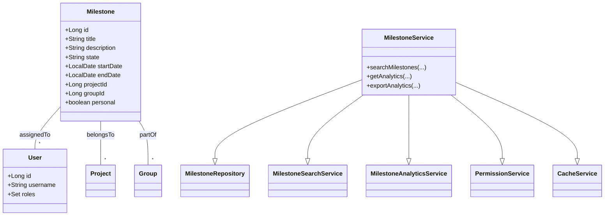
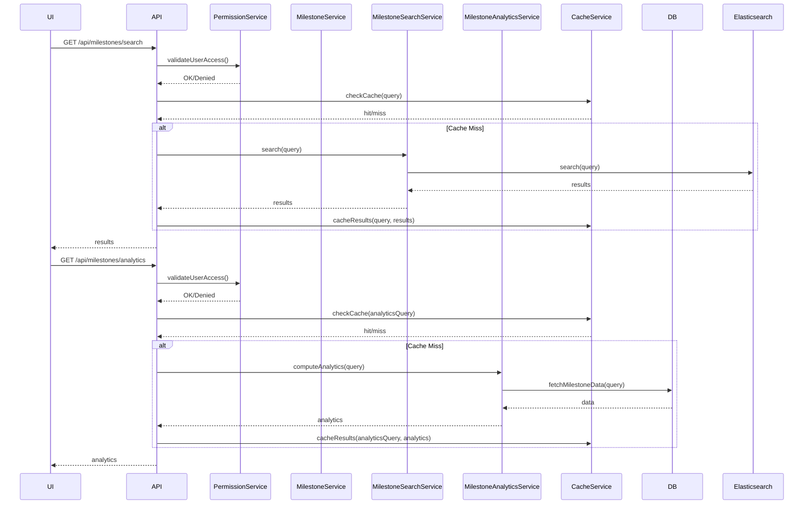
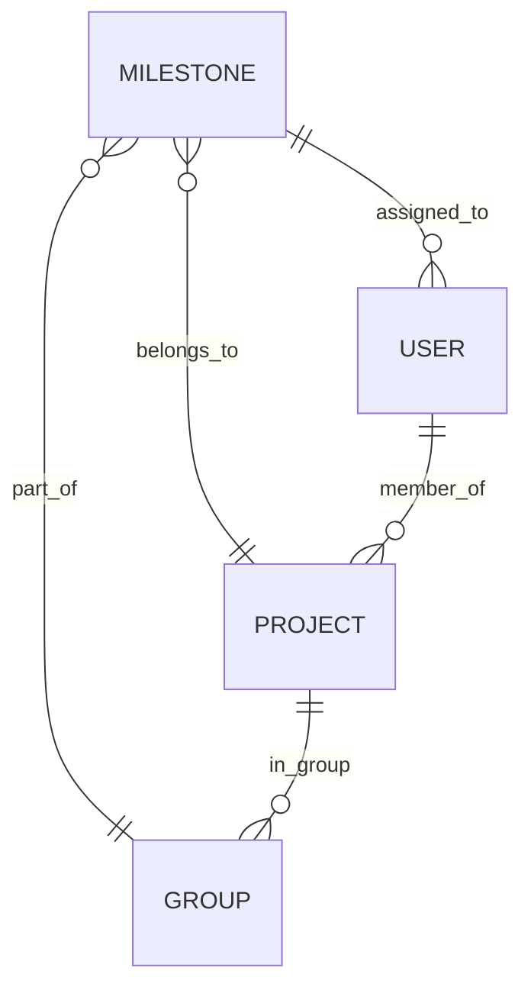

# LLD For Story 5-6

## Story 5: Search and Filter Milestones

### Summary
As a project manager, I want to search and filter milestones, so that I can quickly find relevant milestones across projects or groups.

### Description
The user should be able to search for milestones using various criteria such as title, description, state, and date range. They should also be able to filter milestones by project, group, or personal milestones.

### Technical Context
- **System:** GitLab application server
- **Database:** PostgreSQL
- **Search:** Elasticsearch (if integrated)
- **API:** RESTful and GraphQL

### Acceptance Criteria
- User can search milestones by title, description, and other attributes
- User can filter milestones by state (active/closed)
- User can filter milestones by date range
- User can filter milestones by project, group, or personal milestones
- Search results are paginated and sortable

### Validations
- Validate search input to prevent SQL injection
- Ensure user has permissions to view the milestones in search results

### Business Logic
- Implement smart search algorithm to provide relevant results
- Cache frequent searches to improve performance

### Non-Functional Requirements
- Search results should be returned within 3 seconds for complex queries
- The system should handle high volumes of concurrent search requests

---

## Story 6: Milestone Analytics

### Summary
As a project leader, I want to view analytics for milestones, so that I can gain insights into project performance and team productivity.

### Description
The user should be able to access a dashboard showing various analytics related to milestones, such as completion rate, average time to completion, and comparison between estimated and actual completion times.

### Technical Context
- **System:** GitLab application server
- **Database:** PostgreSQL
- **Analytics:** Custom analytics engine or integration with tools like Grafana
- **Frontend:** Interactive charts and graphs (e.g., using D3.js)

### Acceptance Criteria
- User can view a dashboard with key milestone metrics
- Dashboard includes visualizations for completion rate, time to completion, and accuracy of estimates
- User can filter analytics by date range, project, or group
- Data can be exported for further analysis

### Validations
- Ensure data accuracy by cross-checking with raw database values
- Validate user permissions for accessing analytics data

### Business Logic
- Calculate key performance indicators (KPIs) based on milestone data
- Implement trend analysis to show improvement or decline over time

### Non-Functional Requirements
- Analytics dashboard should load within 5 seconds
- The system should handle data aggregation for large projects efficiently
- Implement caching mechanisms to reduce database load for frequently accessed analytics

---

**Status:** To Do

----------

# Low-Level Design (LLD) for Milestone Search, Filter, and Analytics

## 1. Objective
This document details the low-level design for the implementation of two key features in the GitLab application server: (1) Search and Filter Milestones, and (2) Milestone Analytics. The goal is to enable project managers and leaders to efficiently search, filter, and analyze milestones across projects and groups. The design ensures robust, secure, and scalable APIs, accurate analytics, and a seamless user experience, following Spring Boot best practices. All logic, validations, models, services, and integrations are consolidated for direct implementation.

## 2. API Model

### 2.1 Common Components/Services
- **MilestoneService**: Core service for milestone CRUD, search, and analytics.
- **MilestoneRepository**: JPA repository for milestone persistence.
- **MilestoneSearchService**: Handles search logic, integrates with Elasticsearch if enabled.
- **MilestoneAnalyticsService**: Computes analytics and KPIs.
- **PermissionService**: Validates user permissions.
- **CacheService**: Caches frequent searches and analytics queries.
- **DTOs**: Request and response data transfer objects for APIs.
- **ExceptionHandler**: Centralized error handling for APIs.

### 2.2 API Details
| Operation                        | REST Method | Type      | URL                                      | Request JSON Example                                                                                                                                     | Response JSON Example                                                                                                   |
|----------------------------------|-------------|-----------|------------------------------------------|----------------------------------------------------------------------------------------------------------------------------------------------------------|------------------------------------------------------------------------------------------------------------------------|
| Search & Filter Milestones       | GET         | Success   | /api/milestones/search                   | { "title": "Release", "description": "", "state": "active", "startDate": "2024-01-01", "endDate": "2024-12-31", "projectId": 123, "groupId": 45, "personal": false, "page": 1, "size": 20, "sort": "dueDate,desc" } | { "results": [ { "id": 1, "title": "Release 1.0", "state": "active", ... } ], "total": 2, "page": 1, "size": 20 } |
| Search & Filter Milestones       | GET         | Failure   | /api/milestones/search                   | { ...invalid input... }                                                                                                                                  | { "error": "Invalid search input." }                                                                                 |
| Get Milestone Analytics Dashboard| GET         | Success   | /api/milestones/analytics                | { "projectId": 123, "groupId": 45, "startDate": "2024-01-01", "endDate": "2024-12-31" }                                                        | { "completionRate": 0.85, "avgTimeToComplete": 12, "estimateAccuracy": 0.9, "trend": [ ... ] }                  |
| Get Milestone Analytics Dashboard| GET         | Failure   | /api/milestones/analytics                | { ...unauthorized... }                                                                                                                                  | { "error": "User does not have permission to view analytics." }                                                      |
| Export Analytics Data            | POST        | Success   | /api/milestones/analytics/export         | { "projectId": 123, "format": "csv" }                                                                                                               | { "downloadUrl": "/exports/analytics_123.csv" }                                                                     |
| Export Analytics Data            | POST        | Failure   | /api/milestones/analytics/export         | { ...invalid params... }                                                                                                                                | { "error": "Invalid export parameters." }                                                                            |

### 2.3 Exceptions
- **InvalidSearchInputException**: Thrown when search/filter input is malformed or unsafe.
- **PermissionDeniedException**: Thrown when user lacks access to requested milestones or analytics.
- **MilestoneNotFoundException**: Thrown if a referenced milestone does not exist.
- **AnalyticsCalculationException**: Thrown if analytics computation fails.
- **ExportFailedException**: Thrown if analytics export fails.

Grouped by scenario:
- **Search/Filter**: InvalidSearchInputException, PermissionDeniedException, MilestoneNotFoundException
- **Analytics**: PermissionDeniedException, AnalyticsCalculationException, ExportFailedException

## 3. Functional Design

### 3.1 Class Diagram

### 3.2 UML Sequence Diagram

### 3.3 Components
| Component Name            | Purpose                                            | New/Existing |
|--------------------------|----------------------------------------------------|--------------|
| MilestoneService         | Business logic for milestones                      | Existing     |
| MilestoneRepository      | Data access for milestones                         | Existing     |
| MilestoneSearchService   | Advanced search logic, Elasticsearch integration   | New          |
| MilestoneAnalyticsService| Analytics computation and aggregation              | New          |
| PermissionService        | User permission validation                         | Existing     |
| CacheService             | Caching search and analytics results               | New          |
| ExceptionHandler         | Centralized API error handling                     | Existing     |
| DTOs                     | API request/response models                        | Existing     |

### 3.4 Service Layer Logic and Validations
| FieldName         | Validation                              | ErrorMessage                                 | ClassUsed                 |
|-------------------|-----------------------------------------|----------------------------------------------|---------------------------|
| title             | Length <= 255, no SQL/meta chars        | "Invalid or too long title."                 | MilestoneSearchService    |
| description       | Length <= 1024, sanitize input          | "Invalid description."                       | MilestoneSearchService    |
| state             | Enum: [active, closed]                  | "Invalid milestone state."                   | MilestoneSearchService    |
| startDate, endDate| Valid date, end >= start                | "Invalid date range."                        | MilestoneSearchService    |
| projectId, groupId| Must exist, user must have access       | "Project/Group not found or access denied."  | PermissionService         |
| personal          | Boolean                                 | "Invalid personal flag."                     | MilestoneSearchService    |
| search input      | SQL injection prevention, sanitize      | "Invalid search input."                      | MilestoneSearchService    |
| analytics filters | Valid project/group/date, permissions   | "Invalid analytics filter or access denied." | MilestoneAnalyticsService |

## 4. Integrations
| SystemToBeIntegrated | IntegratedFor         | IntegrationType |
|---------------------|----------------------|-----------------|
| PostgreSQL          | Milestone storage    | DB              |
| Elasticsearch       | Milestone search     | API             |
| Grafana/Analytics   | Analytics dashboard  | API             |
| D3.js/Charts        | Frontend visualizations| JS Library    |

## 5. DB Details

### 5.1 ER Model

### 5.2 DB Validations
- **Milestone.title**: NOT NULL, VARCHAR(255)
- **Milestone.state**: CHECK (state IN ('active', 'closed'))
- **Milestone.start_date, Milestone.end_date**: NOT NULL, end_date >= start_date
- **Milestone.project_id/group_id**: Foreign key constraints
- **Milestone.personal**: BOOLEAN, default FALSE

## 6. Dependencies
- Spring Boot 3.x (Web, Data JPA, Security, Cache)
- PostgreSQL 13+
- Elasticsearch 7.x (optional, for advanced search)
- Grafana (optional, for analytics dashboard)
- D3.js (frontend charts)
- Java 17+

## 7. Assumptions
- Elasticsearch is optional; fallback to SQL search if not available.
- Analytics engine may be custom or integrated with Grafana.
- User authentication and authorization are handled by existing security modules.
- All APIs are secured and require authentication.
- Caching is implemented using Redis or Spring Cache abstraction.
- Frontend is responsible for rendering charts using provided analytics APIs.
- Exported analytics data is stored temporarily and cleaned up periodically.

---

**Absolute Path:** `/app/0a0b7882-2972-4522-a2cf-80c436c7e23c/Generated_LLD.md`
